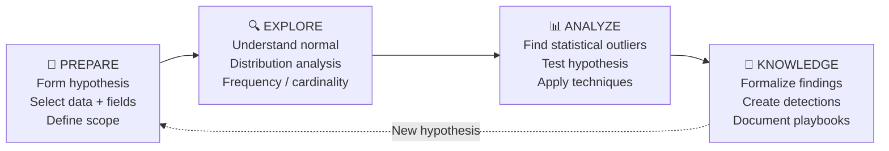
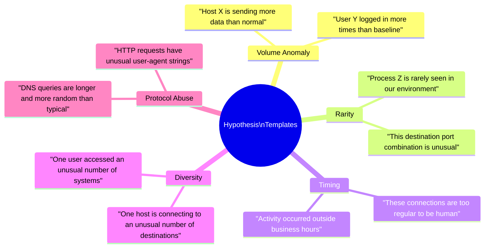
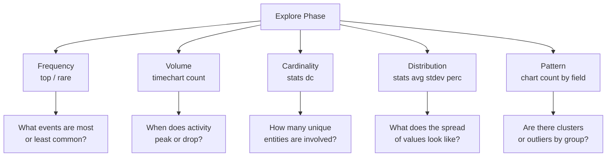
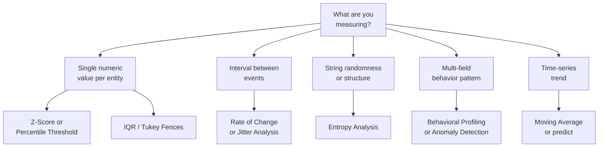
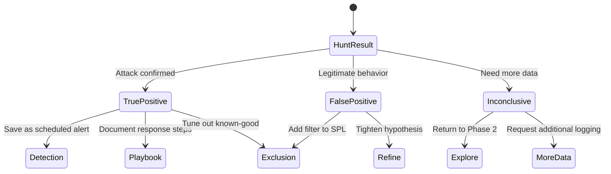
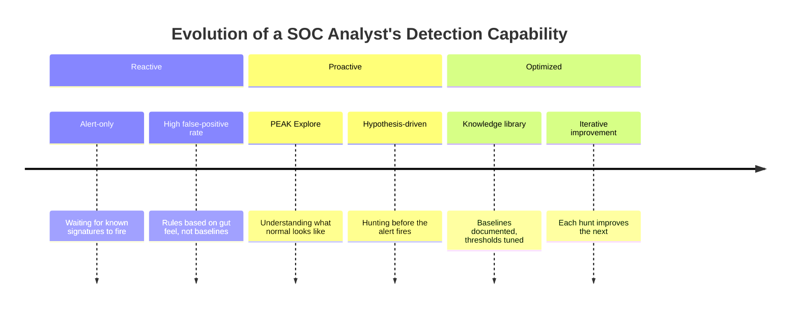

# PEAK Threat Hunting Framework

> **PEAK** — Prepare, Explore, Analyze, Knowledge — is a structured methodology for threat hunting that ensures hunts are hypothesis-driven, statistically grounded, and converted into repeatable detections.

← [Back to README](README.md)

---

## What is PEAK?



PEAK is **iterative** — knowledge from one hunt informs the hypothesis for the next. Over time, you build a library of baselines, detections, and institutional knowledge about what normal looks like in your environment.

---

## Phase 1: Prepare

**Goal**: Turn a vague concern into a testable, data-driven hypothesis.

### What You Define

| Element | Example |
|---|---|
| **Hypothesis** | "An attacker may be using DNS tunneling to exfiltrate data" |
| **Data Source** | Corelight `dns.log`, Sysmon EID 22 |
| **Field(s) to Baseline** | `query` length, character entropy, query frequency per host |
| **Time Window** | Last 7 days (minimum for a meaningful baseline) |
| **Scope** | All internal hosts communicating with external DNS resolvers |

### Hypothesis Templates



### Prepare Checklist

- [ ] Hypothesis written in plain English
- [ ] Data source(s) identified (Corelight / WinEvent / Sysmon)
- [ ] Relevant field(s) identified
- [ ] Time range selected (7 days minimum for baseline)
- [ ] Exclusions noted (known scanners, monitoring systems, DCs)

---

## Phase 2: Explore

**Goal**: Understand the data distribution before applying thresholds. You cannot identify anomalies without first understanding normal.

### Key Splunk Commands for Exploration



### Example: Explore DNS Query Lengths

```spl
index=corelight sourcetype=corelight_dns
| eval query_len = len(query)
| stats avg(query_len) AS avg_len,
        stdev(query_len) AS stdev_len,
        min(query_len) AS min_len,
        max(query_len) AS max_len,
        perc95(query_len) AS p95_len,
        count AS total_queries
| appendcols
    [search index=corelight sourcetype=corelight_dns
     | eval query_len = len(query)
     | timechart span=1h avg(query_len) AS avg_len_over_time]
```

### Example: Explore Auth Failure Patterns

```spl
index=wineventlog EventCode=4625
| timechart span=1h count AS failed_logins
| appendcols
    [search index=wineventlog EventCode=4625
     | stats dc(TargetUserName) AS unique_users,
             dc(IpAddress) AS unique_srcs,
             count AS total_failures
       BY date_hour]
```

### What to Document in Explore

```mermaid
quadrantChart
    title Data Distribution Assessment
    x-axis Low Volume --> High Volume
    y-axis Low Variance --> High Variance
    quadrant-1 Investigate: High vol, high variance
    quadrant-2 Baseline: High vol, low variance
    quadrant-3 Ignore: Low vol, low variance
    quadrant-4 Watch: Low vol, high variance
```

Record:
- Mean and standard deviation of key fields
- p95 and p99 thresholds
- Peak activity times (time-of-day, day-of-week)
- Known legitimate high-volume sources to exclude

---

## Phase 3: Analyze

**Goal**: Apply statistical techniques to surface deviations from the baseline established in Explore.

### Choosing the Right Technique



### Statistical Technique Summary

| Technique | Splunk Command(s) | Best For | File |
|---|---|---|---|
| Z-Score | `stats avg/stdev` + `eval` | Numeric outliers per entity | [03_zscore_stdev.md](02_baseline_hunts/03_zscore_stdev.md) |
| Percentile Threshold | `stats perc95/99`, `eventstats` | Volume/rate outliers | [04_percentile_iqr.md](02_baseline_hunts/04_percentile_iqr.md) |
| IQR / Tukey Fences | `stats perc25/75` + `eval` | Robust outliers, skewed data | [04_percentile_iqr.md](02_baseline_hunts/04_percentile_iqr.md) |
| Entropy | `eval` + `rex` | String randomness (DGA, tunneling) | [05_entropy_analysis.md](02_baseline_hunts/05_entropy_analysis.md) |
| Moving Average | `streamstats window=N avg()` | Trend deviation, smoothing | [06_moving_averages.md](02_baseline_hunts/06_moving_averages.md) |
| Rate of Change | `autoregress` + `eval` | Sudden spikes, beaconing jitter | [07_rate_of_change.md](02_baseline_hunts/07_rate_of_change.md) |
| Frequency Analysis | `rare`, `top`, `stats count` | Rare or dominant events | [01_frequency_analysis.md](02_baseline_hunts/01_frequency_analysis.md) |
| Cardinality | `stats dc()` | Entity diversity anomalies | [02_cardinality_analysis.md](02_baseline_hunts/02_cardinality_analysis.md) |
| Time-Series Forecast | `predict` | Seasonal deviation detection | [08_timeseries_forecasting.md](02_baseline_hunts/08_timeseries_forecasting.md) |
| Behavioral Profiling | `eventstats` + `streamstats` | Multi-dimensional UEBA | [09_behavioral_profiling.md](02_baseline_hunts/09_behavioral_profiling.md) |
| Anomaly Detection | `anomalydetection`, `cluster` | Automated outlier scoring | [10_anomaly_detection.md](02_baseline_hunts/10_anomaly_detection.md) |

### The Analyze Mindset

> Do not set thresholds before exploring. A threshold of "more than 100 failed logins" may be meaningless in an environment where a misconfigured service generates 50,000 per hour, or overly aggressive in one that averages 10 per day.

**Set thresholds relative to the observed baseline**, not arbitrary numbers.

---

## Phase 4: Knowledge

**Goal**: Convert hunt findings into durable, reusable detections.

### Knowledge Outputs



### Creating a Detection from a Hunt

A detection is a hunt that has been:
1. **Validated** — confirmed to fire on real attack data
2. **Tuned** — false positives filtered with `NOT` clauses or lookups
3. **Scheduled** — runs automatically (e.g., every 1 hour, every 15 minutes)
4. **Documented** — hypothesis, data source, threshold, and response steps recorded

```spl
/* Example: Tuned detection derived from Z-Score analysis hunt */
index=wineventlog EventCode=4625
| stats count AS fail_count, dc(TargetUserName) AS unique_users BY IpAddress, date_hour
| eventstats avg(fail_count) AS avg_fails, stdev(fail_count) AS stdev_fails
| eval zscore = round((fail_count - avg_fails) / (stdev_fails + 0.001), 2)
| where zscore > 3 AND unique_users > 10
/* Tune out known monitoring systems */
| where NOT IpAddress IN ("10.0.0.5", "10.0.0.6")
| table IpAddress, date_hour, fail_count, unique_users, zscore
```

### Documentation Template

Each detection should record:

| Field | Value |
|---|---|
| **Name** | Credential Spray — High DC User + Z-Score |
| **Hypothesis** | A single source IP is attempting credentials against many users |
| **Data Source** | WinEvent 4625 |
| **PEAK Phase** | Knowledge (derived from Frequency + Cardinality Explore) |
| **MITRE** | T1110.003 (Password Spraying) |
| **Threshold** | zscore > 3 AND unique_users > 10 |
| **Schedule** | Every 1 hour, 24-hour lookback |
| **Response** | See [03_credential_attacks.md](03_detection_use_cases/03_credential_attacks.md) |

---

## PEAK Applied: Full Example

> **Scenario**: Hunt for beaconing C2 communications

```mermaid
gantt
    title PEAK Hunt: Beaconing Detection
    dateFormat  YYYY-MM-DD
    section Prepare
    Define hypothesis (regular interval connections)    :done, p1, 2024-01-01, 1d
    Identify fields: _time, id.orig_h, id.resp_h       :done, p2, after p1, 1d
    section Explore
    timechart conn count per src-dest pair              :done, e1, after p2, 1d
    Understand normal interval distribution             :done, e2, after e1, 1d
    section Analyze
    autoregress to compute intervals                    :done, a1, after e2, 1d
    stats avg/stdev of intervals per pair               :done, a2, after a1, 1d
    Filter: low stdev + consistent avg                  :done, a3, after a2, 1d
    section Knowledge
    Save as scheduled alert                             :done, k1, after a3, 1d
    Document response playbook                          :done, k2, after k1, 1d
```

### Prepare
```
Hypothesis: "A compromised host is beaconing to a C2 server at regular intervals"
Data: Corelight conn.log (id.orig_h, id.resp_h, _time, orig_bytes)
Fields: inter-connection time delta, connection interval variance
```

### Explore
```spl
index=corelight sourcetype=corelight_conn
| timechart span=1h count BY id.orig_h
| sort - count
```

### Analyze
```spl
index=corelight sourcetype=corelight_conn
| sort id.orig_h, id.resp_h, _time
| autoregress _time AS prev_time p=1
| eval interval_sec = _time - prev_time
| where interval_sec > 0 AND interval_sec < 3600
| stats count AS conn_count,
        avg(interval_sec) AS avg_interval,
        stdev(interval_sec) AS stdev_interval
  BY id.orig_h, id.resp_h
| where conn_count > 20 AND stdev_interval < 10
| eval jitter_pct = round((stdev_interval / avg_interval) * 100, 1)
| sort avg_interval
```

### Knowledge
```spl
/* Saved Alert: Beaconing Detection — Low Jitter Connections */
index=corelight sourcetype=corelight_conn
| sort id.orig_h, id.resp_h, _time
| autoregress _time AS prev_time p=1
| eval interval_sec = _time - prev_time
| where interval_sec > 0 AND interval_sec < 3600
| stats count AS conn_count,
        avg(interval_sec) AS avg_interval,
        stdev(interval_sec) AS stdev_interval
  BY id.orig_h, id.resp_h
| where conn_count > 20 AND stdev_interval < 10
| where NOT id.resp_h IN ("8.8.8.8", "1.1.1.1")
| eval jitter_pct = round((stdev_interval / avg_interval) * 100, 1)
| table id.orig_h, id.resp_h, conn_count, avg_interval, stdev_interval, jitter_pct
```

**Response**: See [01_beaconing.md](03_detection_use_cases/01_beaconing.md)

---

## Why PEAK Matters for SOC Analysts



Without PEAK (or a similar structure), analysts often:
- Set arbitrary thresholds that generate too many or too few alerts
- Miss novel attacks because they don't have baselines to compare against
- Spend time investigating the same patterns repeatedly without formalizing detections
- Cannot explain *why* something is anomalous — only that an alert fired

With PEAK, every hunt produces either a detection or knowledge about normal behavior — both are valuable outcomes.

---

**Next**: [Splunk Search Head Functions Reference →](01_splunk_search_head_functions.md)
