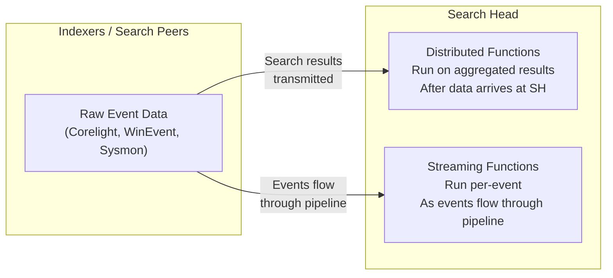
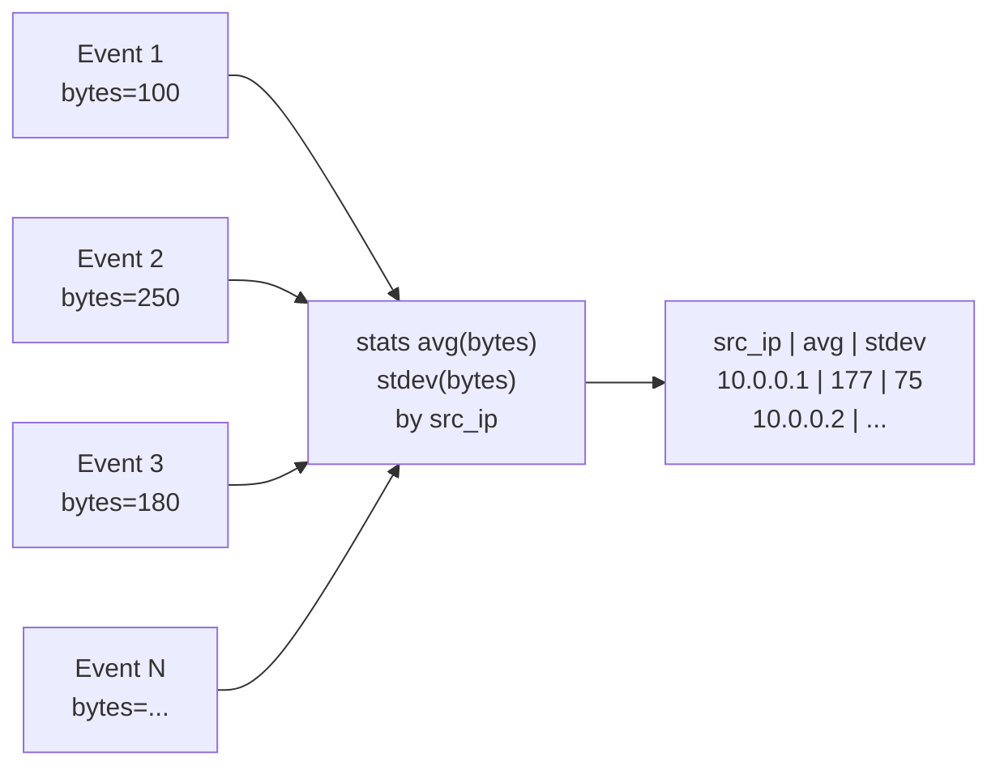
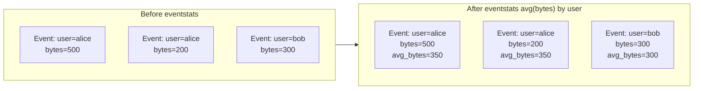
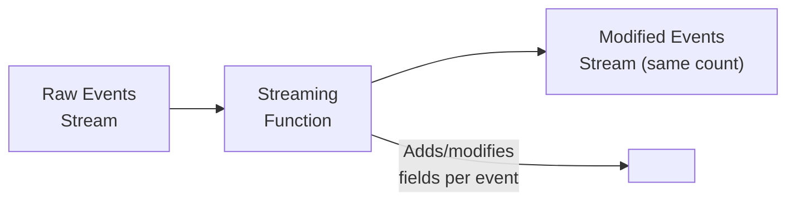
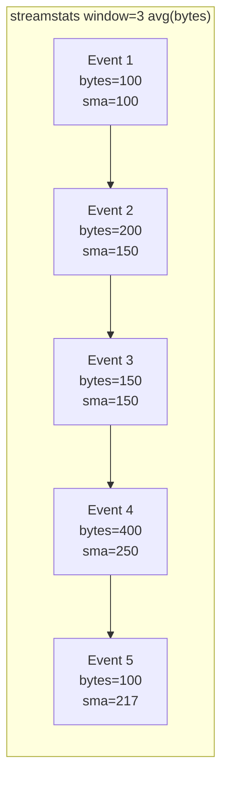
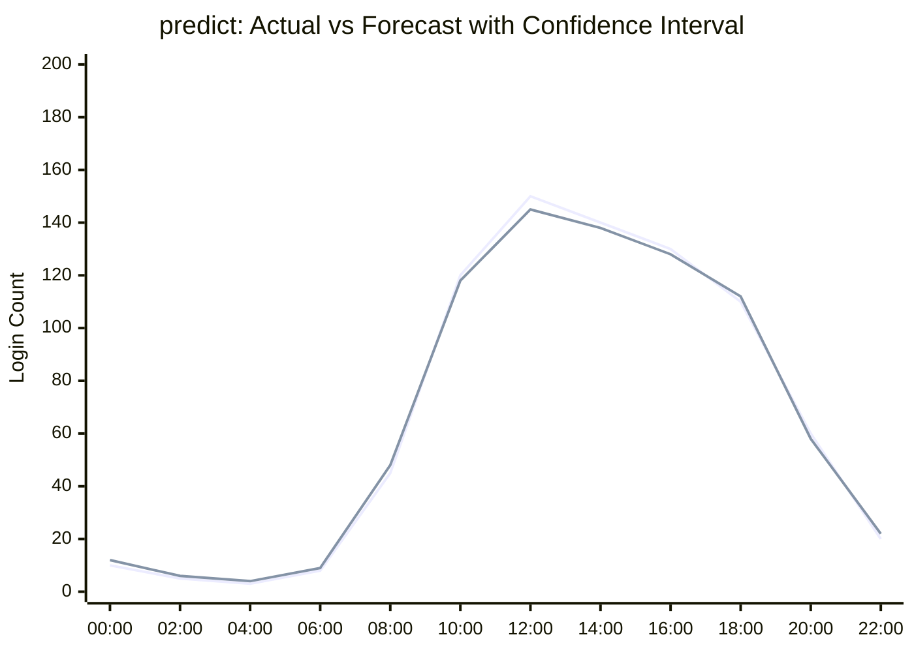
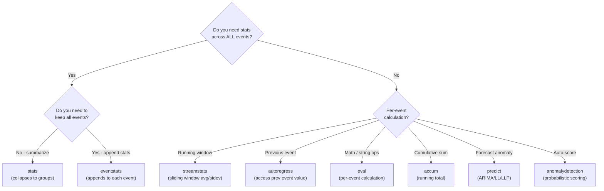

# Splunk Search Head Functions Reference

> A reference for statistical functions available on the **Splunk Search Head** — the only platform used in this repository. No ML Toolkit, no external add-ons, no scripting required.

← [Back to README](README.md) | [PEAK Overview](00_peak_framework_overview.md)

---

## Two Categories of Functions



The distinction matters for performance and use:

| Category | When It Runs | Data It Sees | Best For |
|---|---|---|---|
| **Distributed** | After all results aggregate at search head | Full result set | Population-level stats (averages, percentiles, counts) |
| **Streaming** | Per-event as data flows through pipeline | One event at a time | Per-event calculations, running stats, comparisons against self |

---

## Distributed Functions

These commands operate on the **full result set** after it has been collected. They collapse multiple events into summary statistics.

### `stats`

The primary aggregation command. Computes statistics over groups of events.



**Statistical functions available within `stats`:**

| Function | Description | Baseline Use |
|---|---|---|
| `count` | Number of events | Frequency baseline |
| `dc(field)` | Distinct count of unique values | Cardinality baseline |
| `avg(field)` | Arithmetic mean | Central tendency |
| `stdev(field)` | Sample standard deviation | Spread / volatility |
| `var(field)` | Variance | Same as stdev² |
| `median(field)` | 50th percentile | Robust central tendency |
| `mode(field)` | Most common value | Most typical value |
| `perc5(field)` | 5th percentile | Lower bound |
| `perc25(field)` | 25th percentile (Q1) | IQR calculation |
| `perc75(field)` | 75th percentile (Q3) | IQR calculation |
| `perc95(field)` | 95th percentile | Upper normal threshold |
| `perc99(field)` | 99th percentile | Extreme outlier threshold |
| `min(field)` | Minimum value | Lower bound |
| `max(field)` | Maximum value | Upper bound |
| `range(field)` | max − min | Total spread |
| `sum(field)` | Sum of all values | Total volume |
| `sumsq(field)` | Sum of squares | Variance calculation basis |
| `values(field)` | All unique values as multivalue | Enumeration |
| `list(field)` | All values (including duplicates) | Sequence inspection |

**Example — Compute comprehensive baseline for outbound bytes:**

```spl
index=corelight sourcetype=corelight_conn
| stats avg(orig_bytes) AS avg_bytes,
        stdev(orig_bytes) AS stdev_bytes,
        median(orig_bytes) AS median_bytes,
        perc95(orig_bytes) AS p95_bytes,
        perc99(orig_bytes) AS p99_bytes,
        max(orig_bytes) AS max_bytes,
        count AS conn_count
  BY id.orig_h
| sort - avg_bytes
```

---

### `eventstats`

Identical to `stats` but **appends the results back to each event** rather than collapsing. This lets you compare each event to the population baseline inline.



**Example — Z-score calculation using eventstats:**

```spl
index=wineventlog EventCode=4624
| stats count AS login_count BY user, date_hour
| eventstats avg(login_count) AS avg_logins,
             stdev(login_count) AS stdev_logins
  BY user
| eval zscore = round((login_count - avg_logins) / (stdev_logins + 0.001), 2)
| where zscore > 2.5
| table user, date_hour, login_count, avg_logins, stdev_logins, zscore
```

**Key difference from `stats`:**

```spl
/* stats: collapses to 1 row per user */
| stats avg(login_count) AS avg_logins BY user

/* eventstats: keeps all rows, adds avg_logins column to each */
| eventstats avg(login_count) AS avg_logins BY user
```

---

### `timechart`

Creates a time-series aggregation, bucketing events into time spans and computing statistics per bucket.

```spl
/* Count failed logins per hour */
index=wineventlog EventCode=4625
| timechart span=1h count AS failed_logins

/* Average bytes per hour by source */
index=corelight sourcetype=corelight_conn
| timechart span=1h avg(orig_bytes) AS avg_bytes BY id.orig_h limit=10
```

Used in **Explore** phase to understand temporal patterns before applying anomaly detection.

---

### `chart`

Multi-dimensional aggregation that produces a pivot-style table. Useful for comparing entities across categories.

```spl
/* Count connections by source IP and destination port */
index=corelight sourcetype=corelight_conn
| chart count BY id.orig_h, id.resp_p

/* Average bytes per hour of day for top users */
index=wineventlog EventCode=4624
| chart count OVER date_hour BY user limit=10
```

---

### `top` / `rare`

Frequency analysis commands — `top` finds most common values, `rare` finds least common.

```spl
/* Most common parent-child process pairs */
index=sysmon EventCode=1
| top limit=20 ParentProcessName, process_name

/* Least common parent-child process pairs — hunt for anomalies */
index=sysmon EventCode=1
| rare limit=20 ParentProcessName, process_name showperc=true
```

`rare` is particularly valuable in the **Explore** phase to surface unusual process chains, rare network destinations, or infrequent auth patterns.

---

## Streaming Functions

These commands execute **per-event** as events flow through the search pipeline. They can access and modify individual events.



Streaming functions **preserve event count** (unlike `stats` which reduces it). They are essential for computing per-event comparisons and running statistics.

---

### `eval`

The most versatile streaming function. Computes expressions and assigns results to fields. Used for z-scores, entropy approximations, ratios, and conditional logic.

**Mathematical operations:**

```spl
/* Z-score calculation (after computing avg/stdev with eventstats) */
| eval zscore = (value - avg_value) / (stdev_value + 0.001)

/* IQR fences */
| eval iqr = q3 - q1
| eval upper_fence = q3 + (1.5 * iqr)
| eval lower_fence = q1 - (1.5 * iqr)

/* Bytes ratio (exfiltration) */
| eval ratio_out_to_in = orig_bytes / (resp_bytes + 1)

/* Approximate entropy via string length and character diversity */
| eval domain_len = len(query)
| eval entropy_proxy = len(replace(query, ".", "")) / domain_len
```

**String functions in eval:**

| Function | Description | Security Use |
|---|---|---|
| `len(str)` | String length | DNS query length analysis |
| `lower(str)` | Lowercase conversion | Case-insensitive matching |
| `replace(str,regex,repl)` | Regex replacement | Domain extraction |
| `match(str,regex)` | Boolean regex match | Pattern detection |
| `substr(str,start,len)` | Substring extraction | Field parsing |
| `split(str,delim)` | Split into multivalue | Character counting |
| `mvcount(mv)` | Count multivalue items | Unique character count |

---

### `streamstats`

Computes running/cumulative statistics over a **sliding window** of events. Each event gets statistics computed from itself and the N preceding events.



```spl
/* 7-event sliding window moving average per source */
index=corelight sourcetype=corelight_conn
| sort _time
| streamstats window=7 avg(orig_bytes) AS sma7, stdev(orig_bytes) AS stdev7 BY id.orig_h
| eval upper_band = sma7 + (2 * stdev7)
| eval lower_band = sma7 - (2 * stdev7)
| where orig_bytes > upper_band
```

**Key parameters:**
- `window=N` — number of preceding events to include
- `BY field` — compute separately per group (per user, per src_ip)
- `global=false` — (default) reset at each group boundary
- `current=true` — (default) include current event in window

---

### `accum`

Computes a **cumulative sum** — each event gets the running total of the specified field up to that point.

```spl
/* Cumulative bytes transferred — detect when threshold crossed */
index=corelight sourcetype=corelight_conn
| sort _time
| accum orig_bytes AS cumulative_bytes BY id.orig_h
| where cumulative_bytes > 1073741824   /* 1 GB */
| table _time, id.orig_h, orig_bytes, cumulative_bytes
```

---

### `autoregress`

Allows access to **field values from previous events** in the stream. Enables computing inter-event deltas (intervals, rate of change).

```spl
/* Compute inter-connection time intervals */
index=corelight sourcetype=corelight_conn
| sort id.orig_h, id.resp_h, _time
| autoregress _time AS prev_time p=1
| eval interval_sec = _time - prev_time
| where interval_sec > 0
```

**Parameter `p=N`** — look back N events (default p=1 for previous event).

---

### `predict`

Time-series forecasting using statistical models. Given a series of values, it **predicts future values** and flags actual values that fall outside the confidence interval.



```spl
index=wineventlog EventCode=4625
| timechart span=1h count AS failed_logins
| predict failed_logins algorithm=LLP upper95=upper lower95=lower
| where failed_logins > upper OR failed_logins < lower
| table _time, failed_logins, upper, lower
```

**Algorithms:**
| Algorithm | Description | Best For |
|---|---|---|
| `LL` | Local Level (simple trend) | Slowly changing baselines |
| `LLP` | Local Level with Periodicity | Daily/weekly patterns (login volumes) |
| `LLP5` | LLP with 5-period seasonality | 5-day work weeks |
| `LLT` | Local Level with Trend | Upward/downward trending data |
| `ARIMA(p,d,q)` | AutoRegressive Integrated Moving Average | Complex time series |

---

### `anomalydetection`

Built-in Splunk command that scores each event for anomalousness using a probabilistic model. No manual threshold setting required.

```spl
index=corelight sourcetype=corelight_conn
| stats count AS conn_count,
        avg(orig_bytes) AS avg_bytes,
        dc(id.resp_p) AS unique_ports
  BY id.orig_h
| anomalydetection action=annotate pthresh=0.01 conn_count avg_bytes unique_ports
| where anomaly_score > 0.95
| sort - anomaly_score
```

**Parameters:**
- `pthresh` — probability threshold (lower = only flag more extreme anomalies)
- `action=annotate` — adds `anomaly_score` field to each event
- `action=filter` — removes non-anomalous events

---

### `cluster`

Groups events by similarity based on field values. Events that don't fit any cluster are potential anomalies.

```spl
index=sysmon EventCode=1
| cluster showcount=true field=process_name t=0.7
| where cluster_count < 3
| table process_name, ParentProcessName, cluster_label, cluster_count
```

**Parameter `t`** — similarity threshold (0 to 1; lower = more clusters, higher = fewer clusters).

---

## Function Decision Guide



---

## Performance Considerations

```mermaid
quadrantChart
    title Function Performance vs Analytical Power
    x-axis Lower Performance Impact --> Higher Performance Impact
    y-axis Lower Analytical Power --> Higher Analytical Power
    quadrant-1 High value, careful use
    quadrant-2 Ideal for dashboards
    quadrant-3 Limited use
    quadrant-4 Avoid without time bounds
    top: false
    rare: [0.1, 0.3]
    stats: [0.2, 0.6]
    eventstats: [0.35, 0.7]
    streamstats: [0.5, 0.75]
    predict: [0.6, 0.85]
    anomalydetection: [0.7, 0.8]
    autoregress: [0.45, 0.65]
    cluster: [0.75, 0.7]
```

**Best practices:**
- Use `tstats` for large time ranges before `stats` to leverage indexed fields
- Always filter by `index=` and `sourcetype=` before streaming functions
- Add `earliest=` and `latest=` bounds to all scheduled searches
- Use `BY` clauses to limit the scope of `eventstats` and `streamstats`

---

**Next**: [Baseline Hunts — Frequency Analysis →](02_baseline_hunts/01_frequency_analysis.md)

| ← [PEAK Overview](00_peak_framework_overview.md) | [README](README.md) | [Baseline Hunts →](02_baseline_hunts/01_frequency_analysis.md) |
