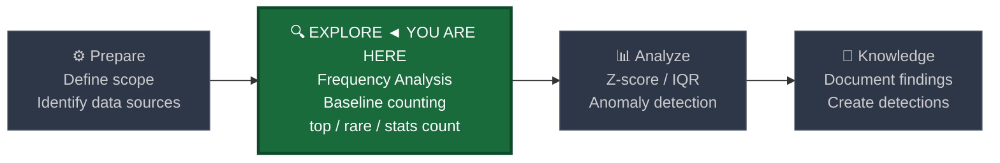
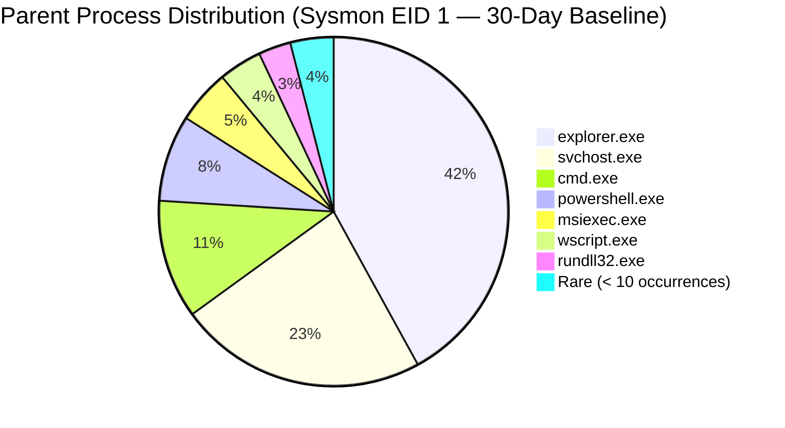
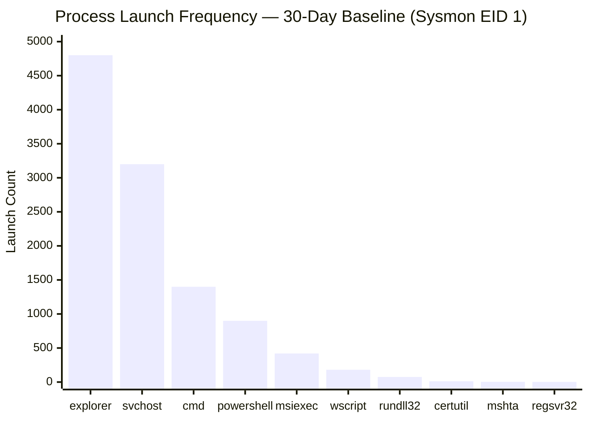

# Frequency Analysis

← [Back to README](../README.md)

**Navigation:** [02 Cardinality Analysis →](./02_cardinality_analysis.md)

---

## PEAK Phase: Explore

Frequency analysis lives in the **Explore** phase of the PEAK framework. Before you can detect anomalies, you must understand what "normal" looks like — and counting how often things occur is the most fundamental way to establish that baseline.



---

## What Is Frequency Analysis?

Frequency analysis is the practice of **counting how often discrete values appear** in a dataset over a defined time window. In security operations, this is the starting point for nearly every hunt: you cannot identify what is rare or anomalous without first knowing what is common.

The core insight is simple:

> **Attackers must do things. The things they do either blend in with normal activity or they don't. Counting reveals both.**

### Why Frequency Analysis Matters for Security

| Scenario | What Frequency Reveals |
|---|---|
| Rare process launches | Attacker tooling, LOLBins used unusually |
| Low-count DNS queries | DGA domain polling, one-time C2 callbacks |
| Spike in failed logins | Brute force, credential stuffing |
| Uncommon parent→child chains | Process injection, living-off-the-land |
| Rare destination ports | Lateral movement, unusual protocol usage |
| Single-occurrence user-agent strings | Automated tools, implants |

Frequency analysis is **non-parametric** — it makes no assumptions about distribution shape. This makes it robust as a first-pass technique before applying statistical tests like Z-score or IQR.

---

## Process Parent Frequency Distribution — Example

The following pie chart shows a typical distribution of `parent_process` values seen in Sysmon EID 1 data across a 30-day enterprise baseline. The long tail of rare parents is precisely where malicious activity hides.



The 4% "Rare" slice contains dozens of distinct parent processes — each appearing fewer than 10 times over 30 days. Threat actors spawning shells from `mshta.exe`, `regsvr32.exe`, or `winword.exe` land squarely in that slice.

---

## Splunk Functions for Frequency Analysis

### `top` — Most Common Values

Returns the N most frequent values of a field, with count and percentage. The foundation for understanding the "normal" majority.

```spl
index=sysmon EventCode=1
| top limit=20 parent_process_name
```

Key options:

| Option | Purpose |
|---|---|
| `limit=N` | Number of rows to return (default 10) |
| `by <field>` | Segment the top list per group |
| `showperc=false` | Suppress the percentage column |
| `countfield=my_count` | Rename the count column |
| `showother=true` | Add a catch-all "OTHER" row for remaining values |

### `rare` — Least Common Values

The inverse of `top`. Returns the N least frequent values — the long tail where anomalies live. One of the most powerful one-liners in threat hunting.

```spl
index=sysmon EventCode=1
| rare limit=20 parent_process_name
```

`rare` is your first stop when hunting for attacker tools, first-time-seen binaries, and unusual parent-child relationships. Rare legitimate activity and rare malicious activity both surface here — triage is the analyst's job.

### `stats count` — Aggregate Counting

`stats count` groups events and produces a flat aggregate table suitable for thresholding, joining, and further analysis.

```spl
index=wineventlog EventCode=4625
| stats count by TargetUserName, IpAddress
| sort - count
```

`stats count` is the workhorse. Use it when you need to apply thresholds, join counts back to other datasets, or perform multi-field grouping that `top`/`rare` cannot express.

### `eventstats` — Inline Statistics Without Collapsing

`eventstats` computes aggregate statistics but **appends the result as a new field to every matching event** rather than collapsing the dataset. This is critical for anomaly detection where you want to compare each event to its group aggregate while preserving full event context.

```spl
index=sysmon EventCode=1
| eventstats count as total_launches by parent_process_name
| where total_launches < 5
| table _time, host, user, parent_process_name, process_name, CommandLine, total_launches
```

Each raw event now carries the group-level count, allowing per-event filtering while retaining all original fields for investigation.

---

## Hypothesis Examples

Good frequency-based hunt hypotheses follow the pattern: *"If [attack technique] is present, I expect [this value] to appear [at this frequency]."*

- **Hypothesis 1:** Malicious scheduled tasks installed by an attacker will be rare — `svchost.exe` as parent of new process names will appear far less frequently than the 30-day baseline of known good tasks
- **Hypothesis 2:** A beaconing implant will produce a DNS query to its C2 domain that appears in the dataset only once or very few times — below the p5 of query frequency
- **Hypothesis 3:** Credential stuffing against a login portal will produce a spike in WinEvent 4625 for a single source IP with many distinct usernames — high count for that IP spread across many users
- **Hypothesis 4:** A new service installed by malware (WinEvent 7045) will have a service name appearing for the first time — zero prior occurrences in the 30-day baseline
- **Hypothesis 5:** LOLBin abuse (`certutil.exe`, `bitsadmin.exe`) will appear in the rare tail of process launches when those binaries are used for payload delivery rather than their legitimate administrative purpose
- **Hypothesis 6:** Rare Corelight destination ports (outside the top 20 by count) contacted from a server host may indicate C2 communication over non-standard ports

---

## Data Sources

### Corelight (Network Logs)

| Log | Key Fields | Frequency Hunt Angle |
|---|---|---|
| `conn.log` | `id.orig_h`, `id.resp_h`, `id.resp_p`, `proto`, `duration`, `orig_bytes` | Rare dest ports, rare host pairs, rare protocols |
| `dns.log` | `id.orig_h`, `query`, `qtype_name`, `answers` | Rare queried domains, single-query domains, rare query types |
| `http.log` | `id.orig_h`, `host`, `uri`, `user_agent`, `method` | Rare user agents, rare HTTP methods, rare URI paths |

### Windows Event Logs

| EventCode | Description | Frequency Hunt Angle |
|---|---|---|
| 4624 | Successful logon | Rare logon types, rare source IPs, off-hours logons |
| 4625 | Failed logon | High count per user or IP signals brute force or spray |
| 4688 | Process creation (native audit) | Rare process+parent combinations |
| 7045 | New service installed | First-seen service names — near-zero frequency is suspicious |

### Sysmon

| EventID | Description | Frequency Hunt Angle |
|---|---|---|
| EID 1 | Process Create | Rare parent→child chains, rare command-line patterns |
| EID 3 | Network Connection | Rare remote ports, rare processes making outbound connections |
| EID 22 | DNS Query | Rare domains queried, single-query domains |

---

## Baseline SPL — Explore Phase

### Rare Parent→Child Process Combinations (Sysmon EID 1)

Establish which parent→child pairs are legitimately rare before adding any thresholds. This builds your mental model of the baseline.

```spl
index=sysmon EventCode=1 earliest=-30d
| eval process_chain = parent_process_name + " → " + process_name
| rare limit=50 process_chain
| rename count as occurrence_count, percent as pct_of_total
| table process_chain, occurrence_count, pct_of_total
```

### Top Destination Ports (Corelight conn.log)

Understand the port landscape before hunting on unusual ports. Every environment has its own "normal" set of destination ports.

```spl
index=corelight sourcetype=corelight_conn earliest=-7d
| top limit=50 id.resp_p
| rename id.resp_p as dest_port, count as connection_count
| eval cumulative_pct = round(percent, 2)
| table dest_port, connection_count, cumulative_pct
```

### Failed Login Count by User (WinEvent 4625)

Baseline how many 4625 events each user generates in a normal period. Outliers drive toward the top of this list.

```spl
index=wineventlog EventCode=4625 earliest=-30d
| stats count as failed_logins by TargetUserName
| sort - failed_logins
| head 100
| eval tier = case(
    failed_logins > 1000, "HIGH",
    failed_logins > 100,  "MEDIUM",
    failed_logins > 10,   "LOW",
    true(),               "NORMAL"
  )
| table TargetUserName, failed_logins, tier
```

---

## Detection SPL — Analyze Phase

### Low-Frequency Process Launches (Count < 3 in 30 Days)

```spl
index=sysmon EventCode=1 earliest=-30d
| stats count
    min(_time) as first_seen
    max(_time) as last_seen
    values(host) as hosts
    by process_name, parent_process_name
| where count < 3
| eval first_seen = strftime(first_seen, "%Y-%m-%d %H:%M:%S")
| eval last_seen  = strftime(last_seen,  "%Y-%m-%d %H:%M:%S")
| sort + count
| table process_name, parent_process_name, count, first_seen, last_seen, hosts
```

> **Analyst note:** Filter out known software deployment activity (SCCM, Intune, patch management) before triaging results. Add `NOT host IN (sccm_server, deploy_server)` as needed.

### Rare Parent→Child Process Chains

```spl
index=sysmon EventCode=1 earliest=-30d
| eval chain = parent_process_name + " → " + process_name
| stats count as chain_count
    values(host) as hosts_seen
    values(CommandLine) as sample_cmdlines
    by chain
| where chain_count < 5
| sort + chain_count
| mvexpand sample_cmdlines
| table chain, chain_count, hosts_seen, sample_cmdlines
```

**Pivot:** Take any suspicious chain and expand with full CommandLine context:

```spl
index=sysmon EventCode=1
    parent_process_name="winword.exe"
    process_name="cmd.exe"
| table _time, host, user, CommandLine, parent_process_name, process_name
```

### Low-Count DNS Queries — Possible DGA

```spl
index=corelight sourcetype=corelight_dns earliest=-7d
| stats count as query_count
    values(id.orig_h) as querying_hosts
    by query
| where query_count < 3
| rex field=query "(?<apex_domain>[^.]+\.[^.]+)$"
| eval domain_len = len(apex_domain)
| where domain_len > 15
| sort + query_count
| table query, query_count, domain_len, querying_hosts
```

---

## Visualization Recommendations

The following chart simulates a typical frequency analysis result: a small number of very common processes and a steep drop-off into rare values. Anything in the far right of this chart (counts in single digits) deserves analyst attention, especially if the binary is capable of network activity, code execution, or credential access.



The steep drop-off (sometimes called a "power law" or "long tail" distribution) is the key visual signal. Attackers using novel or unusual binaries will land at the right end of this chart every time.

---

## Tuning Notes

| Issue | Symptom | Remediation |
|---|---|---|
| Software deployment noise | Rare process count explodes during patch windows | Add time-based exclusion windows; exclude SCCM/Intune source hosts |
| Known LOLBin legitimate use | `certutil.exe` fires for PKI operations | Allowlist specific CommandLine patterns (`-urlcache` is suspicious; `-verify` is not) |
| Short-lived transient processes | Processes never repeat, count always = 1 | Require minimum 2 distinct hosts, or widen the window to 60 days |
| New host onboarding | First-seen software on newly imaged machines | Exclude hosts aged < 7 days from rare analysis |
| Dev/build servers | High process diversity is expected | Segment analysis by host role or asset tier using a lookup |

**Minimum recommended baseline window:** 14 days for process analysis; 7 days for network port analysis; 30 days for user behavior baselining.

---

## Knowledge Output

After running frequency analysis, document the following as institutional knowledge:

1. **Top-20 process chains** observed across the environment — these become your allowlist anchors for rare-process alerts
2. **Expected rare binaries** — note legitimate uses of LOLBins in your environment and document the business justification
3. **Port baseline** — record which destination ports represent > 99% of traffic; anything outside this set is a persistent hunting target
4. **Service name baseline** — maintain a list of expected service names from WinEvent 7045; any new entries trigger immediate review
5. **DNS query frequency distribution** — record p5/p50/p95 of query counts per domain; anything below p5 with a long domain name is suspicious

---

## Related Detection Use Cases

- [Rogue Services and Processes](../03_detection_use_cases/09_rogue_services_processes.md) — Frequency analysis of WinEvent 7045 and rare process chains is the primary detection method
- [DNS Tunneling / DGA](../03_detection_use_cases/04_dns_tunneling_dga.md) — Low-count DNS queries are a key DGA signal; combine with entropy analysis for higher fidelity
- [Privilege Escalation](../03_detection_use_cases/06_privilege_escalation.md) — Rare parent→child chains involving privilege-granting binaries surface here

---

**Navigation:**
← [Back to README](../README.md) | [02 Cardinality Analysis →](./02_cardinality_analysis.md)
