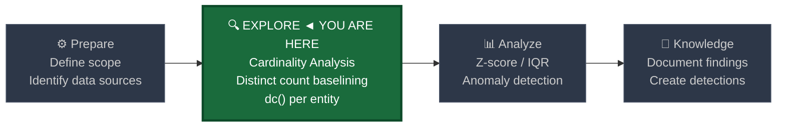
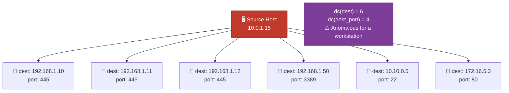
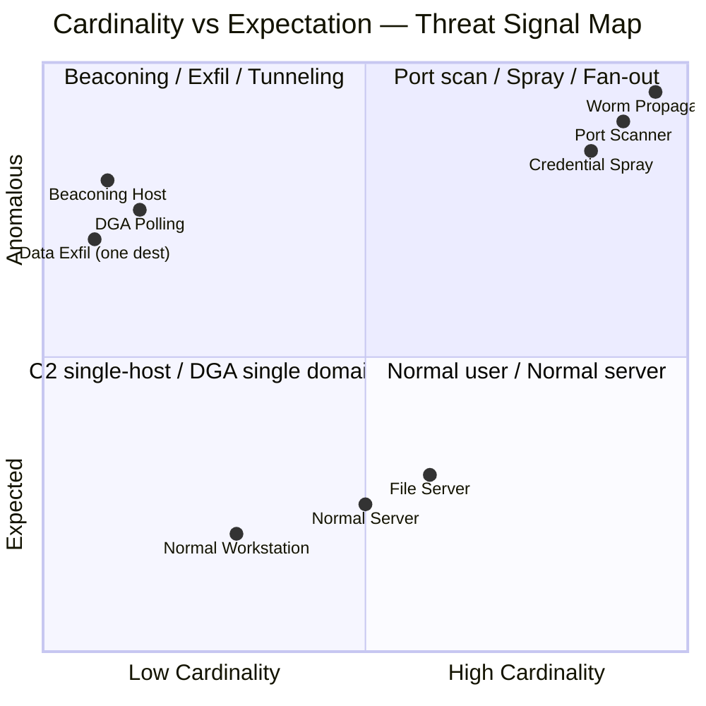
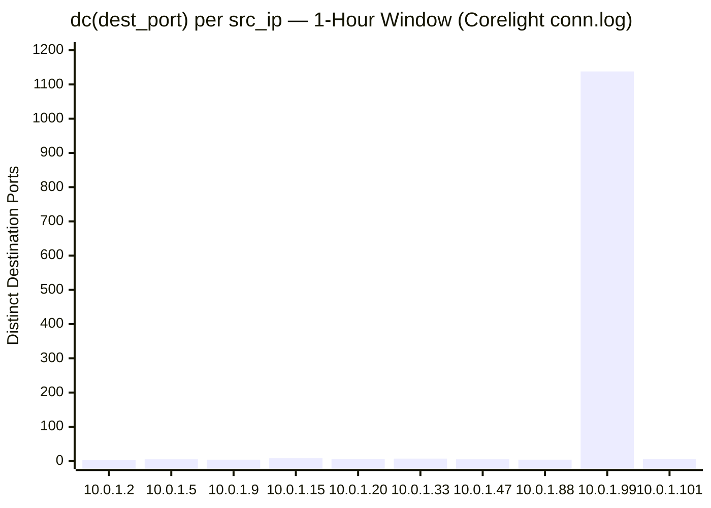

# Cardinality Analysis (Distinct Count)

← [Back to README](../README.md)

**Navigation:** [← 01 Frequency Analysis](./01_frequency_analysis.md) | [03 Z-Score and Std Dev →](./03_zscore_stdev.md)

---

## PEAK Phase: Explore

Cardinality analysis lives in the **Explore** phase of the PEAK framework. Where frequency analysis asks *"how often does this value appear?"*, cardinality analysis asks *"how many distinct values does this entity contact, use, or produce?"* These are complementary angles on the same baseline data.



---

## What Is Cardinality?

**Cardinality** is the number of distinct (unique) values in a set. In Splunk, the `dc()` function — short for *distinct count* — measures this. It answers questions like:

- How many unique destination IPs did this source contact?
- How many different usernames were attempted from this IP address?
- How many distinct destination ports did this host reach?

### The Cardinality Concept: One Source, Many Destinations



A normal workstation might connect to 5–15 distinct internal destinations in an hour. A scanning host might contact 500+. `dc()` surfaces that difference immediately, whereas a raw event count might not (the scanner sends one SYN per destination — the count is just a number without context).

---

## Why High and Low Cardinality Both Signal Threats

> **The threat landscape lives at the extremes. Anomalously high cardinality and anomalously low cardinality are both hunting signals.**



| Cardinality Direction | Example Threat | Why It Stands Out |
|---|---|---|
| Abnormally **HIGH** dc(dest_port) | Port scanner | Normal hosts use < 10 distinct ports per hour |
| Abnormally **HIGH** dc(TargetUserName) | Credential spray | One IP trying many usernames |
| Abnormally **HIGH** dc(dest_ip) | Worm / lateral movement | Workstation should reach few internal hosts |
| Abnormally **LOW** dc(dest_ip) | Beaconing implant | C2 traffic always to exactly one IP |
| Abnormally **LOW** dc(query) | DGA fallback / hardcoded C2 | One domain queried repeatedly |

---

## Splunk Functions for Cardinality Analysis

### `stats dc()` — Compute Distinct Count Per Group

`stats dc(field)` collapses the dataset into one row per group and returns the count of unique values.

```spl
index=corelight sourcetype=corelight_conn earliest=-1h
| stats dc(id.resp_h) as unique_dests
       dc(id.resp_p) as unique_ports
       count as total_conns
    by id.orig_h
| sort - unique_dests
```

Multiple `dc()` calls in a single `stats` command are efficient — Splunk computes them in one pass.

### `eventstats dc()` — Inline Distinct Count Without Collapsing

`eventstats` appends the computed cardinality value as a new field on every event, preserving raw event context. This allows per-event filtering against the group-level cardinality.

```spl
index=corelight sourcetype=corelight_conn earliest=-1h
| eventstats dc(id.resp_p) as src_port_cardinality by id.orig_h
| where src_port_cardinality > 100
| table _time, id.orig_h, id.resp_h, id.resp_p, src_port_cardinality
```

This is especially useful when you want to flag every raw connection event from a scanner, not just the summary row.

---

## Data Sources

### Corelight (Network Logs)

| Log | Key Cardinality Metrics | Threat Signal |
|---|---|---|
| `conn.log` | `dc(id.resp_h)` per src, `dc(id.resp_p)` per src | Scanning, lateral movement, fan-out |
| `dns.log` | `dc(query)` per src, `dc(answers)` per domain | DGA, DNS tunneling |
| `http.log` | `dc(host)` per src, `dc(user_agent)` per src | Automated scanning, implant diversity |

### Windows Event Logs

| EventCode | Key Cardinality Metrics | Threat Signal |
|---|---|---|
| 4624 | `dc(dest)` per user per day | Lateral movement, unusual access spread |
| 4625 | `dc(TargetUserName)` per IpAddress | Credential spray, password guessing |
| 4688 | `dc(process_name)` per host per hour | Rapid tool execution, malware staging |

### Sysmon

| EventID | Key Cardinality Metrics | Threat Signal |
|---|---|---|
| EID 1 | `dc(process_name)` per parent per hour | Process injection staging, tool drops |
| EID 3 | `dc(DestinationIp)` per process | Process doing unexpected network fan-out |
| EID 22 | `dc(QueryName)` per host per hour | DGA — many unique domains queried |

---

## Baseline SPL — Explore Phase

### Destination Diversity per Source IP (Corelight conn.log)

Build a distribution of how many unique hosts and ports each source typically contacts. This distribution becomes your anomaly detection threshold.

```spl
index=corelight sourcetype=corelight_conn earliest=-7d
| bucket _time span=1h
| stats dc(id.resp_h) as unique_dests
       dc(id.resp_p) as unique_ports
       count as conn_count
    by id.orig_h, _time
| stats avg(unique_dests)   as avg_dests
       max(unique_dests)   as max_dests
       avg(unique_ports)   as avg_ports
       max(unique_ports)   as max_ports
    by id.orig_h
| sort - max_dests
```

### Username Diversity per Source IP (WinEvent 4625)

For each source IP, how many different usernames has it attempted? Normal sources (a user mistyping their password) will show dc = 1 or 2. Sprayers show dc in the dozens or hundreds.

```spl
index=wineventlog EventCode=4625 earliest=-24h
| stats dc(TargetUserName) as unique_users
       count as total_failures
    by IpAddress
| sort - unique_users
| eval avg_failures_per_user = round(total_failures / unique_users, 1)
| table IpAddress, unique_users, total_failures, avg_failures_per_user
```

### Destination Diversity per User (WinEvent 4624)

How many distinct machines does each user log into per day? Lateral movement shows up as an unusual spike in this number.

```spl
index=wineventlog EventCode=4624 earliest=-30d
| bucket _time span=1d
| stats dc(ComputerName) as unique_dests by SubjectUserName, _time
| stats avg(unique_dests) as avg_daily_dests
       stdev(unique_dests) as stdev_daily_dests
       max(unique_dests) as max_daily_dests
    by SubjectUserName
| sort - max_daily_dests
```

---

## Detection SPL — Analyze Phase

### Port Scan Detection: dc(dest_port) > 100 in 1 Hour

```spl
index=corelight sourcetype=corelight_conn earliest=-2h
| bucket _time span=1h
| stats dc(id.resp_p) as unique_ports
       dc(id.resp_h) as unique_dests
       count as total_conns
    by id.orig_h, _time
| where unique_ports > 100
| eval scan_type = case(
    unique_dests > 50 AND unique_ports > 100, "FULL_SWEEP",
    unique_dests < 5  AND unique_ports > 100, "VERTICAL_SCAN",
    unique_dests > 50 AND unique_ports < 10,  "HORIZONTAL_SCAN",
    true(), "MIXED_SCAN"
  )
| eval hour = strftime(_time, "%Y-%m-%d %H:00")
| table hour, id.orig_h, unique_ports, unique_dests, total_conns, scan_type
| sort - unique_ports
```

### Lateral Movement: dc(dest) Spike Above User Baseline

```spl
index=wineventlog EventCode=4624 earliest=-30d
| bucket _time span=1d
| stats dc(ComputerName) as daily_unique_dests by SubjectUserName, _time
| eventstats avg(daily_unique_dests) as avg_dests
             stdev(daily_unique_dests) as stdev_dests
    by SubjectUserName
| eval threshold = avg_dests + (2 * stdev_dests)
| eval is_anomalous = if(daily_unique_dests > threshold AND daily_unique_dests > avg_dests * 2, "YES", "NO")
| where is_anomalous = "YES"
| eval day = strftime(_time, "%Y-%m-%d")
| table day, SubjectUserName, daily_unique_dests, avg_dests, threshold
| sort - daily_unique_dests
```

### Credential Spray: dc(TargetUserName) > 20 with High Failure Rate

```spl
index=wineventlog EventCode=4625 earliest=-1h
| stats dc(TargetUserName) as unique_users
       count as total_attempts
       values(TargetUserName) as attempted_users
    by IpAddress
| where unique_users > 20
| eval attempts_per_user = round(total_attempts / unique_users, 1)
| eval risk_score = case(
    unique_users > 100, "CRITICAL",
    unique_users > 50,  "HIGH",
    unique_users > 20,  "MEDIUM",
    true(),             "LOW"
  )
| table IpAddress, unique_users, total_attempts, attempts_per_user, risk_score, attempted_users
| sort - unique_users
```

---

## Visualization Recommendations

The following chart illustrates a typical cardinality distribution for `dc(dest_port)` per source IP in a one-hour window. One host is a clear outlier — a scanner sitting far above the population mean.



The host at index 9 (`10.0.1.99`) with 1,138 distinct destination ports in one hour is a scanner or compromised host exhibiting scanning behavior. All other hosts are within 3–8 ports, which is normal workstation behavior.

---

## Tuning Notes

| Issue | Symptom | Remediation |
|---|---|---|
| IT admin accounts | Legitimate remote management causes high dc(dest) | Segment by user role; apply a separate higher threshold for admin accounts |
| Network monitoring systems | SNMP pollers and scanners show extreme dc() values | Allowlist monitoring infrastructure source IPs |
| NAT / proxy source IPs | Shared IP inflates dc(TargetUserName) for 4625 | Correlate with proxy logs to de-NAT before counting |
| Service accounts | May connect to many hosts normally | Build separate baseline per account type |
| Vulnerability scanners | Scheduled Nessus / Qualys scans inflate port cardinality | Allowlist scanner IPs and correlate with scan schedule |

**Recommended minimum observation window:** 1 hour for port scan detection; 24 hours for lateral movement; 7 days for building baseline distribution.

---

## Knowledge Output

After running cardinality analysis, record:

1. **Per-host dc(dest) baseline** — typical range of unique destinations per host per day, by asset tier
2. **Per-user dc(dest) baseline** — typical range of unique authentication targets per user per day
3. **Known high-cardinality sources** — document monitoring tools, scanners, and jump servers that legitimately show high dc() values
4. **Spray thresholds** — document the dc(TargetUserName) value above which an alert should fire, tuned to your environment's false-positive rate

---

## Related Detection Use Cases

- [Port Scanning](../03_detection_use_cases/08_port_scanning.md) — Cardinality of destination ports per source IP is the primary detection signal
- [Lateral Movement](../03_detection_use_cases/05_lateral_movement.md) — Spike in dc(dest) per user reveals horizontal movement across the environment
- [Credential Attacks](../03_detection_use_cases/03_credential_attacks.md) — High dc(TargetUserName) per source IP identifies password spray campaigns

---

**Navigation:**
← [01 Frequency Analysis](./01_frequency_analysis.md) | [03 Z-Score and Std Dev →](./03_zscore_stdev.md)
