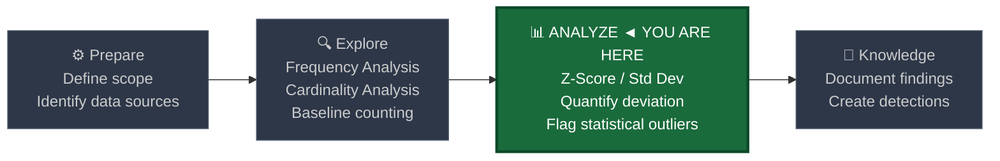
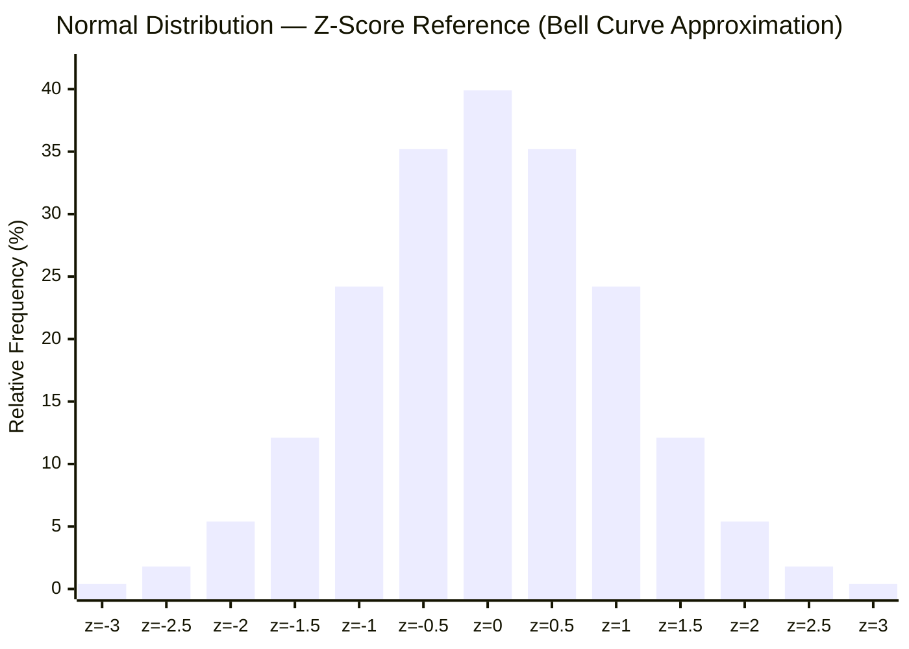
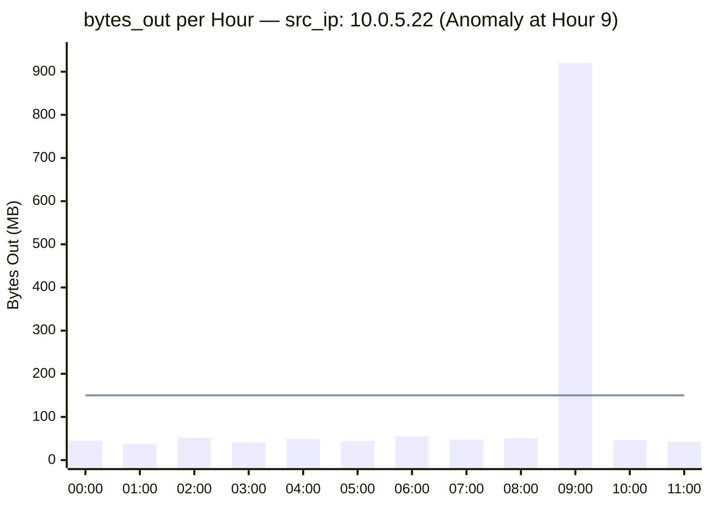

# Z-Score and Standard Deviation Analysis

← [Back to README](../README.md)

**Navigation:** [← 02 Cardinality Analysis](./02_cardinality_analysis.md) | [04 Percentile and IQR →](./04_percentile_iqr.md)

---

## PEAK Phase: Analyze

Z-score and standard deviation analysis live in the **Analyze** phase of the PEAK framework. By this point you have explored your data with frequency and cardinality baselines. Now you quantify *how far from normal* any given observation is — putting a precise number on "anomalous."



---

## What Is a Z-Score?

A **Z-score** (also called a standard score) measures how many standard deviations a data point is from the mean of its population. It transforms raw observations into a unitless measure of relative deviation.

### The Formula

```
z = (x - μ) / σ
```

Where:
- `x` is the observed value
- `μ` (mu) is the population mean
- `σ` (sigma) is the population standard deviation

A Z-score of 0 means the observation is exactly at the mean. A Z-score of 2 means the observation is 2 standard deviations above the mean — in a normal distribution, only ~2.3% of observations fall above this threshold.

### Z-Score Interpretation Table

| Z-Score Range | Interpretation | Security Action |
|---|---|---|
| `\|z\| < 1.0` | Normal — within one standard deviation | No action needed |
| `1.0 ≤ \|z\| < 2.0` | Slightly elevated — worth monitoring | Log for trending |
| `2.0 ≤ \|z\| < 3.0` | Suspicious — statistically unusual | Analyst review recommended |
| `\|z\| ≥ 3.0` | Highly anomalous — rare event | Priority investigation |
| `\|z\| ≥ 4.0` | Extreme outlier | Immediate escalation |

---

## Normal Distribution — Bell Curve Reference

The following chart approximates a normal distribution using bar heights. Most observations cluster near the center (mean). The tails — where Z > 2 or Z < -2 — are the detection zones.



The shaded extremes (z < -2 and z > 2) represent approximately 4.6% of observations combined. In a security context, these are your **alert candidates**.

---

## Why Standard Deviation Alone Is Not Enough

Standard deviation tells you *how spread out* the data is but not *where* a specific observation falls relative to the group. Consider:

- Host A sends 500 MB/hour. Standard deviation of the population is 200 MB. **Is 500 MB anomalous?**
- If the mean is 480 MB → Z = (500-480)/200 = **0.1** — completely normal.
- If the mean is 50 MB → Z = (500-50)/200 = **2.25** — suspicious.

Without the mean, `stdev` is meaningless as an anomaly signal. Always compute both together and combine them in an `eval` statement.

---

## Splunk Functions for Z-Score Analysis

### `stats avg() stdev()` — Compute Population Parameters

```spl
index=wineventlog EventCode=4624 earliest=-30d
| bucket _time span=1h
| stats count as login_count by SubjectUserName, _time
| stats avg(login_count) as mean_logins
       stdev(login_count) as stdev_logins
    by SubjectUserName
```

### `eventstats` — Inline Z-Score Without Collapsing

`eventstats` appends the population mean and stdev to every event, enabling per-event Z-score computation while preserving full event context.

```spl
index=corelight sourcetype=corelight_conn earliest=-24h
| stats sum(orig_bytes) as bytes_out by id.orig_h, _time
| eventstats avg(bytes_out) as mean_bytes
             stdev(bytes_out) as stdev_bytes
| eval z_score = round((bytes_out - mean_bytes) / stdev_bytes, 2)
| where z_score > 3
```

### `eval` — Compute Z-Score Per Row

```spl
| eval z_score = (observed_value - mean_value) / stdev_value
| eval z_abs = abs(z_score)
| eval anomaly_level = case(
    z_abs >= 4.0, "CRITICAL",
    z_abs >= 3.0, "HIGH",
    z_abs >= 2.0, "MEDIUM",
    true(),       "NORMAL"
  )
```

---

## Limitation: Assumes Normal Distribution

> **Z-score is only valid when the underlying data is approximately normally distributed. Many security metrics are heavily skewed — do not blindly apply Z-score to skewed data.**

Common skewed security metrics where Z-score underperforms:

| Metric | Distribution Type | Preferred Method |
|---|---|---|
| Bytes transferred per session | Right-skewed (power law) | IQR / percentile thresholding |
| Connection duration | Right-skewed (most short, few very long) | IQR |
| Process launch count per host | Right-skewed | Log-transform then Z-score, or IQR |
| Failed login count per user | Right-skewed | IQR / percentile |
| Beacon interval | Near-normal (if beacon jitter is Gaussian) | Z-score works well |
| Login count per hour (active users) | Near-normal | Z-score works well |

**Rule of thumb:** If your histogram shows a long right tail, use IQR ([04 Percentile and IQR](./04_percentile_iqr.md)). If it looks roughly bell-shaped, Z-score is appropriate.

---

## Data Sources

### Corelight (Network Logs)

| Log | Z-Score Metric | What Anomaly Indicates |
|---|---|---|
| `conn.log` | `bytes_out` per src_ip per hour | Data exfiltration spike |
| `conn.log` | `duration` per connection | Long-duration C2 sessions |
| `dns.log` | Query count per src_ip per hour | DGA flurry, DNS tunneling |

### Windows Event Logs

| EventCode | Z-Score Metric | What Anomaly Indicates |
|---|---|---|
| 4624 | Login count per user per hour | Account takeover, automated access |
| 4625 | Failed login count per user per hour | Brute force surge |
| 4688 | Process count per host per hour | Malware staging, tool deployment |

### Sysmon

| EventID | Z-Score Metric | What Anomaly Indicates |
|---|---|---|
| EID 1 | Process launch count per host per hour | Rapid tool execution, dropper activity |
| EID 3 | Outbound connection count per host per hour | Scanning, lateral movement, C2 check-ins |

---

## Baseline SPL — Explore Phase

### Compute Login Count Distribution per User per Hour

Build the population parameters that Z-score detection will use.

```spl
index=wineventlog EventCode=4624 earliest=-30d
| bucket _time span=1h
| stats count as login_count by SubjectUserName, _time
| stats avg(login_count)   as mean_logins
       stdev(login_count)  as stdev_logins
       min(login_count)    as min_logins
       max(login_count)    as max_logins
       count               as sample_hours
    by SubjectUserName
| where sample_hours >= 30
| eval cv = round(stdev_logins / mean_logins, 2)
| sort - stdev_logins
| table SubjectUserName, mean_logins, stdev_logins, cv, min_logins, max_logins, sample_hours
```

### Compute Bytes-Out Distribution per Source IP

```spl
index=corelight sourcetype=corelight_conn earliest=-30d
| bucket _time span=1h
| stats sum(orig_bytes) as bytes_out by id.orig_h, _time
| stats avg(bytes_out)   as mean_bytes
       stdev(bytes_out)  as stdev_bytes
       count             as sample_hours
    by id.orig_h
| where sample_hours >= 30
| eval upper_2sigma = round(mean_bytes + (2 * stdev_bytes), 0)
| eval upper_3sigma = round(mean_bytes + (3 * stdev_bytes), 0)
| sort - mean_bytes
| table id.orig_h, mean_bytes, stdev_bytes, upper_2sigma, upper_3sigma, sample_hours
```

---

## Detection SPL — Analyze Phase

### Z-Score on Login Count per User per Hour (WinEvent 4624)

```spl
index=wineventlog EventCode=4624 earliest=-24h
| bucket _time span=1h
| stats count as login_count by SubjectUserName, _time
| eventstats avg(login_count)  as mean_logins
             stdev(login_count) as stdev_logins
    by SubjectUserName
| eval z_score = round((login_count - mean_logins) / stdev_logins, 2)
| where z_score > 2.5 AND login_count > mean_logins
| eval hour = strftime(_time, "%Y-%m-%d %H:00")
| table hour, SubjectUserName, login_count, mean_logins, stdev_logins, z_score
| sort - z_score
```

### Z-Score on bytes_out per src_ip (Corelight conn.log)

```spl
index=corelight sourcetype=corelight_conn earliest=-24h
| bucket _time span=1h
| stats sum(orig_bytes) as bytes_out by id.orig_h, _time
| eventstats avg(bytes_out)   as mean_bytes
             stdev(bytes_out) as stdev_bytes
    by id.orig_h
| eval z_score = round((bytes_out - mean_bytes) / stdev_bytes, 2)
| where z_score > 3
| eval bytes_out_mb = round(bytes_out / 1048576, 2)
| eval mean_mb      = round(mean_bytes / 1048576, 2)
| eval hour = strftime(_time, "%Y-%m-%d %H:00")
| table hour, id.orig_h, bytes_out_mb, mean_mb, stdev_bytes, z_score
| sort - z_score
```

### Z-Score on Process Count per Host per Hour (Sysmon EID 1)

```spl
index=sysmon EventCode=1 earliest=-24h
| bucket _time span=1h
| stats count as proc_count by host, _time
| eventstats avg(proc_count)   as mean_procs
             stdev(proc_count) as stdev_procs
    by host
| eval z_score = round((proc_count - mean_procs) / stdev_procs, 2)
| where z_score > 3
| eval hour = strftime(_time, "%Y-%m-%d %H:00")
| table hour, host, proc_count, mean_procs, stdev_procs, z_score
| sort - z_score
```

### Inline Z-Score with `eventstats` — Preserving Raw Event Context

This pattern keeps individual raw events while annotating each with its group's Z-score, enabling drilling into the specific events that drove the anomaly.

```spl
index=corelight sourcetype=corelight_conn earliest=-6h
| eval hour = strftime(_time, "%Y-%m-%d %H:00")
| eventstats sum(orig_bytes) as hourly_bytes by id.orig_h, hour
| eventstats avg(hourly_bytes)   as mean_hourly_bytes
             stdev(hourly_bytes) as stdev_hourly_bytes
    by id.orig_h
| eval z_score = round((hourly_bytes - mean_hourly_bytes) / stdev_hourly_bytes, 2)
| where z_score > 3
| table _time, id.orig_h, id.resp_h, id.resp_p, orig_bytes, hourly_bytes, mean_hourly_bytes, z_score
| sort - z_score
```

---

## Visualization Recommendations

The following chart shows hourly `bytes_out` for a single source IP across a 12-hour window. The mean and ±2σ threshold are represented conceptually. Hour 9 is a clear Z > 3 outlier — consistent with data exfiltration.



The flat line at 150 represents the mean + 2σ threshold. Hour 9 at 920 MB is approximately Z = 6.1 — extreme and unambiguous. In a real dashboard, pair this with a sparkline of the anomalous host's destination IPs during that hour.

---

## Tuning Notes

| Issue | Symptom | Remediation |
|---|---|---|
| Insufficient sample size | Z-score fires on users with < 7 days of data | Enforce minimum sample size: `where sample_hours >= 30` |
| Skewed data | High false positive rate on bytes metrics | Switch to IQR ([04 Percentile and IQR](./04_percentile_iqr.md)) |
| Bursty legitimate transfers | Backup jobs, OS updates inflate bytes_out | Allowlist backup destination IPs; tag traffic by service |
| Accounts with no baseline | New accounts have no history | Require minimum N events before enabling Z-score alerts |
| Multiple populations | Servers and workstations are different populations | Always segment Z-score computation by host type or asset tier |

**Minimum recommended data points for reliable Z-score:** ≥ 30 observations per entity. Below 30, the mean and standard deviation are unstable and will produce excessive false positives. The more data the better — 90-day baselines are ideal for user behavior.

---

## Related Detection Use Cases

- [Beaconing](../03_detection_use_cases/01_beaconing.md) — Z-score on beacon interval consistency is a key detection signal; regular low-variance intervals are suspicious
- [Data Exfiltration](../03_detection_use_cases/02_data_exfiltration.md) — Z-score on bytes_out per src_ip per hour is the primary exfiltration signal
- [Insider Threat](../03_detection_use_cases/07_insider_threat.md) — Z-score on login count, access diversity, and data access volume reveals behavioral deviation

---

**Navigation:**
← [02 Cardinality Analysis](./02_cardinality_analysis.md) | [04 Percentile and IQR →](./04_percentile_iqr.md)
