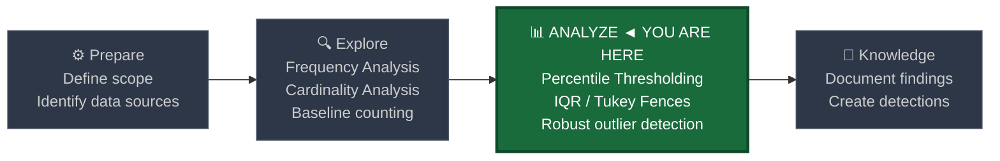
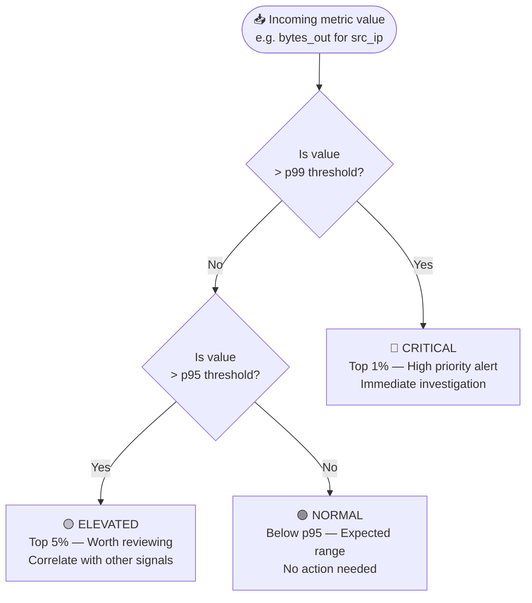
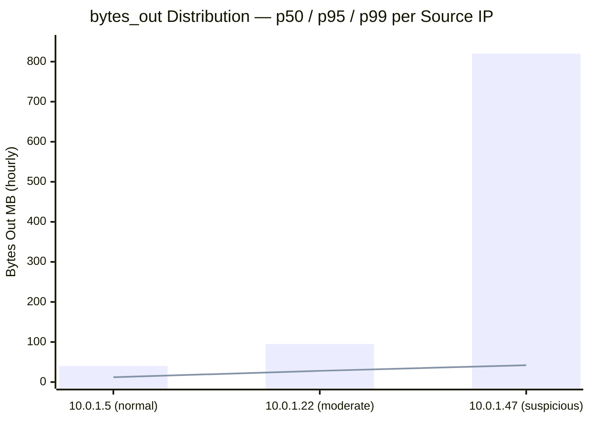
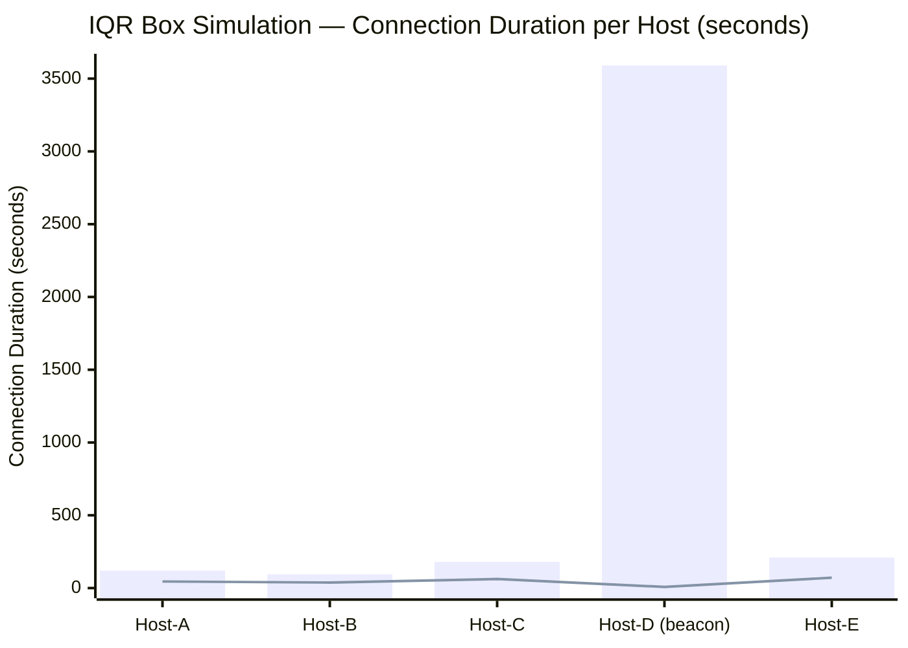

# Percentile Thresholding and IQR

← [Back to README](../README.md)

**Navigation:** [← 03 Z-Score and Std Dev](./03_zscore_stdev.md) | [05 Entropy Analysis →](./05_entropy_analysis.md)

---

## PEAK Phase: Analyze

Percentile thresholding and IQR analysis sit in the **Analyze** phase of the PEAK framework. These techniques are the robust alternatives to Z-score when your data is skewed — which describes the majority of real-world security metrics.



---

## Two Techniques, One Goal

This file covers two complementary approaches for identifying outliers in skewed distributions:

| Technique | Core Idea | Best For |
|---|---|---|
| **Percentile Thresholding** | Flag values above the 95th or 99th percentile | Single-threshold alerts on known-skewed metrics |
| **IQR (Interquartile Range)** | Flag values beyond Q3 + 1.5×IQR (Tukey fences) | Adaptive outlier detection, robust to extreme values |

Both methods work without assuming a normal distribution, making them more appropriate than Z-score for the right-skewed metrics that dominate security data (bytes transferred, connection counts, process spawns per hour).

---

## Percentile Thresholding

### Concept

A **percentile** ranks observations from lowest to highest and identifies the value below which a given percentage of observations fall.

- **p50** = median — 50% of values are below this
- **p95** = 95th percentile — only 5% of values exceed this
- **p99** = 99th percentile — only 1% of values exceed this

Defining "normal" as *anything below p95* and "anomalous" as *anything above p99* is a robust, distribution-agnostic threshold that works even when a handful of extreme values would otherwise inflate a mean and standard deviation.



---

## IQR: Interquartile Range

### Concept

The **IQR** is the range between the 25th percentile (Q1) and the 75th percentile (Q3). It represents the middle 50% of the data — the "bulk" of observations, unaffected by extremes at either end.

```
IQR = Q3 - Q1
```

### Tukey Fences

The **Tukey fences** extend from the IQR to define outlier boundaries:

```
Lower fence = Q1 - 1.5 × IQR
Upper fence = Q3 + 1.5 × IQR
```

Any value beyond these fences is a statistical outlier. For security purposes, we almost always focus on the **upper fence** (anomalously high values).

For extreme outlier detection, use a 3× multiplier:

```
Extreme upper fence = Q3 + 3.0 × IQR
```

### Why IQR Is More Robust Than Z-Score for Skewed Data

Z-score is sensitive to extreme values — one massive outlier inflates the mean and standard deviation, making subsequent outlier detection less sensitive. IQR uses quartiles which are **resistant to outliers**: a single extremely large value cannot shift Q1 or Q3 significantly.

---

## Z-Score vs IQR: When to Use Each

| Factor | Z-Score | IQR |
|---|---|---|
| Distribution assumption | Requires approximately normal distribution | No distribution assumption |
| Sensitivity to outliers in baseline | High — outliers inflate σ | Low — quartiles are robust |
| Best data types | Login counts per hour, beacon intervals | Bytes transferred, session duration, process counts |
| Interpretability | "N standard deviations from mean" | "Beyond the expected bulk range" |
| Splunk complexity | Moderate — requires `avg()` + `stdev()` + `eval` | Higher — requires `perc25/75` + multiple `eval` steps |
| False positive profile | Can be high when data is skewed | Lower for skewed data |
| Requires minimum sample size | Yes — ≥ 30 recommended | Yes — ≥ 30 recommended |

---

## Splunk Functions

### `stats perc25() perc75() perc95() perc99()` — Percentile Computation

```spl
index=corelight sourcetype=corelight_conn earliest=-30d
| stats perc25(orig_bytes) as q1
       perc75(orig_bytes) as q3
       perc95(orig_bytes) as p95
       perc99(orig_bytes) as p99
    by id.orig_h
```

Splunk supports any percentile from 1–99 using the `percN()` notation. Multiple percentile functions can be combined in a single `stats` command efficiently.

### `eventstats` — Append Percentiles to Raw Events

```spl
index=corelight sourcetype=corelight_conn earliest=-24h
| eventstats perc95(orig_bytes) as p95_bytes by id.orig_h
| where orig_bytes > p95_bytes
```

### `eval` — Compute IQR and Fences

```spl
| eval iqr           = q3 - q1
| eval upper_fence   = q3 + (1.5 * iqr)
| eval extreme_fence = q3 + (3.0 * iqr)
| eval is_outlier    = if(value > upper_fence, "YES", "NO")
| eval severity      = case(
    value > extreme_fence, "EXTREME",
    value > upper_fence,   "OUTLIER",
    true(),                "NORMAL"
  )
```

---

## Data Sources

### Corelight (Network Logs)

| Log | Key Metrics | Percentile / IQR Application |
|---|---|---|
| `conn.log` | `orig_bytes`, `resp_bytes`, `duration` | p99 bytes for exfiltration; IQR on duration for beaconing |
| `dns.log` | query count per src, response size | p95 query volume for tunneling |
| `http.log` | `request_body_len`, `response_body_len` | p99 upload size for exfiltration |

### Windows Event Logs

| EventCode | Key Metrics | Percentile / IQR Application |
|---|---|---|
| 4625 | Failed login count per user per hour | p95 for spray detection |
| 4624 | Logon count per user, logon diversity | p95 for unusual access volume |

### Sysmon

| EventID | Key Metrics | Percentile / IQR Application |
|---|---|---|
| EID 1 | Process spawn count per host per hour | p95 for malware staging |
| EID 3 | Outbound connection count per process | IQR on connection intervals for beaconing |

---

## Baseline SPL — Explore Phase

### Compute Percentile Distribution for bytes_out per Source IP

Use this to understand the full shape of the distribution before setting thresholds. Visualize the p50/p95/p99 gap to decide whether Z-score or IQR is appropriate.

```spl
index=corelight sourcetype=corelight_conn earliest=-30d
| bucket _time span=1h
| stats sum(orig_bytes) as bytes_out by id.orig_h, _time
| stats perc50(bytes_out) as p50
       perc75(bytes_out) as p75
       perc95(bytes_out) as p95
       perc99(bytes_out) as p99
       avg(bytes_out)    as mean_bytes
       stdev(bytes_out)  as stdev_bytes
       count             as sample_hours
    by id.orig_h
| where sample_hours >= 30
| eval skew_ratio = round(p99 / p50, 1)
| eval method_rec = if(skew_ratio > 5, "USE_IQR", "USE_ZSCORE")
| sort - skew_ratio
| table id.orig_h, p50, p75, p95, p99, mean_bytes, stdev_bytes, skew_ratio, method_rec
```

### Compute Percentile Distribution for Failed Logins per Hour

```spl
index=wineventlog EventCode=4625 earliest=-30d
| bucket _time span=1h
| stats count as failed_count by IpAddress, _time
| stats perc25(failed_count)  as q1
       perc75(failed_count)  as q3
       perc95(failed_count)  as p95
       perc99(failed_count)  as p99
       count                 as sample_hours
    by IpAddress
| where sample_hours >= 24
| eval iqr         = q3 - q1
| eval upper_fence = round(q3 + (1.5 * iqr), 0)
| sort - p99
| table IpAddress, q1, q3, iqr, upper_fence, p95, p99, sample_hours
```

---

## Detection SPL — Analyze Phase

### Percentile: bytes_out Above p99 per Source (Corelight)

```spl
index=corelight sourcetype=corelight_conn earliest=-24h
| bucket _time span=1h
| stats sum(orig_bytes) as bytes_out by id.orig_h, _time
| eventstats perc99(bytes_out) as p99_threshold by id.orig_h
| where bytes_out > p99_threshold
| eval bytes_out_mb  = round(bytes_out / 1048576, 2)
| eval threshold_mb  = round(p99_threshold / 1048576, 2)
| eval ratio_above   = round(bytes_out / p99_threshold, 2)
| eval hour = strftime(_time, "%Y-%m-%d %H:00")
| table hour, id.orig_h, bytes_out_mb, threshold_mb, ratio_above
| sort - bytes_out_mb
```

### Percentile: Failed Login Count Above p95 per Hour (WinEvent 4625)

```spl
index=wineventlog EventCode=4625 earliest=-24h
| bucket _time span=1h
| stats count as failed_count
       dc(TargetUserName) as unique_users
    by IpAddress, _time
| eventstats perc95(failed_count) as p95_threshold by IpAddress
| where failed_count > p95_threshold
| eval hour = strftime(_time, "%Y-%m-%d %H:00")
| eval ratio_above = round(failed_count / p95_threshold, 2)
| table hour, IpAddress, failed_count, unique_users, p95_threshold, ratio_above
| sort - failed_count
```

### IQR Full Example: Flag Outlier Connection Durations (Corelight conn.log)

This pattern computes the full IQR pipeline: Q1, Q3, IQR, Tukey fence, then flags individual connections exceeding the threshold.

```spl
index=corelight sourcetype=corelight_conn earliest=-24h
    duration > 0
| stats perc25(duration) as q1
       perc75(duration) as q3
    by id.orig_h
| eval iqr           = q3 - q1
| eval upper_fence   = q3 + (1.5 * iqr)
| eval extreme_fence = q3 + (3.0 * iqr)
| join type=left id.orig_h [
    search index=corelight sourcetype=corelight_conn earliest=-24h duration > 0
    | table id.orig_h, id.resp_h, id.resp_p, duration, orig_bytes, proto, _time
  ]
| eval is_outlier = case(
    duration > extreme_fence, "EXTREME",
    duration > upper_fence,   "OUTLIER",
    true(),                   "NORMAL"
  )
| where is_outlier != "NORMAL"
| eval conn_time = strftime(_time, "%Y-%m-%d %H:%M:%S")
| table conn_time, id.orig_h, id.resp_h, id.resp_p, proto, duration, upper_fence, extreme_fence, is_outlier
| sort - duration
```

### IQR on Beacon Interval Data

Legitimate network traffic is irregular. Beacons are extremely regular. Low IQR on connection intervals from a single source to a single destination is a beacon signal.

```spl
index=corelight sourcetype=corelight_conn earliest=-24h
| sort id.orig_h, id.resp_h, _time
| streamstats window=2 current=true
    values(_time) as time_pair
    by id.orig_h, id.resp_h
| eval interval = abs(mvindex(time_pair, 1) - mvindex(time_pair, 0))
| where interval > 0
| stats count as conn_count
       perc25(interval) as q1
       perc75(interval) as q3
       avg(interval) as avg_interval
    by id.orig_h, id.resp_h
| where conn_count >= 10
| eval iqr           = q3 - q1
| eval cv_iqr        = round(iqr / avg_interval, 4)
| where cv_iqr < 0.05
| eval avg_interval_min = round(avg_interval / 60, 2)
| sort + cv_iqr
| table id.orig_h, id.resp_h, conn_count, avg_interval_min, iqr, cv_iqr
```

A `cv_iqr` (coefficient of variation using IQR) below 0.05 indicates extremely regular intervals — a strong beacon signal.

---

## Visualization Recommendations

### Percentile Distribution Comparison

The following chart shows the bytes_out distribution shape for three source IPs. The difference between mean and p99 reveals skewness — IPs with extreme p99/p50 ratios are candidates for IQR-based detection.



The `bar` series represents p99 values; the `line` series represents p50 (median). For `10.0.1.47`, the p99 is 820 MB while the median is only 42 MB — a skew ratio of ~19.5x. This warrants IQR-based detection rather than Z-score.

### Boxplot Simulation — IQR Range Comparison

A conceptual representation of IQR ranges across hosts. Hosts with wide boxes (large IQR) have inherently variable traffic; hosts with narrow boxes and extreme whisker outliers are the detection targets.



`Host-D` has extreme max duration (3590 s) with a tiny IQR (near the line value of 8 s) — the hallmark of a beaconing session: many short connections plus one extremely long persistent connection.

---

## Tuning Notes

| Issue | Symptom | Remediation |
|---|---|---|
| Insufficient baseline window | Percentile thresholds shift daily | Require minimum 30-day baseline for stable percentile computation |
| Single extreme event skewing p99 | One legitimate large transfer makes p99 useless | Use IQR instead of percentile when outliers are present in baseline |
| Backup / batch job windows | Nightly backup spikes p99 for that host | Exclude backup traffic by destination IP or port from the baseline |
| CDN / cloud traffic | Large legitimate downloads inflate p95/p99 for users | Segment by traffic direction; focus detection on egress to unknown external IPs |
| New hosts | No baseline data means no reliable percentile | Require minimum 30 data points before enabling threshold alerts |
| Low-traffic hosts | Rarely communicate, so even small spikes look extreme | Set a minimum activity floor before applying percentile detection |

---

## Related Detection Use Cases

- [Beaconing](../03_detection_use_cases/01_beaconing.md) — IQR on connection intervals is the core beaconing detection technique; low IQR = highly regular intervals = beacon
- [Data Exfiltration](../03_detection_use_cases/02_data_exfiltration.md) — p99 thresholding on bytes_out per src_ip per hour is the primary exfiltration signal
- [Credential Attacks](../03_detection_use_cases/03_credential_attacks.md) — p95 thresholding on failed login counts per source per hour detects spray and brute force

---

**Navigation:**
← [03 Z-Score and Std Dev](./03_zscore_stdev.md) | [05 Entropy Analysis →](./05_entropy_analysis.md)
