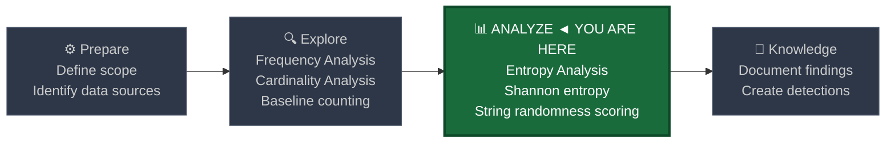
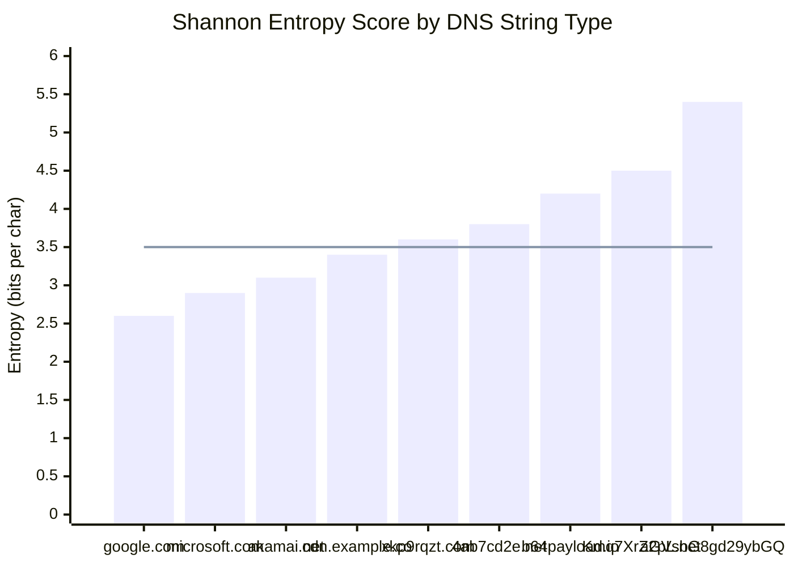
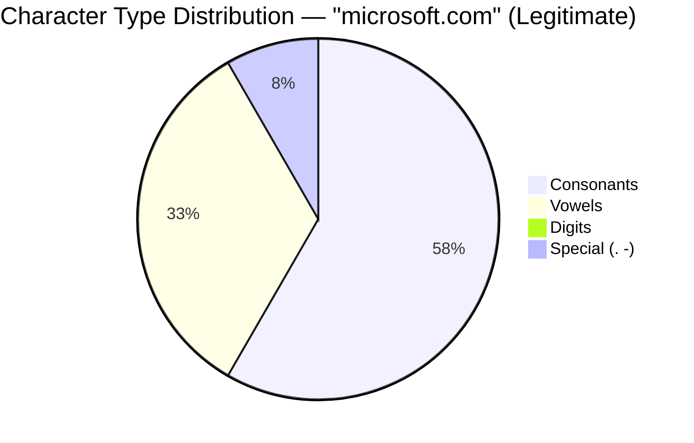
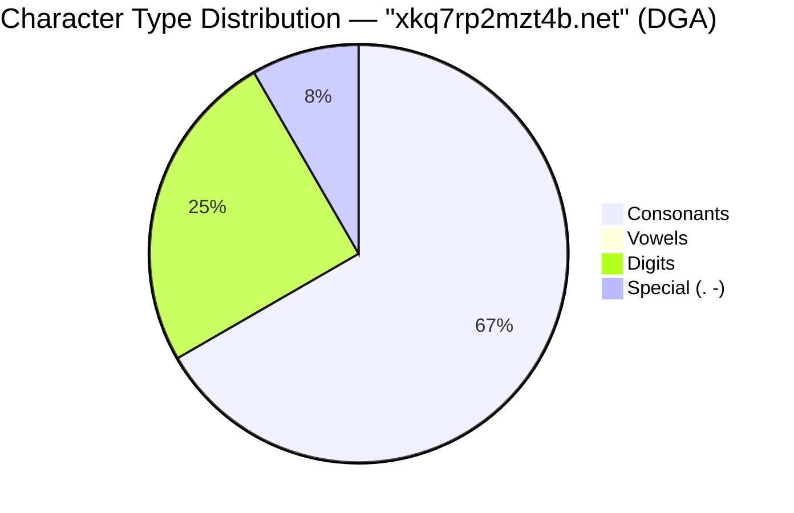

# Entropy Analysis

← [Back to README](../README.md)

**Navigation:** [← 04 Percentile and IQR](./04_percentile_iqr.md)

---

## PEAK Phase: Analyze

Entropy analysis lives in the **Analyze** phase of the PEAK framework. It is a specialized technique for detecting **randomness in strings** — a signal that separates algorithmically generated domain names and encoded payloads from human-readable, legitimate ones.



---

## What Is Shannon Entropy?

**Shannon entropy** (introduced by Claude Shannon in 1948) quantifies the **unpredictability or randomness** in a string or data source. A string with high entropy has many distinct characters used roughly equally — it looks "random." A string with low entropy has few distinct characters or strong repetition — it looks "structured" or "human-generated."

### The Formula

```
H = -Σ p(x) × log₂(p(x))
```

Where:
- `H` is the entropy in bits
- `p(x)` is the probability (frequency / total length) of character `x`
- The sum is taken over all distinct characters in the string
- The result is expressed in **bits per character**

### Worked Example

For the domain `google.com` (10 chars): `g=1, o=3, l=2, e=1, c=1, m=1, .=1`

| Character | Count | p(x) | p(x)×log₂(p(x)) |
|---|---|---|---|
| `o` | 3 | 0.300 | -0.521 |
| `l` | 2 | 0.200 | -0.464 |
| `g` | 1 | 0.100 | -0.332 |
| `e` | 1 | 0.100 | -0.332 |
| `c` | 1 | 0.100 | -0.332 |
| `m` | 1 | 0.100 | -0.332 |
| `.` | 1 | 0.100 | -0.332 |

H = 0.521 + 0.464 + 0.332 + 0.332 + 0.332 + 0.332 + 0.332 = **2.645 bits**

A DGA domain like `xkq7rp2mzt.com` uses 10 very different characters with near-equal frequency → H ≈ 3.5 bits.

---

## Why Security Cares About Entropy

### Domain Generation Algorithms (DGA)

Malware uses DGAs to generate hundreds or thousands of domain names as potential C2 channels. These domains:
- Are algorithmically generated → high character diversity → high entropy
- Are long (often 12–30 characters in the subdomain)
- Contain unusual character distributions (more consonants, more digits)
- Are queried rarely (one or few hosts, very low frequency)

### DNS Tunneling

DNS tunneling encodes data (file transfers, C2 commands) inside DNS query or response fields. Encoded data (base64, hex) is near-maximum entropy because the encoding uses the full character set uniformly.

### Entropy Reference Table

| String Type | Example | Entropy (bits) | Notes |
|---|---|---|---|
| Natural language word | `google`, `microsoft` | 2.0 – 3.2 | High vowel content, repetition |
| Legitimate domain (apex) | `amazon.com` | 2.5 – 3.5 | Mix of common and uncommon chars |
| DGA domain | `xkrp9mtz4q.com` | 3.5 – 4.0 | High diversity, no vowel pattern |
| Hex-encoded string | `4a2f9c81e3` | 3.9 – 4.0 | Max for 16-char set |
| Base64-encoded data | `aGVsbG8gd29ybGQ=` | 4.0 – 5.5 | 64-char set used near-uniformly |
| Random binary (base64) | `Xj7kL+Rq2nV/Yw==` | 5.5 – 6.0 | Maximum entropy for printable chars |

---

## Entropy Score Visualization

The following chart shows approximate entropy scores for different domain/payload types observed in DNS traffic. High-entropy names in the right portion of the chart are DGA or tunneling indicators.



The flat line at 3.5 represents a suggested detection threshold. Everything to the right of `cdn.example.co` warrants additional scrutiny when combined with low query frequency.

---

## Implementing Entropy in Splunk

### The Challenge

True Shannon entropy requires computing character frequencies across an arbitrary string — a statistical operation that pure SPL cannot do natively in a single command. The calculation requires iterating over every character, counting occurrences, and computing a logarithm — operations that require loops, which SPL lacks.

**Option 1: Splunk MLTK (Machine Learning Toolkit)** — provides a `shannon_entropy` function through Python-backed custom commands. Most accurate but requires the MLTK app.

**Option 2: Custom SPL approximations** — several proxy metrics strongly correlate with entropy and are computable in native SPL. These are described in detail below and are the practical choice for most environments.

**Option 3: External lookup / scripted input** — precompute entropy for observed domains in a Python script feeding a KV Store lookup. Combine with SPL at search time.

---

## Practical Entropy Approximations in Native SPL

The following five proxy metrics are each computable in native SPL and together form a multi-signal scoring model that approximates entropy detection without requiring the MLTK.

### Signal 1: Domain Length

DGA domains tend to be longer than legitimate domains. The subdomain component of a DGA name typically exceeds 12–15 characters.

```spl
index=corelight sourcetype=corelight_dns earliest=-24h
| rex field=query "^(?<subdomain>[^.]+)"
| eval domain_len = len(subdomain)
| stats count by query, domain_len
| sort - domain_len
```

### Signal 2: Unique Character Ratio (Diversity Score)

A high ratio of unique characters to total length suggests randomness. For `google` (6 chars, 5 unique): ratio = 0.83. For `aaabbbccc` (9 chars, 3 unique): ratio = 0.33. DGA domains typically score 0.70+.

```spl
| eval char_list      = split(lower(subdomain), "")
| eval total_chars    = mvcount(char_list)
| eval unique_chars   = mvcount(mvdedup(char_list))
| eval diversity_ratio = round(unique_chars / total_chars, 3)
```

### Signal 3: Vowel Ratio

Natural language (English) contains approximately 38–42% vowels. DGA domains generated from random character sets score much lower — often 5–15% vowels.

```spl
| eval vowel_count = len(replace(lower(subdomain), "[^aeiou]", ""))
| eval vowel_ratio = round(vowel_count / total_chars, 3)
```

> **Note:** `replace(string, regex, "")` combined with `len()` is a standard SPL pattern for counting character classes by measuring the length drop.

### Signal 4: Digit Ratio

Legitimate domain names rarely contain many digits. DGA algorithms often inject digits to increase character space. A digit ratio above 0.25 is a weak signal; above 0.40 is suspicious.

```spl
| eval digit_count = len(replace(lower(subdomain), "[^0-9]", ""))
| eval digit_ratio = round(digit_count / total_chars, 3)
```

### Signal 5: Subdomain Count (Label Depth)

DNS tunneling encodes data in nested subdomains. Legitimate domains rarely exceed 3–4 labels; tunneling traffic may show 6–10+ labels. A label count > 5 combined with high entropy is a strong tunneling signal.

```spl
| eval label_count = mvcount(split(query, "."))
```

---

## Splunk Functions Used

| Function | Purpose in Entropy Approximation |
|---|---|
| `eval` | Compute derived metrics, scoring, thresholds |
| `rex` | Extract subdomain component from full query string |
| `mvcount()` | Count elements in a multivalue field (chars, labels) |
| `split(field, delim)` | Split a string into a multivalue field (characters or labels) |
| `mvdedup()` | Remove duplicate values — used to count unique characters |
| `replace(field, regex, "")` | Remove matching characters — used to count character classes by length |
| `len()` | String length — foundation for all ratio computations |

---

## Data Sources

### Corelight — dns.log

The primary source for entropy-based DGA and tunneling detection.

| Field | Description | Entropy Use |
|---|---|---|
| `query` | Full DNS query string | Primary entropy analysis target |
| `id.orig_h` | Source IP | Correlate with frequency (low count + high entropy) |
| `qtype_name` | Query type (A, AAAA, TXT, MX) | TXT + high entropy = tunneling signal |
| `answers` | DNS response values | High entropy in TXT responses = tunneling |

### Sysmon — EID 22 (DNS Query)

Endpoint-side visibility into DNS queries. Correlate with process context (which process made the query).

| Field | Description | Entropy Use |
|---|---|---|
| `QueryName` | Full DNS query string | Primary entropy analysis target |
| `Image` | Process making the query | Unexpected process + high-entropy query = alert |
| `ProcessId` | PID of querying process | Correlate with EID 1 for full process context |

---

## Baseline SPL — Explore Phase

### Distribution of Domain Lengths

Build a histogram of subdomain lengths to establish what is normal in your environment. Anything in the right tail (> 20 chars) deserves scrutiny.

```spl
index=corelight sourcetype=corelight_dns earliest=-7d
| rex field=query "^(?<subdomain>[^.]+)"
| eval domain_len = len(subdomain)
| stats count by domain_len
| sort + domain_len
| eval length_bucket = case(
    domain_len <= 5,  "1-5 chars",
    domain_len <= 10, "6-10 chars",
    domain_len <= 15, "11-15 chars",
    domain_len <= 20, "16-20 chars",
    domain_len <= 30, "21-30 chars",
    true(),           "31+ chars"
  )
| stats sum(count) as query_count by length_bucket
```

### Distribution of Unique Character Ratio

```spl
index=corelight sourcetype=corelight_dns earliest=-7d
| rex field=query "^(?<subdomain>[^.]+)"
| eval char_list      = split(lower(subdomain), "")
| eval total_chars    = mvcount(char_list)
| eval unique_chars   = mvcount(mvdedup(char_list))
| eval diversity_ratio = round(unique_chars / total_chars, 2)
| where total_chars >= 8
| stats count by diversity_ratio
| sort + diversity_ratio
```

---

## Detection SPL — Analyze Phase

### Domain Length > 40 AND High Character Diversity

A fast first-pass filter to surface the most obviously anomalous domains.

```spl
index=corelight sourcetype=corelight_dns earliest=-24h
| rex field=query "^(?<subdomain>[^.]+)"
| eval total_chars    = len(subdomain)
| eval char_list      = split(lower(subdomain), "")
| eval unique_chars   = mvcount(mvdedup(char_list))
| eval diversity_ratio = round(unique_chars / total_chars, 3)
| where total_chars > 40 AND diversity_ratio > 0.7
| stats count as query_count
       values(id.orig_h) as querying_hosts
    by query, total_chars, diversity_ratio
| sort - total_chars
| table query, total_chars, diversity_ratio, query_count, querying_hosts
```

### Low Vowel Ratio Detection

```spl
index=corelight sourcetype=corelight_dns earliest=-24h
| rex field=query "^(?<subdomain>[^.]+)"
| eval total_chars = len(subdomain)
| where total_chars >= 10
| eval vowel_count = len(replace(lower(subdomain), "[^aeiou]", ""))
| eval vowel_ratio = round(vowel_count / total_chars, 3)
| where vowel_ratio < 0.15
| stats count as query_count
       values(id.orig_h) as querying_hosts
    by query, total_chars, vowel_ratio
| sort + vowel_ratio
| table query, total_chars, vowel_ratio, query_count, querying_hosts
```

### Combined Multi-Signal Entropy Scoring

This is the recommended production detection approach. It combines all five proxy signals into a composite risk score (0–100). Higher scores indicate a greater probability of DGA or DNS tunneling.

```spl
index=corelight sourcetype=corelight_dns earliest=-24h
| rex field=query "^(?<subdomain>[^.]+)(?:\.(?<apex>[^.]+\.[^.]+))?$"
| eval total_chars    = len(subdomain)
| where total_chars >= 8
| eval char_list      = split(lower(subdomain), "")
| eval unique_chars   = mvcount(mvdedup(char_list))
| eval diversity_ratio = round(unique_chars / total_chars, 3)
| eval vowel_count    = len(replace(lower(subdomain), "[^aeiou]", ""))
| eval vowel_ratio    = round(vowel_count / total_chars, 3)
| eval digit_count    = len(replace(lower(subdomain), "[^0-9]", ""))
| eval digit_ratio    = round(digit_count / total_chars, 3)
| eval label_count    = mvcount(split(query, "."))
| eval score_length   = case(total_chars > 30, 25, total_chars > 20, 15, total_chars > 15, 8, true(), 0)
| eval score_diversity = case(diversity_ratio > 0.85, 25, diversity_ratio > 0.75, 15, diversity_ratio > 0.65, 8, true(), 0)
| eval score_vowels   = case(vowel_ratio < 0.10, 25, vowel_ratio < 0.20, 15, vowel_ratio < 0.30, 8, true(), 0)
| eval score_digits   = case(digit_ratio > 0.40, 15, digit_ratio > 0.25, 8, digit_ratio > 0.15, 3, true(), 0)
| eval score_labels   = case(label_count > 6, 10, label_count > 4, 5, true(), 0)
| eval total_score    = score_length + score_diversity + score_vowels + score_digits + score_labels
| where total_score >= 50
| stats count as query_count
       avg(total_score) as avg_score
       values(id.orig_h) as querying_hosts
    by query, total_chars, diversity_ratio, vowel_ratio, digit_ratio, label_count
| sort - avg_score
| table query, total_chars, diversity_ratio, vowel_ratio, digit_ratio, label_count, avg_score, query_count, querying_hosts
```

**Score interpretation:**

| Score Range | Interpretation | Recommended Action |
|---|---|---|
| 0–30 | Low suspicion | No action |
| 30–49 | Moderate — worth noting | Include in weekly hunt review |
| 50–69 | Elevated — possible DGA | Analyst review, correlate with frequency |
| 70–89 | High — likely DGA or tunneling | Priority investigation |
| 90–100 | Critical — very high confidence | Immediate escalation |

---

## Visualization Recommendations

### Character Type Distribution: Legitimate vs DGA Domains

The following pie charts compare the character composition of a legitimate domain versus a DGA-generated domain.





The contrast is immediate: the legitimate domain has vowels (normal English distribution) and no digits. The DGA domain has zero vowels and three digits. This difference is what the vowel ratio and digit ratio signals quantify automatically.

---

## Tuning Notes

| Issue | Symptom | Remediation |
|---|---|---|
| CDN subdomains | Akamai, Cloudflare, Fastly use long random-looking hostnames | Build an allowlist of known CDN apex domains; suppress scoring for these |
| GUID-based cloud subdomains | Azure, AWS generate GUID-format hostnames with high entropy | Allowlist known cloud apex domains (`.azure.com`, `.amazonaws.com`, `.cloudapp.net`) |
| Security product beacons | Some EDR/XDR agents use high-entropy hostnames for telemetry endpoints | Document agent callback domains and add to allowlist |
| Internal PKI / OCSP | Certificate validation may use random-looking revocation check URLs | Allowlist known internal CA domains |
| Short subdomains | Very short strings (< 8 chars) generate unreliable ratio calculations | Enforce minimum length filter: `where total_chars >= 8` |
| Score threshold tuning | High false positive rate at score ≥ 50 | Raise threshold to ≥ 65 and require `query_count < 5` for DGA hunting |

**Recommended allowlist sources:** Cisco Umbrella Popularity List (top 1M domains), Majestic Million, internal asset DNS names from CMDB. Exclude these from entropy scoring entirely.

---

## Related Detection Use Cases

- [DNS Tunneling / DGA](../03_detection_use_cases/04_dns_tunneling_dga.md) — Entropy scoring is the core detection technique for both DGA and DNS tunneling; combine with low-frequency filtering for maximum precision

---

**Navigation:**
← [04 Percentile and IQR](./04_percentile_iqr.md) | ← [Back to README](../README.md)
