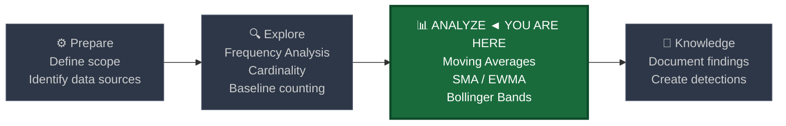
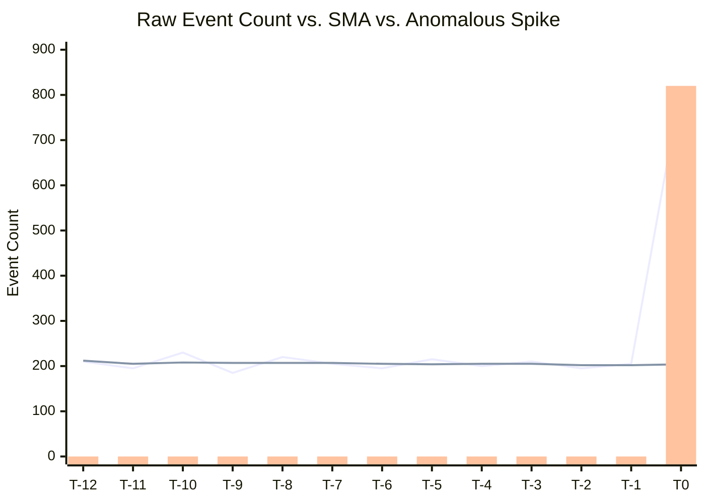
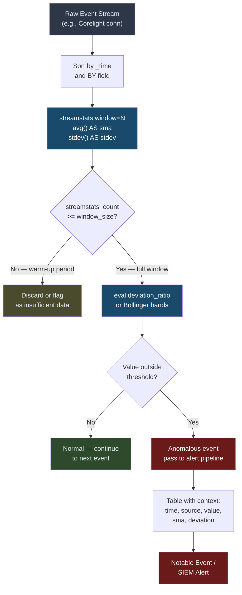
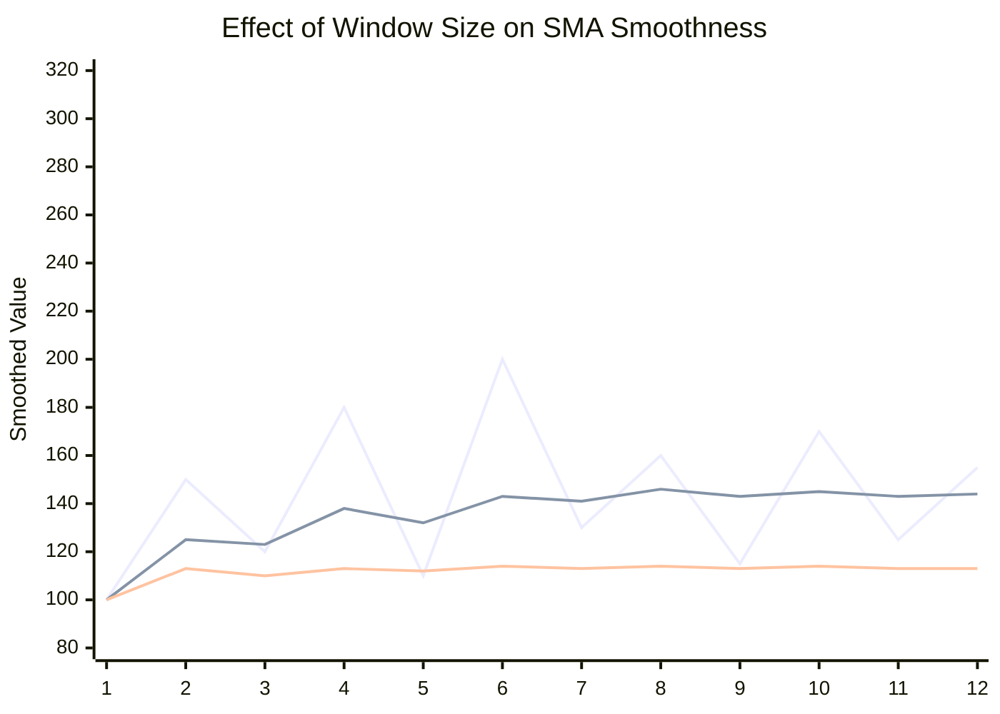

# Moving Averages

← [Back to README](../README.md)

**Navigation:** [← 05 IQR and Outlier Detection](./05_iqr_outlier_detection.md) | [07 Rate of Change →](./07_rate_of_change.md)

---

## PEAK Phase: Analyze

Moving averages live in the **Analyze** phase of the PEAK framework. Once you have explored your baseline distributions, moving averages let you build a dynamic, adaptive reference line that follows the natural rhythm of your data — and raises a flag when reality diverges from that rhythm.



---

## What Are Moving Averages?

A **moving average** is a continuously recalculated average that uses only the most recent N values (or a weighted subset of them). Rather than computing a single static mean across your entire dataset, a moving average **slides forward through time**, updating as new data arrives.

This property makes moving averages ideal for cybersecurity analytics because:

- **Baseline values change over time.** Network volumes are higher on weekdays, authentication events spike at 9 AM, and DNS queries surge when marketing runs campaigns. A static mean computed once a month will be wrong most of the time.
- **Attackers exploit static thresholds.** A threat actor performing slow-and-low exfiltration can stay under a fixed threshold indefinitely. A moving average catches gradual drift.
- **Noise obscures signals.** Individual data points are jittery. Smoothing reveals the underlying trend line, making deviations visually and computationally obvious.

> **The core security insight:** A moving average tells you what "normal right now" looks like. Any significant departure from that line is worth investigating.

---

## Simple Moving Average (SMA) vs. Exponentially Weighted Moving Average (EWMA)

The two most commonly used forms of moving average in security analytics are the **Simple Moving Average (SMA)** and the **Exponentially Weighted Moving Average (EWMA)**. They serve the same smoothing purpose but weight historical values differently.

### SMA — All Window Events Weighted Equally

The SMA takes the arithmetic mean of the last N events:

```
SMA_N = (x_t + x_{t-1} + x_{t-2} + ... + x_{t-N+1}) / N
```

Every event in the window contributes equally. An event from 10 windows ago and an event from 1 window ago both count the same — until the older event falls out of the window entirely, at which point it contributes nothing.

### EWMA — Recent Events Weighted More Heavily

The EWMA applies an exponentially decaying weight to older observations:

```
EWMA_t = α * x_t + (1 - α) * EWMA_{t-1}
```

Where α (alpha) is the smoothing factor between 0 and 1. A higher α makes the EWMA more responsive to recent changes; a lower α produces more smoothing.

### Comparison Table

| Property | SMA | EWMA |
|---|---|---|
| **Weighting** | Equal weight across window | Exponential decay — recent events weighted more |
| **Responsiveness** | Slow to react (controlled by window size) | Faster to react (controlled by α parameter) |
| **Memory** | Hard cutoff at window boundary — old data drops instantly | Infinite memory — old data fades but never fully disappears |
| **Implementation in Splunk** | Native via `streamstats window=N avg()` | Approximated via `eval` + previous value trick |
| **Best for** | Smoothing noisy but stationary metrics | Detecting rapid shifts while still smoothing noise |
| **Lag** | Higher lag (window/2 events behind) | Lower lag for high α values |
| **Sensitivity to outliers** | Outlier diluted across full window | Outlier has decaying but persistent influence |
| **Complexity** | Simple, easy to tune and explain | Requires alpha tuning, harder to explain to stakeholders |

---

## Visualizing Raw Data vs. Moving Average vs. Anomaly

The following chart shows three series on the same timeline: the noisy raw event count, the smoothed SMA line that follows the underlying trend, and the spike that breaks away from the moving average — the anomaly a detection rule would fire on.



> **Reading the chart:** The line series represent raw counts (jagged) and the SMA (smooth). The bar at T0 highlights the anomalous spike — the raw value jumps to 820 while the SMA remains near 204. The deviation ratio is approximately 4×, well above any reasonable threshold.

---

## EWMA Approximation in Splunk

Splunk's `streamstats` command does not implement true EWMA natively — it computes a true sliding-window arithmetic mean. However, you can **approximate EWMA** using `streamstats` to carry the previous EWMA value and `eval` to apply the decay formula.

The standard technique uses `streamstats` to bring forward the last computed value, then `eval` to apply the blending formula:

```spl
| streamstats window=1 last(metric) AS prev_metric BY src
| eval alpha = 0.3
| eval ewma = if(isnull(ewma), metric, alpha * metric + (1 - alpha) * prev_metric)
```

**Limitation:** Because Splunk processes events sequentially within `streamstats`, the EWMA approximation works best when events are pre-sorted by time and the series is dense (no large gaps). For sparse series, the "previous EWMA" may be hours or days stale, making α = 0.3 behave very differently than intended. In those cases, SMA with a carefully chosen window is more predictable.

---

## Splunk Functions Reference

### `streamstats`

The workhorse command for moving averages. It maintains a running window of events and computes aggregate statistics over that window.

```
streamstats window=N [BY <field>] [global=<bool>] [current=<bool>] <function> AS <alias>
```

| Parameter | Description | Typical Value |
|---|---|---|
| `window=N` | Number of events to include in the sliding window | 5–24 depending on granularity |
| `BY <field>` | Compute separate windows per group (e.g., per src_ip) | `src`, `user`, `host` |
| `global=true` | When used with BY, applies window globally before grouping | `false` (default) |
| `current=true` | Include the current event in the window calculation | `true` (default) |
| `avg(<field>)` | Compute mean over window | Any numeric field |
| `stdev(<field>)` | Compute standard deviation over window | Any numeric field |

### Key functions used in this guide

| Function | Purpose |
|---|---|
| `streamstats window=N avg(X)` | Sliding window mean — the SMA |
| `streamstats window=N stdev(X)` | Sliding window standard deviation — used for Bollinger Bands |
| `eval deviation = X / sma - 1` | Compute relative deviation from moving average |
| `eval upper_band = sma + 2*stdev` | Bollinger upper band |
| `eval lower_band = sma - 2*stdev` | Bollinger lower band |

---

## Data Sources

| Source | Field(s) of Interest | Notes |
|---|---|---|
| **Corelight conn** | `bytes_out`, `orig_pkts`, `duration`, `dest_port` | Network volume metrics — high natural variance |
| **Sysmon EID 1** | `process_name`, `parent_process` — aggregated count per host | Process spawn velocity |
| **WinEvent 4624** | `user` — aggregated auth count per hour | Login volume trends |
| **WinEvent 4625** | `user` — failed login count | Brute force detection |
| **Corelight dns** | `query` count per src | DNS query volume burst detection |
| **Corelight http** | `request_body_len`, `response_body_len` | HTTP transfer volume |

---

## Baseline SPL — Explore Phase

Before building detection rules, visualize the trend in your data with `timechart` and a trendline overlay. This tells you whether your data has a linear trend (slowly growing traffic), cyclic pattern (day/night), or is roughly stationary.

```spl
| tstats summariesonly=t count AS conn_count
    FROM datamodel=Network_Traffic.All_Traffic
    WHERE earliest=-30d
    BY _time span=1h
| timechart span=1h sum(conn_count) AS hourly_connections
    trendline sma5(hourly_connections) AS sma_5h
              sma24(hourly_connections) AS sma_24h
```

> **Interpretation:** The `trendline` modifier in `timechart` applies Splunk's built-in SMA calculation for visualization. `sma5` is a 5-bucket SMA; `sma24` is a 24-bucket (full-day) SMA. Comparing them reveals intraday vs. day-over-day trends.

For Corelight specifically:

```spl
index=corelight sourcetype=corelight_conn
| bucket _time span=1h
| stats sum(bytes_out) AS total_bytes BY _time
| sort _time
| timechart span=1h sum(total_bytes)
    trendline sma7(sum(total_bytes)) AS rolling_7h
```

---

## Detection SPL — Analyze Phase

### 1. SMA 7-Event Sliding Window on Bytes Out per Source (Corelight conn)

Flag when a source IP's current bytes_out is more than 2× its 7-event moving average. This catches sudden exfiltration bursts even when the absolute volume is not threshold-triggering.

```spl
index=corelight sourcetype=corelight_conn
    earliest=-24h
| eval bytes_out = tonumber(orig_bytes)
| where isnotnull(bytes_out) AND bytes_out > 0
| sort _time
| streamstats window=7 avg(bytes_out) AS sma_bytes
             stdev(bytes_out) AS stdev_bytes
    BY id.orig_h
| eval deviation_ratio = bytes_out / sma_bytes
| eval z_score = (bytes_out - sma_bytes) / if(stdev_bytes > 0, stdev_bytes, 1)
| where deviation_ratio > 2 AND streamstats_count >= 7
| table _time id.orig_h id.resp_h id.resp_p bytes_out sma_bytes deviation_ratio z_score
| sort - deviation_ratio
```

**Why `streamstats_count >= 7`?** The first 6 events for any source IP have a window smaller than 7, making the SMA less reliable. Requiring a full window reduces false positives during the warm-up period.

---

### 2. SMA 10-Event on Process Spawn Count per Host per Hour (Sysmon EID 1)

Detect hosts spawning processes at an elevated rate compared to their own recent history. Useful for catching malware dropping multiple child processes, lateral movement tools, or malicious scripting activity.

```spl
index=sysmon EventCode=1
    earliest=-48h
| bucket _time span=1h
| stats count AS spawn_count BY _time host
| sort host _time
| streamstats window=10 avg(spawn_count) AS sma_spawns
             stdev(spawn_count) AS stdev_spawns
    BY host
| eval upper_threshold = sma_spawns + 2 * stdev_spawns
| eval is_anomalous = if(spawn_count > upper_threshold AND spawn_count > sma_spawns * 1.5, 1, 0)
| where is_anomalous = 1 AND streamstats_count >= 5
| table _time host spawn_count sma_spawns upper_threshold stdev_spawns
| sort - spawn_count
```

---

### 3. Bollinger Band Approach — Flag Events Outside ±2 Standard Deviations

Bollinger Bands apply a dynamic envelope around the moving average. Values outside the band are statistically unusual given recent history. This is more nuanced than a simple ratio — it accounts for the current volatility of the metric.

```spl
index=corelight sourcetype=corelight_conn
    earliest=-7d
| eval bytes = tonumber(orig_bytes)
| where isnotnull(bytes)
| bucket _time span=1h
| stats sum(bytes) AS hourly_bytes BY _time id.orig_h
| sort id.orig_h _time
| streamstats window=24 avg(hourly_bytes) AS sma
             stdev(hourly_bytes) AS stdev
    BY id.orig_h
| eval upper_band = sma + (2 * stdev)
| eval lower_band = sma - (2 * stdev)
| eval outside_band = case(
    hourly_bytes > upper_band, "ABOVE",
    hourly_bytes < lower_band AND hourly_bytes > 0, "BELOW",
    true(), "NORMAL"
  )
| where outside_band != "NORMAL" AND streamstats_count >= 12
| table _time id.orig_h hourly_bytes sma stdev upper_band lower_band outside_band
| sort - hourly_bytes
```

> **Bollinger Band width as an indicator:** When `stdev` is very small, the bands are tight and even small deviations flag. When `stdev` is large (high-variance metric), the bands widen and only extreme values flag. This self-calibration is one of the key advantages over fixed thresholds.

---

### 4. Rolling 24-Hour Window for Day-Over-Day Comparison

Use a 24-bucket window on hourly data to compare the current hour's value against the same-time-yesterday average. This naturally accounts for time-of-day seasonality without needing `predict`.

```spl
index=wineventlog EventCode=4625
    earliest=-14d
| bucket _time span=1h
| stats count AS failed_logins BY _time
| sort _time
| streamstats window=24 avg(failed_logins) AS rolling_24h_avg
             stdev(failed_logins) AS rolling_24h_stdev
| eval upper_band = rolling_24h_avg + (2 * rolling_24h_stdev)
| eval pct_above_avg = round((failed_logins - rolling_24h_avg) / rolling_24h_avg * 100, 1)
| where failed_logins > upper_band AND streamstats_count >= 24
| table _time failed_logins rolling_24h_avg rolling_24h_stdev upper_band pct_above_avg
```

---

## Event Stream to Alert — Processing Flow



---

## Window Size Selection — Visual Impact

The window size is the single most important tuning parameter. This chart shows how different window sizes respond to the same underlying signal.



> **Reading the chart:** The first line (jagged) is raw data. The middle line is SMA-3 — still responsive but smoother. The bottom line is SMA-7 — much smoother but significantly lagged. A spike that appears at point 6 in the raw data only partially surfaces in SMA-7 by point 10.

---

## Visualization Recommendations

| Visualization | Splunk Chart Type | Use Case |
|---|---|---|
| Moving average overlay | `timechart` with `trendline sma7()` | Quick visual baseline validation |
| Bollinger band envelope | `timechart` + `eval` upper/lower, overlay line chart | Show band width dynamics over time |
| Deviation ratio heatmap | `chart deviation_ratio BY host date_hour` | Spot which hosts spike at which hours |
| Top deviators table | `table` sorted by `deviation_ratio` | Triage list for investigation |
| Alert rate over time | `timechart count WHERE is_anomalous=1` | Track rule performance and FP rate |

**Recommended dashboard layout:**
1. Top panel: `timechart` of raw metric + SMA overlay for the most important source
2. Middle panel: table of current anomalies with deviation ratio sorted descending
3. Bottom panel: trend of daily alert count (to catch if tuning changes or new data appears)

---

## Tuning Notes

### Window Size Selection

| Window Size | Behavior | Best For |
|---|---|---|
| 3–5 events | Highly responsive, noisy | Fast-moving metrics, short bursts |
| 7–10 events | Balanced — standard choice | Most security use cases |
| 12–24 events | Slow to respond, very smooth | Day-over-day comparison, trending |
| >30 events | Effectively a monthly average | Macro trend only, poor for detection |

**Rule of thumb:** Set window to cover one complete "natural cycle" of your data. If your data is hourly and has a clear 24-hour pattern, use `window=24`. If it's per-connection and you want to capture recent behavior only, use `window=7`.

### Avoiding Common Pitfalls

- **Warm-up bias:** Always filter `WHERE streamstats_count >= window_size` or you will flag legitimate early events as anomalous due to incomplete windows.
- **Mixed entity sizes:** A server handling millions of connections per hour and a workstation handling ten will have very different variances. Always use `BY host` or `BY src_ip` — never compute a global SMA across heterogeneous entities.
- **Static ratio thresholds:** `deviation > 2` is a starting point, not a rule. In high-variance environments (e.g., backup windows that double normal traffic), you may need `deviation > 4` or `deviation > 5`. Use the `stdev`-based Bollinger approach instead of ratios when variance itself is variable.
- **Time gaps in series:** `streamstats` does not know about time — only event count. If an entity goes quiet for 12 hours and then resumes, the window may span days of real time. For time-gap-aware analysis, pre-bucket by `_time span=1h` and use `fillnull value=0` before running `streamstats`.

---

## Related Detection Use Cases

- [Data Exfiltration](../03_detection_use_cases/02_data_exfiltration.md) — Moving averages on bytes_out are a primary detection mechanism for slow exfiltration
- [Lateral Movement](../03_detection_use_cases/05_lateral_movement.md) — Process spawn and authentication rate changes reveal lateral movement propagation

---

**Navigation:** [← 05 IQR and Outlier Detection](./05_iqr_outlier_detection.md) | [07 Rate of Change →](./07_rate_of_change.md)

← [Back to README](../README.md)
