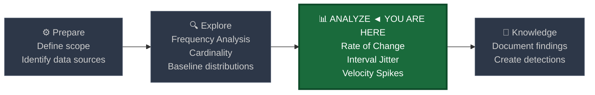
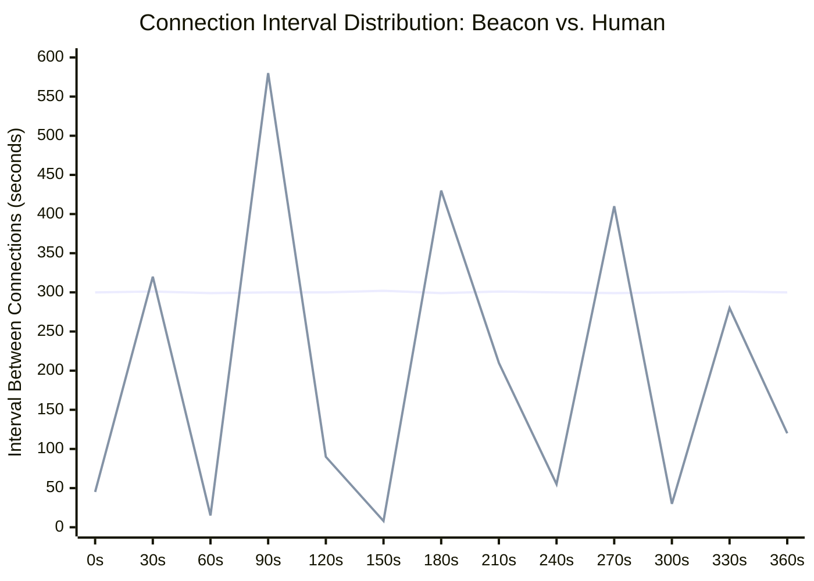
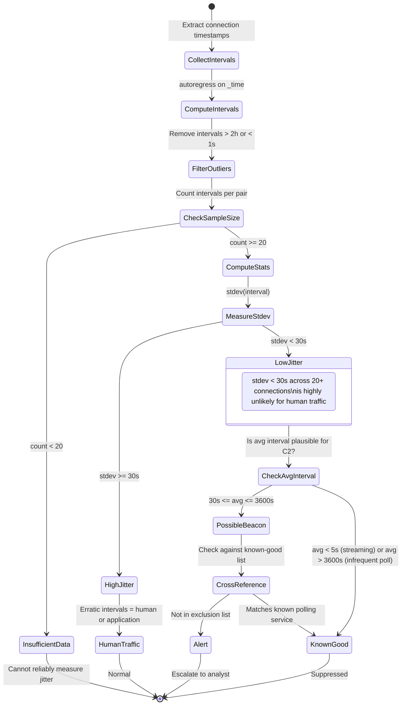
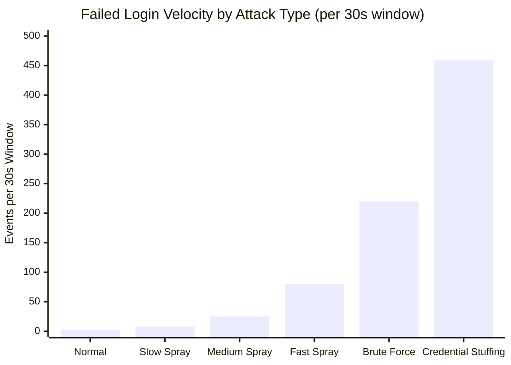

# Rate of Change and Velocity Analysis

← [Back to README](../README.md)

**Navigation:** [← 06 Moving Averages](./06_moving_averages.md) | [08 Time-Series Forecasting →](./08_timeseries_forecasting.md)

---

## PEAK Phase: Analyze

Rate of change analysis lives in the **Analyze** phase of the PEAK framework. Where moving averages tell you the current expected level, rate of change tells you **how fast** something is moving — and velocity is often the most reliable early indicator of attack activity.



---

## What Is Rate of Change?

**Rate of change** measures how much a value shifts between successive observations:

```
rate_of_change = (current_value - previous_value) / previous_value
```

This produces a relative (percentage) change. A value of `0.05` means a 5% increase; a value of `2.0` means the metric tripled. When applied to **time intervals** rather than metric values, rate of change reveals the rhythm of activity.

**Velocity** is the colloquial security term for the same concept — how fast is something moving? A slowly creeping volume increase has low velocity. A sudden burst of 500 failed logins in 30 seconds has extremely high velocity.

> **The core security insight:** Many attacks have characteristic velocity signatures. Beaconing has NEAR-ZERO velocity (hyper-regular intervals). Brute force has EXTREME positive velocity (sudden count surge). Knowing which you're looking for determines how you compute and threshold the rate.

---

## The Two Velocity Signatures That Matter Most

### Low Velocity (Suspicious Regularity) — Beaconing / C2

A compromised host calling home to a C2 server does so on a programmatic timer. Humans do not browse the internet on a timer. The difference is not in the volume of connections but in the **consistency of the interval between them**.

- Connection at T+0
- Connection at T+300s
- Connection at T+600s
- Connection at T+900s

Standard deviation of intervals ≈ 0. This is not human. This is a beacon.

### High Velocity (Suspicious Spike) — Brute Force / Scanning

An attacker attempting to authenticate against 1,000 accounts in 60 seconds produces a sharp discontinuity in the event count time series. The count goes from 2 per minute to 800 per minute in a single measurement window. That delta — the velocity — is the signal.

---

## Visualizing Beaconing vs. Human Browsing Intervals



> **Reading the chart:** The flat line represents a beacon with a 300-second (5-minute) callback interval — extremely consistent, stdev ≈ 1. The jagged line represents human browsing — intervals vary wildly from 8 seconds to 580 seconds with high standard deviation. Low stdev = suspicious in this context.

---

## Splunk Functions for Rate of Change

### `autoregress`

The `autoregress` command is Splunk's dedicated tool for accessing the value of a field from a **previous event** in the same search. It enables event-to-event delta computation.

```
autoregress <field> [AS <alias>] [p=<int>]
```

| Parameter | Description | Example |
|---|---|---|
| `<field>` | The field whose previous value you want | `bytes_out`, `_time`, `count` |
| `AS <alias>` | Name for the previous-value field | `AS prev_bytes` |
| `p=<int>` | How many events back to look (default 1) | `p=1` (previous), `p=7` (7 events back) |

**Important:** `autoregress` requires events to be **sorted by the relevant field** before the command runs. Always `sort _time` or `sort host _time` before calling `autoregress`. It also respects `BY` groups when used in combination with `streamstats`.

### `streamstats` for velocity

```
streamstats window=N count AS rolling_count BY src
```

Used to compute event counts over sliding windows, then `autoregress` on the count to find the change between windows.

### `eval` for rate computation

```spl
| eval velocity = (count - prev_count)
| eval pct_change = (count - prev_count) / if(prev_count > 0, prev_count, 1) * 100
| eval interval = _time - prev_time
```

---

## Data Sources

| Source | Use Pattern | Key Fields |
|---|---|---|
| **Corelight conn** | Interval jitter per src-dest pair | `id.orig_h`, `id.resp_h`, `_time` |
| **Corelight conn** | Volume velocity (bytes_out change rate) | `orig_bytes`, `id.orig_h` |
| **WinEvent 4624** | Login velocity per user | `Account_Name`, `_time` |
| **WinEvent 4625** | Failed login burst detection | `Account_Name`, `IpAddress` |
| **Sysmon EID 1** | Process spawn velocity per host | `host`, `_time` |
| **Sysmon EID 3** | Network connection velocity per process | `Image`, `DestinationIp`, `_time` |
| **Corelight dns** | DNS query burst | `id.orig_h`, `query`, `_time` |

---

## Two Main Use Patterns

### Pattern 1 — Interval Jitter (Beaconing Detection)

**Goal:** Identify src-dest pairs where the time between connections is suspiciously consistent.

**Method:**
1. Extract connection timestamps per src-dest pair
2. Compute the interval between consecutive connections using `autoregress`
3. Aggregate: `avg(interval)`, `stdev(interval)`, `count`
4. Flag pairs where `stdev < threshold` (low jitter = regular cadence)

**Threshold guidance:** `stdev < 10` seconds for a 5-minute nominal interval is very suspicious. Human traffic at the same pair will have `stdev > 60` seconds over any meaningful sample.

### Pattern 2 — Value Velocity (Spike Detection)

**Goal:** Identify when a metric's rate of change exceeds normal variation.

**Method:**
1. Bucket events into fixed time windows (e.g., 30-second or 1-minute buckets)
2. Count events per window
3. Use `autoregress` to get the previous window's count
4. Compute velocity = current count - previous count
5. Flag when `velocity > threshold`

---

## Baseline SPL — Explore Phase

### Distribution of Connection Intervals per Src-Dest Pair (Corelight conn)

Before building detection rules, explore the natural distribution of intervals for your most active connections.

```spl
index=corelight sourcetype=corelight_conn
    earliest=-7d
| eval src = 'id.orig_h'
| eval dest = 'id.resp_h'
| eval dest_port = 'id.resp_p'
| sort src dest dest_port _time
| autoregress _time AS prev_time p=1
| eval interval_sec = _time - prev_time
| where interval_sec > 0 AND interval_sec < 3600
| stats count AS connection_count
         avg(interval_sec) AS avg_interval
         stdev(interval_sec) AS stdev_interval
         min(interval_sec) AS min_interval
         max(interval_sec) AS max_interval
    BY src dest dest_port
| where connection_count >= 20
| sort stdev_interval
| head 50
```

> **What to look for:** The top results (lowest stdev) are your most regular connections. Some will be legitimate polling services, monitoring agents, or keep-alives. Document these as known-good and add them to an exclusion list before building detection rules.

### Distribution of Inter-Login Time for User Accounts (WinEvent 4624)

```spl
index=wineventlog EventCode=4624
    LogonType=3 OR LogonType=10
    earliest=-14d
| eval user = Account_Name
| where user != "-" AND user != "ANONYMOUS LOGON"
| sort user _time
| autoregress _time AS prev_login_time p=1
| eval minutes_since_last_login = round((_time - prev_login_time) / 60, 1)
| where minutes_since_last_login > 0 AND minutes_since_last_login < 1440
| stats count AS login_count
         avg(minutes_since_last_login) AS avg_gap_min
         stdev(minutes_since_last_login) AS stdev_gap_min
         perc5(minutes_since_last_login) AS p5_gap
         perc95(minutes_since_last_login) AS p95_gap
    BY user
| where login_count >= 10
| sort avg_gap_min
```

---

## Detection SPL — Analyze Phase

### 1. Beaconing Detection via Interval Jitter (Corelight conn)

```spl
index=corelight sourcetype=corelight_conn
    earliest=-24h
| eval src = 'id.orig_h'
| eval dest = 'id.resp_h'
| eval dest_port = 'id.resp_p'
| where dest_port != 443 OR match(dest, "^(10\.|172\.(1[6-9]|2[0-9]|3[01])\.|192\.168\.)")
| sort src dest dest_port _time
| autoregress _time AS prev_time p=1
| eval interval_sec = _time - prev_time
| where interval_sec > 1 AND interval_sec < 7200
| stats count AS connection_count
         avg(interval_sec) AS avg_interval_sec
         stdev(interval_sec) AS jitter_sec
         min(interval_sec) AS min_interval
         max(interval_sec) AS max_interval
         values(dest_port) AS ports
    BY src dest
| where connection_count >= 20
      AND jitter_sec < 30
      AND avg_interval_sec > 10
| eval regularity_score = round(100 - (jitter_sec / avg_interval_sec * 100), 1)
| where regularity_score > 85
| sort - regularity_score
| table src dest ports connection_count avg_interval_sec jitter_sec regularity_score
```

**Logic explanation:**
- `jitter_sec < 30`: less than 30 seconds of standard deviation in connection intervals
- `avg_interval_sec > 10`: filters out connections that are essentially constant streams (keep-alive at 1s)
- `regularity_score > 85`: composite score — the closer to 100, the more machine-like the cadence
- Minimum 20 connections required for statistically reliable jitter estimate

---

### 2. Brute Force Velocity Detection (WinEvent 4625)

```spl
index=wineventlog EventCode=4625
    earliest=-2h
| bucket _time span=30s
| stats count AS failed_count
         dc(Account_Name) AS unique_accounts
         dc(IpAddress) AS unique_sources
    BY _time IpAddress
| sort IpAddress _time
| autoregress failed_count AS prev_count p=1
| eval velocity = failed_count - prev_count
| eval acceleration = velocity - coalesce(lag_velocity, 0)
| autoregress velocity AS lag_velocity p=1
| where velocity > 20 OR failed_count > 50
| eval attack_type = case(
    unique_accounts > 10 AND failed_count > 30, "PASSWORD_SPRAY",
    unique_accounts <= 3 AND failed_count > 30, "BRUTE_FORCE_TARGETED",
    true(), "ELEVATED_FAILURES"
  )
| table _time IpAddress failed_count prev_count velocity unique_accounts unique_sources attack_type
| sort - velocity
```

---

### 3. C2 Heartbeat Detection via Sysmon EID 3 (Process Network Connections)

Detect processes making regular, low-jitter outbound network connections — the signature of a C2 agent checking in.

```spl
index=sysmon EventCode=3
    Initiated=true
    earliest=-6h
| where NOT match(Image, "(?i)(chrome|firefox|edge|teams|outlook|onedrive|svchost)")
| eval process_dest = Image + "|" + DestinationIp + "|" + DestinationPort
| sort process_dest _time
| autoregress _time AS prev_time p=1
| eval interval_sec = _time - prev_time
| where interval_sec > 5 AND interval_sec < 3600
| stats count AS call_count
         avg(interval_sec) AS avg_interval
         stdev(interval_sec) AS jitter
         values(host) AS hosts
         values(User) AS users
    BY Image DestinationIp DestinationPort
| where call_count >= 10
      AND jitter < 15
      AND avg_interval BETWEEN 30 AND 3600
| eval beacon_score = round((1 - jitter / avg_interval) * 100, 1)
| where beacon_score > 80
| sort - beacon_score
| table Image DestinationIp DestinationPort call_count avg_interval jitter beacon_score hosts users
```

---

## State Machine: Interval Analysis Decision Flow



---

## Velocity Threshold Calibration Chart

The following shows how brute force velocity (failed logins per 30s window) compares across different attack intensities:



> **Reading the chart:** The recommended velocity threshold of `velocity > 20` will catch Medium Spray and above while avoiding false positives from Normal user traffic. Adjust downward (e.g., 10) in environments with small user populations where even slow sprays are suspicious.

---

## Visualization Recommendations

| Visualization | Splunk Chart Type | Use Case |
|---|---|---|
| Interval scatter plot | `scatter _time interval_sec BY src dest` | Visually identify flat (beacon) vs. scattered (human) lines |
| Jitter histogram | `chart count BY interval_bucket` with eval bucketing | Show distribution shape per pair |
| Velocity timechart | `timechart sum(failed_count)` with `streamstats` overlay | See burst events in context |
| Beacon candidates table | Table sorted by `regularity_score` | Daily review list |
| Alert heat map | `chart count BY src date_hour` | Show when each source is most active |

**Key dashboard panels for rate-of-change monitoring:**
1. Real-time failed login velocity (30-second buckets, last 2 hours)
2. Top beacon candidates (sorted by regularity score, updated hourly)
3. Process network velocity outliers (sorted by call frequency, last 6 hours)

---

## Tuning Notes

### Minimum Connection Count for Reliable Jitter Analysis

Statistical rule: you need **at least 20 intervals** (21 connection events) to get a reliable standard deviation estimate. With fewer points, a single delayed connection (e.g., due to network latency or host sleep) can artificially inflate the stdev and mask a beacon.

| Sample Size | Stdev Reliability | Recommendation |
|---|---|---|
| < 10 | Poor | Do not use for jitter detection |
| 10–19 | Marginal | Use only with conservative thresholds (stdev < 10) |
| 20–49 | Good | Standard detection threshold (stdev < 30) |
| 50+ | Excellent | Reliable — can tighten threshold to stdev < 15 |

### Environment-Specific Adjustments

- **Monitoring/management agents:** Tools like SCCM, CrowdStrike, Carbon Black, and Splunk forwarders themselves make hyper-regular connections. Build an exclusion list from your baseline before enabling beacon detection.
- **CDN and cloud traffic:** Traffic to CDN endpoints (Akamai, CloudFront) from enterprise hosts may appear regular due to content refresh cycles. Exclude known CDN IP ranges.
- **VPN keep-alives:** VPN clients send keep-alive packets at fixed intervals. These will always look like beacons. Exclude VPN gateway IPs from the destination filter.
- **Brute force thresholds:** A threshold of `velocity > 20` per 30 seconds is appropriate for large enterprises (>500 users). For smaller organizations, `velocity > 10` is more sensitive and still avoids FPs from normal morning login surges.

---

## Related Detection Use Cases

- [Beaconing](../03_detection_use_cases/01_beaconing.md) — Interval jitter analysis is the primary technique for detecting C2 beaconing
- [Credential Attacks](../03_detection_use_cases/03_credential_attacks.md) — Velocity analysis on failed logins detects brute force and password spray

---

**Navigation:** [← 06 Moving Averages](./06_moving_averages.md) | [08 Time-Series Forecasting →](./08_timeseries_forecasting.md)

← [Back to README](../README.md)
