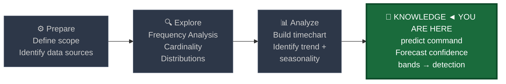
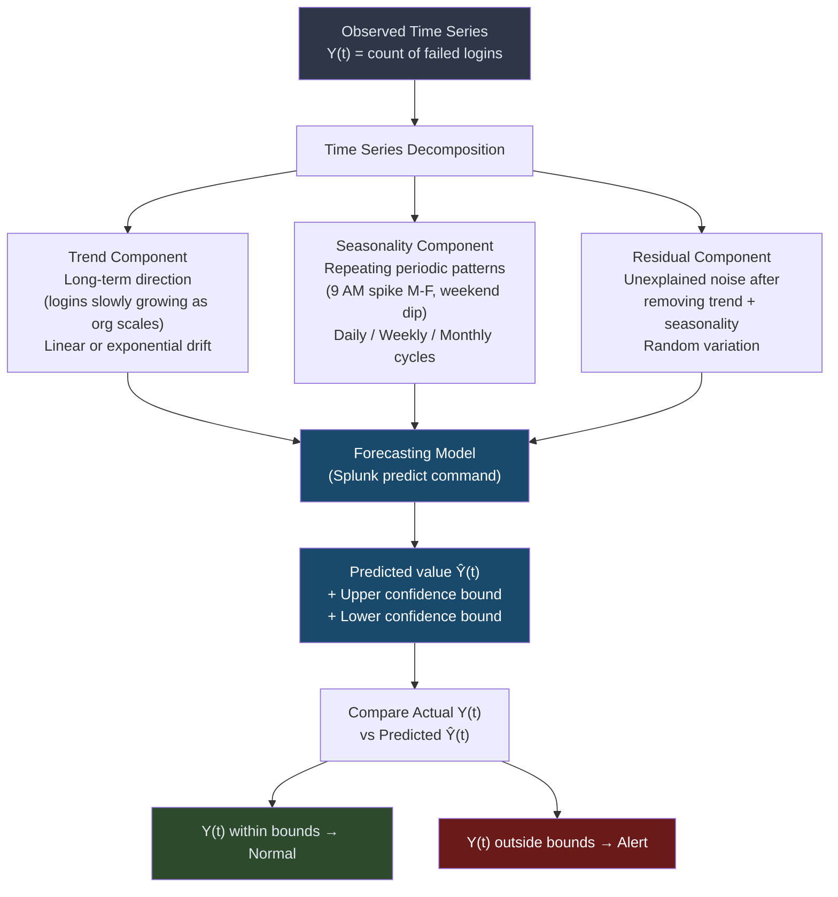
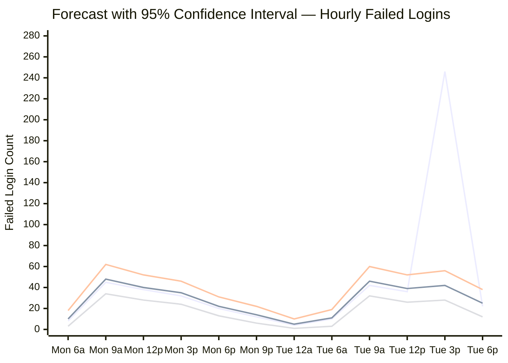
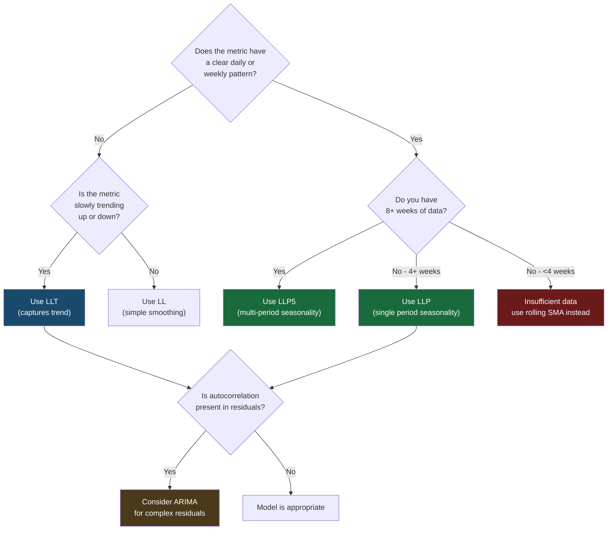
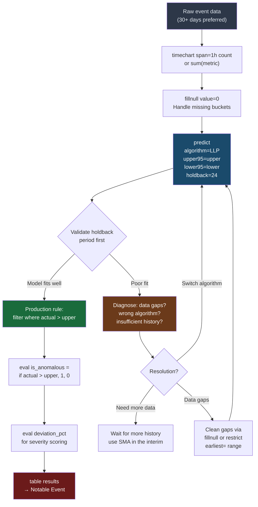
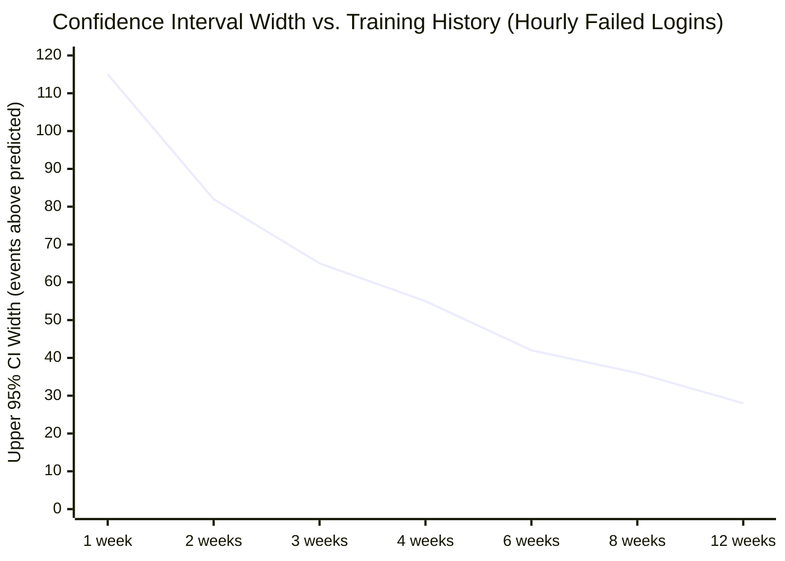

# Time-Series Forecasting with predict

← [Back to README](../README.md)

**Navigation:** [← 07 Rate of Change](./07_rate_of_change.md) | [09 Behavioral Profiling →](./09_behavioral_profiling.md)

---

## PEAK Phase: Knowledge (Derives from Analyze)

Time-series forecasting straddles the **Analyze** and **Knowledge** phases. You analyze historical patterns to build predictive models, then operationalize those models as detection rules — creating durable, seasonality-aware knowledge artifacts that continue working without manual recalibration.



---

## What Is Time-Series Forecasting?

Time-series forecasting uses **historical patterns to predict future expected values** along with a confidence interval that defines the range of "normal." An anomaly is any actual value that falls outside that predicted confidence envelope.

Unlike static thresholds (e.g., "alert if failed logins > 100") or even rolling averages, forecasting captures:

- **Trend:** Is the metric slowly growing over time? Forecasting accounts for this so a gradually growing volume does not endlessly trigger alerts.
- **Seasonality:** Are there repeating patterns — more logins at 9 AM, fewer on weekends, a monthly patch-Tuesday spike? Forecasting learns these patterns and adjusts expected values accordingly.
- **Residual:** After removing trend and seasonality, what noise remains? This is the component that an anomaly must overcome to trigger an alert.

> **The core security insight:** A static threshold of 100 failed logins will miss an attack at 9 AM Monday (when 80 is already normal) and false-positive on 9 AM Monday (where 95 is still normal but crosses the threshold). Forecasting adjusts the threshold in real time based on what the model predicts for that exact time slot.

---

## The Three Components of a Time Series



---

## Actual vs. Predicted — Confidence Band Visualization



> **Reading the chart:** The first line (actual values) spikes to 246 at Tue 12p. The second line (predicted) expected 39. The third line (upper 95% confidence) was 56. The actual value is 4× the upper bound — a clear anomaly. The fourth line is the lower 95% bound. On all other time buckets, actuals track within the confidence envelope.

---

## The Splunk `predict` Command

Splunk's `predict` command applies exponential smoothing and ARIMA models to a timechart output to generate predicted values and confidence bounds.

```
predict <field> [algorithm=<algo>] [upper<N>=<alias>] [lower<N>=<alias>]
        [holdback=<int>] [future_timespan=<int>] [correlate=<field>]
```

### Key Parameters

| Parameter | Description | Example |
|---|---|---|
| `<field>` | The numeric field to forecast (output of timechart) | `count`, `sum(bytes)` |
| `algorithm=` | Forecasting algorithm to use | `LLP`, `LLT`, `ARIMA` |
| `upper95=` | Field name for upper 95% confidence bound | `upper95=predicted_upper` |
| `lower95=` | Field name for lower 95% confidence bound | `lower95=predicted_lower` |
| `upper99=` | Field name for upper 99% confidence bound (stricter) | `upper99=strict_upper` |
| `holdback=N` | Reserve last N buckets from training, use for validation | `holdback=24` |
| `future_timespan=N` | Number of future buckets to predict beyond the data | `future_timespan=24` |
| `correlate=<field>` | A correlating variable to improve model fit | Rarely used in security |

### Algorithm Reference

| Algorithm | Full Name | When to Use | Seasonality | Trend | Min Data Needed |
|---|---|---|---|---|---|
| `LL` | Local Level | Stationary data, no trend or seasonality | No | No | 2 weeks |
| `LLP` | Local Level + Period | **Daily or weekly patterns — most common security use case** | Yes | No | 4 weeks |
| `LLP5` | Local Level + 5 Periods | Multiple overlapping periods (daily + weekly simultaneously) | Yes (multi) | No | 8 weeks |
| `LLT` | Local Level + Trend | Gradually growing/shrinking metrics (org growth) | No | Yes | 3 weeks |
| `ARIMA(p,d,q)` | AutoRegressive Integrated Moving Average | Complex patterns, correlated residuals | Optional | Optional | 3+ months |

**Choosing an algorithm:**



---

## Data Sources

| Source | Forecast Target | Suggested Span | Algorithm |
|---|---|---|---|
| **WinEvent 4625** | Failed login count per hour | `span=1h` | LLP (daily pattern) |
| **WinEvent 4624** | Successful login count per hour | `span=1h` | LLP |
| **Corelight conn** | Total bytes per hour | `span=1h` | LLP or LLT |
| **Sysmon EID 1** | Process spawn count per hour | `span=1h` | LLP |
| **Corelight dns** | DNS query count per hour | `span=1h` | LLP |
| **Corelight http** | HTTP request count per 15 min | `span=15m` | LLP |
| **WinEvent 4688** | Process creation count per hour | `span=1h` | LLP |

---

## Baseline SPL — Explore Phase

Before applying `predict`, visualize the time series to confirm the seasonal pattern and check for data gaps. A gap in history (e.g., a log source outage) can corrupt the model.

```spl
index=wineventlog EventCode=4625
    earliest=-30d latest=now
| timechart span=1h count AS failed_logins
| fillnull value=0 failed_logins
```

Inspect the resulting chart for:
1. **Clear daily cycles** (9 AM peak, overnight trough) → use LLP
2. **Weekend dips** → confirm your data covers at least 2 full weeks
3. **Data gaps** (zero counts for consecutive hours) → investigate log source health before forecasting
4. **Step changes** (sudden persistent level shift) → these indicate infrastructure changes; trim data to post-change period

---

## Detection SPL — Analyze and Knowledge Phase

### 1. Failed Login Forecast — WinEvent 4625

The most common forecasting detection. Flags when actual failed logins exceed the upper 95% confidence bound predicted from historical patterns.

```spl
index=wineventlog EventCode=4625
    earliest=-30d latest=now
| timechart span=1h count AS failed_logins
| fillnull value=0 failed_logins
| predict failed_logins
    algorithm=LLP
    upper95=predicted_upper
    lower95=predicted_lower
    holdback=24
| where isnotnull(predicted_upper)
| eval is_anomalous = if(failed_logins > predicted_upper, 1, 0)
| eval deviation_pct = round((failed_logins - 'prediction(failed_logins)') / 'prediction(failed_logins)' * 100, 1)
| where is_anomalous = 1
| table _time failed_logins 'prediction(failed_logins)' predicted_upper deviation_pct
| sort _time
```

**Using `holdback=24`:** This reserves the last 24 hours of data for validation — the model trains on days 1–29 and predicts for the held-back day 30. If actual values in the holdback period look reasonable, the model is well-fitted. Remove the `where is_anomalous=1` filter during validation to see all predicted vs. actual values.

---

### 2. Network Bytes Forecast — Corelight conn (Exfiltration Detection)

```spl
index=corelight sourcetype=corelight_conn
    earliest=-30d latest=now
| eval bytes_out = tonumber(orig_bytes)
| where isnotnull(bytes_out)
| bucket _time span=1h
| stats sum(bytes_out) AS total_bytes_out BY _time
| sort _time
| fillnull value=0 total_bytes_out
| predict total_bytes_out
    algorithm=LLP
    upper95=forecast_upper
    lower95=forecast_lower
| where isnotnull(forecast_upper)
| eval is_exfil_candidate = if(total_bytes_out > forecast_upper * 1.5, 1, 0)
| eval excess_bytes = max(total_bytes_out - forecast_upper, 0)
| where is_exfil_candidate = 1
| eval excess_gb = round(excess_bytes / 1073741824, 3)
| table _time total_bytes_out 'prediction(total_bytes_out)' forecast_upper excess_gb
| sort - excess_gb
```

> **The `* 1.5` multiplier:** Adding a buffer above the 95% upper bound reduces false positives from legitimate traffic bursts (e.g., large patch downloads). Start with 1.5× and tune down to 1.2× if you are missing real exfiltration events, or up to 2× if the rule is too noisy.

---

### 3. Process Spawn Forecast — Sysmon EID 1 (Malware Execution)

```spl
index=sysmon EventCode=1
    earliest=-30d latest=now
| bucket _time span=1h
| stats count AS process_count BY _time host
| sort host _time
| eventstats avg(process_count) AS overall_avg BY host
| where overall_avg > 1
| timechart span=1h sum(process_count) AS total_spawns
| fillnull value=0 total_spawns
| predict total_spawns
    algorithm=LLP
    upper95=spawn_upper
    lower95=spawn_lower
| where isnotnull(spawn_upper)
| eval is_suspicious = if(total_spawns > spawn_upper * 2, 1, 0)
| where is_suspicious = 1
| table _time total_spawns 'prediction(total_spawns)' spawn_upper
```

---

### 4. DNS Query Volume Forecast — Corelight dns (Burst / DGA Detection)

```spl
index=corelight sourcetype=corelight_dns
    earliest=-30d latest=now
| bucket _time span=1h
| stats count AS dns_queries
         dc(query) AS unique_domains
         dc(id.orig_h) AS unique_sources
    BY _time
| sort _time
| fillnull value=0 dns_queries
| predict dns_queries
    algorithm=LLP
    upper95=dns_upper
    lower95=dns_lower
| where isnotnull(dns_upper)
| eval is_burst = if(dns_queries > dns_upper, 1, 0)
| where is_burst = 1
| join _time [
    search index=corelight sourcetype=corelight_dns earliest=-30d latest=now
    | bucket _time span=1h
    | stats dc(query) AS unique_domains dc(id.orig_h) AS unique_sources BY _time
  ]
| eval burst_type = case(
    unique_domains > unique_sources * 50, "POSSIBLE_DGA",
    unique_sources < 3 AND dns_queries > dns_upper * 2, "SINGLE_HOST_BURST",
    true(), "GENERAL_DNS_BURST"
  )
| table _time dns_queries 'prediction(dns_queries)' dns_upper unique_domains unique_sources burst_type
| sort - dns_queries
```

---

## Complete Forecasting Pipeline



---

## Forecast Model Confidence Over Time

As more historical data accumulates, the confidence interval narrows and the model becomes more precise. This chart shows how the upper 95% confidence band tightens as history grows:



> **Reading the chart:** With only 1 week of history, the upper bound is 115 events above the predicted mean — so loose as to be nearly useless. At 4 weeks (the LLP minimum), the bound tightens to 55 events. At 12 weeks, it reaches 28 events — precise enough to catch meaningful anomalies.

---

## Visualization Recommendations

| Visualization | Splunk Chart Type | Use Case |
|---|---|---|
| Forecast overlay | Line chart: actual + predicted + upper + lower | Primary validation view — see model quality |
| Anomaly markers | `timechart` with `where is_anomalous=1` as bar overlay | Highlight exactly which buckets fired |
| Deviation heatmap | `chart deviation_pct BY date_hour date_wday` | Find which times have most anomalies (tuning aid) |
| Algorithm comparison | Side-by-side line charts for LL vs LLP vs LLT | Choose best algorithm for your data |
| Holdback validation | Full series with holdback period shaded | Validate model before production deployment |

**Recommended dashboard structure for forecast-based detection:**
1. Top panel: 7-day view of actual vs. predicted with confidence band (line chart)
2. Middle panel: anomaly events table with deviation percentage, sorted by deviation
3. Bottom-left: weekly false positive rate trend (anomalies that were investigated and closed as benign)
4. Bottom-right: model fit score tracked over time (use `eval fit_error = abs(actual - predicted) / predicted`)

---

## Limitations and Minimum Data Requirements

| Algorithm | Minimum History | Optimal History | Critical Limitation |
|---|---|---|---|
| `LL` | 1 week | 3+ weeks | Misses all seasonality — avoid for security |
| `LLP` | 2 weeks | 4–8 weeks | Struggles with multi-period patterns (daily + weekly) |
| `LLP5` | 6 weeks | 8–12 weeks | Slow to train; needs dense, consistent data |
| `LLT` | 3 weeks | 6+ weeks | Extrapolates trend indefinitely — can drift far |
| `ARIMA` | 3 months | 6+ months | Complex to tune; not well-documented in Splunk context |

**Additional limitations:**
- `predict` is **not real-time.** It runs over the full historical series each execution. For production detection, schedule the search to run every 15–60 minutes with a fixed `earliest=` window.
- **Step changes break models.** If your organization undergoes a major change (acquisition, new application deployment, log source addition), the historical data before the change will corrupt the model. Trim `earliest=` to exclude pre-change data.
- **Zero-inflation.** If many time buckets have zero counts (e.g., a log source that only generates events during business hours), `fillnull value=0` helps but LLP may still produce poor confidence intervals. Consider using `where count > 0` before predicting and treating zero buckets separately.

---

## Tuning Notes

### Reducing False Positives

1. **Widen the confidence bound:** Use `upper99=` instead of `upper95=` if the 95% bound triggers too frequently. 99% reduces FPs by approximately 60% at the cost of missing more subtle anomalies.
2. **Add a buffer multiplier:** `where actual > upper95 * 1.2` adds a 20% buffer above the statistical bound.
3. **Minimum absolute threshold:** `where actual > upper95 AND actual > 50` prevents alerting on statistically unusual but operationally insignificant counts (e.g., 3 events when 1 was predicted).
4. **Holdback validation cadence:** Re-validate the model monthly. If the holdback error is increasing, expand your training window or switch algorithms.

### Improving Sensitivity

1. **Use `upper90=`** instead of `upper95=` to catch more deviations (more FPs, more TPs).
2. **Segment by entity:** Instead of global `timechart`, forecast per-host or per-user to catch anomalies that are diluted at the aggregate level.
3. **Layer with other signals:** Forecasting alone may miss low-volume targeted attacks. Combine with Z-score, IQR, or rate-of-change detections for defense-in-depth.

---

## Related Detection Use Cases

- [Credential Attacks](../03_detection_use_cases/03_credential_attacks.md) — LLP forecasting on failed login volume is a tier-1 detection for brute force and password spray
- [Data Exfiltration](../03_detection_use_cases/02_data_exfiltration.md) — Network bytes forecasting catches exfiltration that blends with normal traffic patterns

---

**Navigation:** [← 07 Rate of Change](./07_rate_of_change.md) | [09 Behavioral Profiling →](./09_behavioral_profiling.md)

← [Back to README](../README.md)
