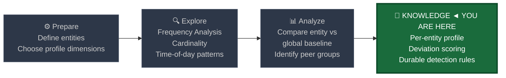
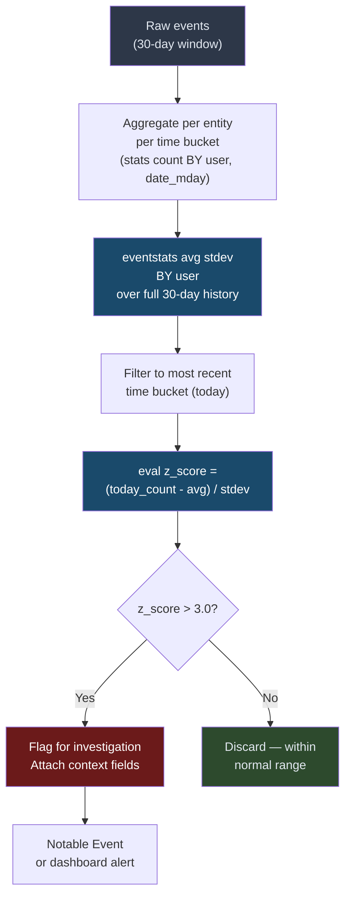
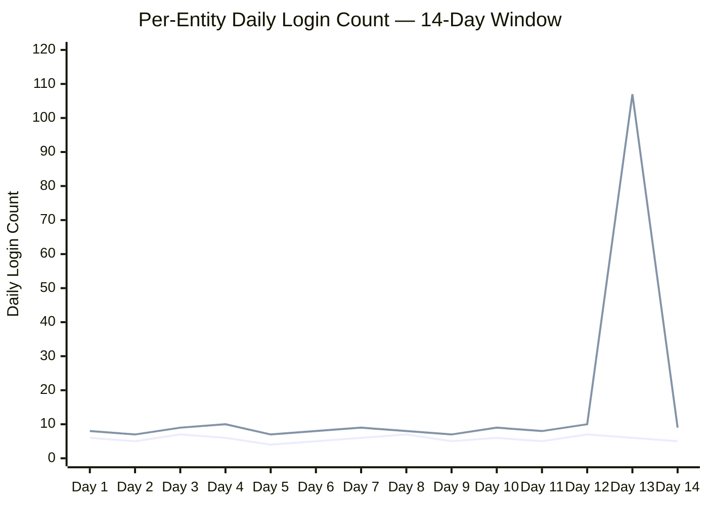

# Behavioral Profiling

← [Back to README](../README.md)

**Navigation:** [← 08 Time-Series Forecasting](./08_timeseries_forecasting.md) | [10 Anomaly Detection →](./10_anomaly_detection.md)

---

## PEAK Phase: Knowledge

Behavioral profiling sits firmly in the **Knowledge** phase. You are not merely measuring a global average — you are constructing a persistent, per-entity model of what "normal" looks like for each individual user, host, or service account, then using that model as a detection surface going forward.



---

## What Is Behavioral Profiling?

Behavioral profiling builds a **per-entity baseline** — a statistical fingerprint of how a specific user, host, or service account behaves — and scores each incoming event against that entity's own history rather than against a global average.

The key distinction from simple threshold detection is the frame of reference:

| Detection Approach | Frame of Reference | Example Threshold |
|---|---|---|
| **Static threshold** | Global absolute limit | Alert if any user logs in more than 100 times in 24 hours |
| **Global statistical baseline** | Population average and spread | Alert if login count > population mean + 3 stdev |
| **Per-entity behavioral profile** | Entity's own historical pattern | Alert if this specific user's login count > their own 30-day avg + 3 stdev |

### Why Per-Entity Matters: A Concrete Example

Consider Windows logon events (EID 4624) for two accounts:

- **svc_backup** (backup service account): logs in 50 times per day, every day, at 02:00 from the backup server. This is entirely normal — it is its job.
- **jsmith** (help desk technician): logs in 4–6 times per day from a single workstation during business hours.

A global threshold of "alert if > 30 logins per day" would fire on `svc_backup` constantly (false positive) and completely miss a situation where `jsmith` suddenly logs in 48 times in a day (false negative).

A per-entity profile handles both correctly: `svc_backup`'s baseline is ~50 logins/day so 50 is noise. `jsmith`'s baseline is ~5 logins/day so 48 is a 9.6× deviation — immediately suspicious.

---

## Three Profile Dimensions

Effective behavioral profiles measure at least three dimensions per entity:

| Dimension | Description | What Deviation Signals |
|---|---|---|
| **Frequency** | How often the entity performs an action per unit time (hourly, daily) | Sudden burst of activity; suppressed activity after credential compromise |
| **Time-of-day** | Which hours the entity is normally active | Off-hours activity; actions at 03:00 for a 9-to-5 employee |
| **Volume** | How much data, how many distinct targets, how many processes | Large file access spike; contacting many new hosts; process explosion |

Each dimension produces a score. Combined, they give a composite risk signal — covered in detail in [10 Anomaly Detection](./10_anomaly_detection.md).

---

## Key Splunk Commands for Profiling

### `eventstats` — Per-Entity Aggregates Without Collapsing

`eventstats` computes aggregate statistics grouped by a field and **adds the result back to every matching event** without collapsing the search results. This is essential for profiling: you preserve the individual event rows while attaching the entity's statistical baseline to each row for comparison.

```
eventstats avg(count) AS avg_count stdev(count) AS stdev_count BY user
```

Every row for user `jsmith` gets columns `avg_count=5.2` and `stdev_count=1.3` appended — the profile — while every row for `svc_backup` gets its own separate values. This one command replaces what would otherwise require a join across two sub-searches.

### `streamstats` — Running Window Per Entity

`streamstats` computes rolling statistics as Splunk processes events in time order, maintaining a sliding window per entity. Use it when you want the profile to update as events accumulate within the search rather than using a pre-computed historical baseline.

```
streamstats time_window=7d avg(count) AS rolling_avg stdev(count) AS rolling_stdev BY user
```

`streamstats` is better than `eventstats` for detecting intra-session changes — for example, an account's login count accelerating over the course of a single day.

---

## Profile Building Pattern

The general pattern for per-entity profiling is:

1. **Historical window query:** Aggregate the metric by entity over a long lookback (14–30 days), computing mean and standard deviation per entity.
2. **Current window query:** Aggregate the same metric for the most recent period (last 24 hours or last hour).
3. **Score each entity:** Compare current value against its own historical mean and standard deviation using a z-score formula.
4. **Filter on threshold:** Surface entities where the z-score exceeds a configured threshold (typically 3.0).



---

## Data Sources

| Source | Event / Stream | Profile Dimension | Entity Field |
|---|---|---|---|
| **WinEvent 4624** | Successful logon | Frequency, time-of-day | `TargetUserName` |
| **WinEvent 4625** | Failed logon | Frequency | `TargetUserName`, `IpAddress` |
| **Sysmon EID 1** | Process creation | Process diversity, frequency | `Computer`, `User` |
| **Sysmon EID 3** | Network connection | Destination cardinality, volume | `Computer`, `User` |
| **Corelight conn** | Network connection | Bytes out, destination cardinality | `id.orig_h` |
| **Corelight dns** | DNS query | Unique domain cardinality | `id.orig_h` |

---

## Baseline SPL — User Login Frequency Profile

This query builds a per-user login frequency profile over a 30-day window, then flags users whose most recent day's activity deviates more than 3 standard deviations from their own mean.

```spl
/* Step 1: Build per-user daily login counts over 30 days */
index=wineventlog EventCode=4624 earliest=-30d latest=now
| where NOT match(TargetUserName, "(?i)(ANONYMOUS|system|\$$|DWM-|UMFD-)")
| bucket _time span=1d
| stats count AS daily_logins BY TargetUserName, _time

/* Step 2: Compute per-user mean and stdev across all days */
| eventstats avg(daily_logins) AS user_avg_logins
             stdev(daily_logins) AS user_stdev_logins
    BY TargetUserName

/* Step 3: Retain only the most recent day for scoring */
| eval day_age = (now() - _time) / 86400
| where day_age < 1

/* Step 4: Z-score each user's latest day against their own baseline */
| eval z_score = if(user_stdev_logins > 0,
    round((daily_logins - user_avg_logins) / user_stdev_logins, 2),
    0)
| where z_score > 3 AND daily_logins > 10

/* Step 5: Surface findings with context */
| eval deviation_x = round(daily_logins / max(user_avg_logins, 1), 1)
| table TargetUserName, daily_logins, user_avg_logins, user_stdev_logins, z_score, deviation_x
| sort - z_score
```

> **Minimum event count guard:** The `AND daily_logins > 10` filter prevents false positives from accounts with extremely low baselines (e.g., an account that normally logs in 0.1 times per day deviating to 1 login produces a high z-score but is operationally meaningless).

---

## Profile Deviation Scoring — Z-Score Per User

The z-score formula standardises deviations across users with very different activity volumes. A user who normally logs in 200 times per day and reaches 260 (z=3) is as anomalous as a user who normally logs in 5 times per day and reaches 8 (z=3) — the formula equalises them.

```spl
/* Z-score deviation scoring — production detection rule (24-hour window) */
index=wineventlog EventCode=4624 earliest=-31d latest=now
| where NOT match(TargetUserName, "(?i)(ANONYMOUS|system|\$$)")
| bucket _time span=1d
| stats count AS daily_count BY TargetUserName, _time
| eventstats avg(daily_count) AS baseline_avg
             stdev(daily_count) AS baseline_stdev
             count AS observation_days
    BY TargetUserName

/* Only score entities with sufficient history (14+ observation days) */
| where observation_days >= 14

/* Focus on most recent day */
| eval days_ago = round((now() - _time) / 86400, 0)
| where days_ago = 0

| eval z_score = round((daily_count - baseline_avg) / max(baseline_stdev, 0.01), 2)
| eval risk_tier = case(
    z_score >= 5, "CRITICAL",
    z_score >= 4, "HIGH",
    z_score >= 3, "MEDIUM",
    true(), "LOW")
| where z_score >= 3
| table TargetUserName, daily_count, baseline_avg, baseline_stdev, z_score, risk_tier, observation_days
| sort - z_score
```

---

## Time-of-Day Profiling

Login frequency is only one dimension. **When** an entity acts is often more discriminating than how much. A domain admin logging in at 03:47 is suspicious even if the total count is low. Off-hours activity is a consistent indicator in insider threat and compromised credential scenarios.

```spl
/* Build time-of-day profile per user — identify typical login hours */
index=wineventlog EventCode=4624 earliest=-30d latest=now
| where NOT match(TargetUserName, "(?i)(ANONYMOUS|system|\$$|svc_|_svc)")
| eval login_hour = tonumber(strftime(_time, "%H"))
| stats count AS hour_count BY TargetUserName, login_hour

/* Find the modal (most common) login hour per user */
| eventstats max(hour_count) AS max_hour_count BY TargetUserName
| where hour_count = max_hour_count
| rename login_hour AS typical_peak_hour

/* Now detect logins outside 08:00-20:00 window for this user */
| join TargetUserName [
    search index=wineventlog EventCode=4624 earliest=-1h latest=now
    | eval login_hour = tonumber(strftime(_time, "%H"))
    | where login_hour < 6 OR login_hour > 22
    | stats count AS offhours_count, values(IpAddress) AS src_ips,
              values(ComputerName) AS dest_hosts
        BY TargetUserName
  ]
| where offhours_count > 0
| table TargetUserName, typical_peak_hour, offhours_count, src_ips, dest_hosts
| sort - offhours_count
```

> **Tuning note:** The off-hours window (before 06:00 or after 22:00) suits most enterprise environments. For organisations with genuine 24/7 shift workers, narrow the window to the quietest hours for your specific environment or profile by user department.

---

## Host Communication Profile

A workstation that normally communicates with 5 internal servers should not suddenly contact 80 distinct destinations. This pattern appears in lateral movement (rapid scanning), beaconing (new C2 contact), and data staging (contact with cloud exfil services).

```spl
/* Build per-host destination cardinality baseline over 30 days */
index=corelight sourcetype=corelight_conn earliest=-30d latest=now
| where isnotnull(id.orig_h) AND isnotnull(id.resp_h)
| bucket _time span=1d
| stats dc(id.resp_h) AS daily_unique_dests BY "id.orig_h", _time

/* Per-host mean and stdev */
| eventstats avg(daily_unique_dests) AS host_avg_dests
             stdev(daily_unique_dests) AS host_stdev_dests
             count AS observation_days
    BY "id.orig_h"
| where observation_days >= 14

/* Score today */
| eval days_ago = round((now() - _time) / 86400, 0)
| where days_ago = 0
| eval z_score = round((daily_unique_dests - host_avg_dests) / max(host_stdev_dests, 0.01), 2)
| where z_score > 3
| rename "id.orig_h" AS src_host
| table src_host, daily_unique_dests, host_avg_dests, host_stdev_dests, z_score
| sort - z_score
```

---

## Process Execution Profile Per Host

Sysmon EID 1 records every process creation. A host that normally runs 20 distinct process names per day should not suddenly run 200. This pattern detects malware dropping tools, lateral movement implants executing, or attackers running discovery commands.

```spl
/* Per-host process diversity baseline — Sysmon EID 1 */
index=sysmon EventCode=1 earliest=-30d latest=now
| eval proc_name = lower(replace(Image, ".*\\\\", ""))
| bucket _time span=1d
| stats dc(proc_name) AS daily_unique_procs
         count AS daily_proc_count
    BY Computer, _time

/* Compute per-host baseline */
| eventstats avg(daily_unique_procs) AS host_avg_procs
             stdev(daily_unique_procs) AS host_stdev_procs
    BY Computer

/* Score today's process diversity */
| eval days_ago = round((now() - _time) / 86400, 0)
| where days_ago = 0
| eval proc_z = round((daily_unique_procs - host_avg_procs) / max(host_stdev_procs, 0.01), 2)
| where proc_z > 3 AND daily_unique_procs > 10

/* Surface rarely-seen processes on this host for context */
| join Computer [
    search index=sysmon EventCode=1 earliest=-1d latest=now
    | eval proc_name = lower(replace(Image, ".*\\\\", ""))
    | stats count BY Computer, proc_name
    | where count < 3
    | stats values(proc_name) AS rare_procs BY Computer
  ]
| table Computer, daily_unique_procs, host_avg_procs, proc_z, rare_procs
| sort - proc_z
```

---

## Baseline vs Anomaly — Entity Behaviour Chart

The chart below illustrates the core concept: Entity A maintains a stable, predictable daily login count while Entity B shows a sudden spike that far exceeds its own historical range.



> **Reading the chart:** Line 1 is Entity A — a stable baseline averaging 6 logins per day with low variance. Line 2 is Entity B — similarly stable at ~8 logins per day until Day 13 where it spikes to 107. The spike is invisible against a global threshold set for high-volume accounts but is immediately visible against Entity B's own profile (z-score ≈ 12.4).

---

## Limitations

| Limitation | Description | Mitigation |
|---|---|---|
| **Cold start** | New entities have no historical data; any activity looks anomalous | Require minimum 14 days of observation before scoring; use peer group baseline for new entities in the interim |
| **Profile drift** | Legitimate behaviour changes (new role, new project) look anomalous until the profile updates | Periodically refresh baselines; implement a "profile update" process for known role changes |
| **Seasonal blind spots** | A quarterly finance process may look anomalous because it falls outside the 30-day window | Extend lookback for known seasonal entities; maintain a calendar of expected periodic activities |
| **Computational cost** | Per-entity aggregation over 30 days across all users is expensive | Schedule as a saved search on a summary index; do not run real-time |
| **Shared accounts** | Profiles for shared service accounts blend multiple users' behaviour, masking individual deviations | Enforce individual account usage; flag shared credential usage separately |
| **Sparse entities** | Entities with very few events (< 5 per day on average) produce unreliable z-scores | Set minimum event count threshold before activating per-entity scoring |

---

## Tuning Notes

1. **Minimum observation window:** 14 days absolute minimum; 30 days preferred. Less than 14 days produces high variance in the baseline, leading to frequent false positives.
2. **Minimum event count per entity:** Require at least 10 events in the current period before computing a z-score. Entities with 1 or 2 baseline events and a z-score of 5 are not meaningful.
3. **Z-score threshold:** Start at 3.0 (99.7% of normal activity falls below this). Tune up to 4.0 if your environment generates too many alerts during the burn-in period. Do not use thresholds below 2.5 — the false positive rate becomes unmanageable.
4. **Baseline refresh cadence:** Refresh baselines weekly or biweekly. Use a rolling window approach rather than a fixed historical window to avoid stale profiles.
5. **Peer group seeding:** For new entities, use the average of their peer group (e.g., other users in the same department or hosts with the same AD OU) as a temporary proxy baseline until 14 days of individual history accumulate.

---

## Related Detection Use Cases

Behavioral profiling is an enabling technique that feeds directly into targeted detection use cases:

- **Insider Threat:** Per-user file access volume profiling is the primary detection signal for data staging by departing employees.
- **Lateral Movement:** Per-host network connection cardinality profiling detects SMB scanning and credential reuse across hosts — see [Lateral Movement](../03_detection_use_cases/05_lateral_movement.md).
- **Privilege Escalation:** Profiling privileged account logon frequency and time-of-day catches misuse of elevated credentials — see [Privilege Escalation](../03_detection_use_cases/06_privilege_escalation.md).
- **Credential Attacks:** Baseline deviation on login failure rates per user surfaces account stuffing and spray — see [Credential Attacks](../03_detection_use_cases/03_credential_attacks.md).

---

**Navigation:** [← 08 Time-Series Forecasting](./08_timeseries_forecasting.md) | [10 Anomaly Detection →](./10_anomaly_detection.md)

← [Back to README](../README.md)
