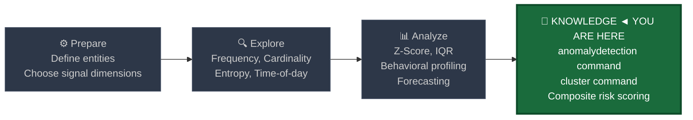
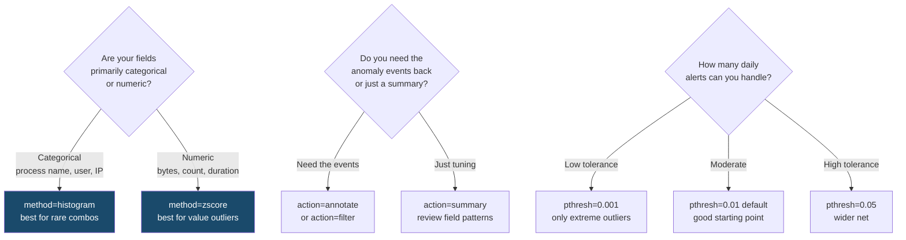
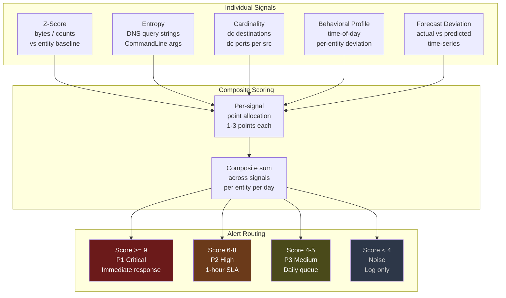
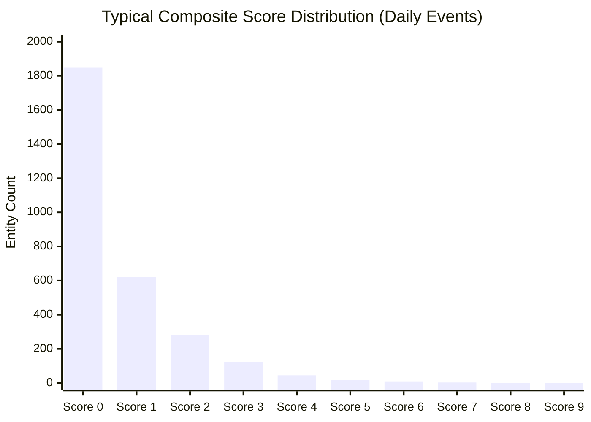

# Anomaly Detection

← [Back to README](../README.md)

**Navigation:** [← 09 Behavioral Profiling](./09_behavioral_profiling.md)

---

## PEAK Phase: Knowledge

Anomaly detection is the **aggregation layer** — the final stage where individual statistical signals from every prior technique are combined into a composite score. Rather than relying on a single signal (z-score alone, or entropy alone), composite anomaly detection reduces false positives by requiring multiple independent signals to align before triggering.



---

## What Is Automated Anomaly Detection?

Automated anomaly detection combines multiple statistical signals into a single composite risk score. Instead of asking "is this z-score > 3?" it asks "how many independent anomaly signals are firing simultaneously for this entity?"

The power of multi-signal detection lies in its **specificity**. In any large environment, individual signals fire constantly — a z-score threshold alone produces hundreds of daily alerts. But an entity that simultaneously triggers a z-score anomaly AND an entropy anomaly AND a cardinality anomaly is genuinely rare and warrants investigation.

### Single-Signal vs Multi-Signal Detection

| Approach | False Positive Rate | Coverage | Tuning Effort |
|---|---|---|---|
| Single static threshold | Very high | Narrow | Low |
| Single z-score threshold | High | Moderate | Medium |
| Single behavioral profile | Medium | Moderate | High |
| **Composite multi-signal score** | **Low** | **Broad** | **Medium** |

### The Three Splunk Commands for Anomaly Detection

| Command | Type | Use Case |
|---|---|---|
| `anomalydetection` | Streaming | Flag events that are unusual across multiple field combinations |
| `cluster` | Distributing | Group similar events; identify outlier clusters |
| `eventstats` + `eval` | Distributing | Build composite z-score across multiple dimensions (manual) |

---

## The `anomalydetection` Command

Splunk's built-in `anomalydetection` command identifies events that are statistically unusual compared to the rest of the result set. It evaluates each event across all specified fields and flags those that deviate from expected patterns.

```
anomalydetection [action=<annotate|filter|summary>]
                 [method=<histogram|zscore>]
                 [pthresh=<float>]
                 [maxvalues=<int>]
                 [<field-list>]
```

### Key Parameters

| Parameter | Values | Description |
|---|---|---|
| `action=annotate` | default | Adds a `probable_cause` field to flagged events |
| `action=filter` | — | Returns only the anomalous events |
| `action=summary` | — | Returns a summary of anomalous field-value pairs |
| `method=histogram` | default | Uses frequency distribution (good for categorical fields) |
| `method=zscore` | — | Uses z-score deviation (good for numeric fields) |
| `pthresh=` | 0.0–1.0, default 0.01 | Probability threshold below which an event is anomalous |
| `maxvalues=` | integer, default 1000 | Maximum distinct values per field to analyse |

### Parameter Selection Guide



---

## The `cluster` Command

The `cluster` command groups events into clusters based on field similarity, then identifies events that are members of very small clusters — the outliers that do not fit any established pattern.

```
cluster [field=<string>] [labelonly=<bool>] [showcount=<bool>]
        [t=<float>] [delims=<string>]
```

Security use case: cluster process names by their `CommandLine` field. The result groups common execution patterns together. Commands that fall into a cluster of size 1 or 2 are anomalies — either new attack tools or one-time admin actions worth reviewing.

---

## Data Sources

| Source | Anomaly Target | Useful Fields |
|---|---|---|
| **Sysmon EID 1** | Rare process executions | `Image`, `CommandLine`, `ParentImage`, `User`, `host` |
| **WinEvent 4624/4625** | Authentication anomalies | `TargetUserName`, `LogonType`, `IpAddress`, `WorkstationName` |
| **Corelight conn.log** | Network volume outliers | `id.orig_h`, `id.resp_h`, `id.resp_p`, `orig_bytes` |
| **Corelight dns.log** | DNS query anomalies | `query`, `qtype_name`, `id.orig_h`, `rcode_name` |
| **WinEvent 7045** | Rare service installations | `ServiceName`, `ServiceFileName`, `AccountName` |

---

## Baseline SPL — Using `anomalydetection` on Process Events

Before using `anomalydetection` in production, run it in `action=summary` mode to understand which field-value combinations it considers anomalous. This helps you tune `pthresh` and `maxvalues`.

```spl
/* Baseline: anomalydetection summary on Sysmon EID 1 — what does it consider rare? */
index=sysmon EventCode=1 earliest=-7d
| stats count BY Image, ParentImage, User, host
| anomalydetection action=summary method=histogram pthresh=0.01
    Image ParentImage User
```

Run this and review the `probable_cause` field. It will tell you which field-value pairs are driving anomaly flags. Use this to build your exclusion list before enabling `action=filter`.

---

## Detection SPL 1 — `anomalydetection` on Process Creation

```spl
/* ANOMALY DETECTION: rare process-parent-user combinations — Sysmon EID 1 */
index=sysmon EventCode=1 earliest=-24h
| eval image_short = replace(Image, ".*\\\\", "")
| eval parent_short = replace(ParentImage, ".*\\\\", "")
| anomalydetection action=annotate method=histogram pthresh=0.005
    image_short parent_short User host
| where isnotnull(probable_cause)
| eval risk_fields = probable_cause
| table _time, host, User, image_short, parent_short, CommandLine, risk_fields
| sort - _time
```

**Reading the results:**
- `probable_cause` lists the specific field-value pairs that are anomalous (e.g., `image_short=mshta.exe User=jsmith`)
- `pthresh=0.005` means the field combination appears in less than 0.5% of all events — very rare
- Start with `pthresh=0.01` and tighten if too noisy; loosen to `0.05` if missing detections

---

## Detection SPL 2 — Multi-Signal Composite Scoring

This approach manually combines four independent signals into a composite risk score. An entity must accumulate points across multiple dimensions to trigger an alert.

```spl
/* COMPOSITE ANOMALY SCORE: combine z-score + cardinality + entropy + time-of-day signals */
index=corelight sourcetype=corelight_conn earliest=-30d
| where NOT cidrmatch("10.0.0.0/8", id.resp_h)
| where NOT cidrmatch("172.16.0.0/12", id.resp_h)
| where NOT cidrmatch("192.168.0.0/16", id.resp_h)
/* Signal 1: daily bytes z-score */
| bin _time span=1d AS day
| stats sum(orig_bytes) AS daily_bytes,
        dc(id.resp_h) AS unique_dests,
        dc(id.resp_p) AS unique_ports
    BY id.orig_h, day
| eventstats avg(daily_bytes) AS avg_bytes,
             stdev(daily_bytes) AS stdev_bytes,
             avg(unique_dests) AS avg_dests,
             stdev(unique_dests) AS stdev_dests
    BY id.orig_h
| eval zscore_bytes = round((daily_bytes - avg_bytes) / (stdev_bytes + 1), 2)
| eval zscore_dests = round((unique_dests - avg_dests) / (stdev_dests + 1), 2)
/* Signal scoring */
| eval score_bytes = case(zscore_bytes > 5, 3, zscore_bytes > 3, 2, zscore_bytes > 2, 1, true(), 0)
| eval score_dests = case(zscore_dests > 5, 3, zscore_dests > 3, 2, zscore_dests > 2, 1, true(), 0)
| eval score_ports = case(unique_ports > 50, 3, unique_ports > 20, 2, unique_ports > 10, 1, true(), 0)
| eval composite_score = score_bytes + score_dests + score_ports
| where composite_score >= 4
| where day >= relative_time(now(), "-1d@d")
| sort - composite_score
| table id.orig_h, day, daily_bytes, unique_dests, unique_ports,
        zscore_bytes, zscore_dests, composite_score,
        score_bytes, score_dests, score_ports
```

**Alert routing by composite score:**

| Score | Tier | Action |
|---|---|---|
| 9 | P1 — Critical | Immediate analyst assignment |
| 6–8 | P2 — High | Alert within 1 hour |
| 4–5 | P3 — Medium | Daily review queue |
| < 4 | Noise | Log only |

---

## Detection SPL 3 — `cluster` for DNS Outliers

```spl
/* CLUSTER-BASED OUTLIER: DNS queries — find unique/rare query patterns */
index=corelight sourcetype=corelight_dns earliest=-24h
| where NOT match(id.orig_h, "^10\.10\.1\.(1[0-9]|20)$")
| eval query_root = replace(query, "^[^.]+\.", "")
| stats count AS query_count,
        dc(id.orig_h) AS unique_requesters,
        values(id.orig_h) AS requesters
    BY query_root, qtype_name
| cluster field=query_root t=0.3 showcount=true labelonly=false
| eval cluster_size = cluster_count
| where cluster_size <= 2
| where query_count >= 5
| sort - query_count
| table query_root, qtype_name, query_count, unique_requesters, cluster_size, requesters
```

**Why `cluster_size <= 2` matters:** DNS domains that are isolated from all established clusters (cluster of size 1 or 2) represent either brand-new infrastructure or attacker-controlled domains. Legitimate domains cluster naturally with other domains from the same registrar/infrastructure.

---

## Detection SPL 4 — `anomalydetection` on Auth Events

```spl
/* ANOMALY DETECTION: rare authentication combinations — WinEvent 4624 */
index=wineventlog EventCode=4624 earliest=-24h
| eval logon_pair = SubjectUserName + "→" + WorkstationName + ":" + LogonType
| anomalydetection action=filter method=histogram pthresh=0.01
    SubjectUserName WorkstationName LogonType AuthenticationPackageName
| table _time, SubjectUserName, WorkstationName, LogonType,
        AuthenticationPackageName, IpAddress, probable_cause
| sort - _time
```

---

## Multi-Signal Pipeline: Architecture



---

## Composite Score Distribution



> **Reading the chart:** In a typical 1,000-host environment, roughly 2,000 entity-days score 0 (clean). Only 1–3 entities per day score 8–9 (P1/P2). This is the expected distribution when composite scoring is tuned correctly. If more than 20 entities per day score 6+, your individual thresholds are too loose.

---

## How This Technique Ties the Repository Together

`anomalydetection` and composite scoring are the **operationalization layer** that sits on top of all nine prior techniques:

| Technique | Signal Contributed to Composite Score |
|---|---|
| [Frequency Analysis](./01_frequency_analysis.md) | Rare event types / processes |
| [Cardinality Analysis](./02_cardinality_analysis.md) | `dc(dest)` and `dc(port)` outlier points |
| [Z-Score / Stdev](./03_zscore_stdev.md) | Byte/count deviation points |
| [Percentile / IQR](./04_percentile_iqr.md) | Outlier transfer sizes |
| [Entropy Analysis](./05_entropy_analysis.md) | High-entropy DNS/CommandLine points |
| [Moving Averages](./06_moving_averages.md) | SMA deviation from trend |
| [Rate of Change](./07_rate_of_change.md) | Velocity spike points |
| [Time-Series Forecast](./08_timeseries_forecasting.md) | Forecast bound exceedance |
| [Behavioral Profiling](./09_behavioral_profiling.md) | Per-entity deviation points |

No single technique in this list is sufficient on its own. An adversary who is careful about volume will evade z-score. An adversary who randomises timing will evade rate-of-change. But an adversary who simultaneously evades **all nine** is practically impossible — composite scoring exploits this constraint.

---

## Limitations

| Limitation | Detail |
|---|---|
| **`anomalydetection` is streaming** | Runs over the full result set each execution. On large data sets (100k+ events), it can be slow. Pre-aggregate with `stats` before passing to `anomalydetection`. |
| **`cluster` performance** | Computationally expensive on high-cardinality string fields. Limit the data with `earliest=` and pre-filter before clustering. |
| **Cold start** | Composite scoring requires at least 14–30 days of history per entity before baselines stabilise. New hosts and accounts will score high initially (false positives). |
| **Score calibration** | The per-signal point values (1/2/3) are environment-specific. Tune them over 2–4 weeks of operation, tracking false positive rates per tier. |
| **Coverage gaps** | Composite scoring only catches what the individual signals measure. Novel attack techniques that do not deviate on any measured dimension will not score. Review your signal coverage regularly. |

---

## Tuning Notes

### Reducing False Positives

1. **Raise `pthresh` floor:** Start at `pthresh=0.001` to catch only the most extreme outliers; relax to `0.01` if detection rate is too low.
2. **Minimum composite score threshold:** Start alerting at score 5 rather than 4; adjust down to 4 after two weeks of tuning.
3. **Suppress known-noisy entities:** Build a lookup of entities with chronic high scores that have been investigated and confirmed benign. Subtract 2 from their composite score.
4. **Require signal diversity:** Do not alert if all composite score points come from a single dimension (e.g., three points all from z-score alone). Require at least two different signal types.

### Improving Sensitivity

1. **Add more signals:** Include time-of-day deviation (from Behavioral Profiling) as a fourth signal type.
2. **Lower minimum event count:** The default `maxvalues=1000` may skip rare field combinations. Reduce to `maxvalues=500` to catch lower-volume anomalies.
3. **Segment by entity class:** Run separate composite scores for workstations vs servers vs service accounts — each class has different normal baselines.

---

## Related Detection Use Cases

Since this technique is the aggregation layer, it feeds into every detection use case in the repository:

- [Beaconing](../03_detection_use_cases/01_beaconing.md) — interval regularity + bytes consistency composite
- [Data Exfiltration](../03_detection_use_cases/02_data_exfiltration.md) — bytes z-score + destination cardinality + file type signals
- [Credential Attacks](../03_detection_use_cases/03_credential_attacks.md) — failure count z-score + target cardinality + time deviation
- [DNS Tunneling / DGA](../03_detection_use_cases/04_dns_tunneling_dga.md) — entropy + NXDOMAIN rate + query volume
- [Lateral Movement](../03_detection_use_cases/05_lateral_movement.md) — destination cardinality + behavioral profile deviation
- [Privilege Escalation](../03_detection_use_cases/06_privilege_escalation.md) — rare group change + privileged process frequency
- [Insider Threat](../03_detection_use_cases/07_insider_threat.md) — multi-dimensional behavioral scoring
- [Port Scanning](../03_detection_use_cases/08_port_scanning.md) — destination port cardinality + connection state ratio
- [Rogue Services](../03_detection_use_cases/09_rogue_services_processes.md) — rare process + unusual path + CommandLine entropy

---

**Navigation:** [← 09 Behavioral Profiling](./09_behavioral_profiling.md)

← [Back to README](../README.md)
