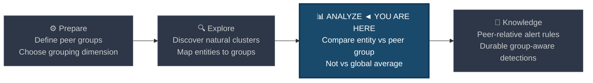
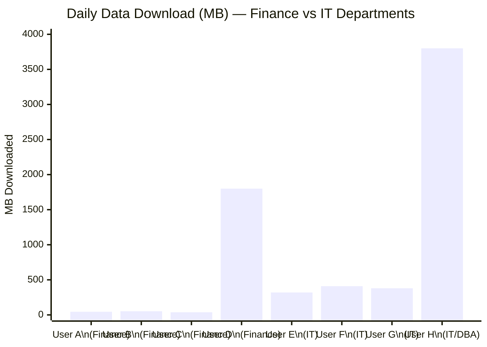
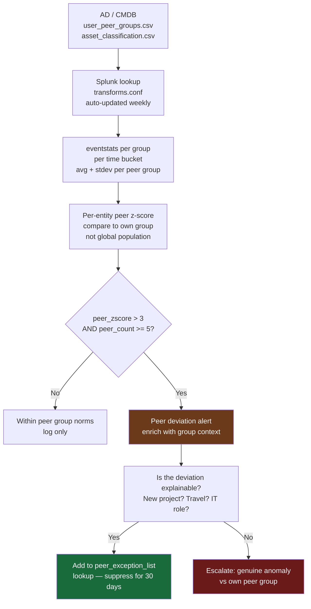
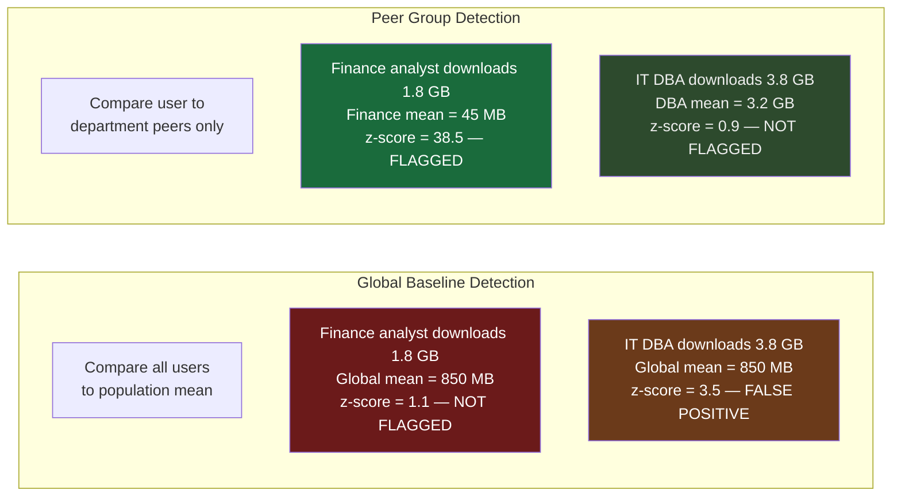

# Peer Group Analysis

← [Back to README](../README.md)

**Navigation:** [← 10 Anomaly Detection](./10_anomaly_detection.md) | [12 Cohort Baselining →](./12_cohort_baselining.md)

---

## PEAK Phase: Analyze → Knowledge

Peer group analysis sits at the boundary of **Analyze** and **Knowledge**. You analyse an entity not against a global population but against the specific subset of entities that share its role, department, or behaviour pattern — then operationalise that comparison as a detection rule.



---

## What Is Peer Group Analysis?

Peer group analysis measures an entity's behaviour relative to **others who should behave similarly** — not relative to the entire population.

The fundamental insight: a finance analyst downloading 2 GB of data is anomalous compared to other finance analysts. That same 2 GB is unremarkable compared to a database administrator. A global threshold catches neither correctly. A peer-relative comparison catches both.

### Why Global Baselines Fail



> User D (Finance, 1800 MB) and User H (IT/DBA, 3800 MB) both look fine against a global average of ~850 MB. But User D is **35× higher** than their finance peer group average of ~45 MB — a strong exfiltration signal. User H is normal for a DBA. Without peer groups, you either miss User D or drown in false positives from IT staff.

### Three Peer Group Dimensions

| Dimension | Grouping Field | Example |
|---|---|---|
| **Organisational** | Department, cost centre, job title | Finance team vs IT team vs HR |
| **Functional** | Asset type, OS, network subnet | Workstations vs servers vs DCs |
| **Behavioural** | Derived from activity patterns | "Users who never log in before 7 AM" |

---

## Building Peer Groups in Splunk

Peer groups require a **reference lookup** that maps each entity to its group. This is the most important prerequisite — without it, all peer group SPL reduces to global analysis.

### Required Lookup: `user_peer_groups.csv`

| Field | Description | Example |
|---|---|---|
| `username` | Account name | `jsmith` |
| `department` | Business unit | `Finance` |
| `job_role` | Role/title | `Analyst` |
| `office_location` | Physical or network location | `SYD-HQ` |
| `user_tier` | Privilege tier (0=DA, 1=admin, 2=standard) | `2` |

**Build this from AD:**

```powershell
Get-ADUser -Filter * -Properties Department, Title, Office, MemberOf |
  Select-Object @{n='username';e={$_.SamAccountName}},
                @{n='department';e={$_.Department}},
                @{n='job_role';e={$_.Title}},
                @{n='office_location';e={$_.Office}},
                @{n='user_tier';e={
                    $groups = ($_.MemberOf | Get-ADGroup).Name
                    if ($groups -match 'Domain Admins|Enterprise Admins') { '0' }
                    elseif ($groups -match 'Server Admins|Helpdesk') { '1' }
                    else { '2' }
                }} |
  Export-Csv -Path .\user_peer_groups.csv -NoTypeInformation
```

---

## Data Sources

| Source | Baseline Target | Peer Group Dimension |
|---|---|---|
| **Corelight conn.log** | Daily bytes_out per user/host | Department, subnet, asset type |
| **WinEvent 4624** | Login count, logon type distribution | Department, user tier |
| **WinEvent 4663** | File access volume | Department, data classification zone |
| **Sysmon EID 1** | Process diversity per host | Host type (workstation/server/DC) |
| **Corelight dns.log** | DNS query volume, unique domains | Subnet, department |

---

## PEAK: Prepare

### Hypothesis

> **"An entity's behaviour deviates significantly from peers who share its role, department, or functional class — suggesting either compromise, misuse, or a configuration error that is not visible when comparing against the full population."**

### Exclusions

Build a peer group exclusion list before analysis. Some accounts legitimately deviate from their peer group:

| Account Type | Reason for Deviation | Exclusion Approach |
|---|---|---|
| IT admins in Finance dept | IT role, Finance cost centre | Tag as `user_tier=1`, exclude from Finance peer group |
| Executive assistants | Access patterns similar to executives | Assign to a dedicated `EA` peer group |
| Shared/service accounts | No human behaviour baseline | Exclude from user peer groups; baseline separately |
| New hires (< 30 days) | Insufficient history to establish own baseline | Exclude from peer deviation scoring until 30 days |

---

## PEAK: Explore

### Step 1 — Discover Natural Peer Group Distributions

Before defining peer groups formally, verify that the proposed grouping dimension actually produces distinct clusters. If Finance and IT have identical data download distributions, the grouping adds no value.

```spl
/* Explore: data download distribution by department — do natural clusters exist? */
index=corelight sourcetype=corelight_conn earliest=-30d
| where NOT cidrmatch("10.0.0.0/8", id.resp_h)
| bin _time span=1d AS day
| stats sum(orig_bytes) AS daily_bytes BY id.orig_h, day
| lookup user_peer_groups username as id.orig_h OUTPUT department
| where isnotnull(department)
| stats avg(daily_bytes) AS avg_bytes_per_user,
        stdev(daily_bytes) AS stdev_per_user,
        perc50(daily_bytes) AS p50,
        perc90(daily_bytes) AS p90,
        perc99(daily_bytes) AS p99
    BY department
| eval p90_MB = round(p90 / 1048576, 1)
| eval p99_MB = round(p99 / 1048576, 1)
| sort - avg_bytes_per_user
```

Look for departments with clearly different distributions — that confirms your grouping dimension has discriminating power.

### Step 2 — Map Entity Counts per Peer Group

Peer groups need a minimum size to produce stable statistics. Groups with fewer than 5–10 members produce unreliable averages.

```spl
/* Explore: how many entities per peer group? Flag groups too small to baseline reliably */
| inputlookup user_peer_groups
| stats count AS members BY department
| eval group_quality = case(
    members >= 20, "Good — stable statistics",
    members >= 10, "Acceptable — monitor for drift",
    members >= 5,  "Marginal — high variance expected",
    true(),        "Too small — merge or exclude"
  )
| sort - members
```

### Step 3 — Visualise Peer Group Separation

```spl
/* Explore: box-plot equivalent — spread within each peer group vs between groups */
index=corelight sourcetype=corelight_conn earliest=-7d
| where NOT cidrmatch("10.0.0.0/8", id.resp_h)
| stats sum(orig_bytes) AS total_bytes BY id.orig_h
| lookup user_peer_groups username as id.orig_h OUTPUT department
| stats avg(total_bytes) AS group_avg,
        stdev(total_bytes) AS group_stdev,
        perc25(total_bytes) AS q1,
        perc75(total_bytes) AS q3
    BY department
| eval iqr = q3 - q1
| eval cv = round(group_stdev / group_avg * 100, 1)
| eval q1_MB = round(q1 / 1048576, 1)
| eval q3_MB = round(q3 / 1048576, 1)
| sort department
```

---

## PEAK: Analyze

### Primary Detection — Peer-Relative Z-Score on Data Volume

```spl
/* PEER DETECTION: flag users deviating from their department peers on outbound bytes */
index=corelight sourcetype=corelight_conn earliest=-7d latest=now
| where NOT cidrmatch("10.0.0.0/8", id.resp_h)
| where NOT cidrmatch("172.16.0.0/12", id.resp_h)
| bin _time span=1d AS day
| stats sum(orig_bytes) AS daily_bytes BY id.orig_h, day

/* Join peer group dimension */
| lookup user_peer_groups username as id.orig_h OUTPUT department, user_tier

/* Compute peer group statistics */
| eventstats avg(daily_bytes) AS peer_avg,
             stdev(daily_bytes) AS peer_stdev,
             count AS peer_count
    BY department, day

/* Score each user against their own peer group */
| eval peer_zscore = round((daily_bytes - peer_avg) / (peer_stdev + 1), 2)
| eval peer_ratio  = round(daily_bytes / (peer_avg + 1), 2)

/* Apply thresholds */
| where peer_count >= 5
| where peer_zscore > 3
| where day >= relative_time(now(), "-1d@d")

| eval daily_MB      = round(daily_bytes / 1048576, 1)
| eval peer_avg_MB   = round(peer_avg / 1048576, 1)

| sort - peer_zscore
| table id.orig_h, department, user_tier, day,
        daily_MB, peer_avg_MB, peer_zscore, peer_ratio, peer_count
```

**Reading the results:**
- `peer_zscore > 3` — this user is 3 standard deviations above their peer group average, not the global average
- `peer_ratio` — how many times higher than the peer mean; a ratio of 40× from the finance peer group is immediately actionable
- `peer_count` — the `>= 5` filter prevents false positives from tiny peer groups

### Enhanced Detection — Multi-Dimension Peer Deviation

Score across three peer group dimensions simultaneously. An entity that deviates on all three is far more suspicious than one that deviates on only one.

```spl
/* PEER DETECTION: multi-dimension deviation within peer group */
index=wineventlog EventCode=4624 earliest=-7d
| lookup user_peer_groups username as SubjectUserName
    OUTPUT department, job_role, user_tier

/* Dimension 1: login count vs peers */
| bin _time span=1d AS day
| stats count AS daily_logins,
        dc(WorkstationName) AS unique_hosts,
        dc(LogonType) AS logon_type_diversity
    BY SubjectUserName, department, day

| eventstats avg(daily_logins) AS peer_avg_logins,
             stdev(daily_logins) AS peer_stdev_logins,
             avg(unique_hosts) AS peer_avg_hosts,
             stdev(unique_hosts) AS peer_stdev_hosts
    BY department, day

| eval zscore_logins = round((daily_logins - peer_avg_logins) / (peer_stdev_logins + 1), 2)
| eval zscore_hosts  = round((unique_hosts - peer_avg_hosts) / (peer_stdev_hosts + 1), 2)

| eval score = 0
| eval score = score + if(zscore_logins > 3, 2, if(zscore_logins > 2, 1, 0))
| eval score = score + if(zscore_hosts  > 3, 2, if(zscore_hosts  > 2, 1, 0))
| eval score = score + if(logon_type_diversity > 3, 1, 0)

| where score >= 3
| where day >= relative_time(now(), "-1d@d")
| sort - score
| table SubjectUserName, department, day,
        daily_logins, peer_avg_logins, zscore_logins,
        unique_hosts, peer_avg_hosts, zscore_hosts,
        logon_type_diversity, score
```

### Peer Group — Network Communication Patterns (Host-Based)

For host peer groups (workstations, servers, DCs) use the asset classification lookup:

```spl
/* PEER DETECTION: host connecting to more unique destinations than peer hosts */
index=corelight sourcetype=corelight_conn earliest=-24h
| where NOT cidrmatch("10.0.0.0/8", id.resp_h)
| stats dc(id.resp_h) AS unique_dests,
        dc(id.resp_p) AS unique_ports,
        sum(orig_bytes) AS bytes_out
    BY id.orig_h

/* Peer group = asset type */
| lookup asset_classification ip as id.orig_h OUTPUT asset_type

| eventstats avg(unique_dests) AS peer_avg_dests,
             stdev(unique_dests) AS peer_stdev_dests,
             avg(unique_ports) AS peer_avg_ports,
             stdev(unique_ports) AS peer_stdev_ports
    BY asset_type

| eval peer_zscore_dests = round((unique_dests - peer_avg_dests) / (peer_stdev_dests + 1), 2)
| eval peer_zscore_ports = round((unique_ports - peer_avg_ports) / (peer_stdev_ports + 1), 2)

| where peer_zscore_dests > 3 OR peer_zscore_ports > 3
| sort - peer_zscore_dests
| table id.orig_h, asset_type, unique_dests, peer_avg_dests, peer_zscore_dests,
        unique_ports, peer_avg_ports, peer_zscore_ports
```

---

## PEAK: Knowledge

### Peer Group Analysis Pipeline



### Operationalisation: Keeping Peer Groups Current

Peer groups become stale when employees change roles, departments, or leave. Add a weekly scheduled search to flag stale group memberships:

```spl
/* Identify users in peer group lookup who haven't appeared in logs recently */
| inputlookup user_peer_groups
| join type=left username [
    search index=wineventlog EventCode=4624 earliest=-30d
    | stats max(_time) AS last_seen BY SubjectUserName
    | rename SubjectUserName AS username
    ]
| eval days_since_activity = round((now() - last_seen) / 86400, 0)
| where isnull(last_seen) OR days_since_activity > 45
| table username, department, job_role, last_seen, days_since_activity
| sort - days_since_activity
```

---

## Comparison: Global vs Peer-Relative Detection



---

## Limitations

| Limitation | Detail |
|---|---|
| **Peer group quality** | Groups with < 10 members produce high-variance baselines. Merge small departments or exclude them from peer scoring. |
| **Stale lookups** | If the `user_peer_groups.csv` is not updated when employees change roles, the peer group comparison becomes incorrect — potentially hiding real anomalies. Automate weekly refresh from AD. |
| **Insider who poisons the peer group** | If an attacker slowly escalates their own behaviour over months, the peer group average drifts upward with them. Layer with long-term drift detection (see [14 Long-Term Drift](./14_long_term_drift.md)). |
| **`eventstats` performance** | `eventstats` is a distributing command that requires all results to be on a single search head. On very large datasets (>10M events), pre-aggregate per entity per day before calling `eventstats`. |

---

## Related Techniques and Detection Use Cases

- [Behavioral Profiling](./09_behavioral_profiling.md) — per-entity baseline (within-entity); peer group is between-entity
- [Cohort Baselining](./12_cohort_baselining.md) — derived peer groups from behaviour rather than AD attributes
- [Long-Term Drift Detection](./14_long_term_drift.md) — detecting when the peer group itself shifts over time
- [Insider Threat](../03_detection_use_cases/07_insider_threat.md) — primary use case for peer group analysis

---

**Navigation:** [← 10 Anomaly Detection](./10_anomaly_detection.md) | [12 Cohort Baselining →](./12_cohort_baselining.md)

← [Back to README](../README.md)
