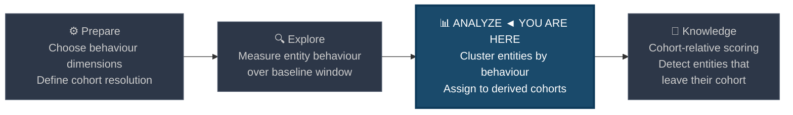
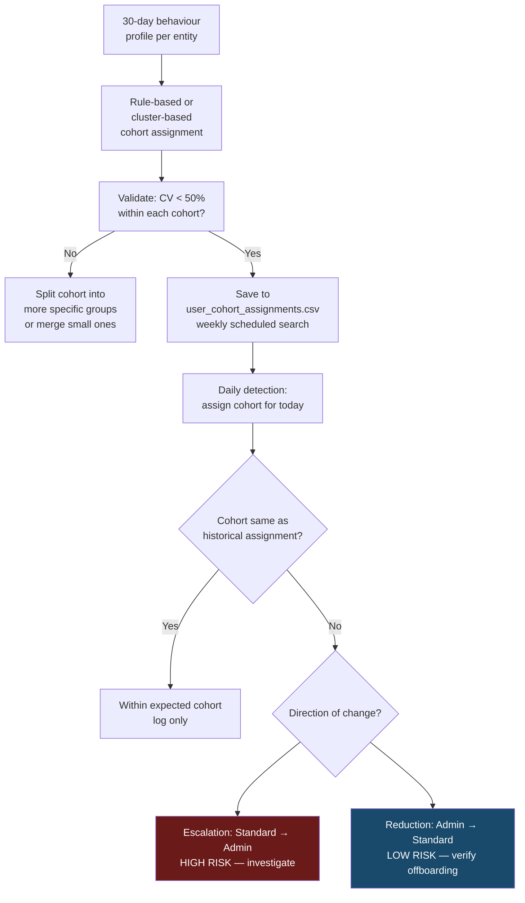

# Cohort Baselining

← [Back to README](../README.md)

**Navigation:** [← 11 Peer Group Analysis](./11_peer_group_analysis.md) | [13 First-Seen Tracking →](./13_first_seen_tracking.md)

---

## PEAK Phase: Analyze → Knowledge

Cohort baselining sits in the **Analyze** phase. Where peer group analysis uses *organisational attributes* (department, role) to define groups, cohort baselining derives groups **from behaviour itself** — entities that act similarly are placed in the same cohort regardless of their organisational classification.



---

## What Is Cohort Baselining?

A cohort is a **behaviour-derived group**: entities are clustered together because they exhibit similar patterns, not because an org chart says they should. This matters because:

- Org charts don't perfectly predict behaviour (an IT admin in a finance team has IT-like traffic)
- Some entities have no organisational classification in your CMDB or AD
- Behaviour clusters often surface **privilege tiers** more accurately than group membership
- Attackers who steal credentials inherit the victim's organisational peer group but not their behaviour cohort

### Peer Group vs Cohort: The Difference

| Dimension | Peer Group | Cohort |
|---|---|---|
| **Defined by** | Organisational attribute (AD department) | Observed behaviour pattern |
| **Requires** | Up-to-date AD / CMDB lookup | Only event log data |
| **Updates** | When org changes (must be maintained) | Periodically re-derived from behaviour |
| **Strength** | Stable, explainable groupings | Self-updating, catches misclassified entities |
| **Weakness** | Stale if lookup not maintained | Can shift if attacker gradually changes behaviour |

---

## Behaviour Dimensions for Cohort Assignment

Choose two or three behaviour dimensions that best separate the entity types you care about. Common choices:

| Dimension | SPL Field | Good for Separating |
|---|---|---|
| Login count per day | `count(EID 4624) BY user` | Power users vs casual users |
| Unique destination count | `dc(id.resp_h)` | Admins vs workstations vs servers |
| Login hour of day | `avg(date_hour)` | Night shift vs business hours vs batch jobs |
| Unique process count | `dc(Image)` | Developer machines vs kiosk devices |
| External bytes per day | `sum(orig_bytes)` | Data-heavy roles vs light users |
| Unique auth target count | `dc(ComputerName) in EID 4624` | Admins vs standard users |

---

## Data Sources

| Source | Cohort Behaviour Signal |
|---|---|
| **WinEvent 4624** | Login frequency, logon type mix, hour-of-day profile, unique target count |
| **Corelight conn.log** | Outbound bytes, destination cardinality, port diversity |
| **Sysmon EID 1** | Process diversity, unique parent-child combinations per host |
| **Corelight dns.log** | DNS query volume, unique domain count |

---

## PEAK: Prepare

### Hypothesis

> **"Entities that have historically exhibited similar behaviour patterns form natural cohorts. An entity that drifts away from its behaviour cohort — or that was never in the expected cohort — is either compromised, misconfigured, or represents an unrecognised threat."**

### Choosing Cohort Resolution

| Resolution | Description | Use When |
|---|---|---|
| **Coarse** (2–4 cohorts) | Admin, Standard, Service Account, Batch Job | Broad anomaly detection; easy to explain |
| **Medium** (5–10 cohorts) | Finance user, Dev, IT admin, DC, File server, Workstation, Service | Most environments |
| **Fine** (10+ cohorts) | Highly specific groups for large, diverse environments | Large orgs where medium cohorts are still too broad |

Start coarse and refine. Too many cohorts means each is too small for stable statistics.

---

## PEAK: Explore

### Step 1 — Measure Behaviour Dimensions per Entity

Build a 30-day behaviour profile for every user. This becomes the input to cohort assignment.

```spl
/* Explore: 30-day behaviour profile per user — input to cohort assignment */
index=wineventlog EventCode=4624 earliest=-30d
| where NOT match(SubjectUserName, "\\$$|ANONYMOUS|SYSTEM")
| bin _time span=1d AS day
| stats count AS daily_logins,
        dc(WorkstationName) AS unique_hosts,
        dc(LogonType) AS logon_type_mix,
        avg(date_hour) AS avg_login_hour,
        min(date_hour) AS earliest_login_hour,
        max(date_hour) AS latest_login_hour
    BY SubjectUserName, day
| stats avg(daily_logins) AS avg_logins_per_day,
        avg(unique_hosts) AS avg_unique_hosts,
        avg(logon_type_mix) AS avg_logon_type_diversity,
        avg(avg_login_hour) AS typical_login_hour,
        stdev(avg_login_hour) AS login_hour_consistency
    BY SubjectUserName
| eval login_span = latest_login_hour - earliest_login_hour
```

### Step 2 — Derive Cohorts via Behaviour Rules

Rather than full ML clustering (not available in Splunk Search Head), use **rule-based cohort assignment** derived from the behaviour profile. This is practical, auditable, and tunable.

```spl
/* Derive cohorts from behaviour profile — rule-based assignment */
index=wineventlog EventCode=4624 earliest=-30d
| where NOT match(SubjectUserName, "\\$$|ANONYMOUS|SYSTEM")
| bin _time span=1d AS day
| stats count AS daily_logins, dc(WorkstationName) AS unique_hosts,
        avg(date_hour) AS avg_hour, dc(LogonType) AS logon_type_mix
    BY SubjectUserName, day
| stats avg(daily_logins) AS avg_logins,
        avg(unique_hosts) AS avg_hosts,
        avg(avg_hour) AS typical_hour,
        max(daily_logins) AS peak_logins
    BY SubjectUserName

/* Cohort assignment rules */
| eval cohort = case(
    avg_logins > 100,                                    "Service Account",
    avg_logins > 20 AND avg_hosts > 10,                  "IT Administrator",
    avg_logins > 20 AND avg_hosts <= 3 AND peak_logins > 80, "Batch Job / Automation",
    typical_hour < 6 OR typical_hour > 20,               "Night Shift / Off-Hours Worker",
    avg_logins > 5 AND avg_hosts > 3,                    "Power User",
    avg_logins >= 1,                                     "Standard User",
    true(),                                              "Inactive / Unknown"
  )
| stats count AS members, avg(avg_logins) AS cohort_avg_logins,
        avg(avg_hosts) AS cohort_avg_hosts,
        values(SubjectUserName) AS sample_users
    BY cohort
| sort - members
```

### Step 3 — Validate Cohort Separation

Good cohorts have **low within-group variance** and **high between-group variance**. Validate by checking the coefficient of variation (CV = stdev/mean) within each cohort:

```spl
/* Validate: coefficient of variation within each cohort — lower = more homogeneous */
index=wineventlog EventCode=4624 earliest=-30d
| where NOT match(SubjectUserName, "\\$$|ANONYMOUS|SYSTEM")
| stats avg(count) AS daily_logins BY SubjectUserName
| eval cohort = case(
    daily_logins > 100, "Service Account",
    daily_logins > 20,  "IT Administrator",
    daily_logins >= 1,  "Standard User",
    true(),             "Inactive"
  )
| stats avg(daily_logins) AS group_mean, stdev(daily_logins) AS group_stdev BY cohort
| eval cv_pct = round(group_stdev / group_mean * 100, 1)
| eval quality = if(cv_pct < 50, "Good cohort separation", "High variance — consider splitting")
| sort cohort
```

---

## PEAK: Analyze

### Primary Detection — Cohort Assignment Drift

Assign users to cohorts today and compare to their 30-day historical cohort assignment. An entity that has moved from "Standard User" to "IT Administrator" behaviour without any AD group change warrants investigation.

```spl
/* COHORT DETECTION: entity behaviour now vs expected cohort from history */

/* Step 1: Build historical cohort baseline (last 30 days, excluding today) */
| makeresults
| eval placeholder = "build_historical"
| append [
    search index=wineventlog EventCode=4624 earliest=-30d latest=-1d
    | where NOT match(SubjectUserName, "\\$$|ANONYMOUS|SYSTEM")
    | stats count AS total_logins, dc(WorkstationName) AS unique_hosts BY SubjectUserName
    | eval avg_daily = round(total_logins / 29, 1)
    | eval historical_cohort = case(
        avg_daily > 100,                "Service Account",
        avg_daily > 20 AND unique_hosts > 10, "IT Administrator",
        avg_daily > 5,                  "Power User",
        true(),                         "Standard User"
      )
    | table SubjectUserName, historical_cohort, avg_daily AS hist_avg_daily
  ]

/* Step 2: Build today's cohort assignment */
| append [
    search index=wineventlog EventCode=4624 earliest=-1d latest=now
    | where NOT match(SubjectUserName, "\\$$|ANONYMOUS|SYSTEM")
    | stats count AS today_logins, dc(WorkstationName) AS unique_hosts_today BY SubjectUserName
    | eval current_cohort = case(
        today_logins > 100,                          "Service Account",
        today_logins > 20 AND unique_hosts_today > 10, "IT Administrator",
        today_logins > 5,                            "Power User",
        true(),                                      "Standard User"
      )
    | table SubjectUserName, current_cohort, today_logins
  ]

/* Step 3: Join and flag cohort changes */
| stats values(historical_cohort) AS hist_cohort,
        values(current_cohort) AS curr_cohort,
        values(today_logins) AS logins_today,
        values(hist_avg_daily) AS hist_avg
    BY SubjectUserName
| where mvcount(hist_cohort) = 1 AND mvcount(curr_cohort) = 1
| eval cohort_changed = if(hist_cohort != curr_cohort, "YES", "NO")
| where cohort_changed = "YES"
| eval escalation = if(
    (hist_cohort="Standard User" AND curr_cohort="IT Administrator")
    OR (hist_cohort="Standard User" AND curr_cohort="Service Account"),
    "HIGH — Lateral escalation pattern",
    "MEDIUM — Cohort shift detected"
  )
| table SubjectUserName, hist_cohort, curr_cohort, logins_today, hist_avg, escalation
| sort - escalation
```

### Enhanced Detection — New Entity Not Matching Any Established Cohort

Entities that have never appeared in your logs before are high-risk. Track first-time appearances that immediately exhibit unusual cohort characteristics:

```spl
/* COHORT DETECTION: new entity appearing with high-privilege cohort behaviour */
index=wineventlog EventCode=4624 earliest=-24h
| where NOT match(SubjectUserName, "\\$$|ANONYMOUS|SYSTEM")

/* Check if user has any history in last 30 days */
| join type=left SubjectUserName [
    search index=wineventlog EventCode=4624 earliest=-30d latest=-1d
    | stats count AS historical_logins BY SubjectUserName
    | where historical_logins > 0
    ]

/* Flag users with no history who immediately show admin-like behaviour */
| where isnull(historical_logins)
| stats count AS logins_today,
        dc(WorkstationName) AS unique_hosts,
        dc(LogonType) AS logon_types,
        values(WorkstationName) AS hosts_accessed
    BY SubjectUserName
| eval new_entity_cohort = case(
    logins_today > 20 OR unique_hosts > 5, "HIGH — New entity with admin-level activity",
    logins_today > 5,                      "MEDIUM — New entity with elevated activity",
    true(),                                "LOW — New entity, normal volume"
  )
| where NOT match(new_entity_cohort, "^LOW")
| sort - logins_today
```

### Network Cohort Deviation — Host-Based

```spl
/* COHORT DETECTION: host deviating from its asset-type cohort in network behaviour */
index=corelight sourcetype=corelight_conn earliest=-24h
| where NOT cidrmatch("10.0.0.0/8", id.resp_h)
| stats dc(id.resp_h) AS unique_dests,
        dc(id.resp_p) AS unique_ports,
        sum(orig_bytes) AS bytes_out
    BY id.orig_h
| lookup asset_classification ip as id.orig_h OUTPUT asset_type

/* Cohort baseline from 30-day history (pre-computed and stored in lookup) */
| lookup host_cohort_baselines ip as id.orig_h
    OUTPUT cohort_label, cohort_avg_dests, cohort_stdev_dests

/* Score deviation from cohort */
| eval cohort_zscore_dests = round(
    (unique_dests - cohort_avg_dests) / (cohort_stdev_dests + 1), 2)
| where cohort_zscore_dests > 3
| sort - cohort_zscore_dests
| table id.orig_h, asset_type, cohort_label, unique_dests,
        cohort_avg_dests, cohort_zscore_dests
```

---

## PEAK: Knowledge

### Saving Cohort Assignments as a Lookup

Persist cohort assignments to a KV Store or CSV lookup for use in other searches:

```spl
/* Save cohort assignments to lookup for downstream use */
index=wineventlog EventCode=4624 earliest=-30d
| where NOT match(SubjectUserName, "\\$$|ANONYMOUS|SYSTEM")
| stats count AS total_logins, dc(WorkstationName) AS unique_hosts BY SubjectUserName
| eval avg_daily = round(total_logins / 30, 1)
| eval assigned_cohort = case(
    avg_daily > 100,                          "Service Account",
    avg_daily > 20 AND unique_hosts > 10,      "IT Administrator",
    avg_daily > 5,                            "Power User",
    true(),                                   "Standard User"
  )
| eval cohort_assigned_date = strftime(now(), "%Y-%m-%d")
| table SubjectUserName, assigned_cohort, avg_daily, unique_hosts, cohort_assigned_date
| outputlookup user_cohort_assignments.csv
```

Schedule this as a weekly saved search to keep cohort assignments current.

---

## Cohort Analysis Decision Flow



---

## Limitations

| Limitation | Detail |
|---|---|
| **Rule-based cohorts are brittle** | Threshold values (e.g., `avg_daily > 20`) require tuning per environment. A small organisation will have different thresholds from a large one. |
| **Gradual drift evades detection** | If an attacker slowly increases activity, they may move cohorts incrementally without triggering a single large jump. Layer with [Long-Term Drift Detection](./14_long_term_drift.md). |
| **Shared accounts blur cohorts** | A shared service account used by multiple people will reflect an average of all their behaviours — potentially placing it in no coherent cohort. Separate shared accounts from human accounts before cohort analysis. |
| **New environments** | Cohort baselining requires at least 30 days of stable history. In a new deployment, start with peer group analysis (using AD attributes) until behavioural data accumulates. |

---

## Related Techniques and Detection Use Cases

- [Peer Group Analysis](./11_peer_group_analysis.md) — org-attribute-based grouping (complement to cohort)
- [Behavioral Profiling](./09_behavioral_profiling.md) — within-entity baseline (cohort is between-entity)
- [Anomaly Detection](./10_anomaly_detection.md) — composite scoring that can incorporate cohort signals
- [Insider Threat](../03_detection_use_cases/07_insider_threat.md) — cohort deviation is a primary insider threat signal
- [Lateral Movement](../03_detection_use_cases/05_lateral_movement.md) — cohort escalation (Standard → IT Admin behaviour) is a key lateral movement indicator

---

**Navigation:** [← 11 Peer Group Analysis](./11_peer_group_analysis.md) | [13 First-Seen Tracking →](./13_first_seen_tracking.md)

← [Back to README](../README.md)
