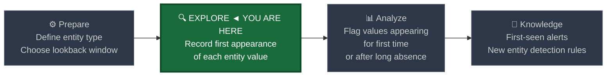
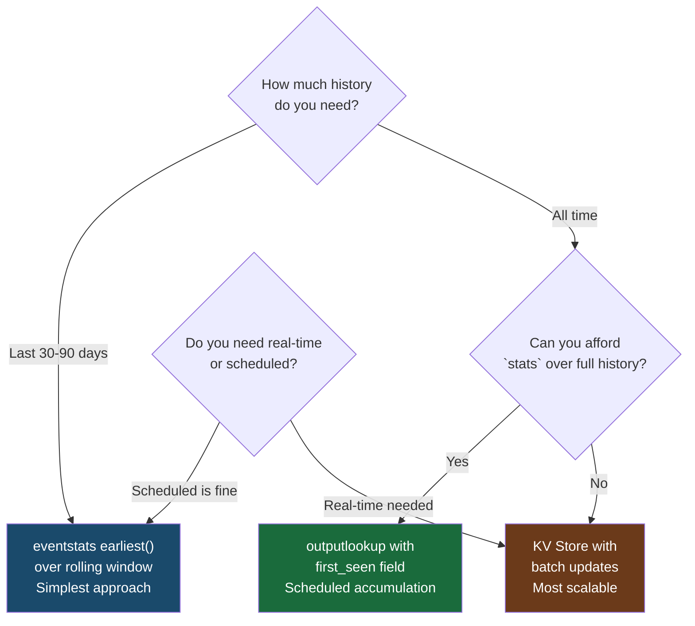
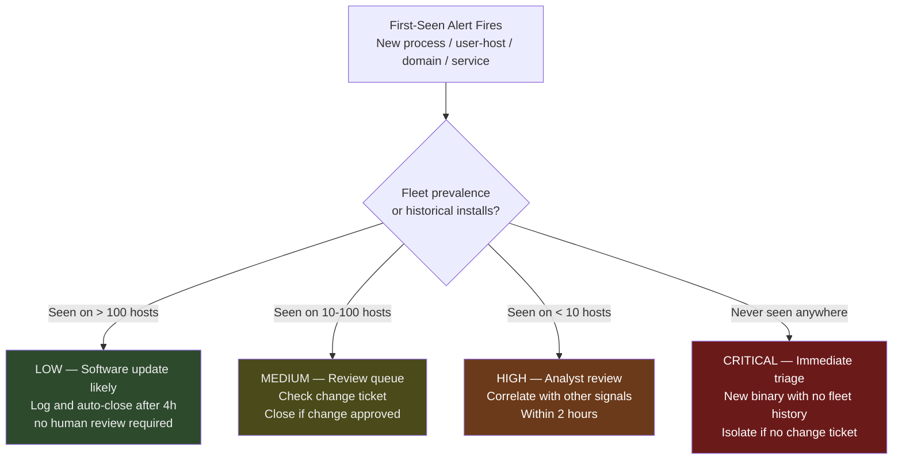

# First-Seen Tracking

← [Back to README](../README.md)

**Navigation:** [← 12 Cohort Baselining](./12_cohort_baselining.md) | [14 Long-Term Drift →](./14_long_term_drift.md)

---

## PEAK Phase: Explore → Analyze

First-seen tracking is a **foundational Explore technique** that underpins many higher-level detections. Before you can measure deviation from a baseline, you need to know when something appeared for the first time. First-seen analysis answers: *"Has this ever happened before?"*



---

## What Is First-Seen Tracking?

First-seen tracking records the **earliest observation** of each distinct value in a field — a process name, a domain, an IP address, a user-host combination — and alerts when new values appear outside expected introduction windows.

The security insight is powerful: **in a stable production environment, genuinely new things are rare and warrant scrutiny.** A new process appearing on 200 workstations on a Tuesday morning is likely a software update. The same process appearing on one workstation at 3 AM on a Saturday is not.

### What First-Seen Tracking Detects

| Entity Type | First-Seen Signal | Threat Scenario |
|---|---|---|
| New process image path | Binary never run in environment before | Dropped malware payload |
| New user-host combination | Account never logged into this machine | Lateral movement, credential use |
| New external IP/domain | Destination never contacted before | C2 communication, first exfiltration |
| New service name | Service never installed in environment | Impacket PSEXEC, persistence |
| New DNS query | Domain never queried by this host | DGA first contact, beaconing start |
| New parent→child process pair | Process chain never seen before | LotL execution, macro weaponisation |

---

## Implementation Approaches

There are three practical first-seen tracking implementations in Splunk, each with different trade-offs:



---

## Data Sources

| Source | First-Seen Entity | Key Field |
|---|---|---|
| **Sysmon EID 1** | New processes, new parent→child chains | `Image`, `ParentImage`, `CommandLine` |
| **WinEvent 4624** | New user→host combinations | `SubjectUserName` + `WorkstationName` |
| **WinEvent 7045** | New services | `ServiceName`, `ServiceFileName` |
| **Corelight conn.log** | New external IP/domain destinations | `id.resp_h`, `id.resp_p` |
| **Corelight dns.log** | New domains queried | `query` |
| **Sysmon EID 3** | New process→destination pairs | `Image` + `DestinationIp` |

---

## PEAK: Prepare

### Hypothesis

> **"A new value has appeared in a high-signal field that has not been observed in the environment during the defined baseline window. New values in stable production environments represent either legitimate change (requiring change management verification) or malicious activity."**

### Baseline Window Selection

| Window | Use Case | Risk |
|---|---|---|
| 7 days | Fast-moving environments, high software update rate | High false positive rate from routine changes |
| 30 days | **Recommended default** — balances coverage and noise | Misses gradual attackers who wait > 30 days |
| 90 days | Stable environments with infrequent change | Catches more legitimate first-sights as anomalies |
| All time (lookup) | Maximum coverage | Requires maintenance; grows indefinitely |

### Exclusions

First-seen analysis generates significant noise from legitimate software deployments. Build exclusion lists before deploying to production:

```spl
/* Identify the top new processes introduced in the last 7 days — build exclusion list */
index=sysmon EventCode=1 earliest=-7d
| eval image_short = replace(Image, ".*\\\\", "")
| eventstats min(_time) AS first_seen BY image_short, host
| where first_seen >= relative_time(now(), "-24h")
| stats count AS hosts_affected, min(_time) AS first_seen_time
    BY image_short
| eval first_seen_str = strftime(first_seen_time, "%Y-%m-%d %H:%M")
| sort - hosts_affected
| head 50
```

Review this list. Software update rollouts (many hosts, business hours, known vendor binary) should go into a `known_new_software.csv` lookup. Individual workstations receiving an unknown process at odd hours should be investigated.

---

## PEAK: Explore

### Step 1 — Build a First-Seen Process Baseline

```spl
/* Baseline: record earliest observation of each process per host over 30 days */
index=sysmon EventCode=1 earliest=-30d
| eval image_path = lower(Image)
| stats min(_time) AS first_seen_epoch BY image_path, host
| eval first_seen = strftime(first_seen_epoch, "%Y-%m-%d")
| sort image_path, host
```

Optionally save this as a lookup for use in first-seen detection:

```spl
/* Save process first-seen baseline to lookup */
index=sysmon EventCode=1 earliest=-30d
| eval image_short = lower(replace(Image, ".*\\\\", ""))
| stats min(_time) AS first_seen_epoch BY image_short
| eval first_seen = strftime(first_seen_epoch, "%Y-%m-%d")
| table image_short, first_seen
| outputlookup process_first_seen.csv
```

### Step 2 — Build a First-Seen User-Host Baseline

```spl
/* Baseline: which user has ever authenticated to which host? */
index=wineventlog EventCode=4624 earliest=-30d
| where NOT match(SubjectUserName, "\\$$|ANONYMOUS|SYSTEM")
| where LogonType IN ("2","3","10")
| stats min(_time) AS first_seen_epoch BY SubjectUserName, WorkstationName
| eval first_seen = strftime(first_seen_epoch, "%Y-%m-%d")
| table SubjectUserName, WorkstationName, first_seen
| outputlookup user_host_first_seen.csv
```

### Step 3 — Build a First-Seen Domain Baseline (Corelight)

```spl
/* Baseline: all domains this environment has ever queried */
index=corelight sourcetype=corelight_dns earliest=-30d
| where NOT cidrmatch("10.0.0.0/8", id.orig_h)
| eval query_lower = lower(query)
| stats min(_time) AS first_seen_epoch, dc(id.orig_h) AS query_count BY query_lower
| eval first_seen = strftime(first_seen_epoch, "%Y-%m-%d")
| table query_lower, first_seen, query_count
| outputlookup domain_first_seen.csv
```

---

## PEAK: Analyze

### Primary Detection — New Process on Host (No Prior History)

```spl
/* FIRST-SEEN DETECTION: process appearing on a host for the first time in 30 days */
index=sysmon EventCode=1 earliest=-24h
| eval image_short = lower(replace(Image, ".*\\\\", ""))

/* Check against 30-day history */
| join type=left image_short host [
    search index=sysmon EventCode=1 earliest=-30d latest=-1d
    | eval image_short = lower(replace(Image, ".*\\\\", ""))
    | stats min(_time) AS historical_first BY image_short, host
    ]

/* Flag processes with no historical record on this host */
| where isnull(historical_first)

/* Enrich: how many other hosts have seen this process? (fleet-wide prevalence) */
| join type=left image_short [
    search index=sysmon EventCode=1 earliest=-30d
    | eval image_short = lower(replace(Image, ".*\\\\", ""))
    | stats dc(host) AS fleet_prevalence BY image_short
    ]

| eval risk = case(
    fleet_prevalence > 100,  "LOW — Common process, first on this host only",
    fleet_prevalence > 10,   "MEDIUM — Seen elsewhere, new to this host",
    fleet_prevalence <= 10 OR isnull(fleet_prevalence), "HIGH — Rare across fleet",
    true(), "UNKNOWN"
  )

| where NOT match(risk, "^LOW")
| table _time, host, User, Image, ParentImage, CommandLine,
        fleet_prevalence, risk
| sort - _time
```

**Fleet prevalence** is the key triage field: a process first-seen on one host but already running on 500 others is almost certainly a software update. A process first-seen on one host that appears on 0 other hosts is a strong malware indicator.

### Enhanced Detection — New User-Host Authentication

```spl
/* FIRST-SEEN DETECTION: user authenticating to a host they've never accessed */
index=wineventlog EventCode=4624 earliest=-24h
| where NOT match(SubjectUserName, "\\$$|ANONYMOUS|SYSTEM")
| where LogonType IN ("2","3","10")

/* Compare to historical user-host pairs */
| lookup user_host_first_seen username as SubjectUserName
    computername as WorkstationName OUTPUT first_seen AS historical_first

| where isnull(historical_first)

/* Enrich with user's peer group */
| lookup user_peer_groups username as SubjectUserName OUTPUT department, user_tier

| eval risk = case(
    user_tier="0", "CRITICAL — Tier 0 account on new host",
    user_tier="1", "HIGH — Admin account on new host",
    true(),        "MEDIUM — Standard user on new host"
  )

| table _time, SubjectUserName, WorkstationName, LogonType,
        IpAddress, department, user_tier, risk
| sort - risk, _time
```

### Enhanced Detection — New External Domain

```spl
/* FIRST-SEEN DETECTION: domain queried for the first time in 30 days */
index=corelight sourcetype=corelight_dns earliest=-24h
| where NOT cidrmatch("10.0.0.0/8", id.orig_h)
| eval query_lower = lower(query)

/* Compare to known domains */
| lookup domain_first_seen query_lower OUTPUT first_seen AS historical_first

| where isnull(historical_first)

/* Enrich: high-risk indicators */
| eval query_len = len(query_lower)
| eval subdomain_count = mvcount(split(query_lower, ".")) - 2

| eval risk = case(
    query_len > 50,                  "HIGH — Long domain (DGA/tunneling candidate)",
    subdomain_count > 4,             "HIGH — Deep subdomain (tunneling candidate)",
    match(qtype_name, "TXT|NULL"),   "HIGH — Unusual query type",
    rcode_name="NXDOMAIN",          "MEDIUM — Domain does not exist (DGA probe)",
    true(),                          "LOW — New domain, standard query"
  )

| where NOT match(risk, "^LOW")
| table _time, id.orig_h, query_lower, qtype_name, rcode_name,
        query_len, subdomain_count, risk
| sort - risk, _time
```

### New Service Installation — Zero-History Check

```spl
/* FIRST-SEEN DETECTION: service installed that has never appeared in environment */
index=wineventlog EventCode=7045 earliest=-24h

/* Check service name against 90-day history */
| join type=left ServiceName [
    search index=wineventlog EventCode=7045 earliest=-90d latest=-1d
    | stats count AS historical_installs, dc(ComputerName) AS hosts_installed_on
        BY ServiceName
    ]

| where isnull(historical_installs)

/* Flag by path patterns */
| eval path_risk = case(
    match(ServiceFileName, "(?i)ADMIN\$|\\\\Windows\\\\Temp|\\\\Users\\\\"),
    "HIGH — Service in suspicious path",
    match(ServiceFileName, "(?i)[A-Za-z0-9]{6,8}\.exe"),
    "HIGH — Random-named binary (Impacket pattern)",
    true(), "MEDIUM — New service, standard path"
  )

| table _time, ComputerName, ServiceName, ServiceFileName,
        ServiceType, StartType, path_risk
| sort - path_risk, _time
```

---

## PEAK: Knowledge

### First-Seen Alert Routing



### Keeping First-Seen Lookups Fresh

First-seen lookups must be updated regularly. Two strategies:

**Accumulative (append-only):**
```spl
/* Weekly: add new process observations to the first-seen lookup */
index=sysmon EventCode=1 earliest=-7d
| eval image_short = lower(replace(Image, ".*\\\\", ""))
| stats min(_time) AS new_first_seen BY image_short

/* Merge with existing lookup */
| append [| inputlookup process_first_seen.csv]
| stats min(new_first_seen) AS first_seen_epoch BY image_short
| eval first_seen = strftime(first_seen_epoch, "%Y-%m-%d")
| outputlookup process_first_seen.csv
```

**Rolling window (drop values older than N days):**
```spl
/* Weekly: maintain rolling 90-day first-seen window — drop stale entries */
index=sysmon EventCode=1 earliest=-90d
| eval image_short = lower(replace(Image, ".*\\\\", ""))
| stats min(_time) AS first_seen_epoch BY image_short
| where first_seen_epoch > relative_time(now(), "-90d")
| eval first_seen = strftime(first_seen_epoch, "%Y-%m-%d")
| outputlookup process_first_seen.csv
```

Use the rolling window approach when you want "first seen in the last 90 days" semantics. Use accumulative when you want true all-time first-seen records.

---

## Limitations

| Limitation | Detail |
|---|---|
| **Log coverage gaps** | First-seen is only as complete as your log coverage. A gap in Sysmon collection means processes that ran during the gap are treated as new when they next appear. |
| **Renamed binaries** | Attackers rename binaries to evade first-seen detection. Complement with hash-based first-seen (`Hashes` field in Sysmon EID 1) — a known-good binary with a new name will have a known-good hash. |
| **Lookup growth** | Accumulative lookups grow without bound. Set a maximum size and schedule pruning of entries older than your baseline window. |
| **Baseline poisoning** | If an attacker is already in the environment when you start collecting first-seen data, their tools get added to the baseline and are no longer flagged as new. See [Long-Term Drift Detection](./14_long_term_drift.md) for how to detect this. |

---

## Related Techniques and Detection Use Cases

- [Frequency Analysis](./01_frequency_analysis.md) — `rare` command finds low-frequency values; first-seen finds zero-prior-frequency values
- [Behavioral Profiling](./09_behavioral_profiling.md) — entity-level profiles that first-seen feeds into
- [Cohort Baselining](./12_cohort_baselining.md) — first-seen of an entity in a new cohort
- [Rogue Services / Processes](../03_detection_use_cases/09_rogue_services_processes.md) — first-seen service and process detection
- [Lateral Movement](../03_detection_use_cases/05_lateral_movement.md) — first-seen user-host authentication pairs

---

**Navigation:** [← 12 Cohort Baselining](./12_cohort_baselining.md) | [14 Long-Term Drift →](./14_long_term_drift.md)

← [Back to README](../README.md)
