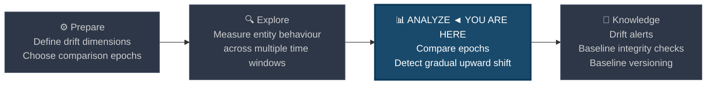
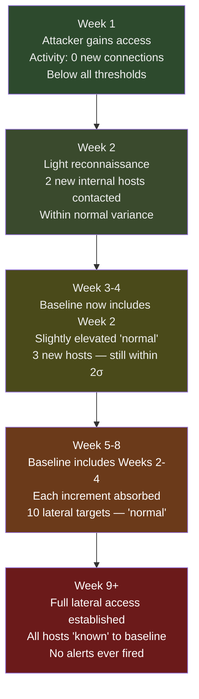
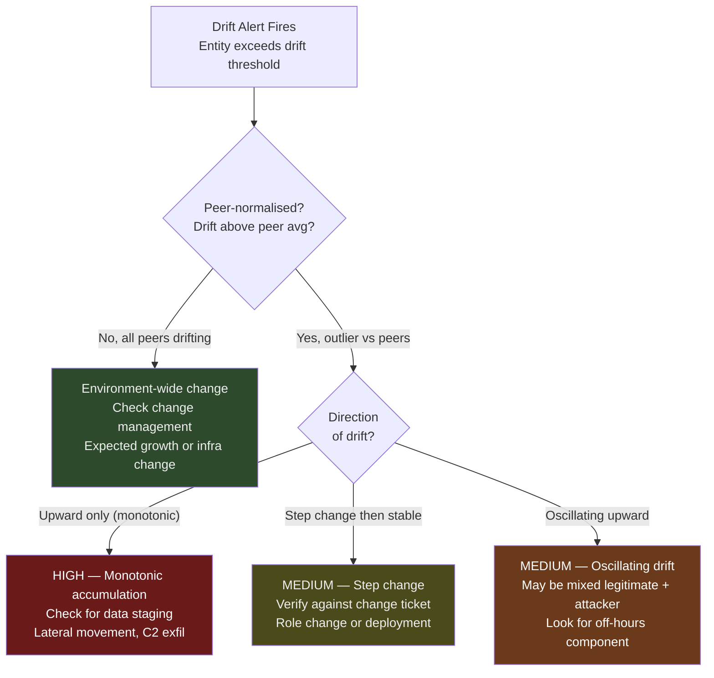

# Long-Term Drift Detection

← [Back to README](../README.md)

**Navigation:** [← 13 First-Seen Tracking](./13_first_seen_tracking.md) | [15 Baseline Management →](./15_baseline_management.md)

---

## PEAK Phase: Analyze → Knowledge

Long-term drift detection sits at the **Analyze** phase boundary. While most baseline techniques compare today against the last 30 days, drift detection asks a harder question: *"Is the baseline itself shifting?"* This catches attackers who operate on timescales longer than your detection window.



---

## What Is Baseline Drift?

Baseline drift occurs when the statistical reference point used for anomaly detection gradually shifts over time — either legitimately (the environment genuinely changes) or maliciously (an attacker deliberately moves slowly to avoid triggering alerts).

### The Slow-Burn Attacker Problem

Short-window baselines (7–30 days) are vulnerable to attackers who understand detection:



The defence: compare recent behaviour not just against the last 30 days, but against an **anchored historical baseline** from 90–180 days ago, before the intrusion began.

### Legitimate vs Malicious Drift

| Drift Pattern | Characteristics | Likely Cause |
|---|---|---|
| **Step change** | Sudden increase, then stable plateau | Software deployment, role change |
| **Gradual ramp** | Slow, consistent week-over-week increase | Slow attacker, data staging |
| **Oscillating drift** | Irregular but trending upward | Mixed legitimate + attacker activity |
| **Seasonal shift** | Predictable increase at known periods | Quarter-end reporting, audit season |
| **Monotonic accumulation** | One-way increase, never decreasing | Data staging, credential harvesting |

---

## Data Sources

| Source | Drift Dimension | Key Metric |
|---|---|---|
| **Corelight conn.log** | Outbound data volume drift | `sum(orig_bytes)` per host per week |
| **WinEvent 4624** | Authentication target spread drift | `dc(WorkstationName)` per user per week |
| **Corelight dns.log** | Unique domain count drift | `dc(query)` per host per week |
| **Sysmon EID 1** | Process diversity drift | `dc(Image)` per host per week |
| **WinEvent 4769** | TGS request volume drift | `count` per user per week |
| **Corelight files.log** | File transfer volume drift | `sum(total_bytes)` per host per week |

---

## PEAK: Prepare

### Hypothesis

> **"An entity whose behaviour metrics show consistent week-over-week or epoch-over-epoch increases — without a corresponding change management event — may be subject to a slow-burn intrusion where activity is deliberately kept below rolling-window detection thresholds."**

### Comparison Epoch Strategy

| Strategy | Window A (Recent) | Window B (Anchor) | Use When |
|---|---|---|---|
| **90-day comparison** | Last 30 days | Days 61–90 ago | Standard environments, monthly cadence |
| **180-day comparison** | Last 30 days | Days 151–180 ago | Slow-moving attackers, patient threat actors |
| **Week-over-week trend** | This week | Average of weeks 2–12 ago | Fast-moving environments, frequent change |
| **Epoch percentile drift** | Current 95th pct | Historical 95th pct | Right-skewed distributions (bytes, counts) |

### What to Exclude

Drift analysis generates false positives from predictable legitimate changes. Build exclusion context before deploying:

```spl
/* Identify known change windows that explain drift — pull from change management */
| inputlookup change_windows.csv
| where status="approved" AND change_type IN ("software_deployment","role_change","infrastructure_expansion")
| eval change_epoch = strftime(strptime(change_date, "%Y-%m-%d"), "%s")
| where change_epoch > relative_time(now(), "-90d")
| table entity, change_type, change_date, description
```

---

## PEAK: Explore

### Step 1 — Build Weekly Behaviour Summaries per Entity

Aggregate behaviour by week for the last 90 days. This creates the multi-epoch view required for drift analysis.

```spl
/* Explore: weekly outbound bytes per host over 90 days */
index=corelight sourcetype=corelight_conn earliest=-90d
| where NOT cidrmatch("10.0.0.0/8", id.resp_h)
| bin _time span=1w AS week
| stats sum(orig_bytes) AS weekly_bytes,
        dc(id.resp_h) AS unique_dests,
        dc(id.resp_p) AS unique_ports
    BY id.orig_h, week
| eval week_str = strftime(week, "%Y-%W")
| sort id.orig_h, week
```

### Step 2 — Compute Epoch Averages

Divide the 90-day window into three 30-day epochs and compare them:

```spl
/* Explore: epoch-based behaviour averages for drift comparison */
index=corelight sourcetype=corelight_conn earliest=-90d
| where NOT cidrmatch("10.0.0.0/8", id.resp_h)
| eval epoch = case(
    _time >= relative_time(now(), "-30d"),  "recent",
    _time >= relative_time(now(), "-60d"),  "mid",
    true(),                                 "anchor"
  )
| stats sum(orig_bytes) AS bytes, dc(id.resp_h) AS unique_dests
    BY id.orig_h, epoch
| stats values(eval(if(epoch="recent", bytes, null()))) AS recent_bytes,
        values(eval(if(epoch="mid",    bytes, null()))) AS mid_bytes,
        values(eval(if(epoch="anchor", bytes, null()))) AS anchor_bytes,
        values(eval(if(epoch="recent", unique_dests, null()))) AS recent_dests,
        values(eval(if(epoch="anchor", unique_dests, null()))) AS anchor_dests
    BY id.orig_h
| eval bytes_drift_pct = round((recent_bytes - anchor_bytes) / (anchor_bytes + 1) * 100, 1)
| eval dests_drift_pct = round((recent_dests - anchor_dests) / (anchor_dests + 1) * 100, 1)
| sort - bytes_drift_pct
```

### Step 3 — Linear Trend Fitting with `predict`

Use Splunk's `predict` command to detect statistically significant upward trends over the full 90-day window:

```spl
/* Explore: fit linear trend to weekly bytes per host — identify hosts with significant upward trend */
index=corelight sourcetype=corelight_conn earliest=-90d
| where NOT cidrmatch("10.0.0.0/8", id.resp_h)
| bin _time span=1w AS week
| stats sum(orig_bytes) AS weekly_bytes BY id.orig_h, week
| sort id.orig_h, week

/* Predict next value and extract trend component */
| streamstats window=12 current=true
    avg(weekly_bytes) AS rolling_avg,
    stdev(weekly_bytes) AS rolling_stdev
    BY id.orig_h
| eval trend_zscore = round((weekly_bytes - rolling_avg) / (rolling_stdev + 1), 2)

/* Flag hosts where recent weeks are consistently above rolling average */
| where _time >= relative_time(now(), "-21d")
| stats avg(trend_zscore) AS avg_recent_zscore,
        count AS recent_weeks
    BY id.orig_h
| where avg_recent_zscore > 1.5 AND recent_weeks >= 3
| sort - avg_recent_zscore
```

### Step 4 — Authentication Target Spread Drift (Lateral Movement Indicator)

```spl
/* Explore: week-over-week growth in unique hosts accessed per user */
index=wineventlog EventCode=4624 earliest=-90d
| where NOT match(SubjectUserName, "\\$$|ANONYMOUS|SYSTEM")
| where LogonType IN ("2","3","10")
| bin _time span=1w AS week
| stats dc(WorkstationName) AS unique_hosts BY SubjectUserName, week
| sort SubjectUserName, week

/* Compute week-over-week delta */
| streamstats window=2 current=true
    values(unique_hosts) AS host_history
    BY SubjectUserName
| eval prev_week_hosts = mvindex(host_history, 0)
| eval curr_week_hosts = mvindex(host_history, 1)
| eval wow_delta = curr_week_hosts - prev_week_hosts

/* Flag users showing consistent upward trend */
| where _time >= relative_time(now(), "-21d")
| stats avg(wow_delta) AS avg_weekly_growth,
        sum(wow_delta) AS total_growth_3wk
    BY SubjectUserName
| where avg_weekly_growth > 2 AND total_growth_3wk > 5
| sort - total_growth_3wk
```

---

## PEAK: Analyze

### Primary Detection — Monotonic Drift Alert

The strongest indicator of slow-burn intrusion is a metric that only moves in one direction. Legitimate usage oscillates; staged data exfiltration and lateral movement accumulate.

```spl
/* DRIFT DETECTION: host with monotonically increasing outbound bytes over 8 weeks */
index=corelight sourcetype=corelight_conn earliest=-56d
| where NOT cidrmatch("10.0.0.0/8", id.resp_h)
| bin _time span=1w AS week
| stats sum(orig_bytes) AS weekly_bytes BY id.orig_h, week
| sort id.orig_h, week

/* Track direction of each weekly change */
| streamstats window=2 current=true
    values(weekly_bytes) AS wk_history
    BY id.orig_h
| eval prev_bytes = mvindex(wk_history, 0)
| eval curr_bytes = mvindex(wk_history, 1)
| eval direction = if(curr_bytes > prev_bytes, "UP", "DOWN_OR_FLAT")

/* Count consecutive UP weeks per host */
| stats count(eval(direction="UP")) AS up_weeks,
        count AS total_weeks,
        min(weekly_bytes) AS min_weekly,
        max(weekly_bytes) AS max_weekly
    BY id.orig_h
| eval pct_up = round(up_weeks / total_weeks * 100, 0)
| eval total_growth_pct = round((max_weekly - min_weekly) / (min_weekly + 1) * 100, 0)

| where up_weeks >= 6 AND pct_up >= 75 AND total_growth_pct > 50

| eval risk = case(
    pct_up = 100 AND total_growth_pct > 200, "CRITICAL — Perfect monotonic drift with 3x growth",
    pct_up >= 87 AND total_growth_pct > 100, "HIGH — Near-monotonic drift with 2x growth",
    true(),                                  "MEDIUM — Consistent upward trend"
  )

| table id.orig_h, up_weeks, total_weeks, pct_up, min_weekly, max_weekly,
        total_growth_pct, risk
| sort - risk, total_growth_pct
```

### Enhanced Detection — Epoch Comparison with Peer Normalisation

Remove environment-wide trends (such as general growth) by comparing an entity's drift to its peer group's drift. True malicious drift stands out against peers who are stable.

```spl
/* DRIFT DETECTION: entity drift vs peer group drift — isolate anomalous growers */
index=corelight sourcetype=corelight_conn earliest=-90d
| where NOT cidrmatch("10.0.0.0/8", id.resp_h)
| eval epoch = case(
    _time >= relative_time(now(), "-30d"), "recent",
    true(),                                "anchor"
  )
| stats sum(orig_bytes) AS bytes BY id.orig_h, epoch
| stats values(eval(if(epoch="recent", bytes, null()))) AS recent,
        values(eval(if(epoch="anchor", bytes, null()))) AS anchor
    BY id.orig_h
| eval host_drift_pct = round((recent - anchor) / (anchor + 1) * 100, 1)

/* Join peer group */
| lookup asset_classification ip as id.orig_h OUTPUT asset_type

/* Compute peer group drift average */
| eventstats avg(host_drift_pct) AS peer_avg_drift,
             stdev(host_drift_pct) AS peer_stdev_drift
    BY asset_type

/* Score relative to peer group */
| eval drift_zscore = round((host_drift_pct - peer_avg_drift) / (peer_stdev_drift + 1), 2)
| where drift_zscore > 3 AND host_drift_pct > 50

| eval risk = case(
    drift_zscore > 5,  "HIGH — Far above peer group drift",
    drift_zscore > 3,  "MEDIUM — Above peer group drift"
  )

| table id.orig_h, asset_type, anchor, recent, host_drift_pct,
        peer_avg_drift, drift_zscore, risk
| sort - drift_zscore
```

### Baseline Poisoning Detection — Retrospective Lookback

Baseline poisoning occurs when malicious activity was present during your baseline collection window. Detect it by comparing current lookups against an older snapshot:

```spl
/* DRIFT DETECTION: compare current process first-seen lookup to archived snapshot */

/* Load current lookup */
| inputlookup process_first_seen.csv
| rename image_short AS image, first_seen AS current_first_seen

/* Load archived baseline from 90 days ago */
| join type=left image [
    | inputlookup process_first_seen_archive_90d.csv
    | rename image_short AS image, first_seen AS archive_first_seen
  ]

/* Flag processes that appear "new" in current baseline but were absent from archive */
| where isnull(archive_first_seen)
| eval days_in_current_only = datediff(now(), strptime(current_first_seen, "%Y-%m-%d"), "days")

/* Focus on processes that appeared during the potential compromise window */
| where days_in_current_only BETWEEN 30 AND 90

| table image, current_first_seen, days_in_current_only
| sort - days_in_current_only
```

### Authentication Spread Drift — Slow Lateral Movement

```spl
/* DRIFT DETECTION: user accessing more unique hosts each week — slow lateral movement */
index=wineventlog EventCode=4624 earliest=-90d
| where NOT match(SubjectUserName, "\\$$|ANONYMOUS|SYSTEM")
| where LogonType IN ("2","3","10")
| eval epoch = case(
    _time >= relative_time(now(), "-30d"), "recent",
    true(),                                "anchor"
  )
| stats dc(WorkstationName) AS unique_hosts BY SubjectUserName, epoch
| stats values(eval(if(epoch="recent", unique_hosts, null()))) AS recent_hosts,
        values(eval(if(epoch="anchor", unique_hosts, null()))) AS anchor_hosts
    BY SubjectUserName
| eval hosts_drift = recent_hosts - anchor_hosts
| eval hosts_drift_pct = round(hosts_drift / (anchor_hosts + 1) * 100, 0)

/* Only flag meaningful expansion, not noise from small counts */
| where anchor_hosts >= 2 AND hosts_drift >= 3 AND hosts_drift_pct > 50

| eval risk = case(
    hosts_drift >= 10 AND hosts_drift_pct > 200, "HIGH — Massive host spread increase",
    hosts_drift >= 5,                            "MEDIUM — Significant host spread growth",
    true(),                                      "LOW — Moderate growth"
  )

| where NOT match(risk, "^LOW")
| table SubjectUserName, anchor_hosts, recent_hosts, hosts_drift, hosts_drift_pct, risk
| sort - hosts_drift
```

### TGS Request Volume Drift — Kerberoasting Preparation

Attackers staging for Kerberoasting may enumerate SPNs slowly over weeks. Track TGS request volume drift:

```spl
/* DRIFT DETECTION: gradual increase in TGS requests — slow Kerberoasting prep */
index=wineventlog EventCode=4769 earliest=-90d
| where NOT match(ServiceName, "krbtgt|\\$")
| eval epoch = case(
    _time >= relative_time(now(), "-30d"), "recent",
    true(),                                "anchor"
  )
| stats count AS tgs_count, dc(ServiceName) AS unique_services
    BY SubjectUserName, epoch
| stats values(eval(if(epoch="recent", tgs_count, null()))) AS recent_tgs,
        values(eval(if(epoch="anchor", tgs_count, null()))) AS anchor_tgs,
        values(eval(if(epoch="recent", unique_services, null()))) AS recent_svcs,
        values(eval(if(epoch="anchor", unique_services, null()))) AS anchor_svcs
    BY SubjectUserName
| eval tgs_drift_pct  = round((recent_tgs - anchor_tgs) / (anchor_tgs + 1) * 100, 0)
| eval svcs_drift_pct = round((recent_svcs - anchor_svcs) / (anchor_svcs + 1) * 100, 0)

| where tgs_drift_pct > 100 AND svcs_drift_pct > 50

| table SubjectUserName, anchor_tgs, recent_tgs, tgs_drift_pct,
        anchor_svcs, recent_svcs, svcs_drift_pct
| sort - tgs_drift_pct
```

---

## PEAK: Knowledge

### Drift Severity Classification



### Recommended Drift Thresholds

| Metric | Medium Alert | High Alert | Notes |
|---|---|---|---|
| Outbound bytes (30d vs anchor) | +100% | +300% | Normalise by peer group first |
| Unique external destinations | +50% | +200% | Exclude CDN ranges |
| Unique auth targets (per user) | +5 hosts | +10 hosts | Absolute delta more useful than % |
| Process diversity (per host) | +30% | +100% | Dev machines have higher baseline |
| TGS requests per user | +100% | +300% | Service accounts: exclude |
| Weekly monotonic streak | 4 weeks | 6 weeks | Count direction-up weeks |

### Saving Drift Snapshots for Future Comparison

Archive weekly snapshots to enable retrospective baseline poisoning detection:

```spl
/* Weekly: archive current first-seen lookup for retrospective comparison */
| inputlookup process_first_seen.csv
| eval archived_date = strftime(now(), "%Y-%m-%d")
| outputlookup process_first_seen_archive_90d.csv
```

Schedule this as a weekly saved search. Maintain rolling archives at 30-day, 90-day, and 180-day snapshots.

---

## Limitations

| Limitation | Detail |
|---|---|
| **Requires long history** | Drift analysis needs at least 60–90 days of clean data. New deployments cannot use this technique until the baseline matures. |
| **Legitimate growth masked by aggregation** | A growing business will show genuine upward trends in almost every metric. Peer-normalisation mitigates this but requires a stable peer group. |
| **Attacker awareness** | Sophisticated adversaries (APT-level) who understand drift detection will deliberately oscillate — increase one week, decrease slightly the next — to avoid monotonic patterns. Layer with first-seen tracking to catch the net increase. |
| **Epoch boundary sensitivity** | Results shift based on where you draw epoch boundaries. A 30/60/90 split may miss an attacker who started exactly 31 days ago. Use multiple overlapping epoch comparisons. |
| **Storage cost** | Maintaining multiple archived baseline snapshots in KV Store or lookup files has storage overhead. See [Baseline Management](./15_baseline_management.md) for retention guidance. |

---

## Related Techniques and Detection Use Cases

- [Time-Series Forecasting](./08_timeseries_forecasting.md) — `predict` for trend projection; complement to epoch comparison
- [Behavioral Profiling](./09_behavioral_profiling.md) — per-entity baselines that drift analysis extends over longer windows
- [First-Seen Tracking](./13_first_seen_tracking.md) — baseline poisoning detection links to first-seen lookup archiving
- [Baseline Management](./15_baseline_management.md) — operational procedures for maintaining drift-resistant baselines
- [Data Exfiltration](../03_detection_use_cases/02_data_exfiltration.md) — monotonic outbound bytes growth is a primary exfiltration indicator
- [Lateral Movement](../03_detection_use_cases/05_lateral_movement.md) — authentication target spread drift detects slow lateral movement

---

**Navigation:** [← 13 First-Seen Tracking](./13_first_seen_tracking.md) | [15 Baseline Management →](./15_baseline_management.md)

← [Back to README](../README.md)
