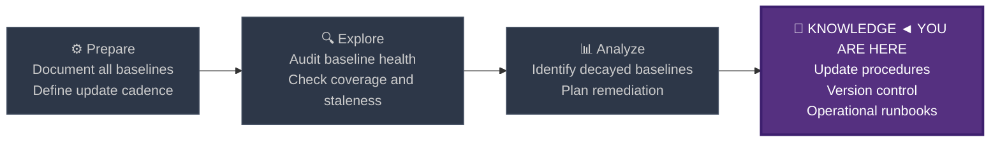
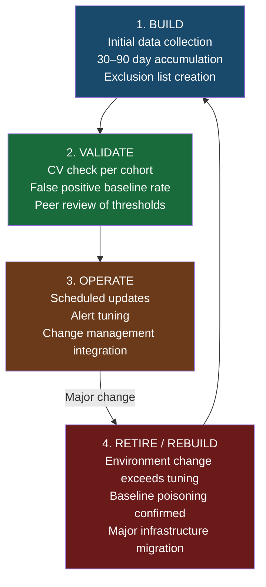
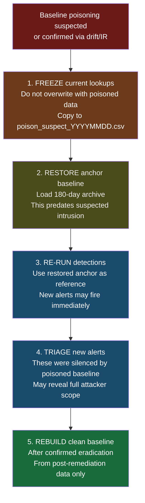

# Baseline Management

← [Back to README](../README.md)

**Navigation:** [← 14 Long-Term Drift](./14_long_term_drift.md)

---

## PEAK Phase: Knowledge (Operational)

Baseline management is a **Knowledge phase discipline** — the operational practices that keep all fourteen preceding techniques working reliably in production. Without active management, baselines decay, drift, accumulate false positives, and eventually stop being useful.



---

## The Baseline Lifecycle

Every baseline passes through four lifecycle stages. Managing this lifecycle explicitly prevents silent detection failures.



---

## Baseline Inventory

Maintain a registry of all active baselines. This is the foundation of baseline management — you cannot manage what you haven't catalogued.

### Recommended Baseline Registry Fields

| Field | Description | Example |
|---|---|---|
| `baseline_id` | Unique identifier | `NET-001` |
| `technique` | Source technique | Frequency Analysis |
| `entity_type` | What is being baselined | host, user, domain |
| `data_source` | Splunk index/sourcetype | `corelight_conn` |
| `metric` | What is measured | `sum(orig_bytes)` per day |
| `window_days` | Lookback window | 30 |
| `update_cadence` | How often refreshed | Weekly |
| `last_updated` | Date of last update | 2024-03-15 |
| `owner` | Team responsible | SOC Tier 2 |
| `false_positive_rate` | Tracked FP% | 4.2% |
| `status` | Current state | Active / Stale / Rebuilding |

### Baseline Registry Health Check

```spl
/* Audit: which baselines haven't been updated in more than 14 days? */
| inputlookup baseline_registry.csv
| eval last_updated_epoch = strptime(last_updated, "%Y-%m-%d")
| eval days_since_update = round((now() - last_updated_epoch) / 86400, 0)
| eval health = case(
    days_since_update > 30,  "STALE — Immediate attention required",
    days_since_update > 14,  "WARNING — Update overdue",
    status="Rebuilding",     "REBUILDING — Monitor progress",
    true(),                  "OK"
  )
| where health != "OK"
| table baseline_id, technique, entity_type, last_updated, days_since_update, owner, health
| sort - days_since_update
```

---

## Update Cadence by Baseline Type

Not all baselines need the same update frequency. Over-updating short-window baselines creates drift vulnerability; under-updating long-window baselines creates staleness.

| Baseline Type | Recommended Cadence | Rationale |
|---|---|---|
| **Frequency / rate baselines** (bytes, logins) | Weekly | Absorbs legitimate weekly variation without missing slow attackers |
| **Peer group assignments** | Monthly | Org changes are slow; weekly updates create noise from temporary behaviour shifts |
| **Cohort assignments** | Weekly | Behaviour evolves faster than org structure |
| **First-seen lookups** (rolling) | Weekly | Keeps rolling window current |
| **First-seen lookups** (accumulative) | Weekly append, monthly prune | Grow via append; remove entries beyond window on schedule |
| **Long-term drift anchors** | Quarterly snapshot | Anchor must not move with the attacker; set and hold for 90 days |
| **Anomaly detection thresholds** | Quarterly review | Review false positive rates; adjust pthresh/zscore cutoffs |
| **Exclusion lists** | As needed (after FP spike) | Event-driven — add exclusions after investigating FP batches |

---

## Scheduled Saved Searches — Template

Implement baseline updates as Splunk saved searches with the following standard attributes:

```
[Baseline Update — Process First-Seen (Weekly Rolling)]
search = index=sysmon EventCode=1 earliest=-90d
  | eval image_short = lower(replace(Image, ".*\\\\", ""))
  | stats min(_time) AS first_seen_epoch BY image_short
  | where first_seen_epoch > relative_time(now(), "-90d")
  | eval first_seen = strftime(first_seen_epoch, "%Y-%m-%d")
  | outputlookup process_first_seen.csv
cron_schedule = 0 3 * * 1
dispatch.earliest_time = -90d
dispatch.latest_time = now
alert.track = 0
```

### Standard Cron Schedule Reference

| Cadence | Cron Expression | Notes |
|---|---|---|
| Daily (3 AM) | `0 3 * * *` | Off-peak hours for search head |
| Weekly (Monday 3 AM) | `0 3 * * 1` | Start of week refresh |
| Monthly (1st, 3 AM) | `0 3 1 * *` | Peer group and cohort refreshes |
| Quarterly (1st of Jan/Apr/Jul/Oct) | `0 3 1 1,4,7,10 *` | Anchor snapshots, threshold review |

---

## Baseline Versioning and Archiving

### Archive Strategy

Maintain three generations of each lookup file:

```
process_first_seen.csv          ← current (this week's)
process_first_seen_prev.csv     ← previous (last week's)
process_first_seen_90d.csv      ← anchor (90 days ago)
process_first_seen_180d.csv     ← long anchor (180 days ago)
```

Implement the rotation in SPL:

```spl
/* Rotate baseline lookups — run before update */

/* Step 1: Copy prev to 90d archive (run quarterly) */
/* Use Splunk REST API or scripted input to copy lookup files */
/* Or implement via KV Store with _key versioning */

/* Step 2: Copy current to prev */
| inputlookup process_first_seen.csv
| outputlookup process_first_seen_prev.csv

/* Step 3: Rebuild current */
index=sysmon EventCode=1 earliest=-90d
| eval image_short = lower(replace(Image, ".*\\\\", ""))
| stats min(_time) AS first_seen_epoch BY image_short
| where first_seen_epoch > relative_time(now(), "-90d")
| eval first_seen = strftime(first_seen_epoch, "%Y-%m-%d")
| outputlookup process_first_seen.csv
```

### KV Store for Version-Controlled Baselines

For high-value baselines, use KV Store with an explicit `baseline_version` key:

```spl
/* Save versioned user cohort assignment to KV Store */
index=wineventlog EventCode=4624 earliest=-30d
| where NOT match(SubjectUserName, "\\$$|ANONYMOUS|SYSTEM")
| stats count AS total_logins, dc(WorkstationName) AS unique_hosts BY SubjectUserName
| eval avg_daily = round(total_logins / 30, 1)
| eval assigned_cohort = case(
    avg_daily > 100,                       "Service Account",
    avg_daily > 20 AND unique_hosts > 10,  "IT Administrator",
    avg_daily > 5,                         "Power User",
    true(),                                "Standard User"
  )
| eval baseline_version = strftime(now(), "%Y%m%d")
| eval _key = SubjectUserName . "_" . baseline_version
| table _key, SubjectUserName, assigned_cohort, avg_daily, unique_hosts, baseline_version
| outputlookup user_cohort_kv_store
```

---

## Exclusion List Management

Exclusion lists are the primary tool for managing false positives. They require active maintenance — stale or over-broad exclusions create blind spots.

### Exclusion List Audit

```spl
/* Audit: exclusions that haven't triggered a match in 30 days — candidates for removal */
index=sysmon EventCode=1 earliest=-30d
| eval image_short = lower(replace(Image, ".*\\\\", ""))
| stats count AS match_count BY image_short
| join type=right image_short [
    | inputlookup known_new_software.csv
    | rename binary_name AS image_short
  ]
| where isnull(match_count) OR match_count = 0
| table image_short, added_date, added_by, reason
| sort - added_date
```

Review zero-hit exclusions quarterly. Remove entries for software that has been decommissioned or that was a one-time deployment.

### Exclusion List Schema

Maintain structured exclusion lists with provenance:

| Field | Required | Description |
|---|---|---|
| `value` | Yes | The excluded value (binary name, IP, domain) |
| `entity_type` | Yes | process, ip, domain, user, service |
| `added_date` | Yes | ISO date when added |
| `added_by` | Yes | Analyst who added it |
| `reason` | Yes | Why excluded (change ticket, vendor software, etc.) |
| `ticket_id` | Recommended | Change management or incident reference |
| `expiry_date` | Recommended | Auto-expire date (prevents stale exclusions) |
| `scope` | Recommended | environment-wide, specific host, specific subnet |

### Auto-Expiring Exclusions

```spl
/* Filter expired exclusions at query time */
| lookup known_new_software binary_name as image_short OUTPUT added_date, expiry_date, reason
| eval expiry_epoch = if(isnull(expiry_date), 9999999999, strptime(expiry_date, "%Y-%m-%d"))
| where isnull(reason) OR now() > expiry_epoch
```

This pattern treats missing exclusion entries and expired exclusions identically — both result in the record being flagged.

---

## Baseline Poisoning Response Procedure

When baseline poisoning is suspected (attacker active during baseline collection window):



### SPL: Restore from Archive

```spl
/* Restore process first-seen baseline from 180-day archive */
/* Step 1: Verify archive exists and is clean */
| inputlookup process_first_seen_180d.csv
| stats count AS entry_count, min(first_seen) AS oldest, max(first_seen) AS newest
| eval archive_age_days = round((now() - strptime(newest, "%Y-%m-%d")) / 86400, 0)

/* Step 2: If archive is clean, restore (run as separate search) */
/* | inputlookup process_first_seen_180d.csv | outputlookup process_first_seen.csv */
```

---

## Change Management Integration

Baselines generate false positives during planned changes. Integrate with your change management system to automatically suppress expected alerts:

```spl
/* Suppress first-seen alerts during approved change windows */
index=sysmon EventCode=1 earliest=-24h
| eval image_short = lower(replace(Image, ".*\\\\", ""))

/* Standard first-seen detection */
| join type=left image_short host [
    search index=sysmon EventCode=1 earliest=-30d latest=-1d
    | eval image_short = lower(replace(Image, ".*\\\\", ""))
    | stats min(_time) AS historical_first BY image_short, host
    ]
| where isnull(historical_first)

/* Suppress if host has an active approved change window */
| lookup change_windows hostname as host OUTPUT change_type, change_window_end, ticket_id
| eval change_window_end_epoch = strptime(change_window_end, "%Y-%m-%d %H:%M")
| where isnull(change_type) OR now() > change_window_end_epoch

| table _time, host, image_short, ticket_id
```

---

## Baseline Health Dashboard Queries

Use these as inputs to a Splunk dashboard monitoring baseline operational health.

### Query 1 — Lookup File Sizes (Staleness Proxy)

```spl
/* REST API: lookup file metadata */
| rest /services/data/transforms/lookups
| search title IN ("process_first_seen","user_cohort_assignments","domain_first_seen","user_host_first_seen")
| eval size_kb = round(toCsvSize / 1024, 1)
| table title, updated, size_kb
| sort - updated
```

### Query 2 — Alert Volume Trend (Threshold Decay Check)

```spl
/* Track daily alert volume per detection — rising alerts = decaying baseline or increased attacker activity */
index=notable sourcetype=stash earliest=-30d
| bin _time span=1d AS day
| stats count AS alert_count BY search_name, day
| eventstats avg(alert_count) AS avg_daily BY search_name
| eval vs_avg_pct = round(alert_count / avg_daily * 100, 0)
| where day >= relative_time(now(), "-7d") AND vs_avg_pct > 200
| table search_name, day, alert_count, avg_daily, vs_avg_pct
| sort - vs_avg_pct
```

### Query 3 — False Positive Rate by Detection

```spl
/* FP rate: closed-as-FP vs total alerts per detection, last 30 days */
index=notable sourcetype=stash earliest=-30d
| stats count AS total_alerts,
        count(eval(status="5")) AS closed_fp
    BY search_name
| eval fp_rate_pct = round(closed_fp / total_alerts * 100, 1)
| where fp_rate_pct > 20
| sort - fp_rate_pct
| table search_name, total_alerts, closed_fp, fp_rate_pct
```

---

## Baseline Management Runbook Summary

| Task | Frequency | Owner | SPL/Tool |
|---|---|---|---|
| Rotate first-seen lookups (rolling) | Weekly | SOC Tier 2 | `outputlookup` saved search |
| Update peer group CSV from AD | Monthly | IT/SOC | PowerShell + `outputlookup` |
| Rebuild cohort assignments | Weekly | SOC Tier 2 | Cohort saved search |
| Archive drift anchor snapshots | Quarterly | SOC Lead | Lookup copy saved search |
| Audit exclusion list for zero-hits | Quarterly | SOC Lead | Exclusion audit SPL above |
| Review FP rates by detection | Monthly | SOC Lead | FP rate query above |
| Baseline registry health check | Weekly | SOC Tier 1 | Registry health SPL above |
| Validate lookup file sizes | Weekly | SOC Tier 1 | REST API query above |
| Baseline poisoning check | Post-incident | IR Team | Drift detection + archive restore |

---

## Limitations

| Limitation | Detail |
|---|---|
| **Operational overhead** | Active baseline management requires dedicated time. Understaffed SOCs often let baselines decay silently. Automate as much as possible via saved searches. |
| **Change management dependency** | Effective suppression of change-window FPs requires a queryable change management system. Orgs without this will have higher alert noise during deployments. |
| **No native Splunk versioning** | Splunk does not version-control lookup files natively. External git or object storage is required for robust baseline versioning. |
| **Archive growth** | Maintaining multiple generations of large lookups (millions of entries) can strain KV Store or file system. Define maximum archive sizes and prune proactively. |

---

## Related Techniques

- [Frequency Analysis](./01_frequency_analysis.md) — first baseline type; exemplifies update cadence requirements
- [Behavioral Profiling](./09_behavioral_profiling.md) — per-entity baselines requiring weekly refresh
- [Cohort Baselining](./12_cohort_baselining.md) — cohort assignments are the most complex baselines to maintain
- [First-Seen Tracking](./13_first_seen_tracking.md) — lookup archiving and rolling vs accumulative strategies
- [Long-Term Drift Detection](./14_long_term_drift.md) — depends on archive discipline for anchor comparisons

---

**Navigation:** [← 14 Long-Term Drift](./14_long_term_drift.md)

← [Back to README](../README.md)
