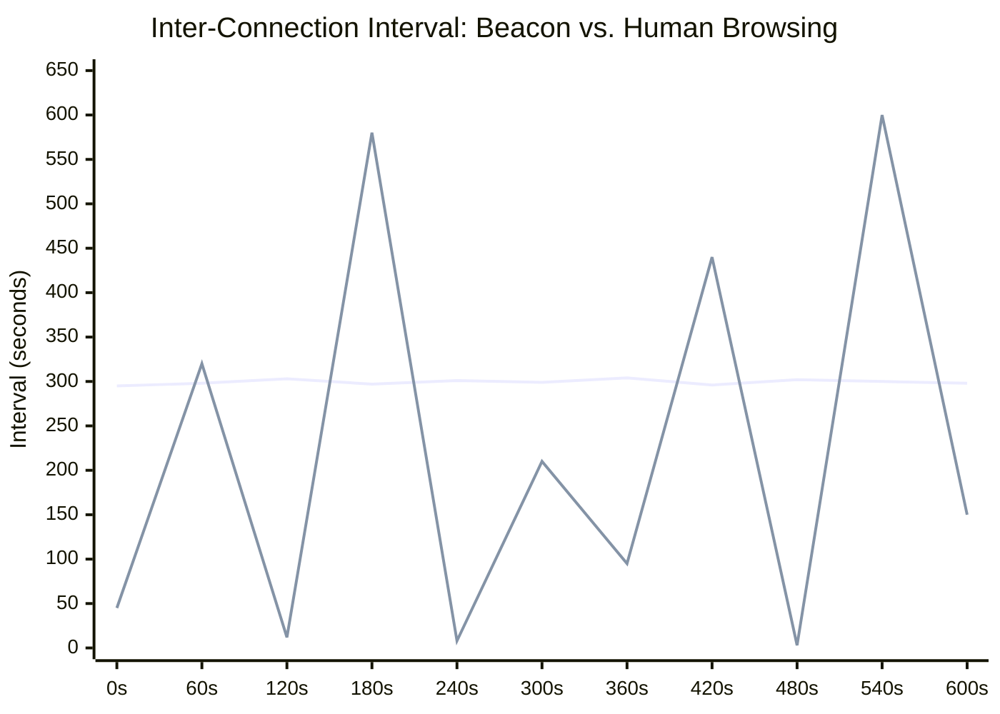
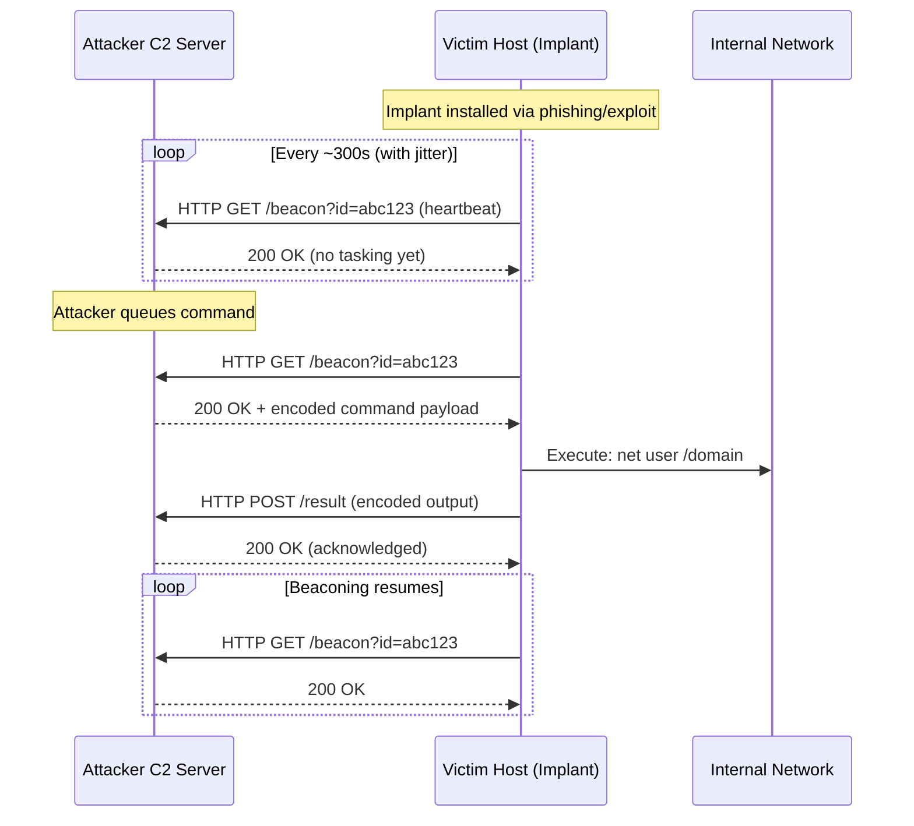
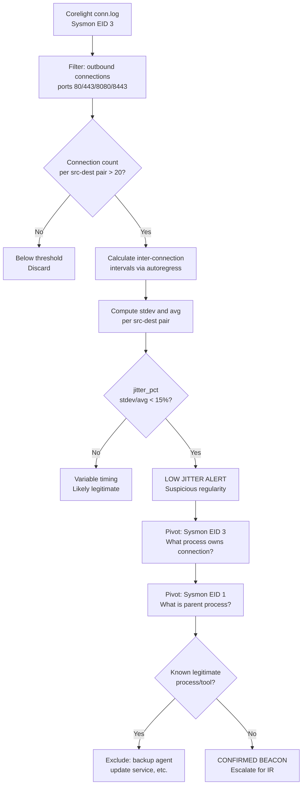
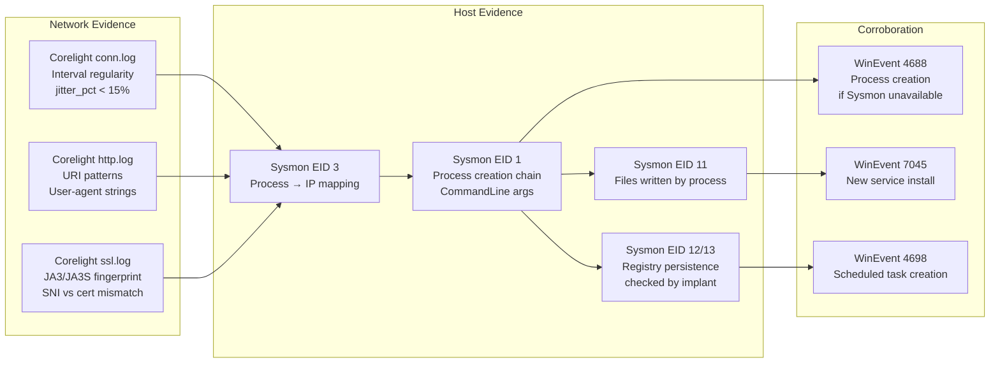
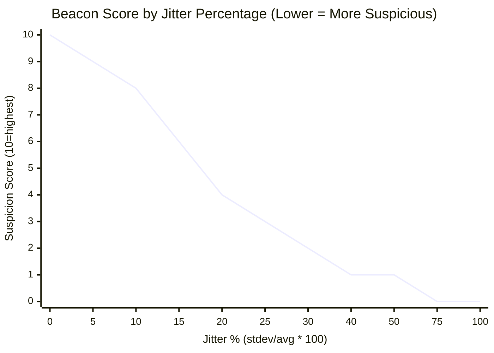
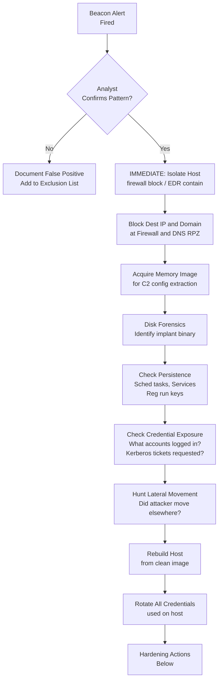
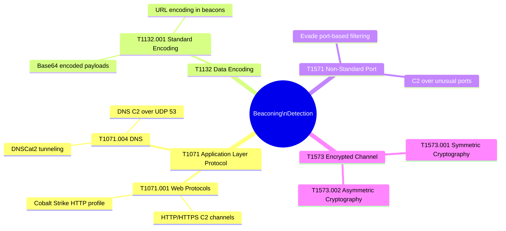

# Beaconing Detection
## C2 Callback Detection via Network Regularity Analysis

---

### Navigation

| Previous | Up | Next |
|---|---|---|
| [Baseline Hunts](../02_baseline_hunts/) | [Detection Use Cases](.) | [Data Exfiltration Detection](./02_data_exfiltration.md) |

**Related Techniques:** [Rate of Change](../02_baseline_hunts/07_rate_of_change.md) | [Percentile / IQR](../02_baseline_hunts/04_percentile_iqr.md) | [Z-Score / Stdev](../02_baseline_hunts/03_zscore_stdev.md)

---

## Overview

| Attribute | Detail |
|---|---|
| **Threat** | Command and Control (C2) Beaconing |
| **MITRE ATT&CK** | [T1071](https://attack.mitre.org/techniques/T1071/) Application Layer Protocol, [T1132](https://attack.mitre.org/techniques/T1132/) Data Encoding |
| **Sub-techniques** | T1071.001 Web Protocols, T1071.004 DNS, T1132.001 Standard Encoding |
| **Data Sources** | Corelight `conn.log`, Sysmon EID 3 (Network Connection) |
| **Statistical Methods** | Interval Regularity (stdev/avg ratio), IQR Jitter Analysis |
| **Detection Difficulty** | Medium — jitter obscures signal; stat methods cut through it |

---

## Threat Description

**What is beaconing?**
When an attacker deploys an implant (RAT, backdoor, stager) on a victim host, the implant needs to regularly contact the attacker's Command and Control (C2) server. This "heartbeat check-in" is called a **beacon**. The implant periodically reaches out to ask: *"Do you have any commands for me?"*

**Why do C2 tools beacon?**
- Firewalls block inbound connections — the implant must initiate outbound
- The implant needs to confirm it is still alive and receive new tasking
- Beaconing allows the attacker to queue commands asynchronously

**Common beacon intervals and their tools:**

| Interval | Typical Source |
|---|---|
| 60 seconds | Cobalt Strike (default sleep) |
| 300 seconds | Metasploit Meterpreter |
| 3600 seconds | APT-style slow-and-low implants |
| Variable | Custom malware with sleep randomization |

**Jitter — the evasion technique:**
Sophisticated implants add randomness (jitter) to their sleep interval to avoid detection. A 300-second beacon with 30% jitter will connect every 210–390 seconds rather than precisely every 300 seconds. The key insight: **even with jitter, the statistical variance of beacon intervals is far lower than that of human browsing behavior.** A human visiting websites has highly irregular connection timing — a beacon does not.

---

## Beacon vs. Human Traffic: The Statistical Difference



*Line 1 (near-flat ~300s) = beacon with low jitter. Line 2 (highly variable) = normal human browsing.*

**Key statistical insight:**
- **Beacon:** `stdev / avg_interval` is very small — often < 0.10 (10%)
- **Human traffic:** `stdev / avg_interval` is very large — often > 0.50 (50%) or higher
- **IQR of beacon intervals** is narrow; IQR of human traffic is wide

---

## Attack Flow



---

## Detection Logic Flow



---

## PEAK: Prepare

### Hypothesis

> **"A host is making regularly-timed outbound network connections to an external IP/domain, with interval variance below 15%, indicative of automated C2 beaconing behavior."**

### Data Sources

| Source | Log | Key Fields |
|---|---|---|
| Corelight | `conn.log` | `_time`, `id.orig_h`, `id.resp_h`, `id.resp_p`, `orig_bytes`, `resp_bytes`, `duration`, `proto` |
| Sysmon | Event ID 3 (Network Connection) | `SourceIp`, `DestinationIp`, `DestinationPort`, `Image`, `ProcessId`, `ParentImage` |
| Sysmon | Event ID 1 (Process Create) | `Image`, `ParentImage`, `CommandLine`, `User` |

### Scope and Exclusions

Before hunting, exclude known-regular traffic that will create false positives:

| Exclusion | Reason |
|---|---|
| Port 123 (NTP) | Network Time Protocol is inherently regular |
| Port 53 (DNS) | DNS resolvers poll regularly |
| Port 443 to known CDN/update IPs | Windows Update, AV updates are regular |
| Backup agent processes | Scheduled backups have fixed intervals |
| Domain controllers | DC replication has regular timing |

```spl
/* Baseline: identify high-frequency connections to build exclusion list */
index=corelight sourcetype=corelight_conn
| where id.resp_p != 53 AND id.resp_p != 123
| where NOT cidrmatch("10.0.0.0/8", id.resp_h)
| where NOT cidrmatch("172.16.0.0/12", id.resp_h)
| where NOT cidrmatch("192.168.0.0/16", id.resp_h)
| stats count AS conn_count,
        dc(id.resp_p) AS unique_ports,
        min(_time) AS first_seen,
        max(_time) AS last_seen
  BY id.orig_h, id.resp_h
| where conn_count > 10
| eval duration_hours = round((last_seen - first_seen) / 3600, 1)
| sort - conn_count
| head 50
```

---

## PEAK: Explore

### Step 1 — Connection Frequency Per Source-Destination Pair

Identify which host-to-host pairs have high connection counts. This is the population we will analyze for regularity.

```spl
/* Explore: connection frequency per src-dest pair */
index=corelight sourcetype=corelight_conn
| where id.resp_p != 53 AND id.resp_p != 123
| where NOT cidrmatch("10.0.0.0/8", id.resp_h)
| stats count AS conn_count,
        dc(id.resp_p) AS unique_ports,
        sum(orig_bytes) AS total_bytes_out,
        sum(resp_bytes) AS total_bytes_in,
        values(id.resp_p) AS ports_used
  BY id.orig_h, id.resp_h
| where conn_count > 20
| sort - conn_count
```

### Step 2 — Distribution of Connection Counts

Understand the overall distribution before flagging anomalies. This tells you where your threshold should sit.

```spl
/* Explore: distribution of connection counts */
index=corelight sourcetype=corelight_conn
| where NOT cidrmatch("10.0.0.0/8", id.resp_h)
| stats count AS conn_count BY id.orig_h, id.resp_h
| stats count AS pair_count BY conn_count
| where conn_count > 5
| sort conn_count
```

### Step 3 — Bytes Profile of Candidate Pairs

Beacons typically have small, consistent payload sizes. An upload-heavy session is more likely exfiltration.

```spl
/* Explore: bytes profile for high-frequency pairs */
index=corelight sourcetype=corelight_conn
| where NOT cidrmatch("10.0.0.0/8", id.resp_h)
| stats count AS conn_count,
        avg(orig_bytes) AS avg_bytes_out,
        stdev(orig_bytes) AS stdev_bytes_out,
        avg(resp_bytes) AS avg_bytes_in,
        avg(duration) AS avg_duration
  BY id.orig_h, id.resp_h, id.resp_p
| where conn_count > 20
| eval bytes_consistency_pct = round((stdev_bytes_out / avg_bytes_out) * 100, 1)
| sort bytes_consistency_pct
```

---

## PEAK: Analyze

### Primary Detection — Interval Regularity (jitter_pct)

The core detection uses `autoregress` to calculate the time between consecutive connections per src-dest pair, then measures how regular those intervals are.

```spl
/* BEACON DETECTION: interval regularity via autoregress */
index=corelight sourcetype=corelight_conn
| where NOT cidrmatch("10.0.0.0/8", id.resp_h)
| where id.resp_p != 53 AND id.resp_p != 123
| sort 0 id.orig_h, id.resp_h, _time
| autoregress _time AS prev_time p=1
| eval interval_sec = _time - prev_time
| where interval_sec > 0 AND interval_sec < 7200
| stats count AS conn_count,
        avg(interval_sec) AS avg_interval,
        stdev(interval_sec) AS stdev_interval,
        min(interval_sec) AS min_interval,
        max(interval_sec) AS max_interval,
        perc25(interval_sec) AS q1_interval,
        perc75(interval_sec) AS q3_interval,
        median(interval_sec) AS median_interval
  BY id.orig_h, id.resp_h, id.resp_p
| eval iqr = round(q3_interval - q1_interval, 1)
| eval jitter_pct = round((stdev_interval / avg_interval) * 100, 1)
| eval avg_interval_min = round(avg_interval / 60, 1)
| where conn_count > 20
| where jitter_pct < 15
| where avg_interval > 30
| sort jitter_pct
| table id.orig_h, id.resp_h, id.resp_p, conn_count,
        avg_interval_min, stdev_interval, iqr, jitter_pct,
        min_interval, max_interval
```

**Reading the results:**
- `jitter_pct < 15` — less than 15% coefficient of variation means highly regular
- `avg_interval_min` — tells you the approximate beacon period in minutes
- `iqr` — the spread of the middle 50% of intervals; narrow IQR confirms regularity
- Adjust the `jitter_pct` threshold based on your environment — start at 20 and tune down

### Enhanced Detection — Combined Bytes + Interval Signal

Real beacons also have consistent payload sizes. Combining both signals reduces false positives.

```spl
/* BEACON DETECTION: interval + bytes consistency combined */
index=corelight sourcetype=corelight_conn
| where NOT cidrmatch("10.0.0.0/8", id.resp_h)
| where id.resp_p != 53 AND id.resp_p != 123
| sort 0 id.orig_h, id.resp_h, _time
| autoregress _time AS prev_time p=1
| eval interval_sec = _time - prev_time
| where interval_sec > 0 AND interval_sec < 7200
| stats count AS conn_count,
        avg(interval_sec) AS avg_interval,
        stdev(interval_sec) AS stdev_interval,
        avg(orig_bytes) AS avg_bytes_out,
        stdev(orig_bytes) AS stdev_bytes_out,
        sum(orig_bytes) AS total_bytes_out,
        perc25(interval_sec) AS q1_interval,
        perc75(interval_sec) AS q3_interval
  BY id.orig_h, id.resp_h, id.resp_p
| eval jitter_pct = round((stdev_interval / avg_interval) * 100, 1)
| eval bytes_cv = round((stdev_bytes_out / avg_bytes_out) * 100, 1)
| eval iqr = round(q3_interval - q1_interval, 1)
| eval beacon_score = case(
    jitter_pct < 5 AND bytes_cv < 5, 10,
    jitter_pct < 10 AND bytes_cv < 10, 8,
    jitter_pct < 15 AND bytes_cv < 15, 6,
    jitter_pct < 20, 4,
    true(), 1
  )
| where conn_count > 20 AND beacon_score >= 6
| sort - beacon_score
| table id.orig_h, id.resp_h, id.resp_p, conn_count,
        jitter_pct, bytes_cv, beacon_score, avg_interval, iqr, total_bytes_out
```

### Corroboration — Sysmon EID 3 Process Pivot

Once a suspicious pair is identified, use Sysmon to identify the process making the connection.

```spl
/* PIVOT: Sysmon EID 3 - which process owns the beaconing connection? */
index=sysmon EventCode=3
| where DestinationIp="<SUSPECT_DEST_IP>"
| where SourceIp="<SUSPECT_SRC_IP>"
| stats count AS conn_count,
        values(Image) AS processes,
        values(DestinationPort) AS ports,
        dc(DestinationPort) AS unique_ports,
        min(_time) AS first_seen,
        max(_time) AS last_seen
  BY SourceIp, DestinationIp
| eval duration_hours = round((last_seen - first_seen) / 3600, 1)
| table SourceIp, DestinationIp, conn_count, processes, ports, duration_hours
```

### Corroboration — Parent Process Chain (Sysmon EID 1)

Identify the process that spawned the beaconing process — a legitimate browser beaconing is different from `svchost` spawned by `powershell`.

```spl
/* PIVOT: Sysmon EID 1 - process creation chain for beaconing process */
index=sysmon EventCode=1 host="<SUSPECT_HOST>"
| where Image IN ("<SUSPECT_PROCESS>")
    OR ParentImage IN ("<SUSPECT_PROCESS>")
| eval process_chain = ParentImage + " -> " + Image
| stats count,
        values(CommandLine) AS commands,
        values(User) AS users,
        values(process_chain) AS chains
  BY host, Image, ParentImage
| sort _time
```

### Timeline — Full Activity from Suspect Host

Build a complete timeline after identifying a beacon.

```spl
/* TIMELINE: all activity from beaconing host */
index=corelight OR index=sysmon host="<SUSPECT_HOST>" OR id.orig_h="<SUSPECT_IP>"
| eval event_type = case(
    sourcetype="corelight_conn", "Network Connection",
    EventCode=1, "Process Create",
    EventCode=3, "Net Connection (Sysmon)",
    EventCode=11, "File Create",
    EventCode=13, "Registry Set",
    true(), "Other"
  )
| eval detail = case(
    sourcetype="corelight_conn", id.resp_h + ":" + id.resp_p,
    EventCode=1, Image + " | " + CommandLine,
    EventCode=3, DestinationIp + ":" + DestinationPort,
    EventCode=11, TargetFilename,
    EventCode=13, TargetObject,
    true(), _raw
  )
| table _time, event_type, detail, host
| sort _time
```

---

## PEAK: Knowledge

### Evidence Collection Chain



### Evidence Chain — Step by Step

| Step | Action | Data Source | What to Look For |
|---|---|---|---|
| 1 | Confirm beacon pattern | Corelight `conn.log` | `jitter_pct < 15`, consistent `avg_interval`, `conn_count > 20` |
| 2 | Identify process making connection | Sysmon EID 3 | `Image` field — is it `explorer.exe`? `svchost.exe`? `powershell.exe`? |
| 3 | Trace parent process | Sysmon EID 1 | `ParentImage` — `powershell` spawned by `winword.exe` is a red flag |
| 4 | Check HTTP/TLS fingerprint | Corelight `http.log`, `ssl.log` | Suspicious URI patterns, rare JA3 hash, SNI mismatch with cert CN |
| 5 | Hunt for persistence | Sysmon EID 12/13, WinEvent 4698/7045 | Did the implant create a scheduled task or registry run key? |
| 6 | Full host timeline | All sources on suspect host | Build complete attacker activity timeline from implant deployment forward |

### Visualization — Interval Timechart

Use this search to visually confirm beacon regularity in Splunk:

```spl
/* VISUALIZATION: timechart of inter-connection intervals */
index=corelight sourcetype=corelight_conn
| where id.orig_h="<SUSPECT_IP>" AND id.resp_h="<DEST_IP>"
| sort _time
| autoregress _time AS prev_time p=1
| eval interval_sec = _time - prev_time
| where interval_sec > 0
| timechart span=1h avg(interval_sec) AS avg_interval_sec,
            stdev(interval_sec) AS stdev_interval_sec
```

### Beacon Interval Reference Chart



---

## Response Playbook



### Immediate Actions (0–1 hour)

| Action | Method |
|---|---|
| Isolate the host | EDR containment OR firewall ACL block all traffic |
| Block destination IP at perimeter firewall | Emergency firewall rule |
| Block destination domain at DNS/proxy | DNS RPZ or proxy URL block |
| Preserve memory | Memory acquisition before isolation if possible |
| Notify incident response team | Escalate per IR playbook |

### Short-Term Actions (1–24 hours)

| Action | Method |
|---|---|
| Memory analysis | Extract C2 config, in-memory implant artifacts |
| Disk forensics | Identify implant binary, install method, persistence mechanism |
| Persistence check | Sysmon EID 11/12–14, WinEvent 4698 (sched task), WinEvent 7045 (service) |
| Credential assessment | Identify all accounts that authenticated to this host |
| Scope assessment | Are other hosts beaconing to the same IP/domain? |

### Remediation

| Action | Rationale |
|---|---|
| Rebuild affected host from clean image | Implant may have multiple persistence mechanisms |
| Rotate all credentials used on host | Attacker may have harvested credentials |
| Revoke Kerberos tickets (klist purge) | Prevent ticket reuse if Kerberos was compromised |
| Review and tighten proxy allow-lists | Prevent similar C2 channels |

### Hardening Actions

| Control | Implementation |
|---|---|
| SSL inspection proxy | Decrypt and inspect HTTPS to detect C2 inside TLS |
| DNS Response Policy Zone (RPZ) | Block malicious domains at DNS resolution |
| Egress filtering | Block outbound on non-standard ports; restrict to proxy |
| JA3/JA3S fingerprinting | Alert on rare TLS fingerprints in Corelight ssl.log |
| User-agent allowlisting | Block non-browser user-agents at proxy |

---

## MITRE ATT&CK Mapping



| Technique | ID | Relevance to This Hunt |
|---|---|---|
| Application Layer Protocol | T1071 | Beacon traffic rides HTTP/HTTPS/DNS |
| Web Protocols | T1071.001 | Most common — HTTP GET beacon |
| DNS | T1071.004 | DNS beaconing / DNS C2 |
| Data Encoding | T1132 | Payload encoding in beacon body |
| Standard Encoding | T1132.001 | Base64 in beacon parameters |
| Non-Standard Port | T1571 | C2 on unusual port to evade firewall |
| Encrypted Channel | T1573 | TLS-wrapped C2 to evade inspection |

---

## Related Hunts and Use Cases

| Document | Relevance |
|---|---|
| [Rate of Change](../02_baseline_hunts/07_rate_of_change.md) | Detecting velocity spikes in connection frequency |
| [Percentile / IQR](../02_baseline_hunts/04_percentile_iqr.md) | IQR jitter measurement methodology |
| [Z-Score / Stdev](../02_baseline_hunts/03_zscore_stdev.md) | Stdev-based anomaly detection for intervals |
| [Data Exfiltration](./02_data_exfiltration.md) | Beacon often precedes or accompanies exfiltration |
| [DNS Tunneling / DGA](./04_dns_tunneling_dga.md) | DNS-based beaconing variants |

---

*Navigation: [Home](../README.md) | [PEAK Framework](../00_peak_framework_overview.md) | [Splunk Functions](../01_splunk_search_head_functions.md) | [Next: Data Exfiltration](./02_data_exfiltration.md)*
