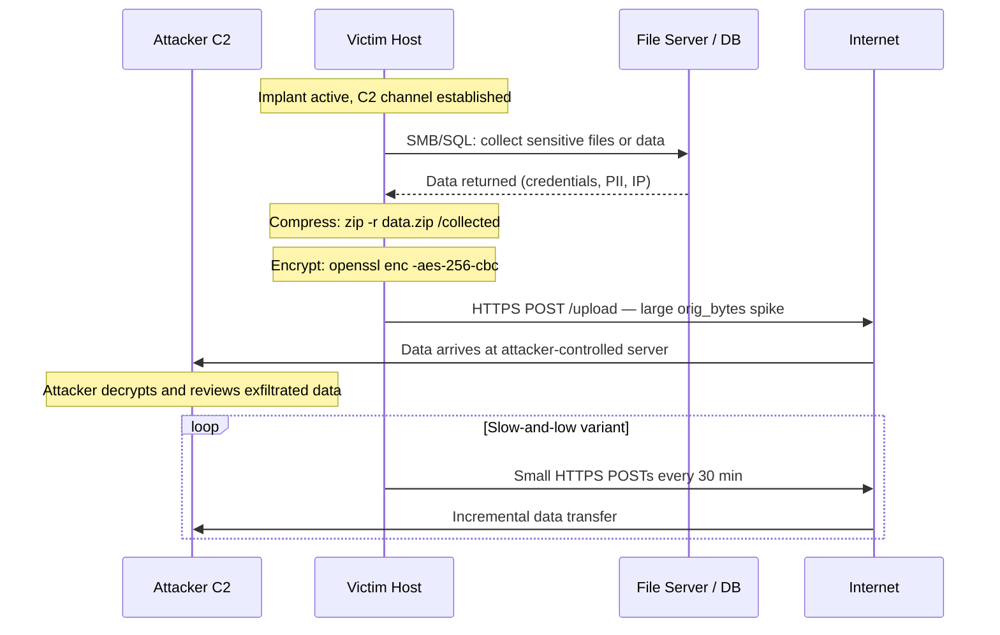
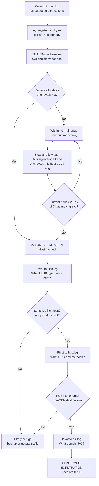
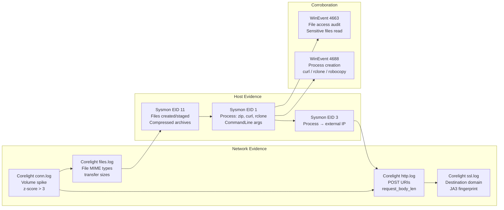
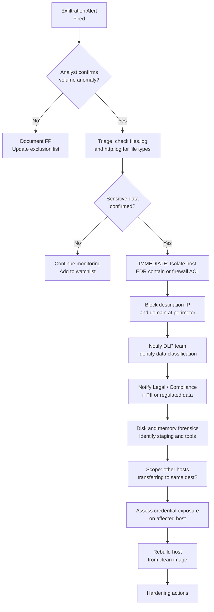
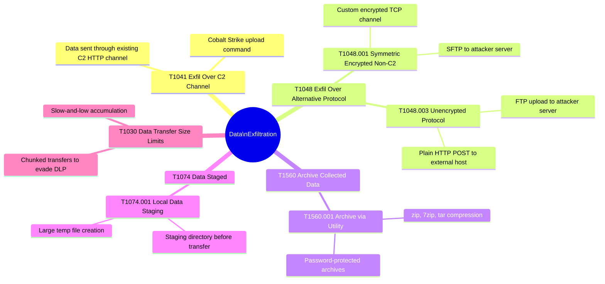

# Data Exfiltration Detection
## Outbound Volume Anomaly Detection via Statistical Baselining

---

### Navigation

| Previous | Up | Next |
|---|---|---|
| [Beaconing Detection](./01_beaconing.md) | [Detection Use Cases](.) | [Credential Attacks](./03_credential_attacks.md) |

**Related Techniques:** [Z-Score / Stdev](../02_baseline_hunts/03_zscore_stdev.md) | [Percentile / IQR](../02_baseline_hunts/04_percentile_iqr.md) | [Moving Averages](../02_baseline_hunts/06_moving_averages.md) | [Time-Series Forecast](../02_baseline_hunts/08_timeseries_forecasting.md)

---

## Overview

| Attribute | Detail |
|---|---|
| **Threat** | Data Exfiltration |
| **MITRE ATT&CK** | [T1041](https://attack.mitre.org/techniques/T1041/) Exfiltration Over C2 Channel, [T1048](https://attack.mitre.org/techniques/T1048/) Exfiltration Over Alternative Protocol |
| **Sub-techniques** | T1048.001 Exfil Over Symmetric Encrypted Non-C2, T1048.003 Exfil Over Unencrypted Protocol |
| **Data Sources** | Corelight `conn.log`, Corelight `files.log`, Corelight `http.log` |
| **Statistical Methods** | Z-Score on `orig_bytes`, Percentile on transfer size, Moving Average trend, Time-Series Forecast |
| **Detection Difficulty** | Hard — exfiltration often mimics legitimate large transfers (backups, cloud sync, updates) |

---

## Threat Description

**What is data exfiltration?**
After achieving access, attackers collect and transfer sensitive data — credentials, intellectual property, customer records, financial data — out of the victim environment. The exfiltration phase is the ultimate goal of many intrusions and represents the highest-impact event in the kill chain.

**Why is it hard to detect?**
The fundamental challenge is that large legitimate transfers exist in every environment: backup jobs, cloud synchronization, OS updates, CI/CD artifact uploads, and log shipping all generate substantial outbound traffic. Exfiltration must be distinguished from this baseline noise using the host's own historical behavior, not a static threshold.

**Exfiltration techniques and their signatures:**

| Technique | Description | Key Signal |
|---|---|---|
| Bulk transfer | Compress/encrypt and send large archive fast | Single large `orig_bytes` spike, z-score >> 3 |
| Slow-and-low | Small amounts over long periods to stay under radar | Moving average trend; accumulated volume |
| Protocol abuse (DNS) | Encode data in DNS query subdomains | High entropy queries, TXT/NULL query types |
| Protocol abuse (HTTPS) | POST data to C2 inside TLS | High `request_body_len` to unusual domains |
| Cloud staging | Upload to attacker-controlled cloud bucket | Large transfer to cloud provider, unusual path |

**Key statistical insight:**
Exfiltration causes `orig_bytes` to spike above the entity's own historical baseline — a z-score greater than 3 relative to the host's 30-day behavior — OR it creates a persistent upward trend in outbound bytes detectable via moving average or time-series forecasting.

---

## Attack Flow



---

## Detection Logic Flow



---

## PEAK: Prepare

### Hypothesis

> **"A host is transferring an anomalous volume of data outbound, exceeding its historical baseline by more than 3 standard deviations, or exceeding the 99th percentile for its peer group, or showing a persistent upward trend in outbound bytes indicating slow-and-low exfiltration."**

### Data Sources

| Source | Log | Key Fields |
|---|---|---|
| Corelight | `conn.log` | `_time`, `id.orig_h`, `id.resp_h`, `id.resp_p`, `orig_bytes`, `resp_bytes`, `proto`, `service` |
| Corelight | `files.log` | `filename`, `mime_type`, `total_bytes`, `tx_hosts`, `rx_hosts`, `source` |
| Corelight | `http.log` | `id.orig_h`, `id.resp_h`, `uri`, `method`, `request_body_len`, `response_body_len`, `user_agent` |

### Scope and Exclusions

Before hunting, build an exclusion list to suppress known-legitimate large transfers:

| Exclusion | Reason |
|---|---|
| Backup server IPs (e.g., Veeam, Commvault) | Nightly backup jobs generate legitimate large transfers |
| Known cloud sync destinations (OneDrive, Dropbox, S3) | Corporate cloud sync produces continuous outbound traffic |
| CDN and OS update ranges | Windows Update, patch management create bursts |
| CI/CD build servers | Artifact uploads to artifact repositories are expected |
| Log aggregation servers | SIEM forwarders and log shippers are normal |

```spl
/* Baseline: build per-host outbound bytes profile for exclusion and baselining */
index=corelight sourcetype=corelight_conn
| where NOT cidrmatch("10.0.0.0/8", id.resp_h)
| where NOT cidrmatch("172.16.0.0/12", id.resp_h)
| where NOT cidrmatch("192.168.0.0/16", id.resp_h)
| where id.resp_p != 123 AND id.resp_p != 53
| bin _time span=1d AS day
| stats sum(orig_bytes) AS daily_bytes_out BY id.orig_h, day
| stats avg(daily_bytes_out) AS avg_daily_bytes,
        stdev(daily_bytes_out) AS stdev_daily_bytes,
        perc50(daily_bytes_out) AS p50,
        perc90(daily_bytes_out) AS p90,
        perc99(daily_bytes_out) AS p99
  BY id.orig_h
| sort - avg_daily_bytes
| head 100
```

---

## PEAK: Explore

### Step 1 — Top Outbound Talkers

Identify which hosts are sending the most data outbound over the hunt window. This gives a raw picture before any statistical baselining.

```spl
/* Explore: top outbound talkers by total bytes */
index=corelight sourcetype=corelight_conn
| where NOT cidrmatch("10.0.0.0/8", id.resp_h)
| where NOT cidrmatch("172.16.0.0/12", id.resp_h)
| where NOT cidrmatch("192.168.0.0/16", id.resp_h)
| stats sum(orig_bytes) AS total_bytes_out,
        sum(resp_bytes) AS total_bytes_in,
        dc(id.resp_h) AS unique_destinations,
        dc(id.resp_p) AS unique_ports,
        count AS conn_count
  BY id.orig_h
| eval total_bytes_out_MB = round(total_bytes_out / 1048576, 2)
| eval ratio_out_to_in = round(total_bytes_out / (total_bytes_in + 1), 2)
| sort - total_bytes_out
| head 50
| table id.orig_h, total_bytes_out_MB, ratio_out_to_in, unique_destinations, unique_ports, conn_count
```

### Step 2 — Transfer Size Distribution (Percentile Baseline)

Understand the full distribution of per-connection transfer sizes across the environment. This establishes what p50, p90, and p99 look like — essential before setting thresholds.

```spl
/* Explore: percentile distribution of outbound transfer sizes */
index=corelight sourcetype=corelight_conn
| where NOT cidrmatch("10.0.0.0/8", id.resp_h)
| where orig_bytes > 0
| stats count AS conn_count,
        perc50(orig_bytes) AS p50_bytes,
        perc90(orig_bytes) AS p90_bytes,
        perc95(orig_bytes) AS p95_bytes,
        perc99(orig_bytes) AS p99_bytes,
        max(orig_bytes) AS max_bytes
  BY id.resp_p
| eval p99_MB = round(p99_bytes / 1048576, 2)
| eval max_MB = round(max_bytes / 1048576, 2)
| sort - p99_bytes
| head 20
```

### Step 3 — Outbound Bytes Over Time (Trend Visualization)

Profile how each major sender's volume has changed over the hunt window. A gradual climb suggests slow-and-low exfiltration.

```spl
/* Explore: outbound bytes timechart per source host */
index=corelight sourcetype=corelight_conn
| where NOT cidrmatch("10.0.0.0/8", id.resp_h)
| timechart span=1h sum(orig_bytes) AS bytes_out BY id.orig_h useother=false limit=10
```

---

## PEAK: Analyze

### Primary Detection — Z-Score on Daily Outbound Bytes

Flag hosts where today's outbound byte volume exceeds their own 30-day baseline by more than 3 standard deviations.

```spl
/* EXFIL DETECTION: z-score on daily outbound bytes per host */
index=corelight sourcetype=corelight_conn earliest=-30d
| where NOT cidrmatch("10.0.0.0/8", id.resp_h)
| where NOT cidrmatch("172.16.0.0/12", id.resp_h)
| where NOT cidrmatch("192.168.0.0/16", id.resp_h)
| where id.resp_p != 53 AND id.resp_p != 123
| bin _time span=1d AS day
| stats sum(orig_bytes) AS daily_bytes BY id.orig_h, day
| eventstats avg(daily_bytes) AS avg_bytes,
             stdev(daily_bytes) AS stdev_bytes
  BY id.orig_h
| eval zscore = round((daily_bytes - avg_bytes) / (stdev_bytes + 1), 2)
| where zscore > 3
| where day >= relative_time(now(), "-1d@d")
| eval daily_bytes_MB = round(daily_bytes / 1048576, 2)
| eval avg_bytes_MB = round(avg_bytes / 1048576, 2)
| sort - zscore
| table id.orig_h, day, daily_bytes_MB, avg_bytes_MB, stdev_bytes, zscore
```

**Reading the results:**
- `zscore > 3` means today's volume is more than 3 standard deviations above normal for that host
- `avg_bytes_MB` provides context — a host that normally sends 10 MB suddenly sending 200 MB is more suspicious than one that normally sends 500 MB
- Tune the zscore threshold based on environment noise; start at 4 and decrease if needed

### Enhanced Detection — Percentile Threshold

Flag any single transfer session where `orig_bytes` exceeds the environment-wide 99th percentile for that port.

```spl
/* EXFIL DETECTION: transfers exceeding p99 for the environment */
index=corelight sourcetype=corelight_conn earliest=-30d
| where NOT cidrmatch("10.0.0.0/8", id.resp_h)
| where orig_bytes > 0
| eventstats perc99(orig_bytes) AS p99_bytes BY id.resp_p
| where orig_bytes > p99_bytes
| where _time >= relative_time(now(), "-24h")
| eval orig_bytes_MB = round(orig_bytes / 1048576, 2)
| eval p99_MB = round(p99_bytes / 1048576, 2)
| eval excess_factor = round(orig_bytes / p99_bytes, 1)
| sort - orig_bytes
| table _time, id.orig_h, id.resp_h, id.resp_p, orig_bytes_MB, p99_MB, excess_factor
```

### Moving Average — Slow-and-Low Accumulation Detection

Detect gradual exfiltration where no single transfer triggers a threshold but accumulated volume trends upward. Compare the current hour's outbound bytes to the 7-day rolling average.

```spl
/* EXFIL DETECTION: slow-and-low via moving average trend */
index=corelight sourcetype=corelight_conn earliest=-8d
| where NOT cidrmatch("10.0.0.0/8", id.resp_h)
| bin _time span=1h AS hour
| stats sum(orig_bytes) AS hourly_bytes BY id.orig_h, hour
| sort id.orig_h, hour
| streamstats avg(hourly_bytes) AS rolling_avg_7d window=168 by id.orig_h
| streamstats stdev(hourly_bytes) AS rolling_stdev_7d window=168 by id.orig_h
| where hour >= relative_time(now(), "-2h@h")
| eval trend_ratio = round(hourly_bytes / (rolling_avg_7d + 1), 2)
| eval hourly_MB = round(hourly_bytes / 1048576, 2)
| eval avg_MB = round(rolling_avg_7d / 1048576, 2)
| where trend_ratio > 2
| sort - trend_ratio
| table id.orig_h, hour, hourly_MB, avg_MB, trend_ratio
```

### Protocol Abuse — Large Transfers on Non-Standard Ports

Flag large outbound transfers on ports that should not carry bulk data. Exfiltration via custom protocols, raw TCP, or alternative ports appears here.

```spl
/* EXFIL DETECTION: large orig_bytes on unusual/non-web ports */
index=corelight sourcetype=corelight_conn
| where NOT cidrmatch("10.0.0.0/8", id.resp_h)
| where orig_bytes > 1000000
| where NOT id.resp_p IN (80, 443, 8080, 8443, 21, 22, 25, 587, 993, 995)
| eval orig_bytes_MB = round(orig_bytes / 1048576, 2)
| stats sum(orig_bytes_MB) AS total_MB,
        count AS conn_count,
        values(id.resp_h) AS destinations
  BY id.orig_h, id.resp_p
| sort - total_MB
| table id.orig_h, id.resp_p, total_MB, conn_count, destinations
```

### Corroboration — files.log File Type Pivot

After identifying a suspicious source host, pivot to `files.log` to determine what types of files were seen in transfers.

```spl
/* PIVOT: files.log - what file types was the suspect host sending? */
index=corelight sourcetype=corelight_files
| where tx_hosts="<SUSPECT_IP>" OR rx_hosts="<SUSPECT_IP>"
| stats count AS file_count,
        sum(total_bytes) AS total_bytes,
        values(filename) AS filenames
  BY mime_type
| eval total_MB = round(total_bytes / 1048576, 2)
| sort - total_bytes
| table mime_type, file_count, total_MB, filenames
```

### Corroboration — http.log URI Pattern Pivot

Examine HTTP requests from the flagged host for suspicious POST patterns, unusual URIs, or non-browser user agents.

```spl
/* PIVOT: http.log - URI and method analysis for suspect host */
index=corelight sourcetype=corelight_http
| where id.orig_h="<SUSPECT_IP>"
| where method="POST" OR request_body_len > 100000
| eval request_MB = round(request_body_len / 1048576, 3)
| stats count,
        sum(request_body_len) AS total_upload_bytes,
        values(uri) AS uris,
        values(user_agent) AS agents
  BY id.resp_h
| eval total_upload_MB = round(total_upload_bytes / 1048576, 2)
| sort - total_upload_bytes
```

---

## PEAK: Knowledge

### Evidence Collection Chain



### Evidence Chain — Step by Step

| Step | Action | Data Source | What to Look For |
|---|---|---|---|
| 1 | Confirm volume anomaly | Corelight `conn.log` | Z-score > 3, percentile > p99, or moving average trend > 200% |
| 2 | Identify file types transferred | Corelight `files.log` | `mime_type` — zip, pdf, docx, sql, csv are high-value targets |
| 3 | Examine HTTP upload activity | Corelight `http.log` | POST method, large `request_body_len`, suspicious URIs |
| 4 | Identify destination | Corelight `ssl.log` | What domain is data going to? Is it known legitimate? |
| 5 | Find staging activity on host | Sysmon EID 11 | Was a large zip or encrypted archive created before transfer? |
| 6 | Identify responsible process | Sysmon EID 1, 3 | `rclone`, `robocopy`, `curl`, `powershell`, custom binary |
| 7 | Check file access audit | WinEvent 4663 | Were sensitive files accessed in bulk before the transfer? |

### Visualization — Bytes Out Anomaly Chart

```spl
/* VISUALIZATION: per-host bytes out trend with moving average overlay */
index=corelight sourcetype=corelight_conn earliest=-14d
| where id.orig_h="<SUSPECT_IP>"
| where NOT cidrmatch("10.0.0.0/8", id.resp_h)
| timechart span=1h sum(orig_bytes) AS hourly_bytes_out
```

---

## Response Playbook



### Immediate Actions (0–1 hour)

| Action | Method |
|---|---|
| Isolate the affected host | EDR containment OR emergency firewall ACL |
| Block destination IP and domain at perimeter | Emergency firewall rule and DNS RPZ |
| Preserve memory before isolation if possible | Memory acquisition for forensic analysis |
| Notify DLP and compliance teams | Assess regulatory notification requirements |
| Identify what data was likely exfiltrated | Cross-reference files.log mime_type with data classification |

### Short-Term Actions (1–24 hours)

| Action | Method |
|---|---|
| Disk forensics | Identify staging directory, archive files, exfiltration tool binary |
| Determine collection scope | Were credentials, PII, or IP exfiltrated? How much? |
| Hunt for additional hosts | Are other hosts transferring to same destination? |
| Identify attacker persistence | C2 implant still present? Scheduled task? Service? |
| Assess initial access vector | How did attacker get in? Patch or block that vector |

### Remediation

| Action | Rationale |
|---|---|
| Rebuild affected host from clean image | Exfiltration tool and implant may persist in multiple locations |
| Rotate all credentials stored on or used from host | Attacker may have harvested credentials before exfil |
| Review and tighten DLP controls | Inspect outbound HTTPS for sensitive content patterns |
| Notify affected parties if regulated data was exposed | Legal and regulatory obligation |

### Hardening Actions

| Control | Implementation |
|---|---|
| SSL/TLS inspection proxy | Decrypt and inspect HTTPS to detect data in POST bodies |
| DLP on egress traffic | Content inspection for PII, credit cards, credentials |
| Egress filtering | Block bulk transfer tools (rclone, robocopy) at proxy level |
| Cloud access security broker (CASB) | Detect uploads to unauthorized cloud storage |
| User and entity behavioral analytics (UEBA) | Baseline per-host volume and alert on deviations |

---

## MITRE ATT&CK Mapping



| Technique | ID | Relevance to This Hunt |
|---|---|---|
| Exfiltration Over C2 Channel | T1041 | Data transfer via existing beacon channel |
| Exfiltration Over Alternative Protocol | T1048 | Custom protocol, FTP, or raw TCP exfiltration |
| Archive Collected Data | T1560 | Zip or encrypt before sending — seen in files.log |
| Local Data Staging | T1074.001 | Staging directory creation — Sysmon EID 11 |
| Data Transfer Size Limits | T1030 | Chunked slow-and-low — requires moving average detection |

---

## Related Hunts and Use Cases

| Document | Relevance |
|---|---|
| [Z-Score / Stdev](../02_baseline_hunts/03_zscore_stdev.md) | Core method for per-host volume anomaly detection |
| [Percentile / IQR](../02_baseline_hunts/04_percentile_iqr.md) | Environment-wide p99 threshold for transfer size |
| [Moving Averages](../02_baseline_hunts/06_moving_averages.md) | Slow-and-low detection via rolling average trend |
| [Time-Series Forecast](../02_baseline_hunts/08_timeseries_forecasting.md) | Forecast expected outbound volume; flag deviations |
| [Beaconing Detection](./01_beaconing.md) | Beacon often precedes exfiltration; correlate both |
| [DNS Tunneling / DGA](./04_dns_tunneling_dga.md) | DNS-based exfiltration as an alternative channel |

---

*Navigation: [Home](../README.md) | [PEAK Framework](../00_peak_framework_overview.md) | [Previous: Beaconing](./01_beaconing.md) | [Next: Credential Attacks](./03_credential_attacks.md)*
