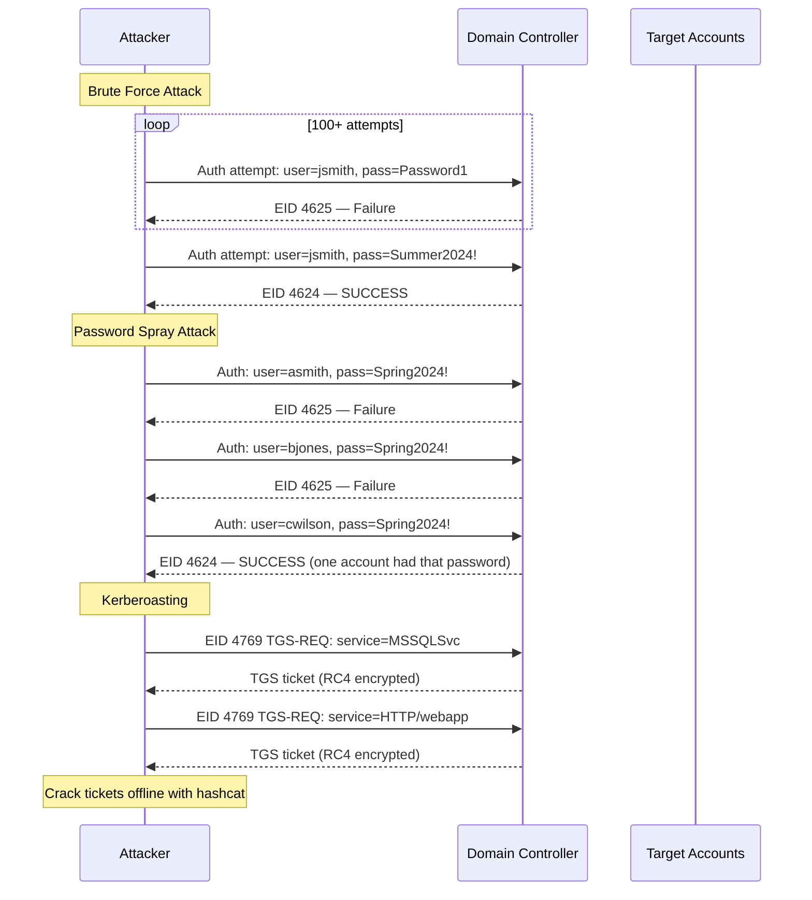
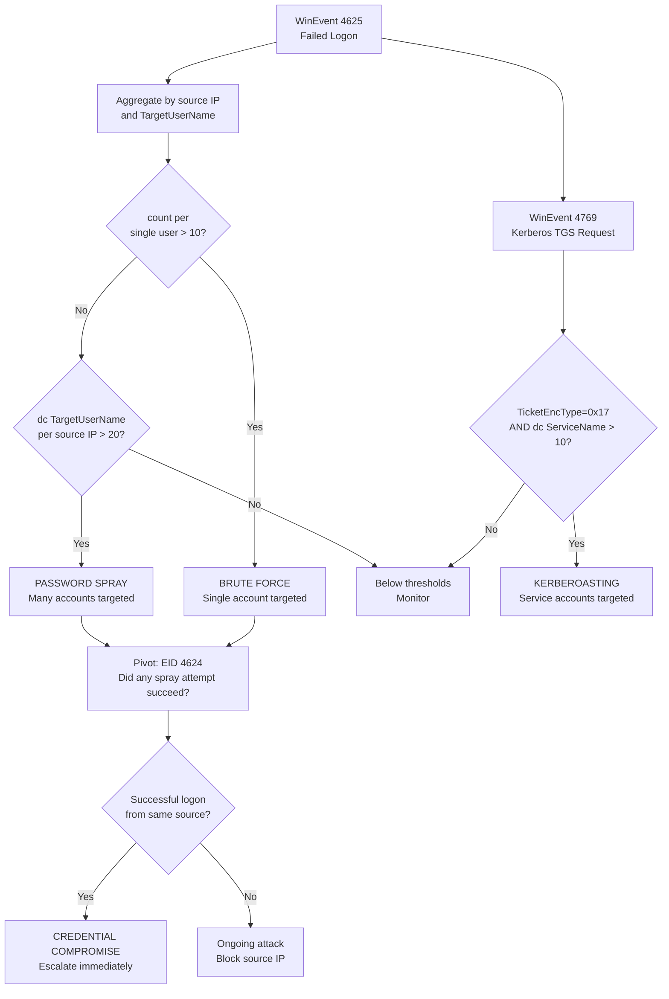
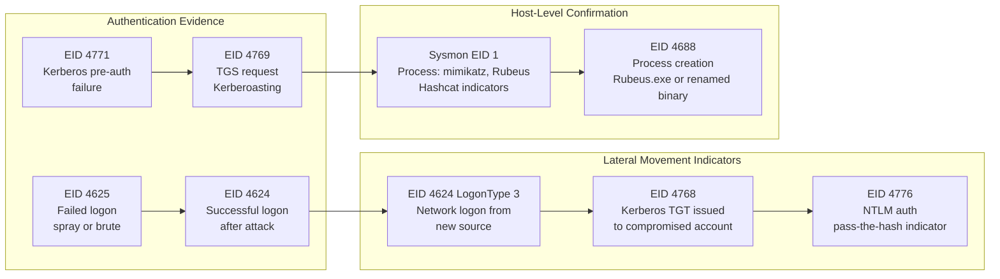
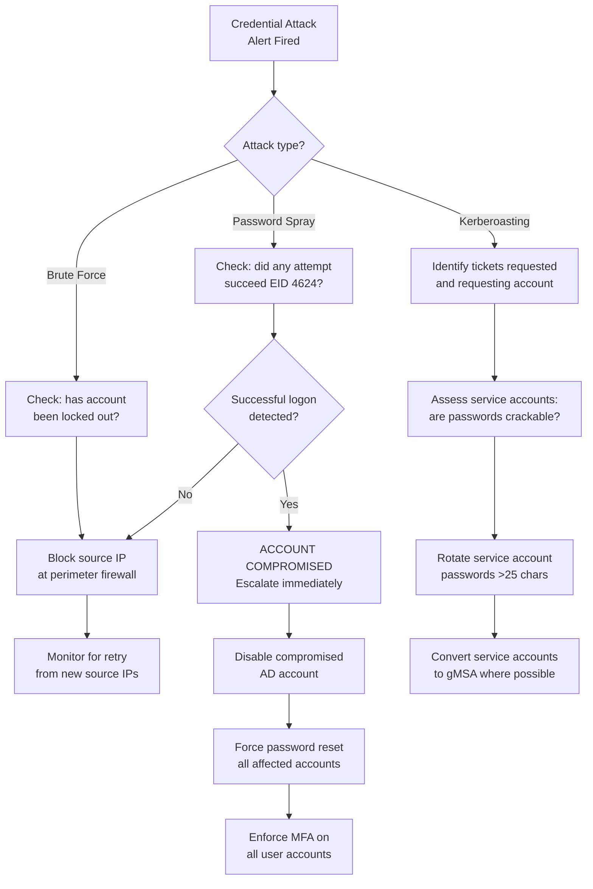
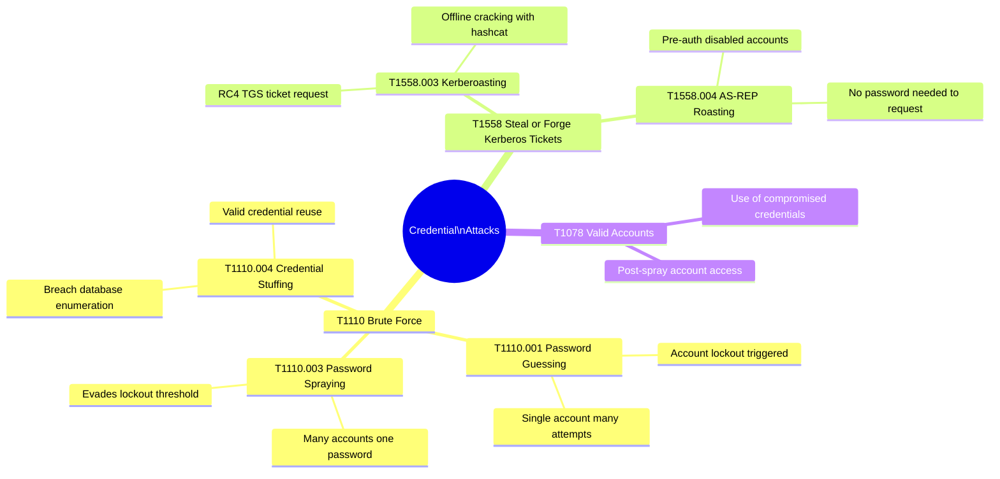

# Credential Attack Detection
## Brute Force, Password Spray, Credential Stuffing, and Kerberoasting

---

### Navigation

| Previous | Up | Next |
|---|---|---|
| [Data Exfiltration](./02_data_exfiltration.md) | [Detection Use Cases](.) | [DNS Tunneling / DGA](./04_dns_tunneling_dga.md) |

**Related Techniques:** [Frequency Analysis](../02_baseline_hunts/01_frequency_analysis.md) | [Cardinality Analysis](../02_baseline_hunts/02_cardinality_analysis.md) | [Z-Score / Stdev](../02_baseline_hunts/03_zscore_stdev.md) | [Time-Series Forecast](../02_baseline_hunts/08_timeseries_forecasting.md)

---

## Overview

| Attribute | Detail |
|---|---|
| **Threat** | Credential Attacks (Brute Force, Password Spray, Credential Stuffing, Kerberoasting) |
| **MITRE ATT&CK** | [T1110](https://attack.mitre.org/techniques/T1110/) Brute Force, [T1558](https://attack.mitre.org/techniques/T1558/) Steal or Forge Kerberos Tickets |
| **Sub-techniques** | T1110.001 Password Guessing, T1110.003 Password Spraying, T1558.003 Kerberoasting |
| **Data Sources** | WinEvent 4625 (Failed Logon), WinEvent 4624 (Successful Logon), WinEvent 4771 (Kerberos Pre-Auth Fail), WinEvent 4769 (Kerberos TGS Request), Corelight `kerberos.log` |
| **Statistical Methods** | Frequency Analysis (failed login counts), Cardinality (unique usernames targeted), Z-Score (spike vs baseline), Time-Series Forecast (LLP on EID 4625 volume) |
| **Detection Difficulty** | Medium — brute force is loud; password spray is low-volume per account and requires cardinality analysis |

---

## Threat Description

**Types of credential attacks:**
Attackers targeting credentials operate on a spectrum from noisy to stealthy. Understanding the statistical signature of each technique is essential to detecting it.

| Attack Type | Description | Statistical Signature |
|---|---|---|
| Brute Force | Many attempts against a single account until lockout | High `count` of EID 4625 per `TargetUserName` from single IP |
| Password Spray | One attempt per account across many accounts | Low count per account, high `dc(TargetUserName)` per source IP |
| Credential Stuffing | Breach list of username:password pairs tested in bulk | Medium count, many different accounts, clustered in time |
| Kerberoasting | Request TGS tickets for service accounts to crack offline | Spike in EID 4769, RC4 encryption type (`0x17`), many service accounts |

**Why password spray evades detection:**
A spray attacker using one attempt per account per 30 minutes will never trigger account lockout policies (typically set at 5–10 failures). Without cardinality analysis across the source IP dimension, each individual account appears to have only a single failed login — unremarkable in isolation. The signal emerges only when you aggregate across the source IP axis: one IP hitting 150 different accounts is unmistakably a spray.

**Key statistical insight for each attack:**
- **Brute force:** high `count(EID 4625)` per `TargetUserName` from a single source
- **Password spray:** high `dc(TargetUserName)` per source IP with low count per user — the inverse of brute force
- **Kerberoasting:** spike in `dc(ServiceName)` in EID 4769 with `TicketEncryptionType=0x17` (RC4), which is easily crackable

---

## Attack Flows



---

## Detection Logic Flow



---

## PEAK: Prepare

### Hypothesis

> **"A source IP or account is generating an anomalous volume of authentication failures against Active Directory, either concentrated on a single account (brute force) or spread across many accounts with low per-account frequency (password spray), or requesting an unusual number of Kerberos service tickets using weak encryption (Kerberoasting)."**

### Data Sources

| Source | Log | Key Fields |
|---|---|---|
| WinEvent | EID 4625 (Failed Logon) | `TargetUserName`, `IpAddress`, `LogonType`, `FailureReason`, `_time` |
| WinEvent | EID 4624 (Successful Logon) | `TargetUserName`, `IpAddress`, `LogonType`, `WorkstationName` |
| WinEvent | EID 4771 (Kerberos Pre-Auth Fail) | `TargetUserName`, `IpAddress`, `FailureCode` |
| WinEvent | EID 4769 (Kerberos TGS Request) | `ServiceName`, `TargetUserName`, `TicketEncryptionType`, `IpAddress` |
| Corelight | `kerberos.log` | `id.orig_h`, `request_type`, `service`, `error_msg`, `cipher` |

### Scope and Exclusions

| Exclusion | Reason |
|---|---|
| Service accounts with known scheduled tasks | Service account authentication failures from misconfigured tasks are common noise |
| IT helpdesk IPs during business hours | Helpdesk may reset and test accounts, causing benign failures |
| Known vulnerability scanner IPs | Scanners may probe authentication endpoints |
| Password expiration window | Spike in failures on password expiry date is normal |

```spl
/* Baseline: establish normal volume of EID 4625 per day for forecasting */
index=winevent EventCode=4625
| bin _time span=1d AS day
| stats count AS daily_failures BY day
| sort day
```

---

## PEAK: Explore

### Step 1 — Failed Login Frequency by User and Source

Get the raw picture of who is failing to authenticate and from where. This single view shows both brute force (high count per user) and spray (spread across many users).

```spl
/* Explore: failed login frequency by TargetUserName and IpAddress */
index=winevent EventCode=4625
| stats count AS failure_count,
        dc(TargetUserName) AS unique_users,
        dc(IpAddress) AS unique_sources,
        values(LogonType) AS logon_types,
        min(_time) AS first_attempt,
        max(_time) AS last_attempt
  BY IpAddress
| eval duration_min = round((last_attempt - first_attempt) / 60, 1)
| eval attempts_per_min = round(failure_count / (duration_min + 1), 2)
| sort - failure_count
| head 50
```

### Step 2 — Cardinality View — IPs Targeting Many Users

The spray signal lives here: find source IPs with high `dc(TargetUserName)` but low count per user. This is the definitive spray indicator.

```spl
/* Explore: password spray cardinality - unique users per source IP */
index=winevent EventCode=4625
| stats count AS total_failures,
        dc(TargetUserName) AS unique_users_targeted,
        values(TargetUserName) AS sample_users
  BY IpAddress
| eval avg_attempts_per_user = round(total_failures / unique_users_targeted, 1)
| where unique_users_targeted > 10
| sort - unique_users_targeted
| table IpAddress, unique_users_targeted, total_failures, avg_attempts_per_user, sample_users
```

### Step 3 — Time Distribution of Failures (Burst Detection)

Spray attacks often run in bursts during off-hours to avoid human observation. A timechart at 5-minute granularity reveals the attack pattern.

```spl
/* Explore: time distribution of authentication failures */
index=winevent EventCode=4625
| timechart span=5m count AS failures
```

---

## PEAK: Analyze

### Primary Detection — Brute Force (High Failures Per Account)

Flag source IPs generating more than a threshold of failures against a single account within one hour.

```spl
/* CREDENTIAL ATTACK DETECTION: brute force - high failures per account */
index=winevent EventCode=4625
| bin _time span=1h AS hour
| stats count AS failure_count,
        dc(IpAddress) AS unique_sources,
        values(IpAddress) AS source_ips,
        values(LogonType) AS logon_types
  BY TargetUserName, hour
| where failure_count > 10
| sort - failure_count
| table hour, TargetUserName, failure_count, unique_sources, source_ips, logon_types
```

### Primary Detection — Password Spray (High Unique Users Per Source)

Flag source IPs that attempt authentication against many distinct accounts with low per-account frequency — the spray fingerprint.

```spl
/* CREDENTIAL ATTACK DETECTION: password spray - cardinality of targeted users */
index=winevent EventCode=4625
| bin _time span=1h AS hour
| stats count AS total_failures,
        dc(TargetUserName) AS unique_targets,
        values(TargetUserName) AS target_sample
  BY IpAddress, hour
| eval avg_per_user = round(total_failures / unique_targets, 1)
| where unique_targets > 20 AND avg_per_user < 5
| sort - unique_targets
| table hour, IpAddress, unique_targets, total_failures, avg_per_user, target_sample
```

**Reading the results:**
- `unique_targets > 20` — one IP hitting more than 20 accounts in an hour is almost never legitimate
- `avg_per_user < 5` — low per-account failure count confirms this is spray, not brute force
- Examine `target_sample` to understand whether targeted accounts look like a user directory dump or sequential naming

### Enhanced Detection — Forecast-Based Anomaly on Failure Volume

Use time-series forecasting to detect spray campaigns that might stay just below static thresholds but still represent a significant deviation from historical norms.

```spl
/* CREDENTIAL ATTACK DETECTION: forecast-based volume anomaly on EID 4625 */
index=winevent EventCode=4625 earliest=-30d
| timechart span=1h count AS failure_count
| predict failure_count algorithm=LLP5 future_timespan=0 holdback=24 upper95=upper_bound lower95=lower_bound
| where _time >= relative_time(now(), "-24h")
| eval is_anomaly = if(failure_count > upper_bound, "YES", "NO")
| eval excess_pct = round(((failure_count - upper_bound) / upper_bound) * 100, 1)
| where is_anomaly="YES"
| table _time, failure_count, upper_bound, excess_pct
```

### Kerberoasting Detection — RC4 TGS Requests at Scale

Flag accounts requesting many Kerberos service tickets (EID 4769) using the weak RC4 encryption type, which is the classic Kerberoasting signature.

```spl
/* KERBEROASTING DETECTION: RC4 TGS requests for multiple service accounts */
index=winevent EventCode=4769
| where TicketEncryptionType="0x17"
| where NOT ServiceName LIKE "%$"
| bin _time span=30m AS window
| stats count AS ticket_count,
        dc(ServiceName) AS unique_services,
        values(ServiceName) AS service_accounts,
        values(IpAddress) AS source_ips
  BY TargetUserName, window
| where unique_services > 5
| sort - unique_services
| table window, TargetUserName, unique_services, ticket_count, service_accounts, source_ips
```

**Notes on Kerberoasting query:**
- `TicketEncryptionType="0x17"` is RC4-HMAC — the weak cipher required for offline cracking
- `NOT ServiceName LIKE "%$"` excludes computer accounts (which end in `$`) to reduce noise
- `unique_services > 5` — legitimate users rarely request TGS for more than 1–2 services at a time

### Pivot — Did Spray Succeed? Check EID 4624

After identifying a spray source, immediately check whether any attempt resulted in a successful logon from the same IP.

```spl
/* PIVOT: check for successful logon following spray - same source IP */
index=winevent (EventCode=4625 OR EventCode=4624)
| where IpAddress="<SPRAY_SOURCE_IP>"
| eval event_type = case(EventCode=4625, "FAILURE", EventCode=4624, "SUCCESS", true(), "OTHER")
| stats count BY event_type, TargetUserName
| sort event_type
```

---

## PEAK: Knowledge

### Evidence Collection Chain



### Evidence Chain — Step by Step

| Step | Action | Data Source | What to Look For |
|---|---|---|---|
| 1 | Identify attack type | WinEvent 4625 | High count per user = brute force; high `dc(TargetUserName)` per IP = spray |
| 2 | Check for spray success | WinEvent 4624 | Any successful logon from spray source IP? |
| 3 | Trace post-compromise activity | WinEvent 4624 LogonType 3 | Did compromised account authenticate to other hosts? |
| 4 | Kerberos ticket analysis | WinEvent 4769 | RC4 encryption, many service accounts, from compromised account |
| 5 | Process-level evidence | Sysmon EID 1, WinEvent 4688 | Rubeus, Mimikatz, or Invoke-Kerberoast process names |
| 6 | Lateral movement following success | WinEvent 4624 LogonType 10 | RDP logon from compromised account to new hosts |

### Visualization — Attack Volume Timechart

```spl
/* VISUALIZATION: authentication failure volume by type over time */
index=winevent (EventCode=4625 OR EventCode=4771 OR EventCode=4769)
| eval attack_indicator = case(
    EventCode=4625, "Failed_Logon",
    EventCode=4771, "Kerberos_PreAuth_Fail",
    EventCode=4769 AND TicketEncryptionType="0x17", "Kerberoasting_TGS",
    true(), "Other_Auth"
  )
| timechart span=15m count BY attack_indicator
```

---

## Response Playbook



### Immediate Actions (0–1 hour)

| Action | Method |
|---|---|
| Block spray/brute source IP at perimeter | Emergency firewall ACL |
| Determine whether any spray attempt succeeded | Query EID 4624 for same source IP |
| Disable any confirmed compromised accounts | Active Directory account disable |
| Force password reset on targeted accounts | If spray succeeded or brute forced to success |
| Alert SOC and IR team | Escalate per IR playbook |

### Short-Term Actions (1–24 hours)

| Action | Method |
|---|---|
| Check for lateral movement from compromised account | EID 4624 LogonType 3/10 from compromised username |
| Assess Kerberos ticket exposure | Were TGS tickets issued for service accounts? Rotate passwords |
| Identify attack source | Is the source IP internal (compromised host) or external? |
| Review account lockout policy | Is threshold appropriate to catch spray? |
| Audit other accounts with weak passwords | Run password auditing tool against AD hash dump |

### Remediation

| Action | Rationale |
|---|---|
| Enforce MFA for all remote access and VPN | Credential alone is insufficient for MFA-protected accounts |
| Reset service account passwords to 25+ character random strings | Defeat offline cracking of Kerberoasted tickets |
| Convert service accounts to gMSAs | Automatically managed 240-character passwords |
| Implement fine-grained password policies | Different policy for service accounts vs user accounts |

### Hardening Actions

| Control | Implementation |
|---|---|
| Account lockout at 5 failures | Balance usability vs brute force prevention |
| Privileged access workstations (PAWs) | Admin credentials only used from hardened workstations |
| Disable RC4 Kerberos encryption | Require AES256; prevents Kerberoasting |
| LAPS for local admin accounts | Unique local admin passwords per workstation |
| Azure AD Password Protection | Block commonly-used password patterns |

---

## MITRE ATT&CK Mapping



| Technique | ID | Relevance to This Hunt |
|---|---|---|
| Brute Force | T1110 | High EID 4625 count per account |
| Password Spraying | T1110.003 | High `dc(TargetUserName)` per source IP |
| Credential Stuffing | T1110.004 | Breach list enumeration — medium count, many accounts |
| Kerberoasting | T1558.003 | RC4 EID 4769 spike against service accounts |
| AS-REP Roasting | T1558.004 | EID 4768 with pre-auth disabled accounts |
| Valid Accounts | T1078 | Post-spray use of compromised credentials |

---

## Related Hunts and Use Cases

| Document | Relevance |
|---|---|
| [Frequency Analysis](../02_baseline_hunts/01_frequency_analysis.md) | Core method for counting failed authentication events |
| [Cardinality Analysis](../02_baseline_hunts/02_cardinality_analysis.md) | `dc(TargetUserName)` per IP — the spray detection method |
| [Z-Score / Stdev](../02_baseline_hunts/03_zscore_stdev.md) | Detect spikes in EID 4625 volume vs historical baseline |
| [Time-Series Forecast](../02_baseline_hunts/08_timeseries_forecasting.md) | LLP-based forecast to flag coordinated spray campaigns |
| [Lateral Movement](./05_lateral_movement.md) | Successful credential compromise precedes lateral movement |
| [Beaconing Detection](./01_beaconing.md) | Attacker with C2 foothold may spray from internal host |

---

*Navigation: [Home](../README.md) | [PEAK Framework](../00_peak_framework_overview.md) | [Previous: Data Exfiltration](./02_data_exfiltration.md) | [Next: DNS Tunneling / DGA](./04_dns_tunneling_dga.md)*
