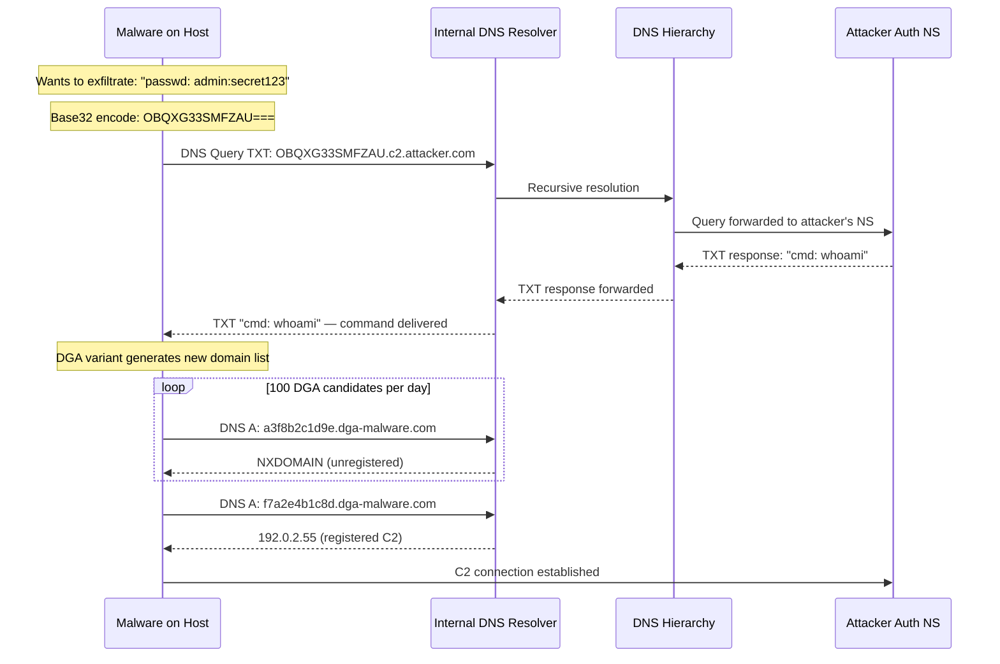
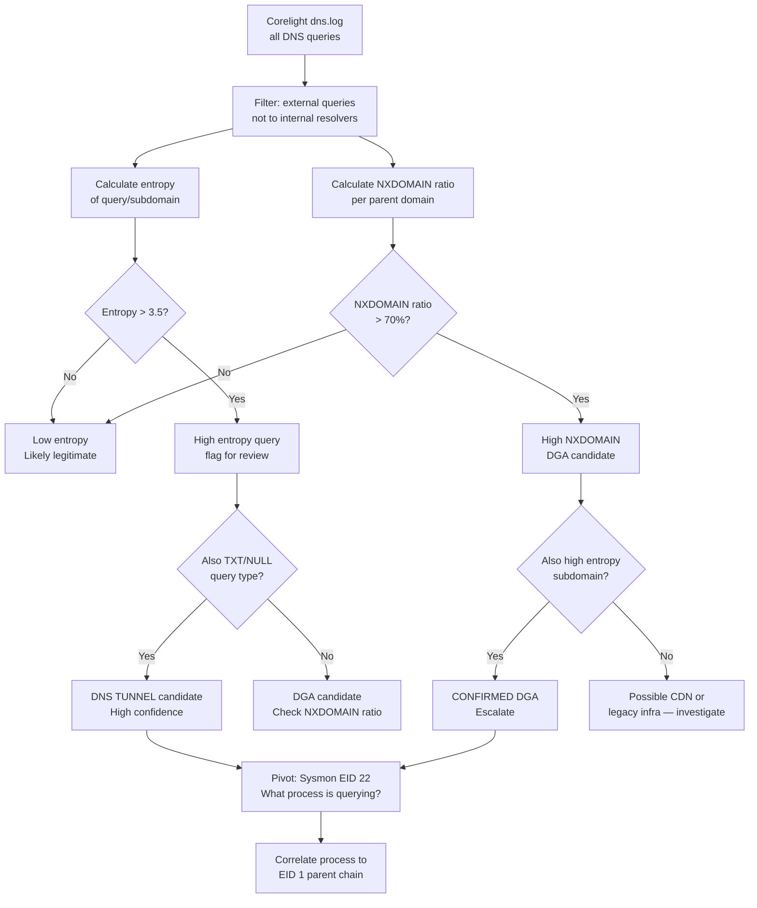
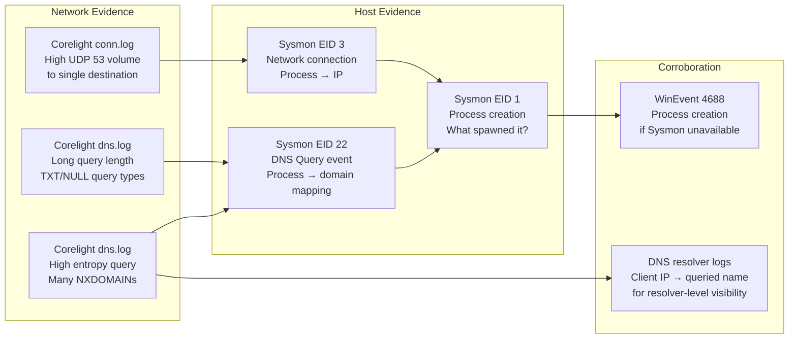
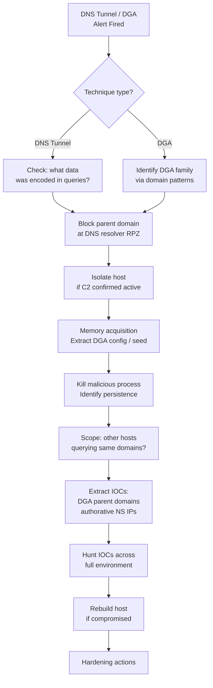
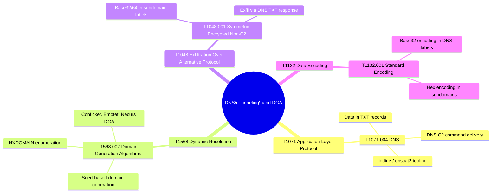

# DNS Tunneling and DGA Detection
## Entropy Analysis and Cardinality Techniques for Covert DNS Channels

---

### Navigation

| Previous | Up | Next |
|---|---|---|
| [Credential Attacks](./03_credential_attacks.md) | [Detection Use Cases](.) | [Lateral Movement](./05_lateral_movement.md) |

**Related Techniques:** [Entropy Analysis](../02_baseline_hunts/05_entropy_analysis.md) | [Frequency Analysis](../02_baseline_hunts/01_frequency_analysis.md) | [Cardinality Analysis](../02_baseline_hunts/02_cardinality_analysis.md)

---

## Overview

| Attribute | Detail |
|---|---|
| **Threat** | DNS Tunneling and Domain Generation Algorithms (DGA) |
| **MITRE ATT&CK** | [T1071.004](https://attack.mitre.org/techniques/T1071/004/) DNS Application Layer Protocol, [T1568.002](https://attack.mitre.org/techniques/T1568/002/) Domain Generation Algorithms |
| **Sub-techniques** | T1071.004 DNS for C2 channel, T1048.001 Exfiltration via DNS, T1568.002 DGA for C2 rendezvous |
| **Data Sources** | Corelight `dns.log`, Sysmon EID 22 (DNS Query) |
| **Statistical Methods** | Entropy Analysis (query string randomness), Frequency Analysis (rare domains), Cardinality (unique subdomains per parent domain) |
| **Detection Difficulty** | Hard — DNS is ubiquitous, many legitimate domains have high entropy, and DGA traffic volume is often low |

---

## Threat Description

**DNS Tunneling:**
DNS tunneling tools (iodine, dnscat2, dns2tcp) encode arbitrary data — commands, credentials, file contents — inside DNS query and response fields. Because DNS is almost always allowed through firewalls and is frequently not inspected by DLP or proxy solutions, it represents an attractive covert channel. Data encoded in subdomain labels of queries travels to the attacker's authoritative nameserver, which decodes and responds through DNS answer fields.

**Domain Generation Algorithms (DGA):**
Rather than hardcoding C2 domains (which can be blocked when discovered), DGA malware uses an algorithm seeded with a date, random value, or public data to generate hundreds of candidate domain names per day. The attacker registers only a few of these. The malware queries all of them, receiving NXDOMAIN for unregistered ones and a valid response from registered C2 infrastructure. DGA provides resilience: blocking one domain does not disable the C2 because the malware will generate new domains the next day.

**Why DNS is attractive as a covert channel:**

| Property | Why Attackers Exploit It |
|---|---|
| Always allowed at firewall | Port 53 UDP/TCP is rarely blocked for internal resolvers |
| Rarely inspected | Most orgs do not decrypt or analyze DNS payload content |
| High query volume | Thousands of DNS queries per host per day — individual anomalies are hard to see |
| Recursive resolver caching | Queries can reach attacker NS indirectly, evading direct IP blocks |

**Key statistical signals by technique:**

| Technique | Primary Signal | Secondary Signal |
|---|---|---|
| DNS Tunneling | High entropy subdomain, long query length | TXT/NULL query types, high query volume to one parent |
| DGA | High entropy domain name, many NXDOMAINs | Short TTL, no web presence, few or no MX records |
| DNS-based exfil | Large TXT responses, high `orig_bytes` per query | Many queries to same authoritative NS over short window |

---

## Attack Flow



---

## Detection Logic Flow



---

## PEAK: Prepare

### Hypothesis

> **"A host is making DNS queries with anomalously high subdomain entropy or generating a high rate of NXDOMAIN responses, consistent with DNS tunneling encoding data in query labels or DGA malware performing C2 rendezvous against generated domain names."**

### Data Sources

| Source | Log | Key Fields |
|---|---|---|
| Corelight | `dns.log` | `_time`, `id.orig_h`, `id.resp_h`, `query`, `qtype_name`, `answers`, `rcode_name`, `TTL`, `trans_id` |
| Sysmon | EID 22 (DNS Query) | `QueryName`, `QueryResults`, `Image`, `ProcessId`, `User` |
| Sysmon | EID 1 (Process Create) | `Image`, `ParentImage`, `CommandLine`, `User` |

### Scope and Exclusions

| Exclusion | Reason |
|---|---|
| Content delivery networks (Akamai, Cloudflare, Fastly) | CDNs use high-entropy subdomain prefixes by design |
| Cloud providers (AWS, Azure, GCP) internal FQDNs | Auto-generated resource hostnames look like DGA |
| Email security services (Proofpoint URL rewriting) | URL-rewritten links have high entropy prefixes |
| OCSP/CRL check domains | Certificate revocation uses high-entropy query paths |
| Known analytics domains (Google Analytics, etc.) | Tracking pixels use unique session IDs in subdomains |

```spl
/* Baseline: profile NXDOMAIN rate per parent domain to establish normal */
index=corelight sourcetype=corelight_dns
| where rcode_name="NXDOMAIN"
| rex field=query "(?:[^.]+\.)*(?P<parent_domain>[^.]+\.[^.]+)$"
| stats count AS nxdomain_count BY parent_domain
| sort - nxdomain_count
| head 50
```

---

## PEAK: Explore

### Step 1 — Top Domains by Query Volume

Understand which domains receive the most queries. Outliers with high volume and low familiarity (not in Alexa top 1M) warrant investigation.

```spl
/* Explore: top queried domains by count */
index=corelight sourcetype=corelight_dns
| where NOT (rcode_name="NOERROR" AND cidrmatch("10.0.0.0/8", id.resp_h))
| rex field=query "(?:[^.]+\.)*(?P<parent_domain>[^.]+\.[^.]+)$"
| stats count AS query_count,
        dc(id.orig_h) AS unique_requestors,
        dc(query) AS unique_subdomains,
        values(qtype_name) AS query_types,
        dc(rcode_name) AS rcode_variety
  BY parent_domain
| sort - query_count
| head 50
```

### Step 2 — High NXDOMAIN Ratio Domains

Domains where most queries return NXDOMAIN are DGA candidates. Legitimate domains should resolve successfully most of the time.

```spl
/* Explore: domains with high NXDOMAIN ratio - DGA indicator */
index=corelight sourcetype=corelight_dns
| rex field=query "(?:[^.]+\.)*(?P<parent_domain>[^.]+\.[^.]+)$"
| stats count AS total_queries,
        count(eval(rcode_name="NXDOMAIN")) AS nxdomain_count,
        dc(query) AS unique_subdomains,
        dc(id.orig_h) AS unique_requestors
  BY parent_domain
| where total_queries > 10
| eval nxdomain_ratio = round(nxdomain_count / total_queries, 2)
| where nxdomain_ratio > 0.7
| sort - nxdomain_ratio
| table parent_domain, total_queries, nxdomain_count, nxdomain_ratio, unique_subdomains, unique_requestors
```

### Step 3 — Unusual Query Types

DNS tunneling prefers record types with large payload capacity: TXT, NULL, CNAME chains. A host making many TXT or NULL queries to external domains is suspicious.

```spl
/* Explore: unusual DNS query type distribution */
index=corelight sourcetype=corelight_dns
| where NOT cidrmatch("10.0.0.0/8", id.resp_h)
| stats count BY qtype_name
| sort - count
```

---

## PEAK: Analyze

### Primary Detection — Entropy-Based DGA Detection

Calculate Shannon entropy of the subdomain portion of each DNS query. High-entropy strings are characteristic of both DGA-generated names and base32/base64 encoded tunneling data.

```spl
/* DGA/TUNNEL DETECTION: Shannon entropy of DNS query subdomain */
index=corelight sourcetype=corelight_dns
| where NOT cidrmatch("10.0.0.0/8", id.resp_h)
| rex field=query "^(?P<subdomain>.+)\.(?:[^.]+\.[^.]+)$"
| where len(subdomain) > 10
| eval chars = split(subdomain, "")
| eval a=mvcount(mvfilter(match(chars,"a"))) | eval b=mvcount(mvfilter(match(chars,"b")))
| eval c=mvcount(mvfilter(match(chars,"c"))) | eval d=mvcount(mvfilter(match(chars,"d")))
| eval e=mvcount(mvfilter(match(chars,"e"))) | eval f=mvcount(mvfilter(match(chars,"f")))
| eval total_len = len(subdomain)
| eval entropy = -1 * (
    if(a>0, (a/total_len)*ln(a/total_len)/ln(2), 0) +
    if(b>0, (b/total_len)*ln(b/total_len)/ln(2), 0) +
    if(c>0, (c/total_len)*ln(c/total_len)/ln(2), 0) +
    if(d>0, (d/total_len)*ln(d/total_len)/ln(2), 0) +
    if(e>0, (e/total_len)*ln(e/total_len)/ln(2), 0) +
    if(f>0, (f/total_len)*ln(f/total_len)/ln(2), 0)
  )
| where entropy > 3.5
| stats count AS high_entropy_queries,
        values(query) AS sample_queries,
        dc(query) AS unique_queries
  BY id.orig_h
| where high_entropy_queries > 20
| sort - high_entropy_queries
```

> **Note:** The SPL entropy approximation above uses a subset of characters for performance. For production use, reference [Entropy Analysis](../02_baseline_hunts/05_entropy_analysis.md) for the full per-character Shannon entropy implementation using a lookup-based approach.

### Subdomain Cardinality — Many Unique Subdomains Per Parent

A domain receiving queries for hundreds of distinct subdomains from a single host is a tunnel or DGA indicator. Legitimate domains have bounded subdomain variety.

```spl
/* DGA/TUNNEL DETECTION: subdomain cardinality per parent domain per host */
index=corelight sourcetype=corelight_dns
| where NOT cidrmatch("10.0.0.0/8", id.resp_h)
| rex field=query "^(?P<subdomain>.+?)\.(?P<parent_domain>[^.]+\.[^.]+)$"
| bin _time span=1h AS hour
| stats dc(subdomain) AS unique_subdomains,
        count AS total_queries,
        dc(rcode_name) AS rcode_variety,
        count(eval(rcode_name="NXDOMAIN")) AS nxdomain_count
  BY id.orig_h, parent_domain, hour
| where unique_subdomains > 50
| eval nxdomain_ratio = round(nxdomain_count / total_queries, 2)
| sort - unique_subdomains
| table hour, id.orig_h, parent_domain, unique_subdomains, total_queries, nxdomain_ratio
```

### DNS Tunneling — Long Query Length + TXT Type

Tunneling tools encode data in DNS labels, producing queries much longer than typical hostname resolution. Combine long query length with TXT query type for high confidence.

```spl
/* DNS TUNNEL DETECTION: long queries and TXT type from same source */
index=corelight sourcetype=corelight_dns
| where NOT cidrmatch("10.0.0.0/8", id.resp_h)
| eval query_len = len(query)
| where query_len > 50
| bin _time span=1h AS hour
| stats count AS tunnel_candidate_queries,
        avg(query_len) AS avg_query_len,
        max(query_len) AS max_query_len,
        count(eval(qtype_name="TXT")) AS txt_queries,
        count(eval(qtype_name="NULL")) AS null_queries,
        dc(query) AS unique_queries,
        values(query) AS sample_queries
  BY id.orig_h, hour
| where tunnel_candidate_queries > 50 OR txt_queries > 10
| eval txt_ratio = round(txt_queries / tunnel_candidate_queries, 2)
| sort - tunnel_candidate_queries
| table hour, id.orig_h, tunnel_candidate_queries, avg_query_len, txt_queries, txt_ratio, sample_queries
```

### NXDOMAIN Burst — Rapid DGA Enumeration

DGA malware often runs through its candidate domain list quickly at startup or after C2 loss. Detect hosts generating NXDOMAIN responses at an anomalous rate.

```spl
/* DGA DETECTION: NXDOMAIN burst rate per source host */
index=corelight sourcetype=corelight_dns earliest=-30d
| where rcode_name="NXDOMAIN"
| bin _time span=1h AS hour
| stats count AS nxdomain_count BY id.orig_h, hour
| eventstats perc99(nxdomain_count) AS p99_nxdomain BY id.orig_h
| where nxdomain_count > p99_nxdomain
| where hour >= relative_time(now(), "-24h@h")
| eval excess_factor = round(nxdomain_count / p99_nxdomain, 1)
| sort - nxdomain_count
| table id.orig_h, hour, nxdomain_count, p99_nxdomain, excess_factor
```

### Corroboration — Sysmon EID 22 Process-to-DNS Mapping

After identifying a suspicious source host, use Sysmon EID 22 (DNS Query events) to correlate DNS queries to the process generating them.

```spl
/* PIVOT: Sysmon EID 22 - which process is generating suspicious DNS queries? */
index=sysmon EventCode=22 host="<SUSPECT_HOST>"
| where match(QueryName, "<SUSPECT_DOMAIN>")
| stats count AS query_count,
        values(QueryName) AS domains_queried,
        values(QueryResults) AS results
  BY Image, ProcessId, User
| sort - query_count
| table Image, ProcessId, User, query_count, domains_queried, results
```

---

## PEAK: Knowledge

### Evidence Collection Chain



### Evidence Chain — Step by Step

| Step | Action | Data Source | What to Look For |
|---|---|---|---|
| 1 | Identify anomalous DNS pattern | Corelight `dns.log` | High entropy, high NXDOMAIN ratio, long query length, TXT type |
| 2 | Confirm source host | Corelight `dns.log` | `id.orig_h` — which internal host is generating these queries? |
| 3 | Map query to process | Sysmon EID 22 | `Image` — is it a browser, or something unusual like `svchost`, `powershell`? |
| 4 | Trace parent process chain | Sysmon EID 1 | `ParentImage` — was the process spawned by a document or exploit? |
| 5 | Check for C2 channel establishment | Corelight `conn.log` | After DGA success, look for outbound TCP/443 to resolved IP |
| 6 | Validate domain reputation | Threat intel lookup | Is the queried domain known DGA family (e.g., Conficker, Emotet)? |

### Visualization — Query Volume and NXDOMAIN Over Time

```spl
/* VISUALIZATION: DNS query volume and NXDOMAIN rate timechart */
index=corelight sourcetype=corelight_dns
| where id.orig_h="<SUSPECT_IP>"
| eval is_nxdomain = if(rcode_name="NXDOMAIN", 1, 0)
| timechart span=15m count AS total_queries, sum(is_nxdomain) AS nxdomain_queries
```

---

## Response Playbook



### Immediate Actions (0–1 hour)

| Action | Method |
|---|---|
| Block suspicious domain at DNS resolver | DNS RPZ rule or firewall DNS sinkhole |
| Block authoritative NS IP at perimeter | Prevent resolver from reaching attacker's NS |
| Identify the process generating queries | Sysmon EID 22 on suspect host |
| Assess whether C2 channel was established | Check Corelight conn.log for outbound connections to resolved DGA IP |
| Notify IR team if active compromise suspected | Escalate per IR playbook |

### Short-Term Actions (1–24 hours)

| Action | Method |
|---|---|
| Memory acquisition for DGA seed/config | Extract algorithm parameters for full domain prediction |
| Identify DGA malware family | Submit samples to sandbox; check DGA family databases |
| Generate full domain list for the family | Use DGA reverse-engineering to predict all C2 candidates |
| Block full DGA domain list | Mass-block predicted domains at DNS and proxy |
| Scope across environment | Are other hosts querying the same DGA family domains? |

### Remediation

| Action | Rationale |
|---|---|
| Rebuild affected host from clean image | DGA malware typically has multiple persistence mechanisms |
| Rotate credentials used on affected host | Tunnel may have been used to exfiltrate credentials |
| Review DNS resolver logs for full scope | Internal resolver logs show all clients that queried suspect domains |

### Hardening Actions

| Control | Implementation |
|---|---|
| DNS Response Policy Zone (RPZ) | Sinkhole known-malicious and DGA domains at resolver |
| Block direct external DNS (port 53) | Force all DNS through monitored internal resolvers |
| DNS over HTTPS (DoH) blocking | Block DoH providers to prevent bypassing DNS monitoring |
| Threat-intel feed integration in dns.log | Enrich Corelight dns.log with passive DNS and domain age |
| Recursive resolver logging | Enable full query logging on internal resolvers for audit trail |

---

## MITRE ATT&CK Mapping



| Technique | ID | Relevance to This Hunt |
|---|---|---|
| DNS Application Layer Protocol | T1071.004 | DNS used as C2 channel — iodine, dnscat2 |
| Domain Generation Algorithms | T1568.002 | High NXDOMAIN rate; high entropy domain names |
| Exfiltration Over Alternative Protocol | T1048 | Data encoded in DNS query labels — tunnel exfiltration |
| Data Encoding — Standard Encoding | T1132.001 | Base32/base64 encoded payload in subdomain |

---

## Related Hunts and Use Cases

| Document | Relevance |
|---|---|
| [Entropy Analysis](../02_baseline_hunts/05_entropy_analysis.md) | Core method for measuring query string randomness |
| [Frequency Analysis](../02_baseline_hunts/01_frequency_analysis.md) | Rare domain detection; high-query-volume parent domain profiling |
| [Cardinality Analysis](../02_baseline_hunts/02_cardinality_analysis.md) | `dc(subdomain)` per parent domain — the tunnel signal |
| [Beaconing Detection](./01_beaconing.md) | DNS can be used for low-jitter beaconing; similar interval analysis applies |
| [Data Exfiltration](./02_data_exfiltration.md) | DNS tunnel is an exfiltration channel — correlate volume anomalies |
| [Lateral Movement](./05_lateral_movement.md) | After DGA C2 is established, attacker moves laterally |

---

*Navigation: [Home](../README.md) | [PEAK Framework](../00_peak_framework_overview.md) | [Previous: Credential Attacks](./03_credential_attacks.md) | [Next: Lateral Movement](./05_lateral_movement.md)*
