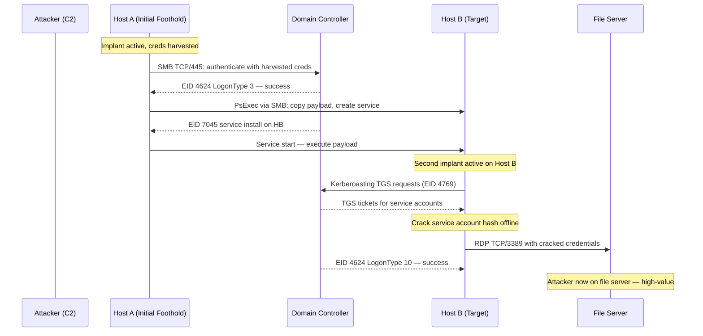
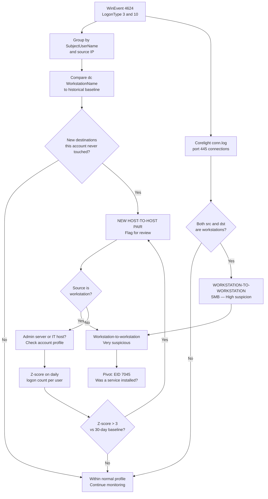
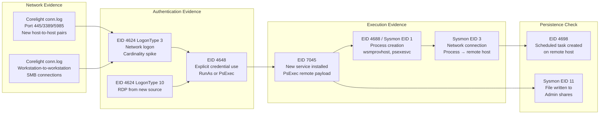
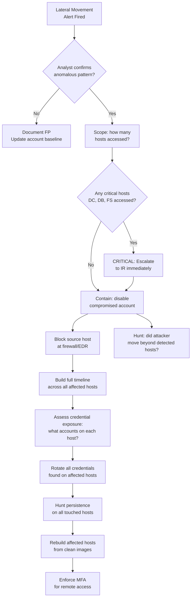
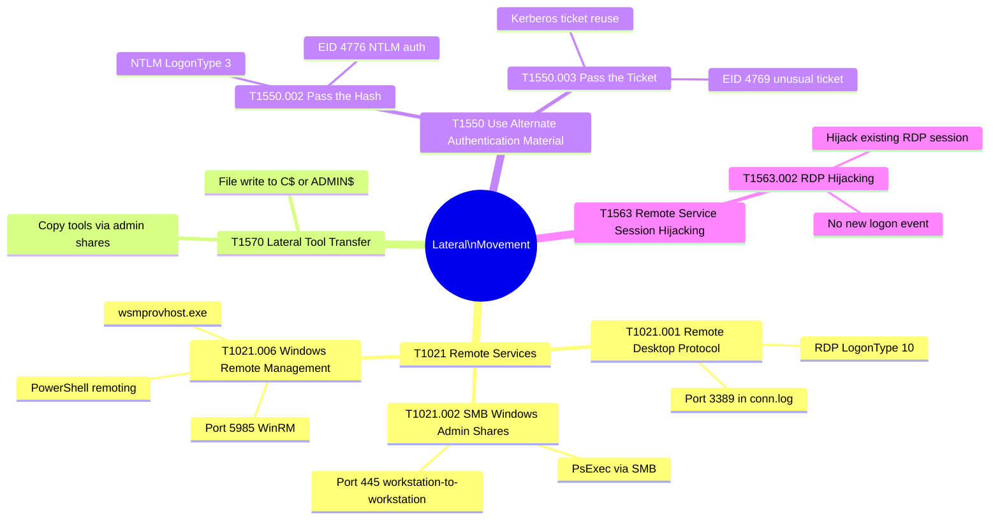

# Lateral Movement Detection
## Cardinality and Behavioral Profiling for Host-to-Host Propagation

---

### Navigation

| Previous | Up | Next |
|---|---|---|
| [DNS Tunneling / DGA](./04_dns_tunneling_dga.md) | [Detection Use Cases](.) | [Privilege Escalation](./06_privilege_escalation.md) |

**Related Techniques:** [Cardinality Analysis](../02_baseline_hunts/02_cardinality_analysis.md) | [Z-Score / Stdev](../02_baseline_hunts/03_zscore_stdev.md) | [Moving Averages](../02_baseline_hunts/06_moving_averages.md) | [Behavioral Profiling](../02_baseline_hunts/09_behavioral_profiling.md)

---

## Overview

| Attribute | Detail |
|---|---|
| **Threat** | Lateral Movement |
| **MITRE ATT&CK** | [T1021](https://attack.mitre.org/techniques/T1021/) Remote Services, [T1570](https://attack.mitre.org/techniques/T1570/) Lateral Tool Transfer |
| **Sub-techniques** | T1021.001 Remote Desktop Protocol, T1021.002 SMB/Windows Admin Shares, T1021.006 Windows Remote Management (WinRM) |
| **Data Sources** | WinEvent 4624 (LogonType 3 Network, LogonType 10 RemoteInteractive), Corelight `conn.log` (ports 445, 3389, 5985), Sysmon EID 3 (Network Connection) |
| **Statistical Methods** | Cardinality (unique destination hosts per source account), Z-Score (logon count vs baseline), Moving Average, Behavioral Profiling (new host-to-host connection pairs) |
| **Detection Difficulty** | Medium — IT admin activity creates legitimate lateral movement noise; key is baselining per-account normal connection patterns |

---

## Threat Description

**What is lateral movement?**
After establishing an initial foothold — typically a single compromised workstation or server — the attacker moves from that initial position to additional hosts in pursuit of higher-value targets: domain controllers, file servers, databases, or privileged accounts. This progression through the network is lateral movement.

**Common lateral movement techniques:**

| Technique | Protocol/Port | Windows Event Evidence | Network Evidence |
|---|---|---|---|
| PsExec / SMB | SMB TCP/445 | EID 4624 LogonType 3, EID 7045 service install | conn.log port 445 |
| WMI Execution | DCOM TCP/135 | EID 4624 LogonType 3, EID 4688 process create | conn.log port 135 |
| Remote Desktop | RDP TCP/3389 | EID 4624 LogonType 10 | conn.log port 3389 |
| WinRM / PowerShell Remoting | WinRM TCP/5985/5986 | EID 4624 LogonType 3, EID 4688 wsmprovhost | conn.log port 5985 |
| Pass-the-Hash | NTLM/SMB | EID 4624 LogonType 3 with NTLM, EID 4776 | conn.log port 445 |
| Pass-the-Ticket | Kerberos | EID 4624 with unusual ticket, EID 4769 | Corelight kerberos.log |

**Key statistical insights:**

1. **Cardinality spike:** Legitimate administrators connect to a predictable, bounded set of hosts. An account suddenly connecting to 20 new hosts it has never touched is anomalous regardless of whether the credentials are valid.

2. **Workstation-to-workstation SMB:** In normal enterprise environments, workstations do not make SMB connections to each other. SMB traffic should flow from workstations to file servers and domain controllers — not peer-to-peer. Any workstation-to-workstation connection on port 445 warrants investigation.

3. **First-seen host pairs:** An account connecting to a host it has never previously connected to — especially if the connection is SMB or RDP — is a behavioral anomaly worthy of investigation.

---

## Attack Flow



---

## Detection Logic Flow



---

## PEAK: Prepare

### Hypothesis

> **"An account or host is making network logon connections (LogonType 3 or 10) to a significantly larger number of unique destination hosts than its historical baseline, or is making SMB connections between workstations that do not normally communicate peer-to-peer, indicating an attacker using harvested credentials to traverse the network."**

### Data Sources

| Source | Log | Key Fields |
|---|---|---|
| WinEvent | EID 4624 (Successful Logon) | `SubjectUserName`, `TargetUserName`, `IpAddress`, `WorkstationName`, `LogonType`, `AuthenticationPackageName` |
| WinEvent | EID 4648 (Explicit Credential Logon) | `SubjectUserName`, `TargetServerName`, `TargetUserName`, `IpAddress` |
| WinEvent | EID 7045 (New Service Installed) | `ServiceName`, `ServiceFileName`, `ComputerName` |
| Corelight | `conn.log` | `id.orig_h`, `id.resp_h`, `id.resp_p`, `orig_bytes`, `resp_bytes`, `duration` |
| Sysmon | EID 3 (Network Connection) | `SourceIp`, `DestinationIp`, `DestinationPort`, `Image`, `User` |

### Scope and Exclusions

| Exclusion | Reason |
|---|---|
| Known admin accounts and their normal managed host sets | IT administrators legitimately connect to many hosts |
| SCCM / SCOM / Ansible management servers | Automated management platforms make large numbers of connections |
| Domain controllers to all workstations (SYSVOL, NETLOGON) | DC-to-workstation SMB for GPO and logon scripts is expected |
| Vulnerability scanner IPs | Scanners probe SMB/RDP across all hosts |
| Jump servers / bastion hosts | All RDP should funnel through bastion — connections from it are normal |

```spl
/* Baseline: per-account normal destination count over 30 days */
index=wineventlog EventCode=4624 earliest=-30d
| where LogonType IN ("3", "10")
| where SubjectUserName != "-" AND SubjectUserName != ""
| bin _time span=1d AS day
| stats dc(WorkstationName) AS daily_dest_count BY SubjectUserName, day
| stats avg(daily_dest_count) AS avg_daily_dests,
        stdev(daily_dest_count) AS stdev_daily_dests,
        max(daily_dest_count) AS max_daily_dests
  BY SubjectUserName
| sort - avg_daily_dests
```

---

## PEAK: Explore

### Step 1 — Logon Type Distribution

Understand the breakdown of logon types in the environment. LogonType 3 (network) and 10 (remote interactive/RDP) are the primary lateral movement indicators.

```spl
/* Explore: logon type distribution across environment */
index=wineventlog EventCode=4624
| stats count BY LogonType
| sort - count
```

### Step 2 — First-Seen Host-to-Host Connections via SMB

Identify source host / destination host / account combinations on port 445 that have not been seen before in the baseline window. These new pairs represent behavioral anomalies.

```spl
/* Explore: new SMB connection pairs - first-seen analysis */
index=corelight sourcetype=corelight_conn earliest=-30d
| where id.resp_p=445
| where NOT cidrmatch("10.0.0.0/8", id.resp_h) OR cidrmatch("10.0.0.0/8", id.orig_h)
| bin _time span=1d AS day
| stats earliest(day) AS first_seen_day BY id.orig_h, id.resp_h
| where first_seen_day >= relative_time(now(), "-1d@d")
| sort id.orig_h, id.resp_h
| table id.orig_h, id.resp_h, first_seen_day
```

### Step 3 — Admin Account Destination Cardinality

Find accounts connecting to an unusually high number of distinct workstations today. Sorts by cardinality to surface the broadest movers.

```spl
/* Explore: unique destination hosts per account - cardinality view */
index=wineventlog EventCode=4624
| where LogonType IN ("3", "10")
| where SubjectUserName != "-"
| stats dc(WorkstationName) AS unique_destinations,
        count AS total_logons,
        values(WorkstationName) AS dest_sample
  BY SubjectUserName
| sort - unique_destinations
| head 30
| table SubjectUserName, unique_destinations, total_logons, dest_sample
```

---

## PEAK: Analyze

### Primary Detection — Cardinality Spike vs Historical Baseline

Flag accounts where today's `dc(WorkstationName)` exceeds their own 30-day baseline by more than 3 standard deviations. This is the core lateral movement signal.

```spl
/* LATERAL MOVEMENT DETECTION: cardinality spike on destination hosts per account */
index=wineventlog EventCode=4624 earliest=-30d
| where LogonType IN ("3", "10")
| where SubjectUserName != "-" AND SubjectUserName != "" AND SubjectUserName != "ANONYMOUS LOGON"
| bin _time span=1d AS day
| stats dc(WorkstationName) AS daily_dest_count BY SubjectUserName, day
| eventstats avg(daily_dest_count) AS avg_dests,
             stdev(daily_dest_count) AS stdev_dests
  BY SubjectUserName
| eval zscore = round((daily_dest_count - avg_dests) / (stdev_dests + 1), 2)
| where zscore > 3
| where day >= relative_time(now(), "-1d@d")
| eval threshold = round(avg_dests + (3 * stdev_dests), 0)
| sort - zscore
| table SubjectUserName, day, daily_dest_count, avg_dests, threshold, zscore
```

### Workstation-to-Workstation SMB Detection

Flag any connection on port 445 between two hosts that are classified as workstations (not servers or DCs). Requires a host classification lookup or naming convention heuristic.

```spl
/* LATERAL MOVEMENT DETECTION: workstation-to-workstation SMB port 445 */
index=corelight sourcetype=corelight_conn
| where id.resp_p=445
| where cidrmatch("10.0.0.0/8", id.orig_h) AND cidrmatch("10.0.0.0/8", id.resp_h)
| eval src_host_type = case(
    match(id.orig_h, "10\.10\."), "workstation",
    match(id.orig_h, "10\.20\."), "server",
    true(), "unknown"
  )
| eval dst_host_type = case(
    match(id.resp_h, "10\.10\."), "workstation",
    match(id.resp_h, "10\.20\."), "server",
    true(), "unknown"
  )
/* Adjust subnet patterns above to match your network segmentation */
| where src_host_type="workstation" AND dst_host_type="workstation"
| stats count AS smb_conn_count,
        sum(orig_bytes) AS total_bytes,
        values(id.resp_h) AS destinations
  BY id.orig_h
| sort - smb_conn_count
| table id.orig_h, smb_conn_count, total_bytes, destinations
```

### RDP from Unusual Source Detection

Flag RDP logons (LogonType 10) originating from a source that has not previously used RDP. Combine with a baseline of known-legitimate RDP sources.

```spl
/* LATERAL MOVEMENT DETECTION: RDP logon from new source host */
index=wineventlog EventCode=4624 earliest=-30d
| where LogonType="10"
| bin _time span=1d AS day
| stats earliest(day) AS first_seen_day,
        count AS total_rdp_sessions
  BY SubjectUserName, IpAddress
| where first_seen_day >= relative_time(now(), "-1d@d")
| eval is_new_source = "YES"
| sort SubjectUserName
| table SubjectUserName, IpAddress, first_seen_day, total_rdp_sessions
```

### Z-Score on Daily Lateral Logon Count per User

Detect a surge in lateral authentication volume (any combination of LogonType 3/10) for a specific user that exceeds their own baseline.

```spl
/* LATERAL MOVEMENT DETECTION: z-score on daily lateral logon count */
index=wineventlog EventCode=4624 earliest=-30d
| where LogonType IN ("3", "10")
| where SubjectUserName != "-"
| bin _time span=1d AS day
| stats count AS daily_logon_count BY SubjectUserName, day
| eventstats avg(daily_logon_count) AS avg_logons,
             stdev(daily_logon_count) AS stdev_logons
  BY SubjectUserName
| eval zscore = round((daily_logon_count - avg_logons) / (stdev_logons + 1), 2)
| where zscore > 3 AND daily_logon_count > 20
| where day >= relative_time(now(), "-1d@d")
| sort - zscore
| table SubjectUserName, day, daily_logon_count, avg_logons, stdev_logons, zscore
```

### Corroboration — WMI / PsExec Service Install (EID 7045)

PsExec installs a temporary service on the remote host. Detect service installations that correlate with lateral movement logons.

```spl
/* PIVOT: EID 7045 - new service install following lateral logon */
index=wineventlog EventCode=7045
| where NOT ServiceName IN ("WinDefend", "wuauserv", "Spooler")
| stats count AS install_count,
        values(ServiceName) AS service_names,
        values(ServiceFileName) AS service_binaries
  BY ComputerName
| sort - install_count
| table ComputerName, install_count, service_names, service_binaries
```

---

## PEAK: Knowledge

### Evidence Collection Chain



### Evidence Chain — Step by Step

| Step | Action | Data Source | What to Look For |
|---|---|---|---|
| 1 | Identify cardinality anomaly | WinEvent 4624 | `dc(WorkstationName)` z-score > 3 for specific account |
| 2 | Identify suspicious network connections | Corelight `conn.log` | Workstation-to-workstation SMB; new host pairs on 445/3389/5985 |
| 3 | Confirm authentication from source | WinEvent 4624 LogonType 3/10 | Specific account authenticating to new hosts |
| 4 | Check for explicit credential use | WinEvent 4648 | PsExec or RunAs — indicates deliberate credential injection |
| 5 | Detect remote execution | WinEvent 7045, EID 4688 | Service install (`PSEXESVC`) or `wsmprovhost.exe` (WinRM) |
| 6 | Hunt for persistence on remote hosts | WinEvent 4698, Sysmon EID 11 | Was a scheduled task or file dropped on the remote host? |
| 7 | Timeline full activity | All sources on source and destination hosts | Build complete movement timeline from foothold forward |

### Visualization — Lateral Movement Heat Map

```spl
/* VISUALIZATION: logon activity heat map - account to destination host */
index=wineventlog EventCode=4624
| where LogonType IN ("3", "10")
| where SubjectUserName="<SUSPECT_ACCOUNT>"
| timechart span=1h count AS logon_count BY WorkstationName useother=false limit=20
```

### Moving Average — Trend Detection on Connection Rate

Detect a gradual increase in lateral connection rate (slow spread) by tracking how current connection volume compares to a rolling average.

```spl
/* VISUALIZATION: rolling average of lateral logons to detect slow spread */
index=wineventlog EventCode=4624 earliest=-8d
| where LogonType IN ("3", "10")
| where SubjectUserName="<SUSPECT_ACCOUNT>"
| bin _time span=1h AS hour
| stats count AS hourly_logons BY hour
| sort hour
| streamstats avg(hourly_logons) AS rolling_avg_7d window=168
| eval trend_ratio = round(hourly_logons / (rolling_avg_7d + 1), 2)
| timechart span=1h values(hourly_logons) AS actual, values(rolling_avg_7d) AS baseline, values(trend_ratio) AS ratio
```

---

## Response Playbook



### Immediate Actions (0–1 hour)

| Action | Method |
|---|---|
| Disable the compromised account | Active Directory account disable — stops further use of those credentials |
| Isolate source host | EDR containment or firewall ACL to prevent further movement |
| Block source IP at perimeter | Prevent external attacker from reestablishing through other paths |
| Identify all hosts the account touched | Query WinEvent 4624 for all LogonType 3/10 from compromised account |
| Escalate if domain controller or file server was accessed | Potential domain compromise requires full IR activation |

### Short-Term Actions (1–24 hours)

| Action | Method |
|---|---|
| Build complete host timeline | For each touched host: auth events, process creation, file writes |
| Check for services or tasks installed on remote hosts | EID 7045 (service), EID 4698 (scheduled task) |
| Assess which credentials were exposed on each host | Any account that logged into affected hosts may be compromised |
| Determine attacker's ultimate objective | Are they headed toward domain controller, database, or backup system? |
| Hunt for additional compromised accounts | Attacker may have harvested additional creds on each hop |

### Remediation

| Action | Rationale |
|---|---|
| Rebuild all hosts that attacker touched with administrative access | Multiple persistence mechanisms may have been installed |
| Rotate all credentials from affected hosts | Attacker may have run credential-harvesting tools (Mimikatz) on each host |
| Reset KRBTGT password twice (if DC was accessed) | Invalidate all Kerberos tickets if domain controller was compromised |
| Audit admin group memberships | Attacker may have added accounts to privileged groups |

### Hardening Actions

| Control | Implementation |
|---|---|
| Privileged Access Workstations (PAWs) | Admin credentials only used from hardened, isolated workstations |
| Host-based firewall — block workstation-to-workstation SMB | GPO to block TCP/445 between workstations in the same subnet |
| Disable NTLM where possible | Force Kerberos to prevent pass-the-hash attacks |
| Local Administrator Password Solution (LAPS) | Unique local admin passwords prevent lateral movement via shared password |
| Tiered administration model | Separate tier-0 (DC), tier-1 (server), tier-2 (workstation) admin accounts |

---

## MITRE ATT&CK Mapping



| Technique | ID | Relevance to This Hunt |
|---|---|---|
| Remote Desktop Protocol | T1021.001 | EID 4624 LogonType 10; port 3389 in conn.log |
| SMB / Windows Admin Shares | T1021.002 | PsExec; workstation-to-workstation SMB; EID 7045 service install |
| Windows Remote Management | T1021.006 | `wsmprovhost.exe`; port 5985; EID 4624 LogonType 3 |
| Lateral Tool Transfer | T1570 | File writes to admin shares on remote hosts — Sysmon EID 11 |
| Pass the Hash | T1550.002 | NTLM authentication; EID 4776; no password required |
| Pass the Ticket | T1550.003 | Kerberos ticket reuse from harvested ticket — EID 4769 anomaly |

---

## Related Hunts and Use Cases

| Document | Relevance |
|---|---|
| [Cardinality Analysis](../02_baseline_hunts/02_cardinality_analysis.md) | Core method: `dc(WorkstationName)` per account is the primary signal |
| [Z-Score / Stdev](../02_baseline_hunts/03_zscore_stdev.md) | Detect spikes in logon count and destination count vs baseline |
| [Moving Averages](../02_baseline_hunts/06_moving_averages.md) | Detect gradual slow-spread lateral movement via rolling average trend |
| [Behavioral Profiling](../02_baseline_hunts/09_behavioral_profiling.md) | Per-account baseline of normal host-to-host connection patterns |
| [Credential Attacks](./03_credential_attacks.md) | Lateral movement is enabled by credential compromise — hunt both together |
| [Privilege Escalation](./06_privilege_escalation.md) | Lateral movement often leads to or requires privilege escalation |

---

*Navigation: [Home](../README.md) | [PEAK Framework](../00_peak_framework_overview.md) | [Previous: DNS Tunneling / DGA](./04_dns_tunneling_dga.md) | [Next: Privilege Escalation](./06_privilege_escalation.md)*
