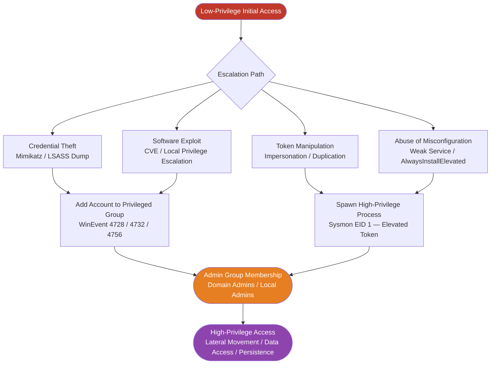
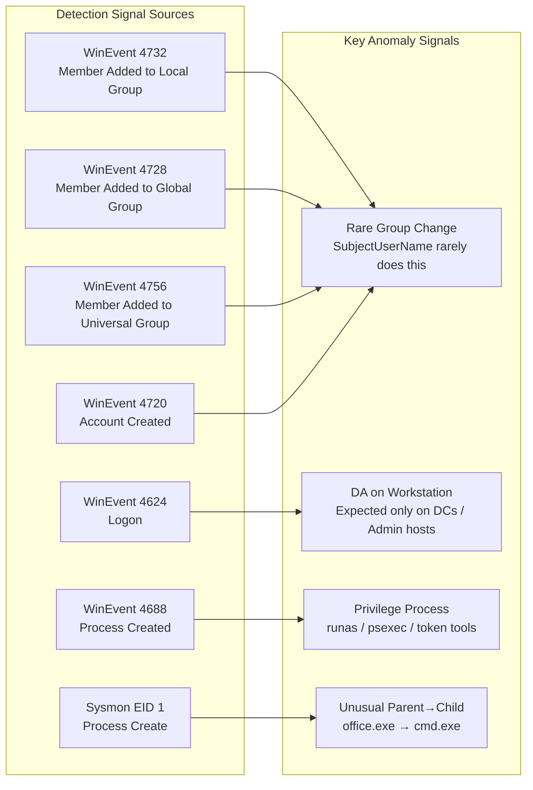
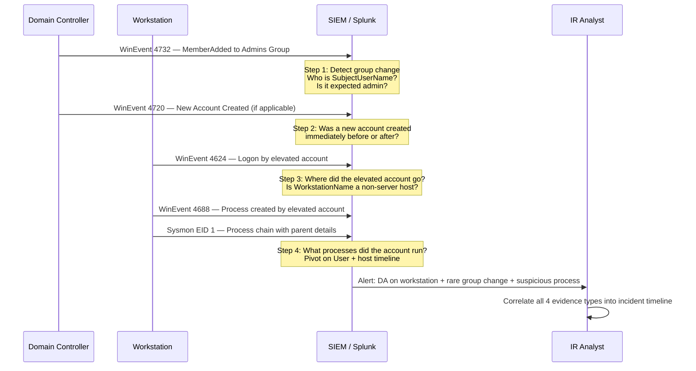
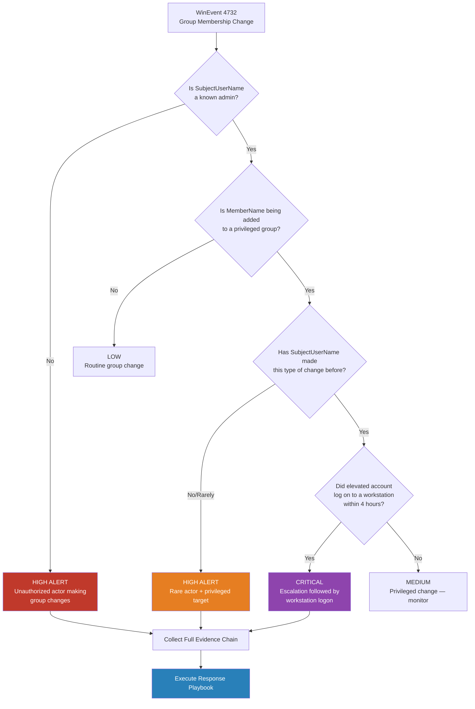
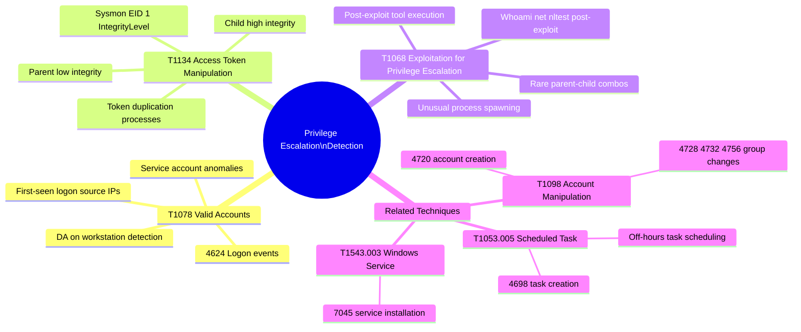

# Privilege Escalation Detection

> **MITRE ATT&CK Coverage**
> | Technique ID | Name | Tactic |
> |---|---|---|
> | T1078 | Valid Accounts | Privilege Escalation, Defense Evasion, Persistence, Initial Access |
> | T1134 | Access Token Manipulation | Privilege Escalation, Defense Evasion |
> | T1068 | Exploitation for Privilege Escalation | Privilege Escalation |

---

## Overview

Privilege escalation describes the set of techniques by which an attacker who has gained an initial foothold at a lower privilege level elevates their access to a higher one — typically moving from a standard user account to local administrator, from local admin to domain admin, or from a service account to SYSTEM. The techniques may involve stealing or abusing valid credentials, exploiting software vulnerabilities, or manipulating access tokens. Detection relies on identifying the statistical anomalies that accompany these actions: rare group membership changes, admin-level accounts appearing on hosts they should never touch, and unusual process lineage associated with privilege-related tooling.

### Why Privilege Escalation Is Hard to Detect

- Many privilege-escalation events use legitimate Windows mechanisms (runas, token duplication)
- Group membership changes can be routine in large environments — signal buried in noise
- Token manipulation leaves no explicit "escalation" event; only indirect signals in process logs
- Domain Admin accounts are valid and expected _somewhere_ — the anomaly is _where_ they appear

---

## Threat Model





---

## Key Signals Summary

| Signal | Event Source | Statistical Approach |
|---|---|---|
| Account added to privileged group | WinEvent 4728, 4732, 4756 | `rare` on SubjectUserName — who is making changes? |
| New account created | WinEvent 4720 | `rare` on SubjectUserName — should be Service Desk only |
| Domain Admin logon to workstation | WinEvent 4624 | `stats count` + filter non-DC/SRV hostnames |
| Privilege-escalation process execution | WinEvent 4688, Sysmon EID 1 | `rare` on process_name from curated list |
| Unusual parent → child process | Sysmon EID 1 | `rare` on ParentProcessName + Image pair |
| Token manipulation artifacts | Sysmon EID 1 | Specific process names + access token flags |

---

## PEAK Framework

### Prepare

**Hypothesis:** An attacker who has obtained low-level access is attempting to gain higher privileges by modifying group memberships, abusing token privileges, or exploiting vulnerabilities — evidenced by anomalous patterns in group management events, admin account logon locations, and process execution chains.

**Assumptions and Prerequisites:**
- Domain Controllers are forwarding Security event logs (4720, 4728, 4732, 4756, 4624)
- Sysmon is deployed with a configuration that captures process creation (EID 1) including parent process details and command-line arguments
- A baseline of normal group management activity exists (who normally adds users to groups)
- A list of known Domain Controller and server hostnames is available for exclusion logic

**Threat Intelligence Context:**
- T1078 (Valid Accounts): Adversaries use existing privileged accounts or newly created ones
- T1134 (Access Token Manipulation): CreateProcessWithTokenW, ImpersonateLoggedOnUser, token duplication
- T1068 (Exploitation): Local privilege escalation via kernel exploits, service misconfigurations

**Key Questions to Answer:**
1. Which accounts are being added to privileged groups, and is the actor (SubjectUserName) expected?
2. Are Domain Admin accounts appearing on workstations where they should never log in?
3. Are privilege-escalation-related processes (runas, PsExec, token tools) appearing with unusual frequency or from unusual parents?
4. Does the timeline of group change → logon → process creation tell a coherent attack story?

---

### Explore

**Step E-1: Baseline Group Membership Change Frequency**

Establish who normally makes group membership changes so rare actors stand out.

```spl
index=wineventlog (EventCode=4728 OR EventCode=4732 OR EventCode=4756)
| eval change_type=case(
    EventCode=4728, "Global Group Add",
    EventCode=4732, "Local Group Add",
    EventCode=4756, "Universal Group Add"
  )
| stats
    count AS total_changes
    dc(TargetUserName) AS unique_targets
    dc(MemberName) AS unique_members_added
    BY SubjectUserName change_type
| sort - total_changes
| head 30
```

**Step E-2: Domain Admin Logon Pattern Baseline**

How often do DA accounts log on to workstations vs. servers vs. DCs? This establishes the normal near-zero baseline for workstation logons.

```spl
index=wineventlog EventCode=4624
    TargetUserName IN (
        [| inputlookup domain_admins.csv | return 200 username]
    )
| eval host_category=case(
    match(ComputerName, "(?i)^(DC|AD)\d*[-.]"), "Domain Controller",
    match(ComputerName, "(?i)^(SRV|SVR|SERVER)\d*[-.]"), "Server",
    true(), "Workstation"
  )
| timechart span=1d
    count BY host_category
```

> Note: If a domain_admins lookup does not exist, replace with a known list or use a group membership query. The pattern `match(ComputerName, "(?i)^(DC|AD)")` should be adapted to your actual naming convention.

**Step E-3: Privilege-Related Process Frequency Baseline**

```spl
index=sysmon EventCode=1
    Image IN (
        "*\\runas.exe",
        "*\\psexec.exe", "*\\psexec64.exe",
        "*\\whoami.exe",
        "*\\net.exe", "*\\net1.exe",
        "*\\nltest.exe",
        "*\\dsquery.exe",
        "*\\adfind.exe",
        "*\\wmic.exe"
    )
| stats
    count AS exec_count
    dc(Computer) AS unique_hosts
    dc(User) AS unique_users
    values(CommandLine) AS sample_cmdlines
    BY Image
| sort - exec_count
```

**Step E-4: New Account Creation Frequency**

```spl
index=wineventlog EventCode=4720
| timechart span=1d count AS accounts_created
| appendcols
    [search index=wineventlog EventCode=4720
     | timechart span=1d count AS accounts_created
     | stats avg(accounts_created) AS avg stdev(accounts_created) AS sd
     | eval upper=avg+(2*sd)
     | table upper]
| eval flag=if(accounts_created > upper, "ABOVE_BASELINE", "normal")
| table _time accounts_created avg upper flag
```

---

### Analyze

**Step A-1: Rare Group Membership Change Actors**

Flag SubjectUserNames that rarely (or never before) make group membership changes — these are the highest-risk actors.

```spl
index=wineventlog (EventCode=4728 OR EventCode=4732 OR EventCode=4756)
    earliest=-90d
| stats count BY SubjectUserName
| where count < 3
| rename SubjectUserName AS rare_admin
| eval risk_note="This account rarely modifies group memberships — possible abuse"
| table rare_admin count risk_note
```

**Step A-2: Accounts Added to Privileged Groups — Full Detail**

```spl
index=wineventlog (EventCode=4728 OR EventCode=4732 OR EventCode=4756)
    earliest=-7d
| eval group_change_type=case(
    EventCode=4728, "Global Group",
    EventCode=4732, "Local Group",
    EventCode=4756, "Universal Group"
  )
| where match(TargetUserName, "(?i)(admin|domain admin|schema admin|enterprise admin|account operator|backup operator)")
| table
    _time
    SubjectUserName
    MemberName
    TargetUserName
    group_change_type
    ComputerName
| sort _time
```

**Step A-3: Domain Admin Accounts Logging On to Workstations**

```spl
index=wineventlog EventCode=4624
    TargetUserName IN (
        [| inputlookup domain_admins.csv | return 200 username]
    )
    LogonType IN (2, 10)
| where
    NOT match(WorkstationName, "(?i)^(DC|AD|SRV|SVR|SERVER)\d*") AND
    NOT match(ComputerName, "(?i)^(DC|AD|SRV|SVR|SERVER)\d*")
| stats
    count AS logon_count
    dc(WorkstationName) AS unique_workstations
    values(WorkstationName) AS workstations
    min(_time) AS first_seen
    max(_time) AS last_seen
    BY TargetUserName
| where logon_count > 0
| eval alert="DA ACCOUNT ON WORKSTATION"
| sort - logon_count
```

**Step A-4: Rare Parent → Child Process Combinations (Privilege Tools)**

```spl
index=sysmon EventCode=1
    Image IN (
        "*\\runas.exe", "*\\psexec.exe", "*\\psexec64.exe",
        "*\\net.exe", "*\\net1.exe", "*\\whoami.exe",
        "*\\nltest.exe", "*\\dsquery.exe", "*\\adfind.exe"
    )
| eval parent_child=ParentImage + " --> " + Image
| rare limit=20 parent_child
| rename count AS occurrence_count
| eval risk_score=case(
    occurrence_count=1, "CRITICAL — first ever",
    occurrence_count < 5, "HIGH — very rare",
    occurrence_count < 20, "MEDIUM — uncommon",
    true(), "LOW"
  )
| table parent_child occurrence_count percent risk_score
```

**Step A-5: Token Manipulation Indicators**

Token manipulation often involves specific API calls surfaced by Sysmon or specific process relationships. Look for processes with elevated integrity spawned from low-integrity parents.

```spl
index=sysmon EventCode=1
| eval integrity_escalation=if(
    (match(IntegrityLevel, "(?i)high|system") AND
     match(ParentIntegrityLevel, "(?i)medium|low")),
    "YES", "NO"
  )
| where integrity_escalation="YES"
| stats
    count AS escalation_events
    values(Image) AS child_processes
    values(ParentImage) AS parent_processes
    values(CommandLine) AS cmdlines
    values(User) AS users
    BY Computer
| sort - escalation_events
```

**Step A-6: Scheduled Task Creation Outside Business Hours (Persistence after Escalation)**

```spl
index=wineventlog EventCode=4698
| eval hour=tonumber(strftime(_time, "%H"))
| eval day_of_week=strftime(_time, "%A")
| eval off_hours=if(
    hour < 7 OR hour > 19 OR day_of_week IN ("Saturday", "Sunday"),
    "YES", "NO"
  )
| where off_hours="YES"
| table _time SubjectUserName TaskName TaskContent ComputerName
| sort _time
```

---

### Knowledge

**K-1: Privilege Escalation Risk Scoring Model**

```spl
index=wineventlog (EventCode=4728 OR EventCode=4732 OR EventCode=4756 OR EventCode=4624 OR EventCode=4720)
    earliest=-24h
| eval event_type=case(
    EventCode=4720, "new_account",
    EventCode=4728 OR EventCode=4732 OR EventCode=4756, "group_change",
    EventCode=4624, "logon"
  )
| eval actor=coalesce(SubjectUserName, TargetUserName)
| stats
    count(eval(event_type="group_change")) AS group_changes
    count(eval(event_type="new_account")) AS accounts_created
    count(eval(event_type="logon")) AS logon_events
    BY actor
| eval risk_score=
    (if(group_changes > 0, group_changes * 10, 0)) +
    (if(accounts_created > 0, accounts_created * 15, 0)) +
    (if(logon_events > 100, 5, 0))
| where risk_score > 0
| sort - risk_score
| eval risk_tier=case(
    risk_score >= 50, "CRITICAL",
    risk_score >= 25, "HIGH",
    risk_score >= 10, "MEDIUM",
    true(), "LOW"
  )
| table actor group_changes accounts_created logon_events risk_score risk_tier
```

**K-2: Investigation Timeline — Pivot from Group Change to Subsequent Activity**

```spl
| savedsearch "Privileged Group Change Alert"
| rename SubjectUserName AS actor, MemberName AS elevated_account
| join type=left elevated_account
    [search index=wineventlog EventCode=4624 earliest=-24h
     | rename TargetUserName AS elevated_account
     | table elevated_account _time WorkstationName LogonType]
| join type=left elevated_account
    [search index=sysmon EventCode=1 earliest=-24h
     | rename User AS elevated_account
     | table elevated_account _time Image CommandLine Computer]
| table _time actor elevated_account WorkstationName Image CommandLine
| sort _time
```

---

## Evidence Collection Chain





---

## Response Playbook

```mermaid
flowchart LR
    subgraph Immediate["Immediate Response (0-1 Hour)"]
        R1[Verify alert:\nIs group change authorized?]
        R2[Identify elevated account\nand current session]
        R3[Check for active logon\nby elevated account]
    end

    subgraph Contain["Containment (1-4 Hours)"]
        C1[Remove unauthorized\ngroup memberships]
        C2[Reset elevated account\npassword + disable if needed]
        C3[Kill active sessions\nof elevated account]
        C4[Block account from\nfurther logons]
    end

    subgraph Investigate["Deep Investigation (4-24 Hours)"]
        I1[Full timeline of actor\nSubjectUserName activity]
        I2[Check for persistence:\nscheduled tasks 4698\nservices 7045\nregistry]
        I3[Check for lateral movement\nfrom elevated account]
        I4[Check original compromise\nhow did attacker get initial access?]
    end

    subgraph Remediate["Remediation"]
        RM1[Remove all persistence\nmechanisms found]
        RM2[Reset all accounts\ntouched by attacker]
        RM3[Patch exploited\nvulnerability if applicable]
        RM4[Document and close\nincident]
    end

    Immediate --> Contain --> Investigate --> Remediate
```



| Step | Action | Owner | Timeframe |
|---|---|---|---|
| 1 | Confirm group membership change is unauthorized via change management system | SOC Analyst | 0-30 min |
| 2 | Identify all active sessions of the elevated account | SOC Analyst | 0-30 min |
| 3 | Remove unauthorized group memberships via AD | Identity Team | 30-60 min |
| 4 | Reset passwords for all accounts involved (actor + elevated) | Identity Team | 30-60 min |
| 5 | Kill active sessions associated with elevated account | SOC / Sysadmin | 30-60 min |
| 6 | Check for scheduled tasks, services, registry run keys | IR Analyst | 1-4 hours |
| 7 | Check for lateral movement from elevated account (4624, Corelight SMB) | IR Analyst | 1-4 hours |
| 8 | Trace original compromise vector (initial access) | IR Analyst | 4-24 hours |
| 9 | Patch or remediate exploitation vector if applicable | Engineering | 24-72 hours |
| 10 | Document complete attack chain in incident record | IR Lead | Post-incident |

---

## MITRE ATT&CK Mapping



| Tactic | Technique | Event Sources | SPL Approach |
|---|---|---|---|
| Privilege Escalation | T1078.002 Domain Accounts | WinEvent 4624 | DA logon to workstation filter |
| Privilege Escalation | T1134.001 Token Impersonation | Sysmon EID 1 | IntegrityLevel mismatch |
| Privilege Escalation | T1068 | Sysmon EID 1 | Rare parent→child chains |
| Persistence | T1098 | WinEvent 4728/4732/4756 | `rare` on SubjectUserName |
| Persistence | T1053.005 | WinEvent 4698 | Off-hours task creation |
| Persistence | T1543.003 | WinEvent 7045 | `rare` ServiceName |

---

## Related Detection Use Cases and Techniques

| Resource | Relevance |
|---|---|
| [Frequency Analysis](../02_baseline_hunts/01_frequency_analysis.md) | `rare` on group change actors and privilege process names |
| [Cardinality Analysis](../02_baseline_hunts/02_cardinality_analysis.md) | dc(group_changes) per admin, dc(workstations) per DA account |
| [Z-Score / Stdev](../02_baseline_hunts/03_zscore_stdev.md) | Deviation from normal group change frequency per admin |
| [Behavioral Profiling](../02_baseline_hunts/09_behavioral_profiling.md) | Admin account behavioral baselines — normal logon hosts, normal working hours |
| [Lateral Movement](05_lateral_movement.md) | Privilege escalation commonly precedes or enables lateral movement |
| [Insider Threat](07_insider_threat.md) | Privilege abuse by insiders overlaps with this use case |

---

*Detection Use Case 06 of 10 — Part of the Stats for SOC Analysts series*
*MITRE ATT&CK: T1078, T1134, T1068 | Data Sources: Windows Event Logs, Sysmon*
