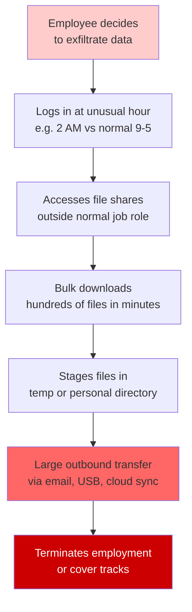
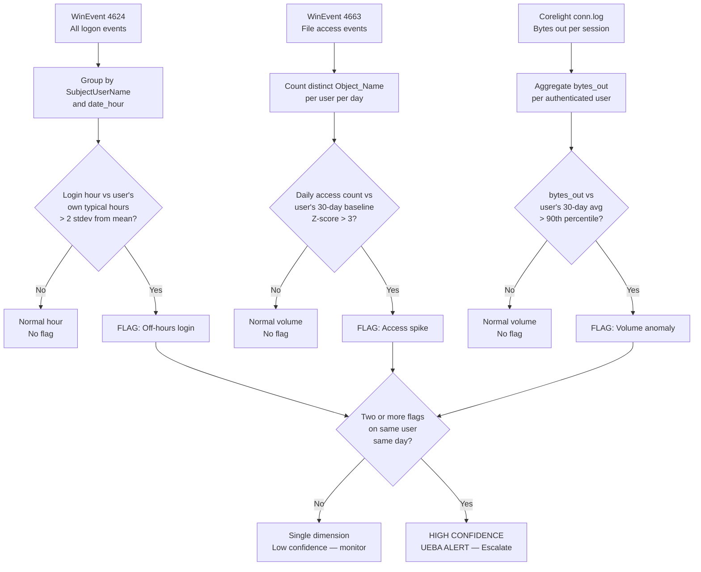
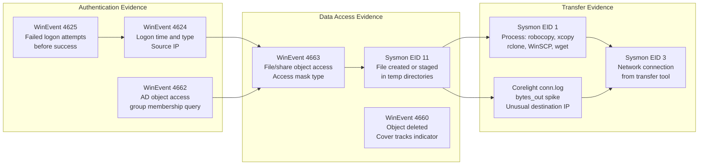
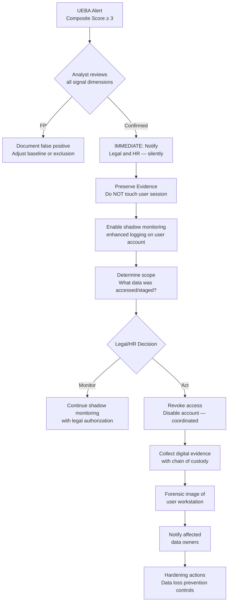
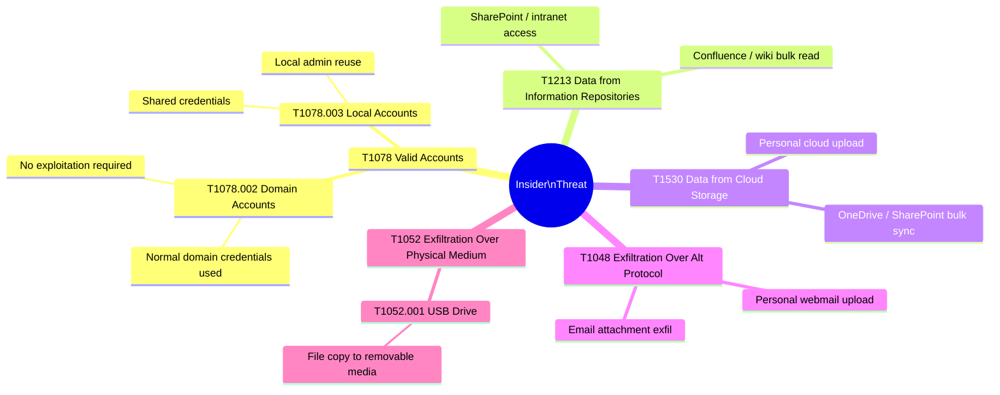

# Insider Threat Detection
## User and Entity Behavior Analytics (UEBA) via Per-User Behavioral Profiling

---

### Navigation

| Previous | Up | Next |
|---|---|---|
| [Privilege Escalation](./06_privilege_escalation.md) | [Detection Use Cases](.) | [Port Scanning](./08_port_scanning.md) |

**Related Techniques:** [Behavioral Profiling](../02_baseline_hunts/09_behavioral_profiling.md) | [Z-Score / Stdev](../02_baseline_hunts/03_zscore_stdev.md) | [Percentile / IQR](../02_baseline_hunts/04_percentile_iqr.md) | [Anomaly Detection](../02_baseline_hunts/10_anomaly_detection.md)

---

## Overview

| Attribute | Detail |
|---|---|
| **Threat** | Insider Threat / User and Entity Behavior Analytics (UEBA) |
| **MITRE ATT&CK** | [T1078](https://attack.mitre.org/techniques/T1078/) Valid Accounts, [T1530](https://attack.mitre.org/techniques/T1530/) Data from Cloud Storage, [T1213](https://attack.mitre.org/techniques/T1213/) Data from Information Repositories |
| **Sub-techniques** | T1078.002 Domain Accounts, T1078.003 Local Accounts |
| **Data Sources** | WinEvent 4624 (logon), 4625 (failed logon), 4663 (object access), 4662 (AD object access), Corelight `conn.log` (bytes out per user), Sysmon EID 1/11 |
| **Statistical Methods** | Behavioral Profiling (per-user baseline), Z-Score (current vs own 30-day history), Percentile (outlier data access volume) |
| **Detection Difficulty** | Hard — insider uses legitimate credentials and access; signal is behavioral deviation, not signature |

---

## Threat Description

**What is an insider threat?**
An insider threat originates from a person with authorized access to organizational systems — an employee, contractor, or partner. Because they use legitimate credentials and have genuine access rights, traditional signature-based detection largely fails. The signal is not *what* they access, but *how that behavior differs from their own norm*.

**Three categories of insider threat:**

| Category | Description | Key Indicator |
|---|---|---|
| Malicious insider | Intentional data theft, sabotage, or fraud | Sudden bulk access, off-hours activity, access to resources outside normal job role |
| Negligent insider | Accidental data mishandling, policy violations | Large uploads to personal cloud, unsanctioned tool usage |
| Compromised insider | Legitimate credentials stolen by external attacker | Login from unusual geo/IP, impossible travel, concurrent sessions |

**Why traditional detection fails:**
Every action taken by an insider is "authorized" — the user has been granted access to the files, shares, and systems they touch. A SIEM rule that fires on "access denied" or "unknown process" will never trigger. The detection challenge is entirely statistical: does this user's behavior today look like this user's behavior over the past 30–90 days?

**The UEBA approach:**
Build a per-user behavioral profile over a baseline window (30–90 days). Score each day's activity against that profile across multiple dimensions simultaneously. A single anomalous dimension is noise; two or more anomalous dimensions on the same user on the same day is a high-confidence signal.

---

## Attack Flow



---

## Detection Logic Flow



---

## PEAK: Prepare

### Hypothesis

> **"A user account is exhibiting behavior that significantly deviates from its established baseline across multiple dimensions: access time, data volume, and resource scope — indicating either a malicious insider or a compromised credential."**

### Data Sources

| Source | Log / Event | Key Fields |
|---|---|---|
| Windows Security | EID 4624 (Logon) | `SubjectUserName`, `LogonType`, `IpAddress`, `_time` |
| Windows Security | EID 4625 (Failed Logon) | `SubjectUserName`, `IpAddress`, `FailureReason` |
| Windows Security | EID 4663 (Object Access) | `SubjectUserName`, `ObjectName`, `ObjectType`, `AccessMask` |
| Windows Security | EID 4662 (AD Object Access) | `SubjectUserName`, `ObjectClass`, `OperationType` |
| Corelight | `conn.log` | `id.orig_h`, `orig_bytes`, `resp_bytes`, `duration` |
| Sysmon | EID 1 (Process Create) | `User`, `Image`, `CommandLine`, `ParentImage` |
| Sysmon | EID 11 (File Create) | `User`, `TargetFilename` |

### Scope and Exclusions

| Exclusion | Reason |
|---|---|
| Service accounts | High-volume, automated access is their normal behavior |
| Admin accounts during patching windows | Scheduled activity spikes on known maintenance dates |
| HR/Finance during quarter-end | Known seasonal volume spikes per job function |
| Backup operator accounts | Regularly access large volumes of files by design |
| IT accounts accessing DC / server shares | Admin access to broad paths is expected |

```spl
/* Baseline: build per-user login hour profile over 30 days */
index=wineventlog EventCode=4624
| where SubjectUserName!="" AND SubjectUserName!="SYSTEM"
| where NOT match(SubjectUserName, "(?i)\$$")
| where NOT SubjectUserName IN ("svc_backup","svc_monitor","svc_patching")
| eval login_hour = strftime(_time, "%H")
| stats count AS login_count BY SubjectUserName, login_hour
| eventstats sum(login_count) AS total_logins BY SubjectUserName
| eval hour_pct = round((login_count / total_logins) * 100, 1)
| sort SubjectUserName, login_hour
```

---

## PEAK: Explore

### Step 1 — Build Per-User Login Hour Profiles

Understand when each user typically logs in. This establishes the temporal baseline for off-hours detection.

```spl
/* Explore: per-user login hour distribution over 30-day baseline */
index=wineventlog EventCode=4624 earliest=-30d
| where SubjectUserName!="" AND SubjectUserName!="SYSTEM"
| where NOT match(SubjectUserName, "(?i)\$$")
| eval login_hour = tonumber(strftime(_time, "%H"))
| stats count AS logins,
        avg(login_hour) AS avg_hour,
        stdev(login_hour) AS stdev_hour,
        min(login_hour) AS earliest_hour,
        max(login_hour) AS latest_hour,
        values(login_hour) AS hours_seen
  BY SubjectUserName
| where logins > 20
| eval normal_window_low  = round(avg_hour - (2 * stdev_hour), 0)
| eval normal_window_high = round(avg_hour + (2 * stdev_hour), 0)
| sort SubjectUserName
```

### Step 2 — Data Access Frequency Baseline

Measure how many unique files each user accesses per day. This is the denominator for z-score anomaly detection.

```spl
/* Explore: daily file access counts per user — 30-day baseline */
index=wineventlog EventCode=4663 earliest=-30d
| where SubjectUserName!="" AND NOT match(SubjectUserName, "(?i)\$$")
| eval access_day = strftime(_time, "%Y-%m-%d")
| stats dc(ObjectName) AS unique_files,
        count AS total_accesses
  BY SubjectUserName, access_day
| stats avg(unique_files)   AS avg_daily_files,
        stdev(unique_files) AS stdev_daily_files,
        max(unique_files)   AS max_daily_files,
        count               AS days_observed
  BY SubjectUserName
| where days_observed > 10
| sort - avg_daily_files
```

### Step 3 — Outbound Bytes Per Authenticated User

Map network bytes out to user sessions using logon events joined to Corelight. This surfaces abnormal upload or transfer volume.

```spl
/* Explore: outbound bytes per source host, proxy for user data transfer */
index=corelight sourcetype=corelight_conn earliest=-30d
| where NOT cidrmatch("10.0.0.0/8", id.resp_h)
| where NOT cidrmatch("172.16.0.0/12", id.resp_h)
| where NOT cidrmatch("192.168.0.0/16", id.resp_h)
| eval transfer_day = strftime(_time, "%Y-%m-%d")
| stats sum(orig_bytes) AS bytes_out,
        sum(resp_bytes) AS bytes_in,
        dc(id.resp_h)   AS unique_dests,
        count           AS conn_count
  BY id.orig_h, transfer_day
| stats avg(bytes_out)   AS avg_daily_bytes_out,
        stdev(bytes_out) AS stdev_daily_bytes_out,
        max(bytes_out)   AS max_daily_bytes_out
  BY id.orig_h
| eval max_bytes_out_MB = round(max_daily_bytes_out / 1048576, 1)
| eval avg_bytes_out_MB = round(avg_daily_bytes_out / 1048576, 1)
| sort - max_bytes_out_MB
```

---

## PEAK: Analyze

### Primary Detection — Off-Hours Login Anomaly

Compare each user's current login hour against their own established norm. Flag logins more than 2 standard deviations from their personal mean.

```spl
/* INSIDER DETECTION: off-hours login — user's current hour vs own baseline */
index=wineventlog EventCode=4624 earliest=-30d
| where SubjectUserName!="" AND SubjectUserName!="SYSTEM"
| where NOT match(SubjectUserName, "(?i)\$$")
| eval login_hour = tonumber(strftime(_time, "%H"))
| eval is_today = if(relative_time(_time, "@d") >= relative_time(now(), "@d"), 1, 0)
| eventstats avg(login_hour)   AS avg_hour,
             stdev(login_hour) AS stdev_hour
  BY SubjectUserName
| eval z_score_hour = round((login_hour - avg_hour) / stdev_hour, 2)
| where is_today=1 AND abs(z_score_hour) > 2
| eval flag = "OFF_HOURS_LOGIN"
| table _time, SubjectUserName, login_hour, avg_hour, stdev_hour,
        z_score_hour, IpAddress, LogonType, flag
| sort - abs(z_score_hour)
```

### Enhanced Detection — File Access Volume Z-Score

Calculate the z-score of today's file access count against the user's 30-day daily baseline. Flag users whose access today is more than 3 standard deviations above their norm.

```spl
/* INSIDER DETECTION: file access spike — z-score vs 30-day per-user baseline */
index=wineventlog EventCode=4663 earliest=-30d
| where SubjectUserName!="" AND NOT match(SubjectUserName, "(?i)\$$")
| eval access_day = strftime(_time, "%Y-%m-%d")
| eval today = strftime(now(), "%Y-%m-%d")
| stats dc(ObjectName) AS unique_files BY SubjectUserName, access_day
| eventstats avg(unique_files)   AS avg_files,
             stdev(unique_files) AS stdev_files
  BY SubjectUserName
| where access_day = today
| eval z_score_files = round((unique_files - avg_files) / stdev_files, 2)
| where z_score_files > 3
| eval flag = "FILE_ACCESS_SPIKE"
| table SubjectUserName, access_day, unique_files, avg_files,
        stdev_files, z_score_files, flag
| sort - z_score_files
```

### Pivot — Unusual Share or Path Access

Use `rare` to surface file share paths a user has accessed that are outside their typical resource scope. One-off accesses to unusual shares are strong indicators.

```spl
/* PIVOT: rare share/path access per user — resources outside normal scope */
index=wineventlog EventCode=4663 earliest=-30d
| where SubjectUserName!="" AND NOT match(SubjectUserName, "(?i)\$$")
| rex field=ObjectName "^(?<share_root>\\\\[^\\]+\\[^\\]+)"
| where share_root!=""
| stats count AS access_count,
        dc(ObjectName) AS unique_objects,
        min(_time) AS first_access,
        max(_time) AS last_access
  BY SubjectUserName, share_root
| where access_count < 5
| eval first_access_str = strftime(first_access, "%Y-%m-%d %H:%M")
| sort SubjectUserName, access_count
```

### Combined UEBA Score — Multi-Dimension Composite Alert

Score each user across all signal dimensions on the current day. A composite score of 3 or higher warrants escalation.

```spl
/* INSIDER DETECTION: composite UEBA score — multi-dimension behavioral anomaly */
index=wineventlog (EventCode=4624 OR EventCode=4663) earliest=-30d
| where SubjectUserName!="" AND SubjectUserName!="SYSTEM"
| where NOT match(SubjectUserName, "(?i)\$$")
| eval event_day = strftime(_time, "%Y-%m-%d")
| eval today = strftime(now(), "%Y-%m-%d")
| eval login_hour = if(EventCode=4624, tonumber(strftime(_time, "%H")), null())
| eval file_access = if(EventCode=4663, ObjectName, null())
| eventstats avg(login_hour)   AS avg_hour,
             stdev(login_hour) AS stdev_hour
  BY SubjectUserName
| eventstats dc(file_access) AS total_daily_files BY SubjectUserName, event_day
| eventstats avg(total_daily_files)   AS avg_files,
             stdev(total_daily_files) AS stdev_files
  BY SubjectUserName
| where event_day=today
| eval z_hour  = round((login_hour - avg_hour) / stdev_hour, 2)
| eval z_files = round((total_daily_files - avg_files) / stdev_files, 2)
| eval score_hour  = if(abs(z_hour) > 2, 1, 0)
| eval score_files = if(z_files > 3, 2, if(z_files > 2, 1, 0))
| eval composite_score = score_hour + score_files
| where composite_score >= 2
| dedup SubjectUserName
| eval risk_level = case(
    composite_score >= 4, "CRITICAL",
    composite_score >= 3, "HIGH",
    composite_score >= 2, "MEDIUM",
    true(), "LOW"
  )
| table SubjectUserName, composite_score, risk_level,
        z_hour, z_files, score_hour, score_files
| sort - composite_score
```

---

## PEAK: Knowledge

### Evidence Collection Chain



### Evidence Chain — Step by Step

| Step | Action | Data Source | What to Look For |
|---|---|---|---|
| 1 | Confirm off-hours authentication | WinEvent 4624 | Login hour z-score > 2 vs user's own baseline |
| 2 | Check for prior failed logins | WinEvent 4625 | Failures from same IP before success — possible brute force |
| 3 | Measure file access volume | WinEvent 4663 | Daily unique file count z-score > 3 vs 30-day baseline |
| 4 | Identify unusual resource scope | WinEvent 4663 `ObjectName` | Access to shares not visited in prior 30 days |
| 5 | Look for staging behavior | Sysmon EID 11 | Files created in `C:\Users\*\AppData`, `C:\Temp`, removable media |
| 6 | Confirm exfiltration vector | Corelight conn.log / Sysmon EID 3 | Large bytes_out to external IP, or known cloud storage domain |

### Visualization — User Activity Timechart

```spl
/* VISUALIZATION: daily file access count per user over 30 days */
index=wineventlog EventCode=4663 earliest=-30d
| where SubjectUserName="<TARGET_USER>"
| timechart span=1d dc(ObjectName) AS unique_files_accessed
```

### Per-User Access Hour Heatmap

```spl
/* VISUALIZATION: login hour heatmap for suspect user */
index=wineventlog EventCode=4624 earliest=-30d
| where SubjectUserName="<TARGET_USER>"
| eval login_hour = strftime(_time, "%H")
| eval login_day  = strftime(_time, "%A")
| chart count OVER login_day BY login_hour
```

---

## Response Playbook

> **CRITICAL NOTE:** Insider threat response differs fundamentally from external incident response. Do NOT alert the subject user. Involve Legal and HR before taking any action that the user could detect. Premature action destroys evidence and creates legal exposure.



### Immediate Actions (0–1 hour)

| Action | Method | Note |
|---|---|---|
| Notify Legal and HR | Direct contact per insider threat policy | Do NOT notify the subject user |
| Enable enhanced logging on account | WinEvent auditing, DLP agent | Silent — no user-visible change |
| Preserve logs | Export relevant log data with timestamps | Chain of custody documentation |
| Assess data sensitivity | Classify what data was accessed | Drives regulatory notification requirements |

### Short-Term Actions (1–24 hours)

| Action | Method |
|---|---|
| Full timeline reconstruction | All 4624/4663 events for subject over 90 days |
| Identify exfiltration destination | Corelight conn.log, proxy logs, DLP events |
| Interview manager (if authorized) | HR-led, confirm whether activity was sanctioned |
| Identify co-conspirators | Did user share accessed files or communicate with unusual parties? |

### Remediation

| Action | Rationale |
|---|---|
| Coordinate account revocation with HR | Legal process integrity — simultaneous with HR action |
| Rotate service account credentials user had access to | Prevent continued access after termination |
| Review and tighten data access permissions | Apply least-privilege to sensitive shares |
| Notify data owners of potential exposure | Regulatory and contractual obligations |

### Hardening Actions

| Control | Implementation |
|---|---|
| Data Loss Prevention (DLP) | Inspect and block large file uploads to cloud storage |
| USB device control | Block or alert on removable media writes via GPO/EDR |
| Privileged Access Management (PAM) | Just-in-time access for sensitive repositories |
| User and Entity Behavior Analytics | Invest in dedicated UEBA platform with ML models |
| Offboarding automation | Immediate account disable on HR termination record |

---

## MITRE ATT&CK Mapping



| Technique | ID | Relevance to This Hunt |
|---|---|---|
| Valid Accounts | T1078 | Insider uses their own legitimate credentials |
| Domain Accounts | T1078.002 | Most enterprise insiders use domain accounts |
| Data from Information Repositories | T1213 | Bulk access to SharePoint, file shares, wikis |
| Data from Cloud Storage | T1530 | Exfil via personal OneDrive, Google Drive sync |
| Exfiltration Over Alt Protocol | T1048 | Exfil via email, FTP, personal cloud |
| Exfiltration Over Physical Medium | T1052 | USB drive — requires endpoint DLP to detect |

---

## Related Hunts and Use Cases

| Document | Relevance |
|---|---|
| [Behavioral Profiling](../02_baseline_hunts/09_behavioral_profiling.md) | Core methodology for per-user baseline construction |
| [Z-Score / Stdev](../02_baseline_hunts/03_zscore_stdev.md) | Z-score calculation for access volume anomaly detection |
| [Percentile / IQR](../02_baseline_hunts/04_percentile_iqr.md) | Percentile thresholds for outlier bytes-out detection |
| [Anomaly Detection](../02_baseline_hunts/10_anomaly_detection.md) | Broader anomaly detection methodology |
| [Privilege Escalation](./06_privilege_escalation.md) | Compromised insider may escalate privileges after entry |
| [Data Exfiltration](./02_data_exfiltration.md) | Final stage of insider threat kill chain |

---

*Navigation: [Home](../README.md) | [PEAK Framework](../00_peak_framework_overview.md) | [Splunk Functions](../01_splunk_search_head_functions.md) | [Previous: Privilege Escalation](./06_privilege_escalation.md) | [Next: Port Scanning](./08_port_scanning.md)*
