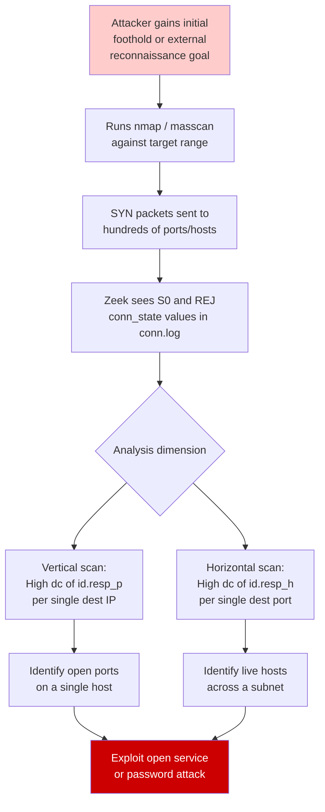
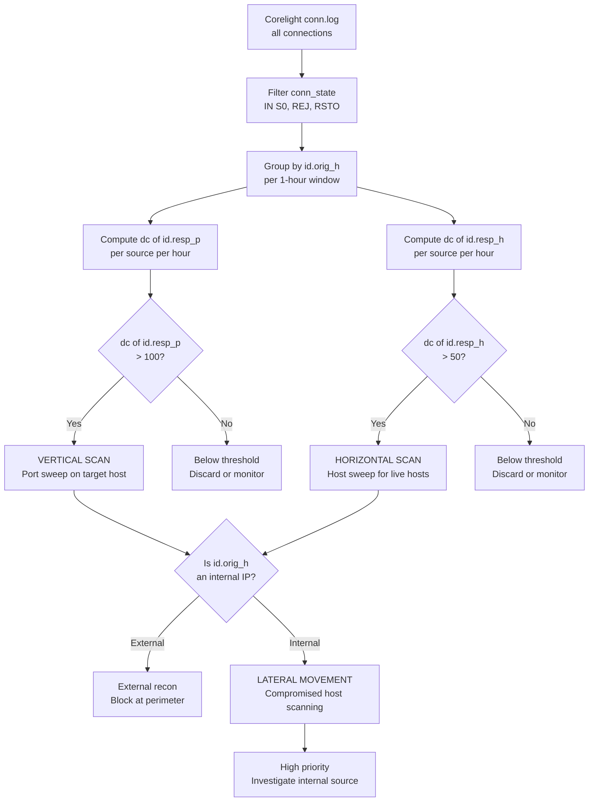
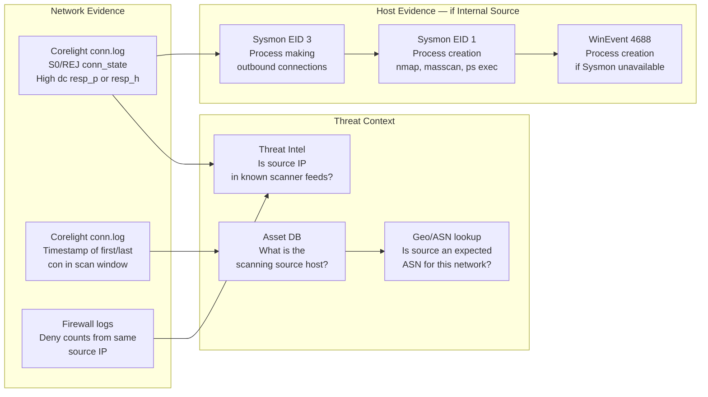
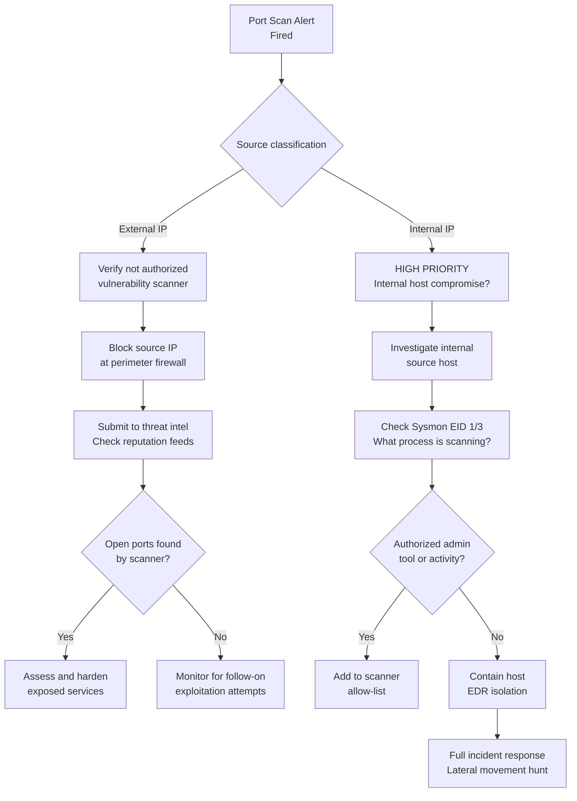
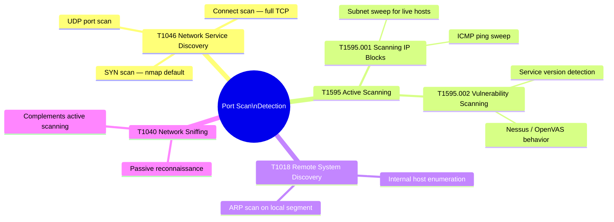

# Port Scanning Detection
## Network Reconnaissance Detection via Cardinality and Connection-State Analysis

---

### Navigation

| Previous | Up | Next |
|---|---|---|
| [Insider Threat](./07_insider_threat.md) | [Detection Use Cases](.) | [Rogue Services / Processes](./09_rogue_services_processes.md) |

**Related Techniques:** [Cardinality Analysis](../02_baseline_hunts/02_cardinality_analysis.md) | [Rate of Change](../02_baseline_hunts/07_rate_of_change.md) | [Frequency Analysis](../02_baseline_hunts/01_frequency_analysis.md)

---

## Overview

| Attribute | Detail |
|---|---|
| **Threat** | Network Reconnaissance / Port Scanning |
| **MITRE ATT&CK** | [T1046](https://attack.mitre.org/techniques/T1046/) Network Service Discovery, [T1595](https://attack.mitre.org/techniques/T1595/) Active Scanning |
| **Sub-techniques** | T1595.001 Scanning IP Blocks, T1595.002 Vulnerability Scanning |
| **Data Sources** | Corelight `conn.log` (`conn_state`: S0/REJ for failed connections), Sysmon EID 3 (Network Connection) |
| **Statistical Methods** | Cardinality Analysis (unique destination ports/IPs per source), Rate of Change (connection velocity over time) |
| **Detection Difficulty** | Low-Medium — fast scanners generate obvious statistical signals; slow/distributed scans are harder to detect |

---

## Threat Description

**What is port scanning?**
Before exploiting a target, an attacker probes the network to discover which hosts are alive and which services are listening. This reconnaissance step — port scanning — generates a characteristic pattern in network logs: a single source making many connection attempts to varied destinations, with a high proportion of failures.

**Scan types and their Zeek/Corelight signatures:**

| Scan Type | Description | Zeek `conn_state` | Detection Approach |
|---|---|---|---|
| SYN scan (`nmap -sS`) | Sends SYN, does not complete handshake | `S0` (no reply) or `REJ` (RST received) | High dc(id.resp_p), many S0/REJ |
| Connect scan (`nmap -sT`) | Full TCP connection, then closes | `SF` (success) then immediate close | Short duration, high cardinality |
| UDP scan | Probes UDP ports, many will be unreachable | `S0` or `ICMP unreachable` | Lower velocity, harder to detect |
| Slow scan | 1 connection per minute — evades rate thresholds | S0/REJ at very low rate | Rate of change over hours; harder |
| Horizontal sweep | Same port across many IPs | S0/REJ, fixed id.resp_p, high dc(id.resp_h) | dc(id.resp_h) anomaly |

**Zeek/Corelight `conn_state` reference:**

| State | Meaning | Significance |
|---|---|---|
| `S0` | SYN sent, no reply | Destination did not respond — host may be down or port filtered |
| `REJ` | Connection rejected (RST received) | Host is alive but port is closed |
| `SF` | Normal connection established and closed | Successful open port (in scan context: finding open ports) |
| `RSTO` | Originator reset connection | May indicate scan tool closing connections early |

**Key statistical insight:** Normal workstations contact a small, stable set of services — low `dc(id.resp_p)` and low `dc(id.resp_h)` per time window. A scanner has extreme cardinality on one or both dimensions. This makes port scanning one of the easiest attack behaviors to detect statistically, as long as the scan is not deliberately slow.

---

## Attack Flow



---

## Detection Logic Flow



---

## PEAK: Prepare

### Hypothesis

> **"A source IP is generating an anomalously high number of connection attempts to unique destination ports or hosts within a short time window, with a high proportion of failed connections (S0/REJ), indicative of automated network port scanning."**

### Data Sources

| Source | Log | Key Fields |
|---|---|---|
| Corelight | `conn.log` | `_time`, `id.orig_h`, `id.resp_h`, `id.resp_p`, `conn_state`, `proto`, `orig_bytes`, `duration` |
| Sysmon | EID 3 (Network Connection) | `SourceIp`, `DestinationIp`, `DestinationPort`, `Image`, `Initiated` |

### Scope and Exclusions

Known scanning tools in the environment will generate large volumes of alerts if not excluded. Maintain an allow-list of authorized scanner IPs and update it as part of the vulnerability management program.

| Exclusion | Source IPs | Reason |
|---|---|---|
| Vulnerability scanner | Nessus / Qualys / Rapid7 source IPs | Authorized scanning — generates identical pattern |
| Asset inventory | CMDB discovery agents | Periodic sweeps to inventory live hosts |
| Network monitoring probes | Nagios / PRTG / SolarWinds | Regular polling of services |
| Load balancer health checks | Internal LB VIPs | Health probes to backend pool members |
| Security assessment windows | Pen test authorization periods | Known authorized scanning during assessments |

```spl
/* Baseline: identify top sources by failed connections to build allow-list */
index=corelight sourcetype=corelight_conn earliest=-7d
| where conn_state IN ("S0","REJ","RSTO")
| where NOT cidrmatch("10.0.0.0/8", id.orig_h) OR cidrmatch("10.0.0.0/8", id.resp_h)
| stats count AS failed_conns,
        dc(id.resp_p) AS unique_ports,
        dc(id.resp_h) AS unique_hosts
  BY id.orig_h
| where failed_conns > 100
| sort - failed_conns
| head 30
```

---

## PEAK: Explore

### Step 1 — Top Sources by Unique Destination Ports

Identify which source IPs are contacting the most unique destination ports. This is the primary cardinality signal for vertical (port) scanning.

```spl
/* Explore: top sources by unique destination port count */
index=corelight sourcetype=corelight_conn earliest=-24h
| where conn_state IN ("S0","REJ","RSTO","OTH")
| where NOT cidrmatch("10.0.0.0/8", id.orig_h)
| stats dc(id.resp_p)   AS unique_ports,
        dc(id.resp_h)   AS unique_hosts,
        count           AS total_conns,
        values(proto)   AS protocols
  BY id.orig_h
| eval scan_ratio = round((unique_ports / total_conns) * 100, 1)
| where unique_ports > 50
| sort - unique_ports
```

### Step 2 — Failed Connection Analysis by Source

Profile the ratio of failed connections per source. High S0/REJ ratios distinguish scanners from legitimate high-cardinality services like CDNs.

```spl
/* Explore: failed connection ratio per source IP */
index=corelight sourcetype=corelight_conn earliest=-24h
| where NOT cidrmatch("10.0.0.0/8", id.orig_h)
| stats count AS total_conns,
        sum(if(conn_state IN ("S0","REJ","RSTO"), 1, 0)) AS failed_conns,
        dc(id.resp_p) AS unique_ports,
        dc(id.resp_h) AS unique_hosts
  BY id.orig_h
| where total_conns > 50
| eval fail_pct = round((failed_conns / total_conns) * 100, 1)
| where fail_pct > 60
| sort - fail_pct
```

### Step 3 — Scan Velocity Timechart

Visualize the rate of connections per suspect source. Fast scanners will show a sharp spike; slow scanners will show a gradual, sustained elevation.

```spl
/* Explore: connection velocity timechart for top scanning sources */
index=corelight sourcetype=corelight_conn earliest=-24h
| where conn_state IN ("S0","REJ","RSTO")
| timechart span=5m count AS failed_conns BY id.orig_h limit=5
```

---

## PEAK: Analyze

### Primary Detection — Vertical Scan (Port Sweep)

A single source IP contacting many unique ports on one or a small set of destination IPs within a 1-hour window.

```spl
/* PORT SCAN DETECTION: vertical scan — unique ports per source per hour */
index=corelight sourcetype=corelight_conn
| where conn_state IN ("S0","REJ","RSTO","OTH")
| where NOT cidrmatch("10.0.0.0/8", id.orig_h)
| where NOT (id.orig_h IN ("10.20.5.15","10.20.5.16","10.30.1.1"))
| bin _time span=1h
| stats dc(id.resp_p)   AS unique_ports,
        dc(id.resp_h)   AS unique_hosts,
        count           AS total_conns,
        values(id.resp_p) AS sampled_ports,
        min(_time)      AS window_start
  BY id.orig_h, _time
| where unique_ports > 100
| eval scan_type = case(
    unique_ports > 1000, "FULL_SCAN",
    unique_ports > 500,  "BROAD_SCAN",
    unique_ports > 100,  "PARTIAL_SCAN",
    true(), "BELOW_THRESHOLD"
  )
| eval window_start_str = strftime(window_start, "%Y-%m-%d %H:%M")
| table window_start_str, id.orig_h, scan_type,
        unique_ports, unique_hosts, total_conns
| sort - unique_ports
```

### Enhanced Detection — Horizontal Scan (Host Sweep)

A single source contacting the same destination port across many different destination IPs. Common when scanning for a specific vulnerable service across a subnet.

```spl
/* PORT SCAN DETECTION: horizontal scan — unique hosts per source per hour */
index=corelight sourcetype=corelight_conn
| where conn_state IN ("S0","REJ","RSTO","OTH")
| where NOT (id.orig_h IN ("10.20.5.15","10.20.5.16","10.30.1.1"))
| bin _time span=1h
| stats dc(id.resp_h)   AS unique_hosts,
        dc(id.resp_p)   AS unique_ports,
        count           AS total_conns,
        mode(id.resp_p) AS primary_port
  BY id.orig_h, _time
| where unique_hosts > 50 AND unique_ports < 5
| eval sweep_type = "HORIZONTAL_HOST_SWEEP"
| eval window_str = strftime(_time, "%Y-%m-%d %H:%M")
| table window_str, id.orig_h, sweep_type, unique_hosts,
        primary_port, unique_ports, total_conns
| sort - unique_hosts
```

### Slow Scan Detection — Rate of Change

Use `autoregress` on hourly cardinality counts to detect gradual accumulation of unique ports over time — the signature of a slow scan designed to evade rate-based thresholds.

```spl
/* PORT SCAN DETECTION: slow scan via rate-of-change on hourly unique ports */
index=corelight sourcetype=corelight_conn earliest=-12h
| where conn_state IN ("S0","REJ")
| bin _time span=1h
| stats dc(id.resp_p) AS unique_ports BY id.orig_h, _time
| sort id.orig_h, _time
| autoregress unique_ports AS prev_ports p=1
| eval port_delta = unique_ports - prev_ports
| eventstats sum(port_delta) AS cumulative_new_ports,
             avg(port_delta) AS avg_hourly_rate
  BY id.orig_h
| where cumulative_new_ports > 200 AND avg_hourly_rate > 10
| dedup id.orig_h
| eval scan_type = "SLOW_SCAN"
| table id.orig_h, scan_type, cumulative_new_ports,
        avg_hourly_rate, unique_ports
| sort - cumulative_new_ports
```

### Internal Source Investigation — Lateral Movement Pivot

When a scanner source is an internal IP, escalate priority immediately. Internal scanning indicates a compromised host or an insider performing lateral movement reconnaissance.

```spl
/* PIVOT: internal scanning source — lateral movement investigation */
index=corelight sourcetype=corelight_conn
| where conn_state IN ("S0","REJ","RSTO")
| where cidrmatch("10.0.0.0/8", id.orig_h)
| where cidrmatch("10.0.0.0/8", id.resp_h)
| where NOT (id.orig_h IN ("10.20.5.15","10.20.5.16","10.30.1.1"))
| bin _time span=1h
| stats dc(id.resp_p) AS unique_ports,
        dc(id.resp_h) AS unique_hosts,
        count         AS total_conns
  BY id.orig_h, _time
| where unique_ports > 20 OR unique_hosts > 20
| eval priority = "HIGH — INTERNAL SOURCE"
| eval time_str = strftime(_time, "%Y-%m-%d %H:%M")
| table time_str, id.orig_h, priority,
        unique_ports, unique_hosts, total_conns
| sort - total_conns
```

---

## PEAK: Knowledge

### Evidence Collection Chain



### Evidence Chain — Step by Step

| Step | Action | Data Source | What to Look For |
|---|---|---|---|
| 1 | Confirm scanning pattern | Corelight `conn.log` | `dc(id.resp_p) > 100` or `dc(id.resp_h) > 50` in 1h window with S0/REJ |
| 2 | Identify scan type | Corelight `conn.log` | High resp_p = vertical; high resp_h + fixed port = horizontal; both = full scan |
| 3 | Classify source | Asset DB / IP lookup | External IP (internet), internal IP (compromised host or insider), DMZ host |
| 4 | If internal: identify process | Sysmon EID 3, EID 1 | What process is making connections? `nmap.exe`? `powershell.exe`? |
| 5 | Check for successful connections | Corelight `conn.log` | `conn_state=SF` mixed with S0/REJ — attacker found open ports |
| 6 | Assess downstream exploitation | Follow-on conn.log events from same source | Did connections to open ports occur after scan completed? |

### Visualization — Scan Cardinality Over Time

```spl
/* VISUALIZATION: unique destination ports over time per suspect scanner */
index=corelight sourcetype=corelight_conn
| where id.orig_h="<SUSPECT_IP>"
| where conn_state IN ("S0","REJ","RSTO")
| timechart span=10m dc(id.resp_p) AS unique_ports_per_10m,
                     count         AS total_conns
```

### Port Distribution Histogram

```spl
/* VISUALIZATION: which ports was the scanner probing? */
index=corelight sourcetype=corelight_conn
| where id.orig_h="<SUSPECT_IP>"
| where conn_state IN ("S0","REJ","RSTO","SF")
| stats count AS probe_count BY id.resp_p
| eval service = case(
    id.resp_p=22,   "SSH",
    id.resp_p=23,   "Telnet",
    id.resp_p=80,   "HTTP",
    id.resp_p=443,  "HTTPS",
    id.resp_p=445,  "SMB",
    id.resp_p=3389, "RDP",
    id.resp_p=1433, "MSSQL",
    id.resp_p=3306, "MySQL",
    true(), "Other"
  )
| sort - probe_count
| head 30
```

---

## Response Playbook



### Immediate Actions (0–1 hour)

| Action | Method |
|---|---|
| Verify source is not authorized scanner | Check vulnerability scanner allow-list |
| Block external source at perimeter firewall | Emergency ACL or security group rule |
| For internal source: initiate host investigation | Sysmon EID 1/3 on scanning host |
| Check what ports were found open | Corelight `conn.log` filter on `conn_state=SF` from scanner |

### Short-Term Actions (1–24 hours)

| Action | Method |
|---|---|
| Review exposed services on scanned ports | Were open ports found? Are they expected to be open? |
| Check for follow-on exploitation | conn.log events from same source after scan completion |
| Internal source: full malware/lateral movement investigation | EDR telemetry, Sysmon logs on compromised host |
| Threat intelligence enrichment | Submit scanner IP to threat intel platforms |

### Remediation

| Action | Rationale |
|---|---|
| Harden or close unnecessary open ports | Remove services that should not be internet-accessible |
| Network segmentation review | Limit which internal hosts can reach which segments |
| Patch services found open and vulnerable | Scanning often precedes exploitation of discovered services |

### Hardening Actions

| Control | Implementation |
|---|---|
| Network segmentation | Micro-segment internal networks to limit scan blast radius |
| Host-based firewall policy | Block unsolicited inbound on all hosts — reduce scan visibility |
| Deception technology | Deploy honeypot services on unused ports to detect scanners |
| Egress filtering per host role | Workstations should not initiate arbitrary port connections |
| IDS/IPS signature tuning | Enable Snort/Suricata port scan detection rules on NIDS |

---

## MITRE ATT&CK Mapping



| Technique | ID | Relevance to This Hunt |
|---|---|---|
| Network Service Discovery | T1046 | Direct mapping — scanning to find open services |
| Active Scanning | T1595 | External reconnaissance before attack |
| Scanning IP Blocks | T1595.001 | Horizontal host sweep pattern |
| Vulnerability Scanning | T1595.002 | Service version/vuln scanning pattern |
| Remote System Discovery | T1018 | Internal scanning for lateral movement |

---

## Related Hunts and Use Cases

| Document | Relevance |
|---|---|
| [Cardinality Analysis](../02_baseline_hunts/02_cardinality_analysis.md) | Core methodology for dc-based scan detection |
| [Rate of Change](../02_baseline_hunts/07_rate_of_change.md) | Velocity analysis for slow scan detection |
| [Frequency Analysis](../02_baseline_hunts/01_frequency_analysis.md) | Connection frequency profiling per source |
| [Insider Threat](./07_insider_threat.md) | Internal scanning may indicate compromised insider account |
| [Rogue Services / Processes](./09_rogue_services_processes.md) | Scanning often precedes rogue service installation |

---

*Navigation: [Home](../README.md) | [PEAK Framework](../00_peak_framework_overview.md) | [Splunk Functions](../01_splunk_search_head_functions.md) | [Previous: Insider Threat](./07_insider_threat.md) | [Next: Rogue Services / Processes](./09_rogue_services_processes.md)*
