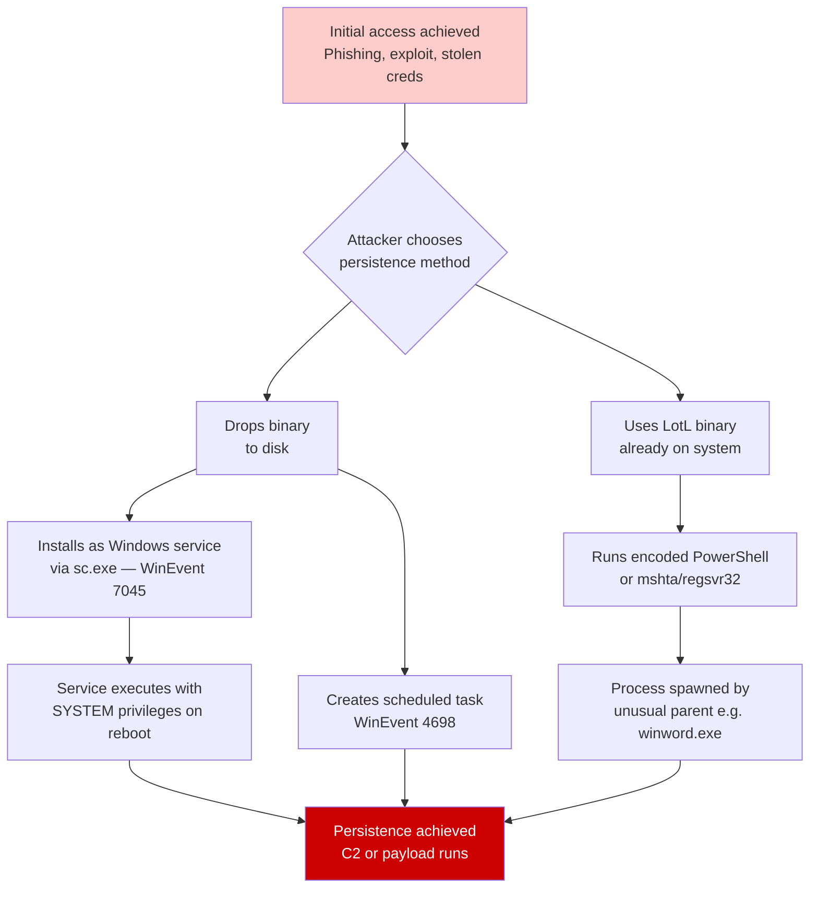
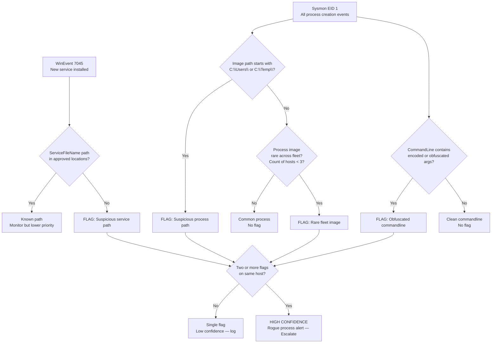
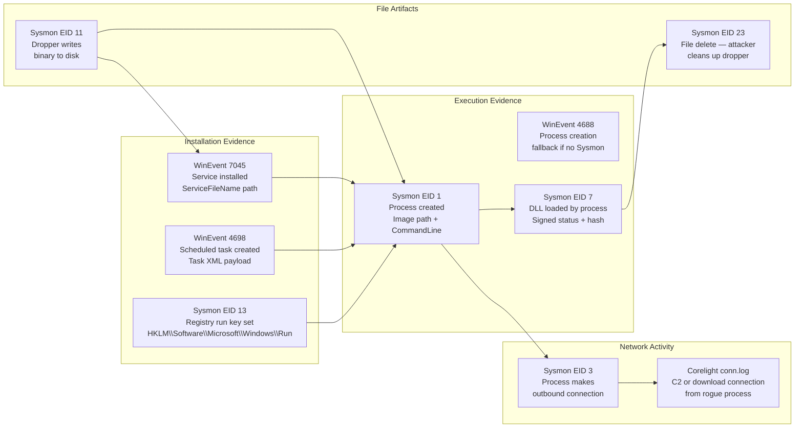
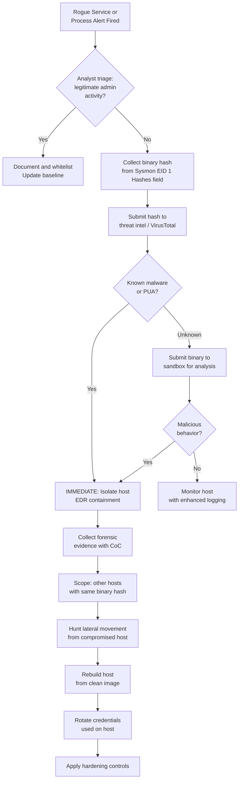
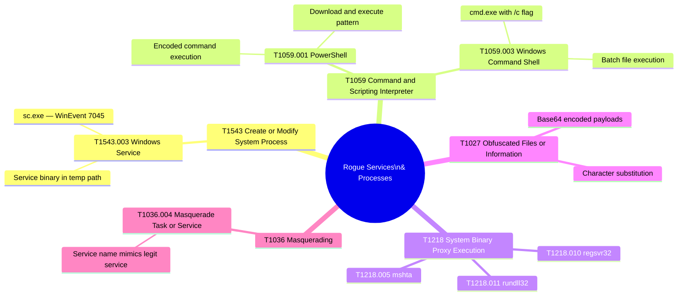

# Rogue Services and Processes Detection
## Persistence and Execution Detection via Frequency Analysis and Behavioral Profiling

---

### Navigation

| Previous | Up | Next |
|---|---|---|
| [Port Scanning](./08_port_scanning.md) | [Detection Use Cases](.) | [← Back to Baseline Hunts](../02_baseline_hunts/) |

**Related Techniques:** [Frequency Analysis](../02_baseline_hunts/01_frequency_analysis.md) | [Percentile / IQR](../02_baseline_hunts/04_percentile_iqr.md) | [Behavioral Profiling](../02_baseline_hunts/09_behavioral_profiling.md)

---

## Overview

| Attribute | Detail |
|---|---|
| **Threat** | Rogue Services and Processes (Persistence, Execution) |
| **MITRE ATT&CK** | [T1543](https://attack.mitre.org/techniques/T1543/) Create or Modify System Process, [T1059](https://attack.mitre.org/techniques/T1059/) Command and Scripting Interpreter |
| **Sub-techniques** | T1543.003 Windows Service, T1059.001 PowerShell, T1059.003 Windows Command Shell |
| **Data Sources** | WinEvent 7045 (new service installed), WinEvent 4688 (process creation), Sysmon EID 1 (process create), Sysmon EID 7 (image load / DLL load) |
| **Statistical Methods** | Frequency Analysis (rare process names and paths across fleet), Percentile/IQR (anomalous process execution count on host), Behavioral Profiling (processes never before seen on this host) |
| **Detection Difficulty** | Medium — legitimate admin tools overlap with attacker tools; living-off-the-land techniques reuse trusted binaries |

---

## Threat Description

**What are rogue services and processes?**
After gaining initial access, attackers establish persistence and execute additional payloads. Two common mechanisms are: installing a new Windows service (which runs on boot with SYSTEM-level privileges) and spawning processes from unusual locations or with obfuscated arguments. Both leave detectable artifacts in Windows event logs and Sysmon telemetry.

**Rogue service installation:**
An attacker with local admin rights can install a service using `sc.exe`, the Windows Service Control Manager API, or tools like `PSExec`. Windows logs this in Event ID 7045. The service binary path is the key artifact — legitimate services run from `C:\Windows\System32` or `C:\Program Files`; attacker services often run from temp directories or custom paths.

**Rogue process execution:**
Malicious processes may be executables dropped by the attacker and run from non-standard paths, or they may be legitimate Windows binaries (living-off-the-land / LotL) called with unusual arguments. LotL is particularly challenging because the process name (`mshta.exe`, `regsvr32.exe`, `rundll32.exe`) is completely legitimate — only the command-line arguments or the parent process reveal the malicious intent.

**Living-off-the-Land (LotL) binary examples:**

| Binary | Legitimate Use | Attacker Abuse |
|---|---|---|
| `mshta.exe` | Run HTML applications | Execute remote VBScript/JScript payloads |
| `regsvr32.exe` | Register COM DLLs | Execute remote scriptlet — `squiblydoo` |
| `rundll32.exe` | Load and call DLL functions | Execute shellcode via DLL |
| `wscript.exe` / `cscript.exe` | Run WSH scripts | Execute malicious VBScript / JScript |
| `powershell.exe` | Administration and automation | Download and execute payloads, encoded commands |
| `certutil.exe` | Certificate management | Download files (`-urlcache -f`) |
| `msiexec.exe` | Install MSI packages | Execute remote MSI payload |

**Key statistical insight:** Legitimate environments have a stable, recurring set of processes on each host — the same set of services and processes runs day after day. A process image path that has never appeared on a host, or that appears on only 1–2 hosts across the entire fleet, is a statistically rare event that warrants investigation. Frequency analysis across the fleet is the most scalable detection approach.

---

## Attack Flow



---

## Detection Logic Flow



---

## PEAK: Prepare

### Hypothesis

> **"A process or service has appeared that is either newly observed in this environment, executing from a non-standard file system path, or exhibits encoded and obfuscated command-line arguments — indicating attacker-controlled execution or persistence."**

### Data Sources

| Source | Log / Event | Key Fields |
|---|---|---|
| Windows System | EID 7045 (Service Install) | `ServiceName`, `ServiceFileName`, `ServiceType`, `StartType`, `AccountName` |
| Windows Security | EID 4688 (Process Create) | `NewProcessName`, `CommandLine`, `ParentProcessName`, `SubjectUserName` |
| Sysmon | EID 1 (Process Create) | `Image`, `CommandLine`, `ParentImage`, `User`, `Hashes`, `IntegrityLevel` |
| Sysmon | EID 7 (Image Load) | `Image`, `ImageLoaded`, `Signed`, `Signature`, `Hashes` |
| Sysmon | EID 3 (Network Connect) | `Image`, `DestinationIp`, `DestinationPort`, `Initiated` |
| Sysmon | EID 11 (File Create) | `Image`, `TargetFilename` |

### Scope and Exclusions

| Exclusion | Reason |
|---|---|
| Known software deployment tools | SCCM / Intune-pushed packages run from temp paths temporarily |
| IT admin tools during change windows | PSExec, remote admin tools used by authorized staff |
| Developer workstations | Visual Studio debug builds run from `C:\Users\` paths |
| Build/CI systems | Automated build agents run from non-standard paths by design |
| Security tools | EDR agents, AV scanners may use unusual paths |

```spl
/* Baseline: service install frequency over 90 days to identify normal services */
index=wineventlog sourcetype="WinEventLog:System" EventCode=7045 earliest=-90d
| stats count AS install_count,
        dc(host) AS unique_hosts,
        min(_time) AS first_seen,
        max(_time) AS last_seen,
        values(ServiceFileName) AS service_paths
  BY ServiceName
| where install_count > 1
| eval first_seen_str = strftime(first_seen, "%Y-%m-%d")
| sort - unique_hosts
```

---

## PEAK: Explore

### Step 1 — Service Install Frequency Analysis

Build a frequency table of services installed over 90 days. Services that appear rarely or only once in 90 days are anomalous.

```spl
/* Explore: service install frequency — top and bottom by prevalence */
index=wineventlog sourcetype="WinEventLog:System" EventCode=7045 earliest=-90d
| stats count AS total_installs,
        dc(host) AS host_count,
        values(host) AS hosts,
        values(ServiceFileName) AS file_paths,
        values(AccountName) AS install_accounts
  BY ServiceName
| eval prevalence = case(
    host_count > 50,  "HIGH — fleet-wide",
    host_count > 10,  "MEDIUM — common",
    host_count > 3,   "LOW — uncommon",
    true(),           "RARE — investigate"
  )
| where host_count < 4
| sort host_count
```

### Step 2 — Rare Process Images Across Fleet

Use `rare` to surface process images that have appeared on very few hosts. A process seen on only 1–2 hosts across a 1,000-host fleet is a high-signal anomaly.

```spl
/* Explore: rare process images across fleet — seen on < 3 hosts */
index=sysmon EventCode=1 earliest=-7d
| where NOT Image IN (
    "C:\\Windows\\System32\\svchost.exe",
    "C:\\Windows\\System32\\lsass.exe",
    "C:\\Windows\\explorer.exe",
    "C:\\Windows\\System32\\services.exe"
  )
| stats dc(host) AS host_count,
        count    AS exec_count,
        values(host) AS seen_on_hosts,
        values(CommandLine) AS sample_cmdlines
  BY Image
| where host_count < 3
| sort host_count, exec_count
```

### Step 3 — Process Path Distribution

Understand the filesystem path distribution of all processes in the environment. This identifies which directories are normal launch points and which are anomalous.

```spl
/* Explore: process image directory distribution across fleet */
index=sysmon EventCode=1 earliest=-7d
| rex field=Image "(?<image_dir>.+)\\[^\\\\]+$"
| stats dc(host)      AS host_count,
        count         AS exec_count,
        dc(Image)     AS unique_images
  BY image_dir
| eval is_standard = case(
    like(image_dir, "C:\\Windows%"),         "STANDARD",
    like(image_dir, "C:\\Program Files%"),   "STANDARD",
    like(image_dir, "C:\\Program Files (x86)%"), "STANDARD",
    like(image_dir, "C:\\Users%"),           "NON-STANDARD — user path",
    like(image_dir, "C:\\Temp%"),            "NON-STANDARD — temp",
    like(image_dir, "C:\\ProgramData%"),     "REVIEW",
    true(), "UNKNOWN — investigate"
  )
| where is_standard != "STANDARD"
| sort - exec_count
```

---

## PEAK: Analyze

### Primary Detection — New Service Installation (Never-Before-Seen)

Compare services installed in the last 24 hours against the 90-day baseline. Any service name not seen in the baseline is a high-priority finding.

```spl
/* ROGUE SERVICE DETECTION: new service not in 90-day baseline */
index=wineventlog sourcetype="WinEventLog:System" EventCode=7045
| eval install_period = if(
    _time > relative_time(now(), "-24h"), "TODAY", "BASELINE"
  )
| stats count AS install_count,
        dc(host) AS host_count,
        values(ServiceFileName) AS file_paths,
        values(AccountName) AS accounts,
        min(_time) AS first_seen
  BY ServiceName, install_period
| eval first_seen_str = strftime(first_seen, "%Y-%m-%d %H:%M")
| eventstats dc(eval(if(install_period="BASELINE", ServiceName, null()))) AS in_baseline
  BY ServiceName
| where install_period="TODAY" AND in_baseline=0
| eval finding = "NEW SERVICE — not in 90-day baseline"
| table first_seen_str, host_count, ServiceName, file_paths, accounts, finding
| sort first_seen_str
```

### Enhanced Detection — Suspicious Process Path

Flag processes executing from user-writable directories — paths where an attacker can drop a binary without admin rights.

```spl
/* ROGUE PROCESS DETECTION: execution from non-standard writable paths */
index=sysmon EventCode=1
| where match(Image, "(?i)C:\\\\Users\\\\|C:\\\\Temp\\\\|C:\\\\Windows\\\\Temp\\\\|C:\\\\ProgramData\\\\(?!Microsoft)")
| where NOT match(Image, "(?i)C:\\\\Users\\\\[^\\\\]+\\\\AppData\\\\Local\\\\(Google|Microsoft|Slack|Zoom)")
| stats count AS exec_count,
        dc(host) AS host_count,
        values(CommandLine) AS cmdlines,
        values(ParentImage) AS parent_processes,
        values(User) AS users,
        min(_time) AS first_seen
  BY Image
| eval first_seen_str = strftime(first_seen, "%Y-%m-%d %H:%M")
| eval risk = case(
    match(Image, "(?i)C:\\\\Temp\\\\|C:\\\\Windows\\\\Temp\\\\"), "HIGH",
    match(Image, "(?i)C:\\\\Users\\\\[^\\\\]+\\\\AppData\\\\Roaming"), "MEDIUM",
    true(), "REVIEW"
  )
| sort - risk, first_seen_str
| table first_seen_str, host_count, Image, risk,
        parent_processes, users, exec_count
```

### LotL Detection — Encoded and Obfuscated Command Lines

Detect PowerShell and scripting interpreter invocations with encoded commands or known payload-delivery patterns.

```spl
/* LOTL DETECTION: encoded and obfuscated PowerShell / scripting interpreter usage */
index=sysmon EventCode=1
| where match(Image, "(?i)(powershell|cmd|wscript|cscript|mshta|regsvr32|rundll32|certutil|msiexec)\.exe")
| where match(CommandLine, "(?i)(-enc|-encodedcommand|iex |invoke-expression|downloadstring|downloadfile|webclient|bitsadmin|-nop|-noninteractive|-windowstyle hidden|/c start|scrobj\.dll)")
| stats count AS occurrence_count,
        dc(host) AS host_count,
        values(host) AS affected_hosts,
        values(CommandLine) AS cmdlines,
        values(ParentImage) AS parents,
        min(_time) AS first_seen
  BY Image, User
| eval first_seen_str = strftime(first_seen, "%Y-%m-%d %H:%M")
| eval obfuscation_type = case(
    match(mvjoin(cmdlines,"|"), "(?i)-enc|-encodedcommand"), "BASE64_ENCODED",
    match(mvjoin(cmdlines,"|"), "(?i)iex|invoke-expression"),  "INVOKE_EXPRESSION",
    match(mvjoin(cmdlines,"|"), "(?i)downloadstring|webclient"), "DOWNLOAD_EXEC",
    match(mvjoin(cmdlines,"|"), "(?i)-windowstyle hidden|-nop"), "STEALTH_FLAGS",
    true(), "SUSPICIOUS_PATTERN"
  )
| table first_seen_str, host_count, Image, User,
        obfuscation_type, parents, occurrence_count
| sort - host_count
```

### Rare Image Fleet Hunt

A fleet-wide sweep for processes appearing on very few hosts — the most scalable approach for detecting novel malware implants.

```spl
/* ROGUE PROCESS DETECTION: rare image fleet hunt — seen on < 3 hosts in 7 days */
index=sysmon EventCode=1 earliest=-7d
| where NOT match(Image, "(?i)C:\\\\Windows\\\\(System32|SysWOW64|WinSxS)\\\\")
| where NOT match(Image, "(?i)C:\\\\Program Files")
| stats dc(host)          AS host_count,
        count             AS exec_count,
        values(host)      AS seen_on_hosts,
        values(User)      AS users,
        values(ParentImage) AS parent_images,
        min(_time)        AS first_seen
  BY Image
| where host_count < 3
| eval first_seen_str = strftime(first_seen, "%Y-%m-%d %H:%M")
| eval image_dir_risk = case(
    match(Image, "(?i)C:\\\\(Temp|Windows\\\\Temp|Users)"), "HIGH",
    match(Image, "(?i)C:\\\\ProgramData"), "MEDIUM",
    true(), "REVIEW"
  )
| sort image_dir_risk, host_count
| table first_seen_str, host_count, exec_count, Image,
        image_dir_risk, parent_images, users
```

---

## PEAK: Knowledge

### Evidence Collection Chain



### Evidence Chain — Step by Step

| Step | Action | Data Source | What to Look For |
|---|---|---|---|
| 1 | Detect new service or rare process | WinEvent 7045, Sysmon EID 1 | Service/image not in 90-day baseline; rare fleet prevalence |
| 2 | Examine service binary path | WinEvent 7045 `ServiceFileName` | Path in `C:\Users\`, `C:\Temp\`, `C:\Windows\Temp\` — highly suspicious |
| 3 | Trace process parent chain | Sysmon EID 1 `ParentImage` | `winword.exe → powershell.exe → cmd.exe` is a red flag |
| 4 | Inspect command-line arguments | Sysmon EID 1 `CommandLine` | Encoded flags (`-enc`), `iex`, `downloadstring`, stealth flags |
| 5 | Check DLL loads by process | Sysmon EID 7 | Unsigned DLLs loaded from temp paths, suspicious hashes |
| 6 | Confirm network activity | Sysmon EID 3, Corelight conn.log | Did the rogue process make outbound connections (C2)? |
| 7 | Identify staging artifacts | Sysmon EID 11 | Files written by rogue process — secondary payload staging |

### Visualization — Service Installation Timeline

```spl
/* VISUALIZATION: service installations over time — spot anomalous spikes */
index=wineventlog sourcetype="WinEventLog:System" EventCode=7045 earliest=-30d
| timechart span=1d count AS service_installs BY ServiceName limit=10
```

### Rare Process Prevalence Chart

```spl
/* VISUALIZATION: process prevalence across fleet — host count distribution */
index=sysmon EventCode=1 earliest=-7d
| where NOT match(Image, "(?i)C:\\\\Windows\\\\(System32|SysWOW64)\\\\")
| stats dc(host) AS host_count BY Image
| stats count AS image_count BY host_count
| sort host_count
```

---

## Response Playbook



### Immediate Actions (0–1 hour)

| Action | Method |
|---|---|
| Collect binary hash | Sysmon EID 1 `Hashes` field or EDR telemetry |
| Submit hash to threat intel | VirusTotal, MISP, in-house TI platform |
| Identify all hosts with same binary | Fleet-wide hash hunt via Sysmon or EDR |
| Preserve process memory | Memory dump of rogue process before isolation |
| Isolate if malicious confirmed | EDR containment or network isolation |

### Short-Term Actions (1–24 hours)

| Action | Method |
|---|---|
| Binary analysis | Static and dynamic analysis in sandbox |
| Service persistence check | WinEvent 7045, 4698, Sysmon EID 12/13 for run keys |
| Parent process chain reconstruction | Full Sysmon EID 1 chain from infection to rogue process |
| Credential exposure assessment | What accounts ran the process? What was accessed? |
| Scope: same binary or behavior on other hosts | Fleet-wide Sysmon hunt for matching hash or CommandLine |

### Remediation

| Action | Rationale |
|---|---|
| Remove rogue service and binary | `sc delete <service>` and delete binary — after evidence collection |
| Rebuild host from clean image | Assume full compromise; single service removal is insufficient |
| Rotate all credentials used on host | Process ran under user context — assume credential harvesting |
| Revoke any tokens or certificates | If process accessed credential stores (LSASS, cert store) |

### Hardening Actions

| Control | Implementation |
|---|---|
| AppLocker / WDAC policies | Whitelist execution paths — block `C:\Users\`, `C:\Temp\` |
| PowerShell Constrained Language Mode | Block full language mode for non-admin users |
| Script Block Logging | Enable PSScriptBlockLogging via GPO for all PS execution |
| Service installation restriction | GPO: restrict `sc.exe` to admin role only |
| Process creation audit | Enable WinEvent 4688 with CommandLine logging via audit policy |
| Sysmon deployment | Deploy Microsoft Sysmon with community config (SwiftOnSecurity) |

---

## MITRE ATT&CK Mapping



| Technique | ID | Relevance to This Hunt |
|---|---|---|
| Create or Modify System Process | T1543 | Core technique — attacker installs Windows service |
| Windows Service | T1543.003 | WinEvent 7045 direct detection |
| Command and Scripting Interpreter | T1059 | Script-based execution of rogue payloads |
| PowerShell | T1059.001 | Most common LotL scripting vector |
| System Binary Proxy Execution | T1218 | LotL via mshta, regsvr32, rundll32 |
| Obfuscated Files or Information | T1027 | Encoded commandlines to evade logging |
| Masquerading | T1036 | Rogue service named to appear legitimate |

---

## Related Hunts and Use Cases

| Document | Relevance |
|---|---|
| [Frequency Analysis](../02_baseline_hunts/01_frequency_analysis.md) | Rare process and service frequency methodology |
| [Percentile / IQR](../02_baseline_hunts/04_percentile_iqr.md) | Outlier detection for process execution counts |
| [Behavioral Profiling](../02_baseline_hunts/09_behavioral_profiling.md) | Per-host process baseline construction |
| [Beaconing](./01_beaconing.md) | Rogue process often establishes C2 beacon after installation |
| [Port Scanning](./08_port_scanning.md) | Scanning may precede rogue service deployment on discovered hosts |
| [Privilege Escalation](./06_privilege_escalation.md) | Service install requires admin rights — may follow privilege escalation |

---

*Navigation: [Home](../README.md) | [PEAK Framework](../00_peak_framework_overview.md) | [Splunk Functions](../01_splunk_search_head_functions.md) | [Previous: Port Scanning](./08_port_scanning.md) | [Back to Baseline Hunts](../02_baseline_hunts/)*
