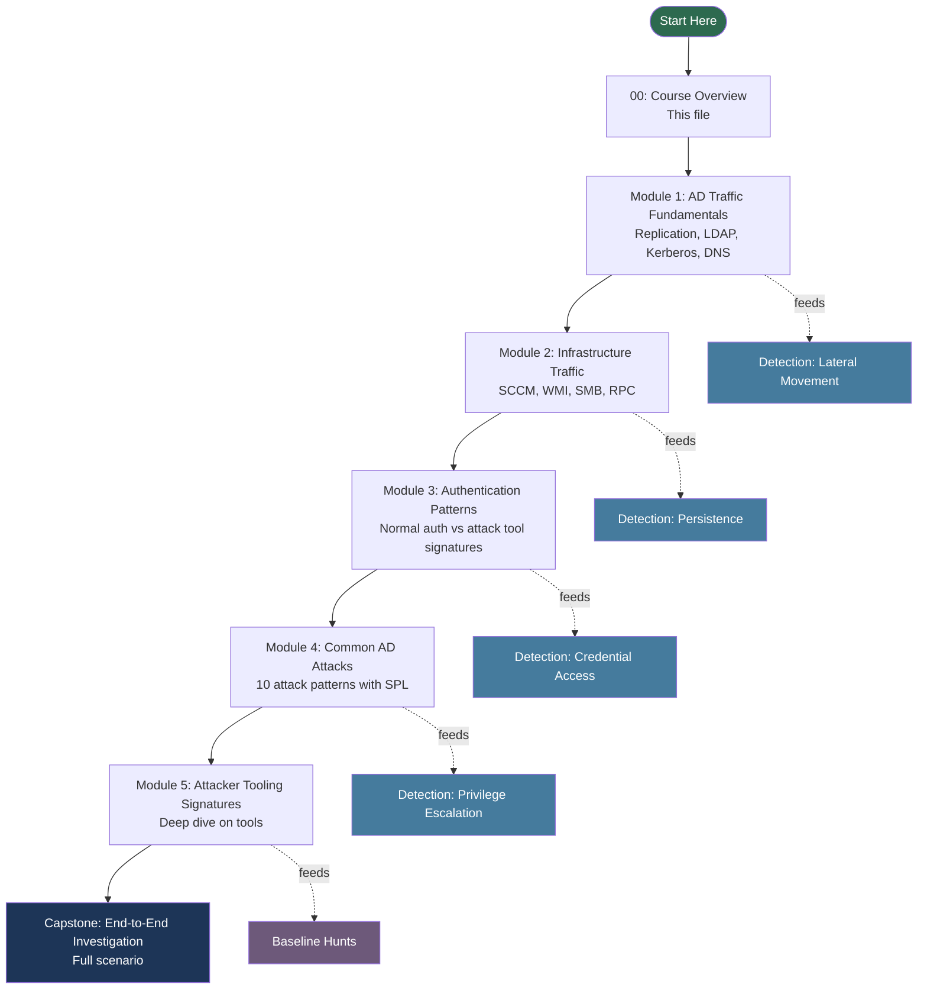
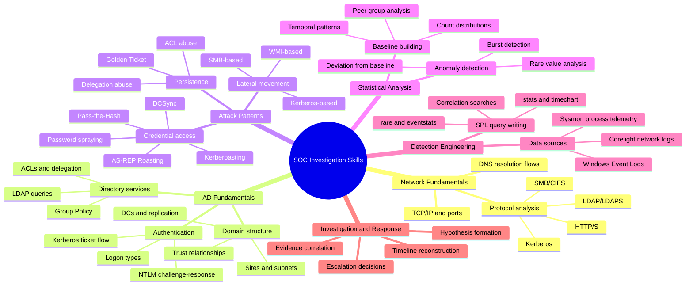
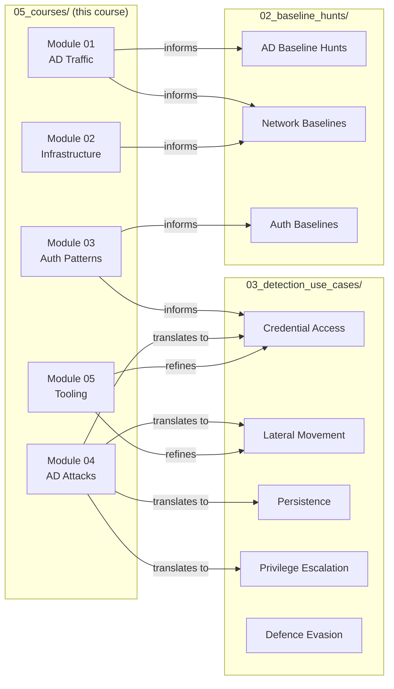

# Course Overview: SOC Analyst Investigation Skills

> **Audience:** SOC analysts (Tier 1–2) who want to move beyond alert triage and develop genuine investigation depth.
> **Data Sources:** Corelight (Zeek-based network telemetry), Windows Event Logs, Sysmon
> **Platform:** Splunk

---

## What This Course Covers

This course teaches you to investigate enterprise environments by building a mental model of what *normal* looks like first, then recognising when something deviates from that baseline. The curriculum progresses from foundational network and Active Directory (AD) traffic patterns through to recognising specific attacker tools and techniques, and culminates in a capstone investigation scenario.

The modules follow a deliberate sequence: you cannot reliably detect DCSync unless you understand how legitimate DC replication traffic looks. You cannot catch Kerberoasting without first knowing the normal distribution of Kerberos ticket requests. This is the philosophy of the course — **understand before you detect**.

---

## Prerequisites

| Requirement | Detail |
|---|---|
| Splunk basics | Ability to write `index=` searches, use `stats`, `table`, `where` |
| Windows networking | Familiarity with DNS, DHCP, SMB, Kerberos concepts at a high level |
| AD concepts | Know what a Domain Controller is, what LDAP does, what a service account is |
| Network basics | TCP/UDP, ports, client/server model |

If you are missing prerequisites, review the [PEAK Framework Overview](../00_peak_framework_overview.md) and the [Splunk Search Head Functions reference](../01_splunk_search_head_functions.md) before starting.

---

## How to Use the Modules

1. **Work in order.** Each module builds on the previous one. Module 3 references concepts introduced in Modules 1 and 2.
2. **Run the SPL queries in your environment.** Every query in this course is designed to run against real data. The baseline queries are safe to run at any time — they do not create alerts.
3. **Complete the knowledge checks.** They are short but calibrated. If you cannot answer them, re-read the relevant section before moving on.
4. **Cross-reference the detection use cases.** Each module links to the corresponding detection query in `03_detection_use_cases/`. After completing a module, review the production detection logic to see how the baseline concepts translate.
5. **Come back to modules when you investigate incidents.** These files are reference material, not just coursework.

---

## Learning Path

---

## Module Summary Table

| # | Module | Topic | Prerequisites | Key Skills |
|---|---|---|---|---|
| 00 | Course Overview | Navigation and context | None | Understanding course structure |
| 01 | AD Traffic Fundamentals | DRSUAPI, LDAP, Kerberos, DNS | AD concepts, Splunk basics | Identify normal AD traffic; detect DCSync, Kerberoasting |
| 02 | Infrastructure Traffic Analysis | SCCM, WMI, SMB, RPC | Module 01 | Baseline management traffic; detect WMI/SMB abuse |
| 03 | Authentication Patterns | Logon types, NTLM vs Kerberos, attack tools | Modules 01–02 | Distinguish tool signatures; write per-tool SPL |
| 04 | Common AD Attacks | 10 statistical attack fingerprints | Module 03 | Map MITRE TTPs to statistical signals |
| 05 | Attacker Tooling Signatures | Deep dives: Impacket, Rubeus, Mimikatz, etc. | Module 04 | Hunt for specific tool artefacts |
| CAP | Capstone Investigation | End-to-end scenario | All modules | Full kill-chain investigation |

---

## Skills Tree

---

## Learning Objectives by Module

### Module 01 — AD Traffic Fundamentals
After completing this module you will be able to:
- Describe what DC replication traffic looks like on the wire and in event logs
- Explain the Kerberos ticket flow and identify which events correspond to which steps
- Write an SPL query to baseline LDAP query rates by source host
- Identify anomalous DRSUAPI calls that indicate a DCSync attack attempt

### Module 02 — Infrastructure Traffic Analysis
After completing this module you will be able to:
- Identify legitimate SCCM traffic patterns and flag unusual callers
- Explain how WMI uses port 135 and dynamic high ports
- Write an SPL query to find `wmiprvse.exe` spawning suspicious child processes
- Baseline normal SMB share access and identify IPC$/ADMIN$ abuse

### Module 03 — Authentication Patterns
After completing this module you will be able to:
- Classify Windows logon types and explain when each appears
- Explain why NTLM is weaker than Kerberos and when it is used
- Identify the network and event log signatures of six major attack tools
- Write per-tool SPL detection queries

### Module 04 — Common AD Attacks
After completing this module you will be able to:
- Describe the statistical fingerprint of 10 common AD attacks
- Map each attack to its MITRE ATT&CK sub-technique
- Write SPL to detect each attack using baseline deviation
- Reference ACSC guidance on detecting and mitigating each technique

### Module 05 — Attacker Tooling Signatures
After completing this module you will be able to:
- Identify tool-specific artefacts left by Impacket, Rubeus, Mimikatz, BloodHound, and NetExec
- Correlate network (Corelight) and host (Sysmon/WinEvent) signals for each tool
- Build hunting queries that do not rely on known-bad IOCs

---

## How Modules Connect to the Repository

This course is part of a broader detection framework. The modules are the *educational layer* — they explain the theory and give you the investigative vocabulary. The other directories provide the *operational layer*.

Use the course modules to understand *why* a detection query is written the way it is. Use the baseline hunts to build your environmental baselines. Use the detection use cases when you are in active investigation mode or are tuning alerts.

---

## Module Links

- [Module 01: Active Directory Traffic Fundamentals](module_01_ad_traffic_fundamentals.md)
- [Module 02: Infrastructure Traffic Analysis](module_02_infrastructure_traffic_analysis.md)
- [Module 03: Enterprise Authentication Patterns vs Attack Traffic](module_03_authentication_patterns.md)
- [Module 04: Common Active Directory Attacks](module_04_common_ad_attacks.md)
- [Module 05: Attacker Tooling Signatures](module_05_attacker_tooling_signatures.md)

---

## Repository Links

- [PEAK Framework Overview](../00_peak_framework_overview.md)
- [Splunk Search Head Functions](../01_splunk_search_head_functions.md)
- [Baseline Hunts](../02_baseline_hunts/)
- [Detection Use Cases](../03_detection_use_cases/)

---

*Last updated: 2026-03-28*
