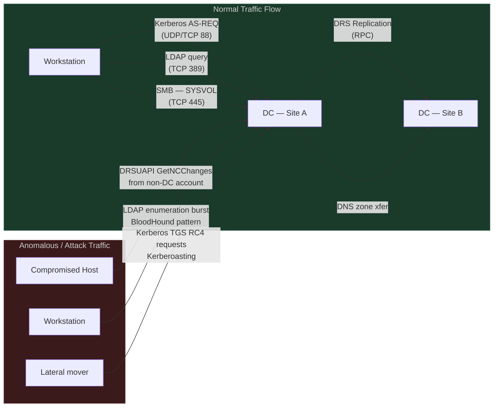
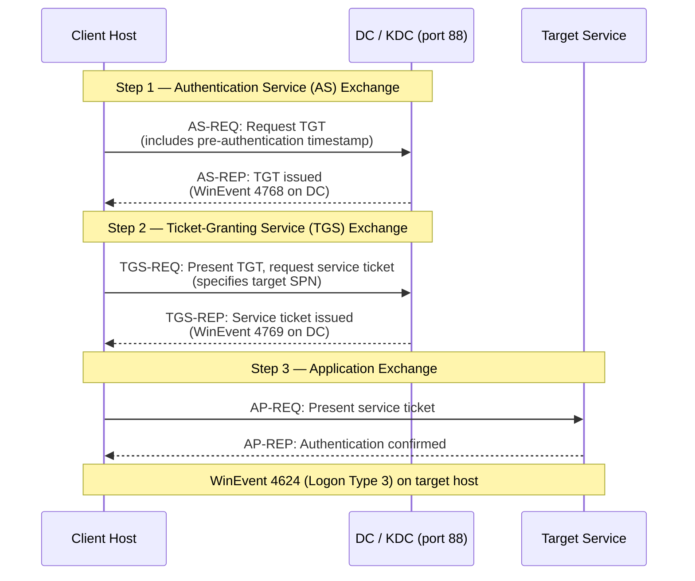

# Module 1: Active Directory Traffic Fundamentals

← [Back to Course Overview](./00_course_overview.md) | [Module 2: Infrastructure Traffic →](./module_02_infrastructure_traffic_analysis.md)

---

## Module Overview

| Attribute | Detail |
|---|---|
| **Estimated Time** | 2 hours |
| **PEAK Phase** | Prepare → Explore |
| **Data Sources** | WinEvent 4624, 4662, 4768, 4769, 4770, 4771; Corelight `conn.log`, `dns.log` |
| **Prerequisites** | [Course Overview](./00_course_overview.md), basic AD concepts (what a DC is, what Kerberos does at a high level) |

### Learning Objectives

After completing this module you will be able to:

1. Describe the roles of Domain Controllers, Global Catalog servers, and RODCs and explain why each generates distinct traffic patterns.
2. Trace the full Kerberos authentication flow (AS-REQ → AS-REP → TGS-REQ → TGS-REP) and identify which Windows Event IDs correspond to each step.
3. Write an SPL query to baseline the distribution of Kerberos ticket encryption types and flag anomalous RC4 usage.
4. Explain the DRS replication protocol, identify WinEvent 4662 as its log artefact, and write an SPL query to detect DCSync attempts by non-DC accounts.
5. Build a DNS query baseline per source host using Corelight `dns.log` and flag workstations making unusual direct-to-DC DNS queries.

---

## Section 1: Active Directory Architecture and Why It Matters

Understanding what traffic is *normal* in an AD environment requires knowing which machines talk to each other, for what purpose, and how often. This section covers the key infrastructure roles that generate the bulk of authentication and directory traffic.

### Domain Controller (DC)

The primary role in every AD domain. DCs authenticate users (Kerberos and NTLM), serve DNS, replicate the directory database to each other via the Directory Replication Service (DRS/DRSUAPI), and deliver Group Policy via SYSVOL (SMB). Every client in the domain will contact a DC at login time and periodically throughout the day.

**Traffic you will always see from DCs:**
- Kerberos (TCP/UDP 88) inbound from all domain members
- LDAP (TCP 389) and LDAPS (TCP 636) queries from clients and applications
- DNS (UDP/TCP 53) queries from clients; DC-to-DC DNS replication
- SMB (TCP 445) for SYSVOL/NETLOGON share access (Group Policy)
- DRS replication (RPC, TCP 135 + dynamic high ports) between DCs

### Global Catalog (GC) Server

A DC that also holds a partial replica of every domain in the forest. GC queries run on TCP 3268 (LDAP) and TCP 3269 (LDAPS). Clients query the GC for Universal Group membership during logon. In most environments all DCs are also GCs.

### Read-Only Domain Controller (RODC)

Deployed in branch offices or DMZs. Only receives inbound replication; never originates it. An RODC initiating outbound replication traffic is an immediate anomaly.

### Sites and Subnets

AD *sites* map IP subnets to physical locations. Clients authenticate to the DC in their own site when possible. Cross-site authentication (a workstation in Site A hitting a DC in Site B) is not necessarily malicious but is worth baselining because attackers who need a specific DC (e.g., the PDC Emulator for DCSync) will reach across sites.

### Why Architecture Matters for Threat Hunting



**Key principle:** Any machine that is not a DC initiating DC-replication-style calls, or any account performing bulk LDAP attribute reads against multiple AD objects in rapid succession, deviates from the normal architectural model.

---

## Section 2: Kerberos Authentication Traffic

Kerberos is the default authentication protocol for all domain-joined hosts communicating with AD resources by hostname. Understanding its flow lets you identify which events are expected at each step — and where attacker tooling produces detectable deviations.

### The Kerberos Ticket Exchange Flow



### Windows Event IDs in the Kerberos Flow

| Event ID | Logged On | Trigger | Key Fields |
|---|---|---|---|
| **4768** | DC | AS-REQ received — TGT requested | `TargetUserName`, `IpAddress`, `TicketEncryptionType`, `TicketOptions`, `Status` |
| **4769** | DC | TGS-REQ received — service ticket requested | `TargetUserName`, `ServiceName`, `IpAddress`, `TicketEncryptionType`, `Status` |
| **4770** | DC | TGS ticket renewed | `TargetUserName`, `ServiceName`, `IpAddress` |
| **4771** | DC | Kerberos pre-authentication failed | `TargetUserName`, `IpAddress`, `FailureCode` |
| **4624** | Target host | Successful Kerberos logon (Type 3) | `AuthenticationPackageName=Kerberos`, `LogonType`, `WorkstationName` |

### Normal vs Abnormal: Encryption Types

The `TicketEncryptionType` field in 4769 events is a critical indicator. Modern environments use AES encryption; RC4 (value `0x17`) is legacy and should be rare.

| EncryptionType Value | Name | Assessment |
|---|---|---|
| `0x12` | AES256-CTS-HMAC-SHA1-96 | Normal — modern default |
| `0x11` | AES128-CTS-HMAC-SHA1-96 | Normal |
| `0x17` | RC4-HMAC | **Suspicious** — legacy; used by Kerberoasting tools |
| `0x18` | RC4-HMAC-EXP | Highly suspicious — weak export cipher |
| `0x03` | DES-CBC-MD5 | Very suspicious — disabled in most environments |

> **Key indicator for Kerberoasting:** An account requesting many TGS tickets (4769) with `TicketEncryptionType=0x17` in a short window. The attacker requests RC4-encrypted service tickets because RC4 is faster to crack offline than AES.

### SPL: Baseline Kerberos Ticket Encryption Types

Run this query over 30 days to establish your environment's normal encryption distribution before writing a detection threshold:

```spl
/* Baseline: distribution of Kerberos ticket encryption types */
index=wineventlog EventCode=4769 earliest=-30d
| eval EncType = case(
    TicketEncryptionType="0x12", "AES256 (normal)",
    TicketEncryptionType="0x11", "AES128 (normal)",
    TicketEncryptionType="0x17", "RC4 (suspicious)",
    TicketEncryptionType="0x18", "RC4-EXP (highly suspicious)",
    TicketEncryptionType="0x03", "DES (very suspicious)",
    true(), "Other: " + TicketEncryptionType)
| stats count by EncType
| sort - count
```

```spl
/* Detection: RC4 TGS requests — Kerberoasting candidate */
index=wineventlog EventCode=4769 TicketEncryptionType=0x17 earliest=-1h
| stats count as rc4_requests, dc(ServiceName) as unique_services,
        values(ServiceName) as services by IpAddress, TargetUserName
| where rc4_requests > 5
| sort - rc4_requests
```

```spl
/* Baseline: per-user TGS request rate — establish normal before thresholding */
index=wineventlog EventCode=4769 earliest=-7d
| bucket span=1h _time
| stats count as tgs_count by _time, TargetUserName
| stats avg(tgs_count) as avg_per_hour, max(tgs_count) as max_per_hour,
        stdev(tgs_count) as sd by TargetUserName
| eval upper_threshold = avg_per_hour + (3 * sd)
| sort - max_per_hour
```

---

## Section 3: DC Replication Traffic (DRS/DRSUAPI)

Domain Controllers replicate directory changes to each other using the **Directory Replication Service (DRS)** protocol, also known as DRSUAPI. Replication runs over RPC (port 135 initial handshake, then dynamic high ports). This is one of the most important traffic patterns to understand because the **DCSync attack** abuses this exact protocol.

### How Legitimate DC Replication Works

1. A change is made on DC-A (e.g., a password reset).
2. DC-A notifies its replication partners.
3. DC-B sends a `GetNCChanges` request to DC-A to pull the changes.
4. DC-A responds with the changed directory objects.
5. **WinEvent 4662** is logged on the DC that processed the replication request.

The critical field in 4662 is `Properties`, which contains the GUIDs of the access rights exercised. Legitimate DC replication uses two specific GUIDs:

| GUID | Right | Meaning |
|---|---|---|
| `1131f6aa-9c07-11d1-f79f-00c04fc2dcd2` | `DS-Replication-Get-Changes` | Basic replication right |
| `1131f6ab-9c07-11d1-f79f-00c04fc2dcd2` | `DS-Replication-Get-Changes-All` | Replication including secrets (hashes) |

### DCSync: Abusing Replication Rights

DCSync (implemented in Mimikatz and Impacket) impersonates a DC by calling `DRSGetNCChanges` using an account that has been granted replication rights (either legitimately or through ACL abuse). The attack does not require code execution on the DC — it runs entirely over the network from any host where the account's credentials are available.

**What makes DCSync detectable:** The `SubjectUserName` in 4662 events will be a *user account or a non-DC computer account* rather than a DC machine account (which ends in `$` and is a member of `Domain Controllers`).

### SPL: Detect DCSync from Non-DC Accounts

```spl
/* Baseline: who is performing replication operations (should only be DC machine accounts) */
index=wineventlog EventCode=4662 earliest=-7d
| search Properties="*1131f6aa*" OR Properties="*1131f6ab*"
| stats count by SubjectUserName, SubjectDomainName, IpAddress
| eval is_dc_account = if(match(SubjectUserName, "(?i)\$$"), "yes", "NO — INVESTIGATE")
| sort is_dc_account, - count
```

```spl
/* Detection: non-DC account performing replication — DCSync alert */
index=wineventlog EventCode=4662 earliest=-15m
| search (Properties="*1131f6aa-9c07-11d1-f79f-00c04fc2dcd2*"
      OR Properties="*1131f6ab-9c07-11d1-f79f-00c04fc2dcd2*")
| where NOT match(SubjectUserName, "(?i)\$$")
| table _time, SubjectUserName, SubjectDomainName, ObjectType, IpAddress, Properties
| sort - _time
```

> **Why filter `\$$`:** DC machine accounts in AD are stored with a trailing dollar sign (e.g., `DC01$`). User accounts and non-DC machines should never be in 4662 replication events. Any match here without a trailing `$` is a high-fidelity DCSync indicator.

---

## Section 4: LDAP and DNS Traffic Baselines

### LDAP Traffic Patterns

LDAP (TCP 389) and LDAPS (TCP 636) are used by clients, applications, and management tools to query and modify the AD directory. Normal LDAP sources include:

- Domain-joined workstations (logon, group policy processing)
- Applications with service accounts (HR systems, monitoring, helpdesk)
- Management tools (RSAT, AD Users and Computers)

**Abnormal LDAP patterns that suggest enumeration:**
- A single workstation making hundreds of LDAP queries per minute
- Queries for unusual object classes (`ms-MCS-AdmPwd` = LAPS passwords, `msDS-AllowedToDelegateTo` = constrained delegation targets)
- `dc(AttributeName)` spike — many distinct AD attributes queried in a short window (BloodHound signature)

### DNS Traffic from DCs vs Workstations

Corelight `dns.log` captures all DNS queries passing through the network sensor. Key patterns:

| Source Type | Normal DNS Behaviour | Abnormal Indicator |
|---|---|---|
| Workstation | Queries to corporate DNS resolvers (typically DC IPs) | Direct queries to external DNS, queries to a DC IP on a non-standard port |
| DC | Authoritative responses; zone-transfer traffic to/from DNS secondaries | DC querying external resolvers for internal names |
| Server | Periodic queries for service dependencies | High-rate queries for random-looking subdomains (DGA) |

### SPL: DNS Query Cardinality Baseline

```spl
/* Baseline: unique DNS queries per source host — establish normal dc(query) range */
index=corelight sourcetype=corelight_dns earliest=-7d
| stats dc(query) as unique_queries, count as total_queries by id.orig_h
| eval avg_query_len = mvavg(len(query), 10)
| sort - unique_queries
| head 50
```

```spl
/* Flag workstations querying DCs directly on non-standard ports */
index=corelight sourcetype=corelight_conn earliest=-7d
| where id.resp_p != 53 AND id.resp_p != 443 AND id.resp_p != 389
| lookup dc_ip_list ip as id.resp_h OUTPUT is_dc
| where is_dc = "true"
| stats dc(id.resp_p) as unusual_ports, values(id.resp_p) as ports by id.orig_h, id.resp_h
| where unusual_ports > 3
```

```spl
/* Distribution of query types — flag unusual qtype spikes */
index=corelight sourcetype=corelight_dns earliest=-7d
| stats count by qtype_name
| sort - count
```

---

## Section 5: Normal vs Attack Signatures

This table provides a side-by-side comparison of normal AD traffic patterns and their attack counterparts. Use it as a quick-reference during investigations.

| Category | Normal Behaviour | Attack Signature | Key Indicator |
|---|---|---|---|
| **Kerberos TGS requests** | AES256 encryption (`0x12`); one per service per session; from domain-joined hosts | RC4 encryption (`0x17`); many service tickets in seconds; from a single source IP | EID 4769 `TicketEncryptionType=0x17`, `dc(ServiceName) > 10` in 5 min |
| **AS-REQ (TGT requests)** | Pre-auth timestamp present; normal user/host pairs | AS-REQ *without* pre-auth for accounts with `DONT_REQ_PREAUTH` set | EID 4768 `PreAuthType=0` (AS-REP Roasting) |
| **DC Replication (4662)** | `SubjectUserName` always ends in `$`; source IPs are known DC IPs | User account or non-DC machine calling `GetNCChanges` | EID 4662 with replication GUIDs, `SubjectUserName` no trailing `$` |
| **LDAP queries** | Low steady rate; well-known attributes; service accounts from app servers | Burst of queries; wide attribute enumeration; workstations at DC-query rates | `dc(AttributeName) > 50` in 60 s (BloodHound) |
| **DNS query rate** | Consistent, low volume; matches browsing/app pattern | Massive spike in query count; high-entropy domain names; fixed query interval | `dc(query) > 500` in 5 min per host, high avg domain name length |
| **Kerberos failures (4771)** | Isolated events; expired tickets; clock skew | Many 4771 events from one IP against many users | `dc(TargetUserName) > 20` with 4771 from single `IpAddress` |

---

## Section 6: Practice Exercise

### Exercise: Identify Non-DC Accounts Requesting TGS for Service Accounts

**Scenario:** Your threat intelligence team has flagged that a threat actor in your sector is using Kerberoasting. You need to identify whether any accounts in your environment are requesting an unusual volume of TGS tickets for service accounts (identified by their SPNs containing common service name patterns).

**Step 1 — Build a 30-day baseline of TGS request counts per account:**

```spl
index=wineventlog EventCode=4769 earliest=-30d
| stats count as tgs_total, dc(ServiceName) as unique_services by TargetUserName, IpAddress
| stats avg(tgs_total) as avg_30d, stdev(tgs_total) as sd_30d,
        avg(unique_services) as avg_services by TargetUserName
```

**Step 2 — Identify accounts requesting service tickets for service account SPNs with RC4:**

```spl
index=wineventlog EventCode=4769 TicketEncryptionType=0x17 earliest=-24h
| where match(ServiceName, "(?i)(svc_|_svc|service|sql|http|iis|mssql|exchange|backup)")
| stats count as rc4_tgs, dc(ServiceName) as unique_svcs,
        values(ServiceName) as svc_names by TargetUserName, IpAddress
| sort - rc4_tgs
```

**Step 3 — Correlate with authentication events to confirm the source host is a workstation:**

```spl
index=wineventlog EventCode=4769 TicketEncryptionType=0x17 earliest=-1h
| stats count by IpAddress, TargetUserName, ServiceName
| join IpAddress [
    search index=wineventlog EventCode=4624 LogonType=3 earliest=-1h
    | stats count by WorkstationName, IpAddress
    ]
| where count > 5
| table IpAddress, TargetUserName, ServiceName, count, WorkstationName
```

**Expected output interpretation:**
- Any user account (not ending in `$`) with `rc4_tgs > 10` in 24 hours against service SPNs is a Kerberoasting candidate.
- Cross-reference the `IpAddress` against your asset inventory to confirm it is a workstation, not an application server.
- Escalate accounts found with multiple service SPNs targeted.

---

## Module Summary

| Key Concept | What to Remember |
|---|---|
| DC roles | DCs, GCs, and RODCs each have distinct traffic fingerprints. RODCs should never originate replication. |
| Kerberos flow | AS-REQ (4768) → AS-REP → TGS-REQ (4769) → TGS-REP → AP-REQ (4624). Each step is logged on the DC. |
| RC4 in 4769 | `TicketEncryptionType=0x17` in a 4769 event is a primary Kerberoasting signal. Baseline your environment's normal RC4 rate first. |
| DCSync via 4662 | The replication GUIDs `1131f6aa` and `1131f6ab` in 4662 events should *only* appear with DC machine accounts as the subject. |
| DNS baselines | `dc(query)` per source in `dns.log` establishes a per-host query uniqueness baseline. Spikes indicate enumeration. |
| LDAP enumeration | High `dc(AttributeName)` per source in a short window is a BloodHound/LDAP-enumeration signature. |

### Related Detection Use Cases

- [Credential Attacks](../03_detection_use_cases/03_credential_attacks.md) — Kerberoasting, AS-REP Roasting, password spray
- [Privilege Escalation](../03_detection_use_cases/06_privilege_escalation.md) — DCSync, ACL abuse
- [Lateral Movement](../03_detection_use_cases/05_lateral_movement.md) — Kerberos-based lateral movement
- [DNS Tunneling / DGA](../03_detection_use_cases/04_dns_tunneling_dga.md) — DNS anomaly detection

---

← [Back to Course Overview](./00_course_overview.md) | [Module 2: Infrastructure Traffic →](./module_02_infrastructure_traffic_analysis.md)

*Last updated: 2026-03-29*
