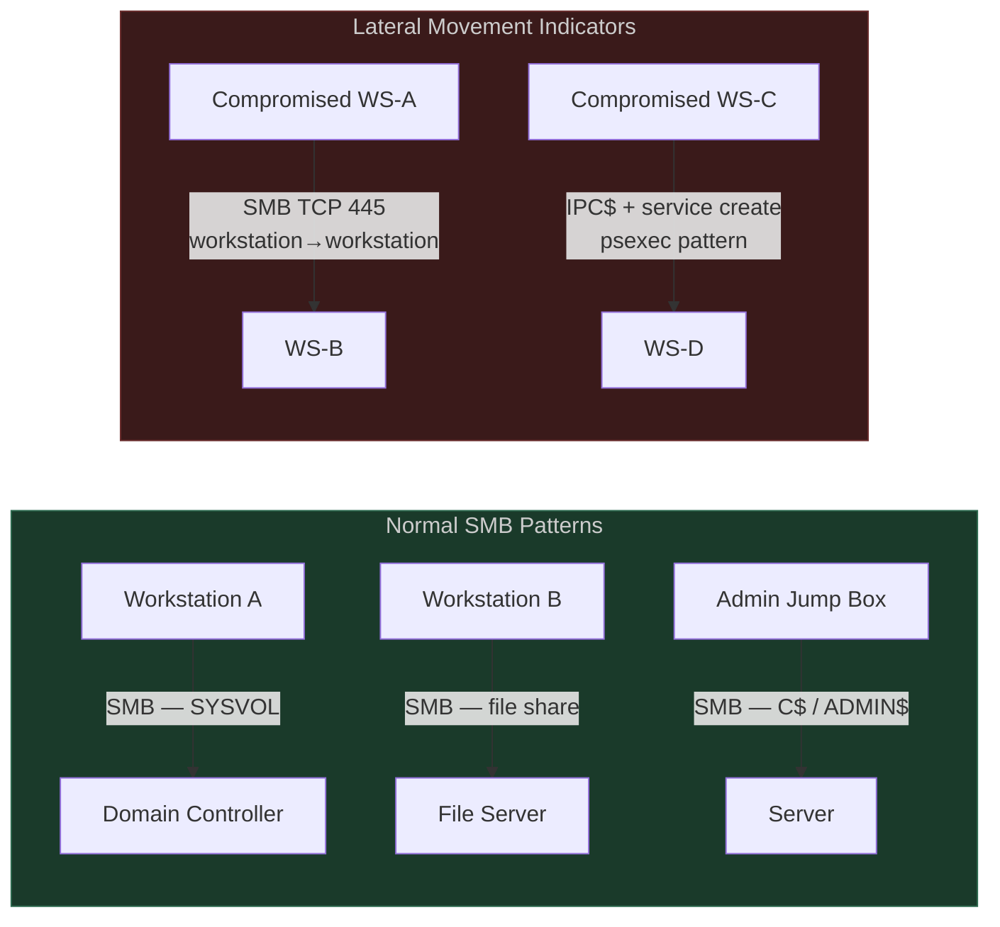
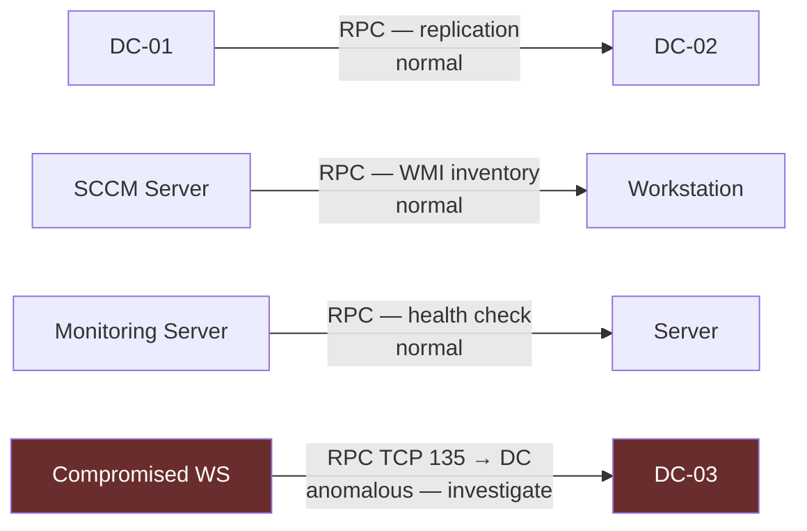

# Module 2: Infrastructure Traffic Analysis

[← Module 1: AD Traffic Fundamentals](./module_01_ad_traffic_fundamentals.md) | [Module 3: Authentication Patterns →](./module_03_authentication_patterns.md)

---

## Module Overview

| Attribute | Detail |
|---|---|
| **Estimated Time** | 2 hours |
| **PEAK Phase** | Prepare → Explore → Analyze |
| **Data Sources** | Corelight `conn.log`; WinEvent 4624, 4688; Sysmon EID 1, 3 |
| **Prerequisites** | [Module 1: AD Traffic Fundamentals](./module_01_ad_traffic_fundamentals.md) |

### Learning Objectives

After completing this module you will be able to:

1. Identify the normal network and log signatures of SMB, WMI, RPC/DCOM, SCCM/ConfigMgr, and WinRM traffic.
2. Write SPL queries using Corelight `conn.log` to profile SMB connections and flag workstation-to-workstation lateral movement patterns.
3. Explain how WMI uses port 135 plus dynamic high ports and identify suspicious WMI activity in WinEvent 4688 and Sysmon.
4. Distinguish legitimate SCCM client traffic from rogue or hijacked SCCM behaviour.
5. Baseline WinRM destinations per source host and flag unusual PowerShell Remoting usage.

---

## Section 1: SMB Traffic Baselines

### What Generates SMB (TCP 445)?

Server Message Block (SMB) is used for Windows file sharing, printer sharing, and critical domain infrastructure. Understanding the *expected* direction and source of SMB connections is the foundation for detecting lateral movement.

| SMB Use Case | Normal Source → Destination | Frequency |
|---|---|---|
| Group Policy / SYSVOL | Workstation → DC (SYSVOL, NETLOGON shares) | At logon + periodic refresh (~90 min) |
| User home drives / file shares | Workstation → File server | Business hours, user-driven |
| DFS referrals | Client → DC or DFS namespace server | On share access |
| Print spooler | Workstation → Print server (TCP 445) | On print job submission |
| Admin shares (C$, ADMIN$, IPC$) | Admin workstation / jump box → target | Periodic, known admin hosts only |
| DC-to-DC | DC → DC (SYSVOL replication via DFS-R) | Background, low rate |

### Normal vs Abnormal SMB Flow



> **Key signal:** Workstation-to-workstation SMB (both source and destination IPs in the workstation subnet) is the most reliable lateral movement indicator in `conn.log`. Servers can communicate over SMB; workstations should not talk to each other over SMB in normal operation.

### SPL: Profile SMB Connections and Flag Workstation-to-Workstation

```spl
/* Baseline: all SMB traffic — understand who talks to whom over port 445 */
index=corelight sourcetype=corelight_conn id.resp_p=445 earliest=-7d
| stats count as smb_connections, sum(orig_bytes) as bytes_sent,
        dc(id.resp_h) as unique_dests by id.orig_h
| sort - smb_connections
| head 50
```

```spl
/* Detection: workstation-to-workstation SMB (adjust subnet CIDR to your environment) */
index=corelight sourcetype=corelight_conn id.resp_p=445 earliest=-1h
| where match(id.orig_h, "^10\.10\.") AND match(id.resp_h, "^10\.10\.")
| lookup asset_classification ip as id.resp_h OUTPUT asset_type as dest_type
| where dest_type = "workstation" OR isnull(dest_type)
| stats count as lateral_smb, values(id.resp_h) as targets by id.orig_h
| where lateral_smb > 2
| sort - lateral_smb
```

```spl
/* Flag IPC$ access — used in PsExec / service-based lateral movement */
index=wineventlog EventCode=5140 ShareName="\\\\*\\IPC$" earliest=-1h
| stats count, dc(IpAddress) as unique_sources by ShareName, SubjectUserName
| where count > 5
| sort - count
```

---

## Section 2: WMI Traffic

### How WMI Uses the Network

Windows Management Instrumentation (WMI) uses DCOM/RPC for remote operations. The initial connection always goes to **TCP port 135** (the DCOM endpoint mapper), which then negotiates a dynamic high port (typically 49152–65535) for the actual WMI traffic. This two-stage connection pattern is a reliable fingerprint.

| WMI Operation | Port Pattern | Normal Source |
|---|---|---|
| `wmic /node:X` | 135 → dynamic high port | Admin workstations, SCCM, monitoring |
| WMI query (PowerShell) | 135 → dynamic high port | Automation scripts, management tools |
| WMI subscription | 135 → dynamic high port | Legitimate monitoring; also used for persistence |
| SCCM hardware inventory | 135 → dynamic high port | SCCM site server → managed host |

### Normal vs Abnormal WMI Activity

| Normal WMI | Suspicious WMI |
|---|---|
| SCCM server → managed host | Workstation → workstation |
| Known monitoring tool (e.g., SolarWinds, Nagios host) → server | User workstation → DC |
| IT admin tool from jump box | Interactive `wmic.exe` spawned from `cmd.exe` / `powershell.exe` |
| Scheduled SCCM inventory window | WMI subscription created to run a payload (Sysmon EID 19/20/21) |

### WinEvent 4688: WMI Process Launches

WinEvent 4688 captures process creation with command-line arguments (if audit policy is configured). Look for:

```
Process Name: wmic.exe
Command Line: wmic /node:10.10.5.22 process call create "cmd.exe /c ..."
```

This pattern — `wmic.exe` with a `/node:` argument pointing to a remote host — indicates remote WMI execution, which is a common lateral movement technique.

### SPL: Detect Suspicious WMI Usage

```spl
/* WMI remote execution via wmic.exe — flag /node: usage against non-management hosts */
index=wineventlog EventCode=4688 earliest=-24h
| where match(lower(NewProcessName), "wmic\.exe")
  AND match(CommandLine, "(?i)/node:")
| eval target_host = replace(CommandLine, ".*?/node:([^\s]+).*", "\1")
| stats count, values(CommandLine) as cmds, dc(target_host) as unique_targets
        by SubjectUserName, ComputerName, target_host
| sort - unique_targets
```

```spl
/* Baseline: rare WMI consumers by host (processes spawned by WMI service) */
index=sysmon EventCode=1 earliest=-30d
| where match(ParentProcessName, "(?i)wmiprvse\.exe")
| stats count by process_name, host
| where count < 5
| sort count
```

```spl
/* Corelight: port 135 connections from unexpected sources (not known management IPs) */
index=corelight sourcetype=corelight_conn id.resp_p=135 earliest=-1h
| lookup management_hosts ip as id.orig_h OUTPUT is_management
| where isnull(is_management)
| stats count as rpc_connections, dc(id.resp_h) as unique_targets by id.orig_h
| where rpc_connections > 3
| sort - rpc_connections
```

---

## Section 3: RPC and DCOM Baselines

### RPC Traffic Pattern

RPC (Remote Procedure Call) underpins many Windows services: DC replication, WMI, DCOM, print spooler remote operations, and more. The traffic pattern is always:

1. Client connects to **TCP 135** (endpoint mapper) on the server.
2. Server returns a dynamic high port (49152+).
3. Client reconnects to the negotiated high port for the actual RPC call.

In Corelight `conn.log` you will see two distinct flows for every RPC interaction.

### Normal RPC Sources

| Source | Destination | Purpose |
|---|---|---|
| DC | DC | Directory replication (DRSUAPI), netlogon |
| SCCM site server | All managed hosts | Inventory, deployment, policy |
| Monitoring server | All managed hosts | WMI-based health checks |
| Admin jump box | Servers | Remote management |
| Print server | DCs | Spooler service calls |

### Flagging Non-Standard RPC Sources Calling DCs



```spl
/* Baseline: who is connecting to DCs on port 135 */
index=corelight sourcetype=corelight_conn id.resp_p=135 earliest=-7d
| lookup dc_ip_list ip as id.resp_h OUTPUT is_dc
| where is_dc = "true"
| stats count by id.orig_h, id.resp_h
| sort - count
```

```spl
/* Flag: workstation-class hosts calling DC on RPC port */
index=corelight sourcetype=corelight_conn id.resp_p=135 earliest=-1h
| lookup dc_ip_list ip as id.resp_h OUTPUT is_dc
| lookup asset_classification ip as id.orig_h OUTPUT asset_type
| where is_dc = "true" AND asset_type = "workstation"
| stats count, dc(id.resp_h) as dc_targets by id.orig_h, asset_type
| sort - count
```

---

## Section 4: SCCM / ConfigMgr Traffic

### SCCM Communication Ports

Microsoft Endpoint Configuration Manager (SCCM/ConfigMgr) uses specific ports for client–management point communication:

| Port | Protocol | Direction | Purpose |
|---|---|---|---|
| 80 | HTTP | Client → MP | Client policy download (if HTTP configured) |
| 443 | HTTPS | Client → MP | Client policy download (if HTTPS configured) |
| 8530 | HTTP | Client → WSUS/SUP | Software update point |
| 8531 | HTTPS | Client → WSUS/SUP | Software update point (TLS) |
| 10123 | TCP | MP → Client | Client notification (fast channel) |
| 135 + high | RPC | Site server → Client | Inventory, remote tools |

### Recognising Legitimate vs Rogue SCCM Behaviour

| Indicator | Legitimate SCCM | Rogue/Abuse Pattern |
|---|---|---|
| Source IP for port 8530/8531 | Only known SCCM MP/SUP IPs | Workstation or unknown server claiming to be MP |
| Client policy registration | All domain-joined hosts, staged rollout | Sudden burst of new client registrations |
| Software deployment | Known deployment windows; `ccmsetup.exe` parent | `ccmsetup.exe` spawned by `cmd.exe` / `powershell.exe` with unusual args |
| Content download | From known Distribution Point IPs | Content pulled from external IP |

```spl
/* Baseline: SCCM-related ports — who is talking to management points */
index=corelight sourcetype=corelight_conn earliest=-7d
| where id.resp_p IN (8530, 8531, 10123)
| stats count as connections, dc(id.orig_h) as unique_clients by id.resp_h, id.resp_p
| sort - connections
```

```spl
/* Flag: hosts connecting to SCCM ports that are not the known MP */
index=corelight sourcetype=corelight_conn earliest=-1h
| where id.resp_p IN (8530, 8531)
| lookup sccm_mp_list ip as id.resp_h OUTPUT is_known_mp
| where isnull(is_known_mp)
| stats count by id.orig_h, id.resp_h, id.resp_p
| sort - count
```

---

## Section 5: WinRM and PowerShell Remoting

### WinRM Default Ports

Windows Remote Management (WinRM) and PowerShell Remoting use:

| Port | Protocol | Default Use |
|---|---|---|
| **5985** | HTTP (SOAP/WSMan) | Default WinRM — plaintext transport layer |
| **5986** | HTTPS (SOAP/WSMan) | Secure WinRM — TLS transport layer |

> Note: Despite being labelled HTTP/HTTPS, WinRM traffic is not the same as web traffic. Corelight will log it in `conn.log` but not in `http.log` by default.

### Normal vs Attack-Tool WinRM Usage

| Normal WinRM | Attack Tool Usage |
|---|---|
| Admin jump box → servers (port 5985/5986) | Workstation → workstation on 5985 (`evil-winrm`) |
| Automation scripts from service account source hosts | Interactive sessions from compromised accounts |
| Known admin accounts from known source IPs | `Invoke-Command` / `Enter-PSSession` in attack chains |
| IT team during change windows | Outside business hours; new source IP never seen before |
| Destination: servers only | Destination: DCs (high value; unusual for WinRM) |

### SPL: Cardinality of WinRM Destinations per Source

```spl
/* Baseline: WinRM connection cardinality per source — how many unique targets does each host connect to? */
index=corelight sourcetype=corelight_conn earliest=-7d
| where id.resp_p IN (5985, 5986)
| stats dc(id.resp_h) as unique_winrm_targets, count as connections by id.orig_h
| sort - unique_winrm_targets
```

```spl
/* Detection: WinRM from non-admin workstations to multiple hosts */
index=corelight sourcetype=corelight_conn earliest=-1h
| where id.resp_p IN (5985, 5986)
| lookup asset_classification ip as id.orig_h OUTPUT asset_type, is_admin_host
| where asset_type = "workstation" AND NOT is_admin_host = "true"
| stats dc(id.resp_h) as unique_targets, values(id.resp_h) as targets by id.orig_h
| where unique_targets > 1
| sort - unique_targets
```

```spl
/* WinRM sessions correlated with Sysmon: wsmprovhost.exe (WinRM process) spawning children */
index=sysmon EventCode=1 earliest=-1h
| where match(ParentProcessName, "(?i)wsmprovhost\.exe")
| stats count, values(CommandLine) as cmds, dc(host) as unique_hosts by process_name
| sort - count
```

---

## Section 6: Traffic Pattern Comparison Table

| Protocol | Normal Source → Destination | Ports | Normal Use | Attack Tool / Technique | Attack Indicator |
|---|---|---|---|---|---|
| **SMB** | Workstation → DC, File Server | TCP 445 | SYSVOL, file shares, print | PsExec, Impacket SMBExec, CrackMapExec | Workstation→workstation SMB; IPC$ + 7045 service create |
| **WMI/DCOM** | SCCM, monitoring → managed hosts | TCP 135 + high | Inventory, health checks, SCCM | wmiexec (Impacket), `wmic /node:`, PowerShell WMI | Workstation→workstation 135; unusual `wmiprvse.exe` child procs |
| **RPC** | DCs, SCCM → managed hosts | TCP 135 + high | AD replication, remote services | DCSync, DCOM exec | Workstation→DC on 135; non-DC replication calls |
| **SCCM** | SCCM MP → clients | TCP 8530/8531, 10123 | Patch management, deployment | SharpSCCM, rogue SCCM NAA abuse | Unknown hosts on 8530; `ccmsetup.exe` from cmd/PS |
| **WinRM** | Admin jump box → servers | TCP 5985/5986 | Remote admin, PS Remoting | evil-winrm, Invoke-Command lateral movement | Workstation→workstation 5985; DC as WinRM target |

---

## Section 7: Practice Exercise

### Exercise: Find Non-Admin Workstations Making SMB Connections to Other Workstations

**Scenario:** Your SIEM fired an alert for lateral movement from a detection that had too many false positives. You need to tune it by first understanding the baseline, then write a precise query that flags only workstation-to-workstation SMB.

**Step 1 — Understand the full SMB landscape:**

```spl
index=corelight sourcetype=corelight_conn id.resp_p=445 earliest=-7d
| stats count by id.orig_h, id.resp_h
| lookup asset_classification ip as id.orig_h OUTPUT asset_type as src_type
| lookup asset_classification ip as id.resp_h OUTPUT asset_type as dst_type
| stats count by src_type, dst_type
| sort - count
```

*This gives you the cross-tab of all SMB flow types (workstation→server, server→server, workstation→workstation, etc.). Review it to understand your environment's baseline distribution.*

**Step 2 — Isolate workstation-to-workstation SMB with connection count threshold:**

```spl
index=corelight sourcetype=corelight_conn id.resp_p=445 earliest=-1h
| lookup asset_classification ip as id.orig_h OUTPUT asset_type as src_type
| lookup asset_classification ip as id.resp_h OUTPUT asset_type as dst_type
| where src_type = "workstation" AND dst_type = "workstation"
| stats count as smb_attempts, dc(id.resp_h) as unique_targets,
        values(id.resp_h) as target_hosts, sum(orig_bytes) as bytes_sent
        by id.orig_h, src_type
| where smb_attempts > 3
| sort - unique_targets
```

**Step 3 — Correlate with WinEvent 4624 to confirm successful authentication:**

```spl
index=wineventlog EventCode=4624 LogonType=3 earliest=-1h
| rename IpAddress as id.orig_h, ComputerName as dest_host
| join id.orig_h [
    search index=corelight sourcetype=corelight_conn id.resp_p=445 earliest=-1h
    | lookup asset_classification ip as id.orig_h OUTPUT asset_type as src_type
    | lookup asset_classification ip as id.resp_h OUTPUT asset_type as dst_type
    | where src_type = "workstation" AND dst_type = "workstation"
    | stats count by id.orig_h
    | where count > 3
    ]
| table _time, id.orig_h, dest_host, TargetUserName, LogonType, AuthenticationPackageName
| sort - _time
```

**Expected findings:** This three-step approach first establishes the full SMB pattern, then narrows to workstation-to-workstation, then confirms with auth events. True lateral movement will have both the `conn.log` evidence and matching 4624 Type 3 events.

---

## Module Summary

| Key Concept | What to Remember |
|---|---|
| SMB lateral movement | Workstation→workstation SMB (TCP 445) is the primary indicator. DCs and file servers are normal SMB destinations; peer workstations are not. |
| WMI network pattern | TCP 135 always first (endpoint mapper), then dynamic high port. Normal sources: SCCM, monitoring, admin hosts. |
| RPC baseline | Same 135→high-port pattern as WMI. Any workstation-class host calling a DC on 135 warrants investigation. |
| SCCM traffic | Ports 8530/8531 should only come from known MP/SUP IPs. Workstations are consumers, not providers, of SCCM services. |
| WinRM | Ports 5985/5986. Only admin jump boxes should have high `dc(id.resp_h)` for WinRM. Workstation-to-workstation WinRM is an attack tool signature. |

### Related Detection Use Cases

- [Lateral Movement](../03_detection_use_cases/05_lateral_movement.md) — SMB, WMI, WinRM-based lateral movement
- [Rogue Services / Processes](../03_detection_use_cases/09_rogue_services_processes.md) — Service creation via PsExec/WMI
- [Privilege Escalation](../03_detection_use_cases/06_privilege_escalation.md) — RPC-based privilege abuse

---

[← Module 1: AD Traffic Fundamentals](./module_01_ad_traffic_fundamentals.md) | [Module 3: Authentication Patterns →](./module_03_authentication_patterns.md)

*Last updated: 2026-03-29*
