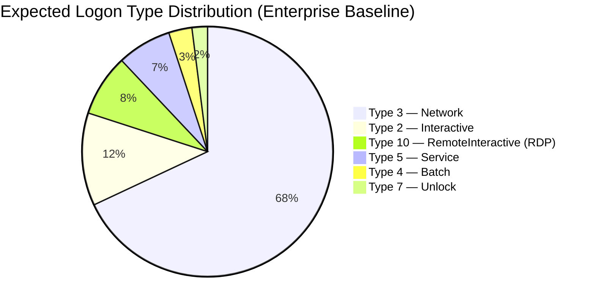
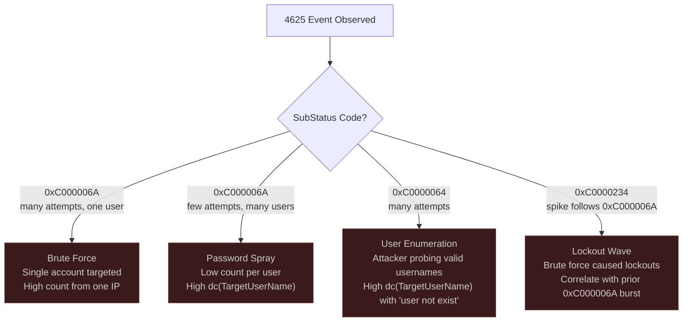

# Module 3: Enterprise Authentication vs Attack Traffic

[← Module 2: Infrastructure Traffic](./module_02_infrastructure_traffic_analysis.md) | [Module 4: Common AD Attacks →](./module_04_common_ad_attacks.md)

---

## Module Overview

| Attribute | Detail |
|---|---|
| **Estimated Time** | 2 hours |
| **PEAK Phase** | Explore → Analyze |
| **Data Sources** | WinEvent 4624, 4625, 4648, 4768, 4769, 4771 |
| **Prerequisites** | [Module 1: AD Traffic Fundamentals](./module_01_ad_traffic_fundamentals.md), [Module 2: Infrastructure Traffic Analysis](./module_02_infrastructure_traffic_analysis.md) |

### Learning Objectives

After completing this module you will be able to:

1. Classify all Windows logon types and explain the security significance of each.
2. Explain when NTLM is used instead of Kerberos and why this distinction matters for detection.
3. Map WinEvent 4625 failure codes to specific attacker behaviours (brute force, spray, enumeration).
4. Identify the event log signature of six common attack tools: Mimikatz, Impacket/PsExec, Rubeus, NetExec/CrackMapExec, evil-winrm, and Cobalt Strike.
5. Write SPL queries to detect pass-the-hash, password spray, and NTLM-from-unexpected-sources.

---

## Section 1: Windows Logon Types

Every authentication event (4624 = success, 4625 = failure) includes a `LogonType` field. This is one of the most important fields for distinguishing legitimate activity from attacker behaviour — different logon types imply different authentication mechanisms and access levels.

### Logon Type Reference Table

| LogonType | Name | How Triggered | Security Relevance |
|---|---|---|---|
| **2** | Interactive | Direct keyboard logon at console, `runas` | Normal desktop logon. If seen on a server from an unexpected account, investigate. |
| **3** | Network | Accessing a network share, mapped drive, `net use` | The most common logon type. PsExec, lateral movement, and most remote access produces Type 3. |
| **4** | Batch | Scheduled task execution | Normal for task scheduler service accounts. If a user account logs on as Batch, investigate. |
| **5** | Service | Service startup | Normal for service accounts. Flag user accounts with LogonType 5. |
| **7** | Unlock | Workstation unlock from screensaver | Normal desktop activity. Mass LogonType 7 spikes can indicate unlock attempts / brute force. |
| **8** | NetworkCleartext | Network logon with cleartext credentials (legacy IIS, NTLMv1) | **Highly suspicious in modern environments.** Indicates legacy auth or intentional credential exposure. |
| **9** | NewCredentials | `runas /netonly` — uses alternate credentials for network but runs locally as original user | **Pass-the-hash indicator.** Mimikatz PTH creates a Type 9 logon with NTLM. |
| **10** | RemoteInteractive | RDP logon | All RDP generates Type 10. Flag unusual RDP source IPs or accounts. |
| **11** | CachedInteractive | Logon using cached domain credentials (no DC reachable) | Normal on laptops offline. If seen on always-connected systems, investigate. |

### Distribution of Logon Types — Expected vs Abnormal



A healthy enterprise sees ~68% Type 3 as the dominant logon type. Any significant volume of Type 8 or Type 9 from non-service accounts warrants immediate investigation.

### SPL: Distribution of Logon Types

```spl
/* Baseline: logon type distribution — run over 30 days to establish normal */
index=wineventlog EventCode=4624 earliest=-30d
| stats count by LogonType
| eval type_name = case(
    LogonType="2",  "Interactive",
    LogonType="3",  "Network",
    LogonType="4",  "Batch",
    LogonType="5",  "Service",
    LogonType="7",  "Unlock",
    LogonType="8",  "NetworkCleartext (suspicious)",
    LogonType="9",  "NewCredentials (PTH indicator)",
    LogonType="10", "RemoteInteractive (RDP)",
    LogonType="11", "CachedInteractive",
    true(), "Other: " + LogonType)
| table LogonType, type_name, count
| sort - count
```

```spl
/* Flag unusual logon types — Type 8 and Type 9 from non-service accounts */
index=wineventlog EventCode=4624 earliest=-24h
| where LogonType IN ("8", "9")
| where NOT match(TargetUserName, "(?i)^(svc_|_svc|service|backup|scan)")
| stats count, dc(IpAddress) as unique_src, values(IpAddress) as src_ips
        by TargetUserName, LogonType, ComputerName
| sort - count
```

---

## Section 2: NTLM vs Kerberos

### When Each Protocol Is Used

| Scenario | Protocol Used | Why |
|---|---|---|
| Domain-joined host to domain resource by hostname | **Kerberos** | Default for domain members; DC issues ticket |
| Domain-joined host to resource by IP address | **NTLM** | Kerberos requires a hostname for SPN lookup; IP forces NTLM |
| Workgroup machines or non-domain resources | **NTLM** | No KDC available |
| Legacy applications | **NTLM** | Older apps that do not support Kerberos |
| Client outside the domain (VPN, internet) | **NTLM or Kerberos** | Depends on configuration and whether KDC is reachable |
| Local account authentication | **NTLM** | No domain context; Kerberos requires domain |

### Why NTLM Is Weaker and Why Attackers Use It

1. **Pass-the-Hash (PTH):** NTLM authentication only requires the NT hash — not the plaintext password. An attacker with a hash from Mimikatz or LSASS dump can authenticate without knowing the password. Kerberos tickets cannot be reused in the same way from raw hash material.
2. **Relay attacks:** NTLM is vulnerable to relay attacks (NTLM relay, Responder). An attacker intercepts an NTLM challenge/response and relays it to a target service. Kerberos tickets are bound to the target SPN and cannot be relayed.
3. **Offline cracking:** NTLM hashes from NTDS.dit or LSASS are offline-crackable. Kerberos AES keys are not crackable without additional material.

### WinEvent 4624: AuthenticationPackageName Field

In 4624 events, the `AuthenticationPackageName` field identifies the protocol:

| Value | Meaning |
|---|---|
| `Kerberos` | Kerberos ticket-based authentication |
| `NTLM` | NTLM challenge-response (NTLMv1 or NTLMv2) |
| `Negotiate` | SPNEGO — could be either; check `LmPackageName` for actual protocol |

### SPL: Flag NTLM from Unexpected Sources

```spl
/* Baseline: NTLM logons by source — understand normal NTLM sources in your environment */
index=wineventlog EventCode=4624 AuthenticationPackageName=NTLM earliest=-7d
| stats count as ntlm_logons, dc(ComputerName) as unique_dest, dc(TargetUserName) as unique_users
        by IpAddress
| sort - ntlm_logons
| head 50
```

```spl
/* Detection: NTLM logons from IPs with no previous Kerberos activity (new/unusual NTLM sources) */
index=wineventlog EventCode=4624 earliest=-24h
| eval auth_type = AuthenticationPackageName
| stats count as total, sum(eval(if(auth_type="NTLM",1,0))) as ntlm_count,
        sum(eval(if(auth_type="Kerberos",1,0))) as kerb_count by IpAddress
| eval ntlm_pct = round((ntlm_count / total) * 100, 1)
| where ntlm_pct = 100 AND ntlm_count > 5
| sort - ntlm_count
```

```spl
/* Flag NTLM Type 9 logons (pass-the-hash signature) from user accounts */
index=wineventlog EventCode=4624 LogonType=9 AuthenticationPackageName=NTLM earliest=-1h
| where NOT match(TargetUserName, "(?i)(ANONYMOUS|system|\$$)")
| stats count, values(IpAddress) as src_ips, values(ComputerName) as dest_hosts
        by TargetUserName
| sort - count
```

---

## Section 3: Failed Authentication Patterns

### WinEvent 4625: Failure Reason Codes

The `SubStatus` field in 4625 events contains a hex code that identifies exactly *why* the authentication failed. This is the key field for distinguishing attack patterns.

| SubStatus Code | Meaning | Attack Pattern Indicator |
|---|---|---|
| `0xC000006A` | Wrong password — user exists | **Brute force or spray.** User account is valid; password is wrong. |
| `0xC0000064` | User does not exist | **User enumeration.** Attacker guessing usernames. |
| `0xC000006D` | Generic bad credentials (NTLM) | Catchall for NTLM failures; usually wrong password. |
| `0xC000006F` | Logon outside permitted hours | Account restricted by logon hours policy. |
| `0xC0000070` | Workstation restriction | Account not permitted to log on from this workstation. |
| `0xC0000071` | Password expired | Normal — password change required. |
| `0xC0000072` | Account disabled | Normal — disabled account attempted access. |
| `0xC0000193` | Account expired | Normal — account past expiry date. |
| `0xC0000234` | Account locked out | Result of repeated wrong-password attempts — secondary lockout indicator. |
| `0xC000015B` | Logon type not granted | Account not permitted this logon type (e.g., non-interactive logon restricted). |

### Attack Pattern Recognition via 4625 SubStatus



### WinEvent 4771: Kerberos Pre-Auth Failure

4771 is the Kerberos equivalent of 4625 — it fires when Kerberos pre-authentication fails. Key field: `FailureCode`.

| FailureCode | Meaning |
|---|---|
| `0x12` | Account disabled or locked |
| `0x17` | Password expired |
| `0x18` | **Wrong password** — equivalent of 4625 0xC000006A |
| `0x25` | Clock skew too large — more than 5 minutes difference |

### SPL: Detect Authentication Attack Patterns

```spl
/* Count failures by failure code and source IP — identify attack pattern type */
index=wineventlog EventCode=4625 earliest=-30m
| eval failure_type = case(
    SubStatus="0xc000006a", "Wrong Password",
    SubStatus="0xc0000064", "User Not Found",
    SubStatus="0xc000006d", "Bad Credentials (NTLM)",
    SubStatus="0xc0000234", "Account Locked Out",
    true(), "Other: " + SubStatus)
| stats count, dc(TargetUserName) as unique_users, dc(IpAddress) as unique_sources
        by failure_type, IpAddress
| sort - count
```

```spl
/* Brute force detection: many failures against single account from one IP */
index=wineventlog EventCode=4625 SubStatus="0xc000006a" earliest=-15m
| stats count as failures, dc(TargetUserName) as unique_users by IpAddress
| where failures > 20 AND unique_users < 3
| sort - failures
```

```spl
/* Password spray detection: few failures per user but across many users */
index=wineventlog EventCode=4625 SubStatus="0xc000006a" earliest=-30m
| stats count as total_failures, dc(TargetUserName) as unique_users by IpAddress
| eval avg_per_user = round(total_failures / unique_users, 1)
| where unique_users > 20 AND avg_per_user < 3
| sort - unique_users
```

```spl
/* User enumeration: spike in "user not found" failures */
index=wineventlog EventCode=4625 SubStatus="0xc0000064" earliest=-15m
| stats count as user_not_found, dc(TargetUserName) as unique_usernames by IpAddress
| where unique_usernames > 10
| sort - unique_usernames
```

---

## Section 4: Attack Tool Authentication Signatures

Different tools leave characteristic patterns in authentication logs. This section maps tool behaviour to specific event signatures.

### Mimikatz Pass-the-Hash

**What it does:** Injects an NT hash into a new logon session. The resulting session authenticates to remote resources as the victim account using NTLM — without knowing the password.

**Event pattern:**
- EID **4624** on the *target* host
- `LogonType = 9` (NewCredentials — the local session impersonates the account for network access only)
- `AuthenticationPackageName = NTLM`
- Source IP is the attacker's host, not a normal workstation for that account

### Impacket / PsExec

**What it does:** Copies a service binary to the target's ADMIN$ share over SMB, creates a service, and starts it. Provides an interactive shell.

**Event pattern:**
- EID **4624** LogonType 3 on target (SMB authentication)
- EID **7045** on target — service `PSEXESVC` (PsExec) or a random-named service (Impacket) created
- EID **4688** / Sysmon EID 1 — `services.exe` spawning `cmd.exe` or unusual process
- Corelight: `conn.log` SMB flow (port 445) from source → target

### Rubeus (Kerberos Manipulation)

**What it does:** Performs Kerberoasting, AS-REP Roasting, ticket harvesting, and pass-the-ticket operations.

**Event pattern:**
- EID **4769** — Many TGS requests for service accounts with `TicketEncryptionType=0x17` (RC4) in a short window
- EID **4768** — AS-REQ *without* pre-auth for AS-REP Roasting targets (`PreAuthType=0`)
- Abnormal ticket request rate from a single `IpAddress` in a short window
- Sysmon EID 1 — `Rubeus.exe` or renamed binary with `tgsroast`, `asreproast`, `dump` arguments

### NetExec / CrackMapExec

**What it does:** Multi-protocol attack framework for SMB, WinRM, LDAP, MSSQL. Used for credential spraying, lateral movement, and post-exploitation.

**Event pattern:**
- EID **4625** — High velocity authentication failures from a single IP across many accounts (spray mode)
- EID **4624** Type 3 — Successful authentications following spray (confirms valid credentials)
- Corelight: rapid sequential SMB (445) or WinRM (5985) connections from the same source to multiple targets
- EID **4688** — `net.exe` or `cmd.exe` commands for enumeration following successful auth

### Tool Signature Comparison Table

| Tool | Primary Events | Key Distinguishing Features | Data Sources |
|---|---|---|---|
| **Mimikatz PTH** | EID 4624 | `LogonType=9`, `AuthPackage=NTLM`, source IP not normal for account | WinEvent 4624 |
| **Impacket / PsExec** | EID 4624, 7045, 4688 | Type 3 NTLM → 7045 service create → `services.exe` spawn | WinEvent 4624, 7045; Sysmon 1 |
| **Rubeus Kerberoast** | EID 4769 | RC4 encryption (`0x17`), many TGS for SPNs from one IP in seconds | WinEvent 4769 |
| **Rubeus AS-REP Roast** | EID 4768 | `PreAuthType=0` for targeted accounts; burst pattern | WinEvent 4768 |
| **NetExec / CME spray** | EID 4625, 4624 | Very high velocity; `dc(TargetUserName)` spike; low per-user fail count | WinEvent 4625 |
| **evil-winrm** | EID 4624, Sysmon 3 | LogonType 3, `wsmprovhost.exe` spawns; port 5985 in conn.log | WinEvent 4624; Corelight conn.log |
| **Cobalt Strike** | EID 4624, Sysmon 1/3 | Unusual parent process; JA3 fingerprint; beaconing interval in conn.log | Sysmon 1, 3; Corelight ssl.log |

---

## Section 5: Practice Exercise

### Exercise: Identify Potential Pass-the-Hash Activity

**Scenario:** An alert fired for a domain admin account authenticating from an IP address that is classified as a standard workstation. You need to determine whether this is pass-the-hash or a legitimate admin action.

**Build a query that identifies LogonType=9 with NTLM from non-service accounts:**

```spl
/* Step 1: Find all LogonType 9 NTLM logons in the last 24 hours */
index=wineventlog EventCode=4624 LogonType=9 earliest=-24h
| where AuthenticationPackageName = "NTLM"
      OR (AuthenticationPackageName = "Negotiate" AND LmPackageName = "NTLM V2")
| where NOT match(TargetUserName, "(?i)(ANONYMOUS LOGON|SYSTEM|LOCAL SERVICE|NETWORK SERVICE|\$$)")
| stats count as logon_count, dc(ComputerName) as unique_dests, dc(IpAddress) as unique_sources,
        values(ComputerName) as dest_hosts, values(IpAddress) as src_ips
        by TargetUserName, TargetDomainName
| sort - logon_count
```

```spl
/* Step 2: For flagged accounts, check whether same account ever uses Kerberos from those IPs */
index=wineventlog EventCode=4624 TargetUserName="<flagged_account>" earliest=-7d
| stats count by AuthenticationPackageName, IpAddress, LogonType
| sort - count
```

```spl
/* Step 3: Check if source IP has any other suspicious activity */
index=wineventlog (EventCode=4624 OR EventCode=4625 OR EventCode=7045) earliest=-1h
| where IpAddress = "<source_ip_from_step1>"
| stats count by EventCode, TargetUserName, LogonType
| sort EventCode, - count
```

**Interpretation guide:**

| Finding | Likely Explanation |
|---|---|
| Account only authenticates with NTLM from this IP (no Kerberos history) | Suspicious — legitimate admin workstations use Kerberos by default |
| LogonType 9 followed by EID 7045 service create | High confidence PTH → PsExec chain |
| LogonType 9 with matching 4624 Type 3 on another host shortly after | Credential reuse / lateral movement chain |
| Kerberos logons from same IP in the same window | Likely legitimate `runas /netonly` usage by admin |

**The key distinction:** A legitimate admin using `runas /netonly` will also have Kerberos activity from the same workstation. A PTH attacker using stolen hashes will show *only* NTLM from a workstation that otherwise authenticates via Kerberos for its own account.

---

## Module Summary

| Key Concept | What to Remember |
|---|---|
| Logon types | Type 3 = network (most common). Type 9 = PTH signal. Type 8 = cleartext (legacy/suspicious). Type 10 = RDP. |
| NTLM vs Kerberos | NTLM is forced by IP-based access, legacy apps, and attackers (PTH). All-NTLM from a normally-Kerberos host is suspicious. |
| 4625 SubStatus | `0xC000006A` = wrong password (spray/brute). `0xC0000064` = user not exist (enumeration). Know your failure codes. |
| Spray vs Brute Force | Spray: many users, few attempts each (`dc(TargetUserName)` high, `avg_per_user < 3`). Brute: one user, many attempts. |
| Tool signatures | Each tool has a unique combination of event IDs and field values. Mimikatz PTH = Type 9 + NTLM. Impacket = Type 3 + EID 7045. Rubeus = 4769 + RC4. |

### Related Detection Use Cases

- [Credential Attacks](../03_detection_use_cases/03_credential_attacks.md) — Brute force, spray, Kerberoasting
- [Lateral Movement](../03_detection_use_cases/05_lateral_movement.md) — PTH, pass-the-ticket, remote service auth
- [Privilege Escalation](../03_detection_use_cases/06_privilege_escalation.md) — Token manipulation, credential-based escalation

---

[← Module 2: Infrastructure Traffic](./module_02_infrastructure_traffic_analysis.md) | [Module 4: Common AD Attacks →](./module_04_common_ad_attacks.md)

*Last updated: 2026-03-29*
