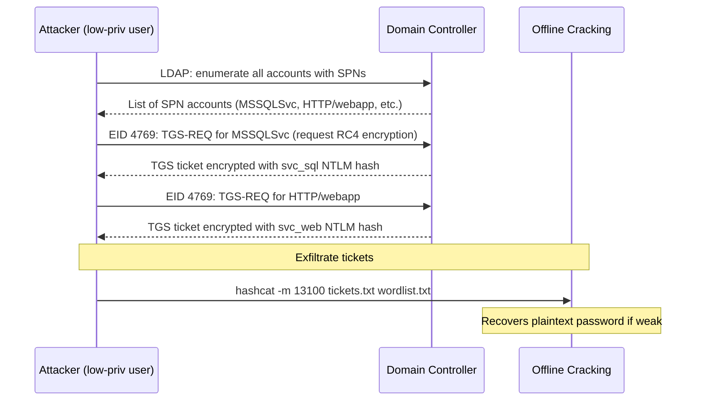
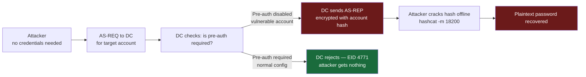
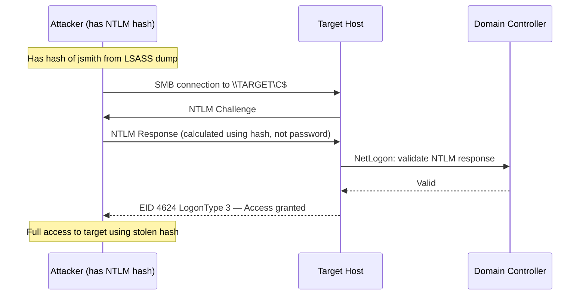
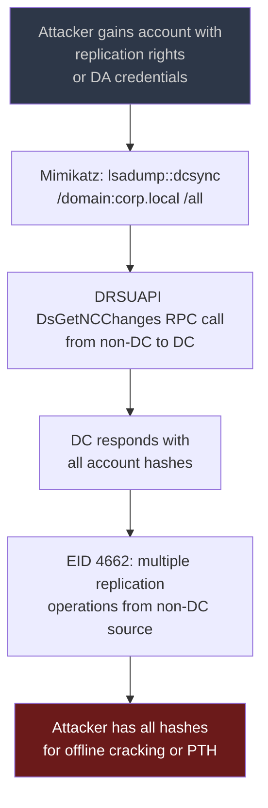
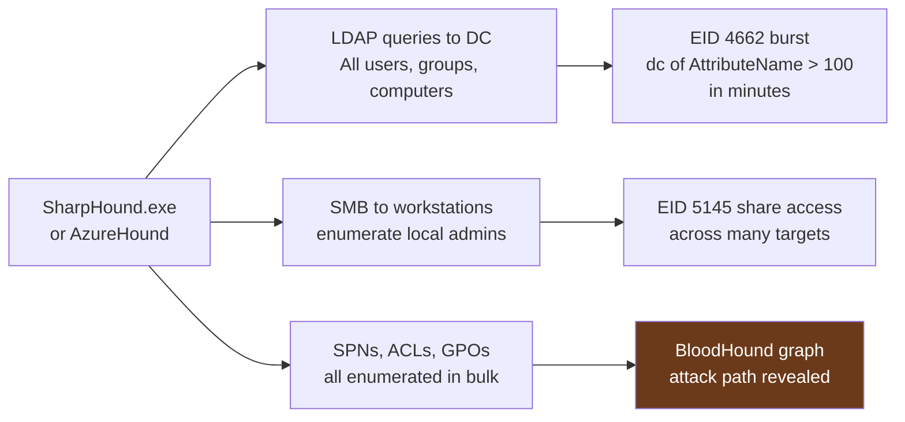
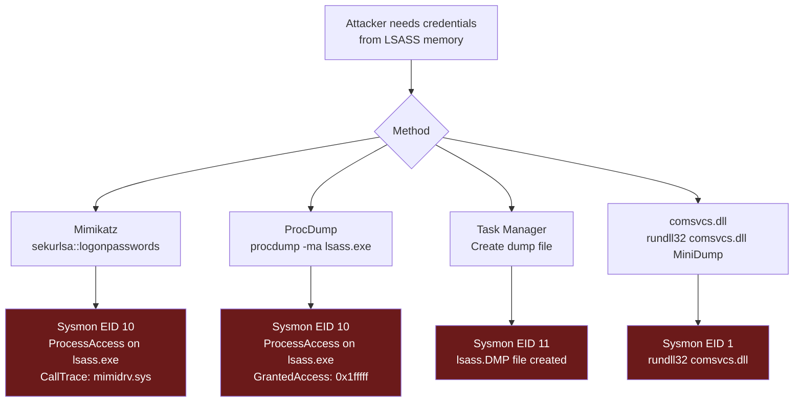

# Module 4: Common Active Directory Attacks

[← Module 3: Authentication Patterns](./module_03_authentication_patterns.md) | [Module 5: Attacker Tooling Signatures →](./module_05_attacker_tooling_signatures.md)

---

## Module Overview

| Attribute | Detail |
|---|---|
| **Estimated Time** | 3 hours |
| **PEAK Phase** | Prepare → Explore → Analyze → Knowledge |
| **Data Sources** | WinEvent 4624/4625/4662/4768/4769/4728/4732/5136, Sysmon EID 1/3/7/10 |
| **Prerequisites** | [Module 3: Authentication Patterns](./module_03_authentication_patterns.md) |

### Learning Objectives

After completing this module you will be able to:

1. Describe the mechanics of 8 common AD attacks and the log events each generates.
2. Write SPL queries to detect Kerberoasting, AS-REP roasting, DCSync, Pass-the-Hash, Golden Ticket, BloodHound enumeration, password spray, and LSASS dumping.
3. Differentiate between legitimate AD activity and attack signatures in Windows Event Logs and Sysmon.
4. Apply the PEAK framework to build detection rules from each attack pattern.

---

## Attack 1: Kerberoasting

### What Is It?

An attacker with any valid domain account requests Kerberos service tickets (TGS) for accounts that have Service Principal Names (SPNs). These tickets are encrypted with the service account's password hash and can be taken offline for cracking. If the service account has a weak password, the attacker recovers it without generating a lockout event.

**MITRE ATT&CK:** T1558.003



### Key Events

| Event | What to Look For |
|---|---|
| WinEvent 4769 | `TicketEncryptionType=0x17` (RC4-HMAC) from non-DC source, multiple ServiceNames in short window |
| Corelight kerberos.log | `request_type=TGS` with `cipher=rc4-hmac` |

### Detection SPL

```spl
/* Kerberoasting: TGS requests with RC4 encryption from non-service accounts */
index=wineventlog EventCode=4769 earliest=-1h
| where TicketEncryptionType="0x17" OR TicketEncryptionType="0x18"
| where NOT match(ServiceName, "krbtgt|\\$$")
| where NOT match(IpAddress, "::1|127\.0\.0\.1")
| stats count AS tgs_count,
        dc(ServiceName) AS unique_services,
        values(ServiceName) AS services,
        values(IpAddress) AS sources
    BY SubjectUserName
| where unique_services > 3 OR tgs_count > 10
| sort - unique_services
```

```spl
/* Kerberoasting baseline: how many TGS/RC4 requests does your environment normally generate? */
index=wineventlog EventCode=4769 earliest=-7d
| where TicketEncryptionType="0x17"
| where NOT match(ServiceName, "krbtgt|\\$$")
| stats count BY date_hour
| stats avg(count) AS avg_per_hour, max(count) AS max_per_hour, stdev(count) AS stdev_per_hour
```

---

## Attack 2: AS-REP Roasting

### What Is It?

AS-REP Roasting targets accounts that have Kerberos pre-authentication **disabled** (a misconfiguration). Without pre-authentication, any user can request an AS-REP for that account and receive a response encrypted with the account's password hash — no credentials required. The hash is taken offline for cracking.

**MITRE ATT&CK:** T1558.004



### Key Events

| Event | What to Look For |
|---|---|
| WinEvent 4768 | `PreAuthType=0` (no pre-authentication) — this is the vulnerability indicator |
| WinEvent 4768 | Large volume of AS-REQ from single source for different accounts |

### Detection SPL

```spl
/* AS-REP Roasting: accounts responding without pre-authentication */
index=wineventlog EventCode=4768 earliest=-24h
| where PreAuthType="0"
| stats count AS requests,
        values(TargetUserName) AS targeted_accounts,
        dc(TargetUserName) AS unique_accounts
    BY IpAddress
| where unique_accounts > 1
| sort - unique_accounts
```

```spl
/* AS-REP Roasting: identify which accounts have pre-auth disabled (ongoing misconfiguration) */
index=wineventlog EventCode=4768 earliest=-30d
| where PreAuthType="0"
| stats count BY TargetUserName
| sort - count
```

---

## Attack 3: Pass-the-Hash

### What Is It?

The attacker has obtained an NTLM hash (via Mimikatz, LSASS dump, or SAM extraction) and uses it to authenticate **without knowing the plaintext password**. The hash is passed directly into the authentication process. Pass-the-Hash requires NTLM authentication — Kerberos is not vulnerable to this specific attack.

**MITRE ATT&CK:** T1550.002



### Key Events

| Event | What to Look For |
|---|---|
| WinEvent 4624 | `LogonType=9` (NewCredentials) + `AuthenticationPackageName=NTLM` from domain account |
| WinEvent 4624 | `LogonType=3` + NTLM + source IP that is not the account's normal workstation |
| Corelight conn.log | SMB connection from unusual source immediately followed by 4624 success |

### Detection SPL

```spl
/* Pass-the-Hash: LogonType 9 with NTLM from domain accounts */
index=wineventlog EventCode=4624 earliest=-1h
| where LogonType="9"
| where AuthenticationPackageName="NTLM"
| where NOT match(SubjectUserName, "ANONYMOUS|\\$$")
| where SubjectDomainName != "NT AUTHORITY"
| stats count, values(WorkstationName) AS workstations,
        values(IpAddress) AS sources, dc(WorkstationName) AS unique_ws
    BY SubjectUserName, SubjectDomainName
| sort - count
```

```spl
/* Pass-the-Hash: NTLM auth from accounts that normally use Kerberos */
index=wineventlog EventCode=4624 earliest=-30d
| stats count BY SubjectUserName, AuthenticationPackageName
| stats sum(eval(if(AuthenticationPackageName="NTLM",count,0))) AS ntlm_count,
        sum(eval(if(AuthenticationPackageName="Kerberos",count,0))) AS kerb_count
    BY SubjectUserName
| where kerb_count > 50
| eval ntlm_ratio = round(ntlm_count / (ntlm_count + kerb_count) * 100, 1)
| where ntlm_ratio > 20
| sort - ntlm_ratio
```

---

## Attack 4: DCSync

### What Is It?

The attacker impersonates a Domain Controller and uses the Directory Replication Service (DRS) protocol to request password hashes for all domain accounts — effectively pulling a copy of the NTDS.dit database contents without touching the DC's disk. Requires `DS-Replication-Get-Changes` and `DS-Replication-Get-Changes-All` rights.

**MITRE ATT&CK:** T1003.006



### Key Events

| Event | What to Look For |
|---|---|
| WinEvent 4662 | `ObjectType` contains `19195a5b-6da0-` (DS-Replication-Get-Changes) from non-DC source |
| WinEvent 4662 | `Properties` contains `1131f6aa` or `1131f6ad` (replication GUIDs) |

### Detection SPL

```spl
/* DCSync: replication operations from non-DC accounts */
index=wineventlog EventCode=4662 earliest=-1h
| where match(Properties, "1131f6aa|1131f6ad|89e95b76")
| where NOT match(SubjectUserName, "\\$$")
| lookup dc_list computername as SubjectUserName OUTPUT is_dc
| where isnull(is_dc) OR is_dc != "true"
| stats count AS repl_ops, values(Properties) AS props, values(ObjectName) AS objects
    BY SubjectUserName, SubjectDomainName, ComputerName
| sort - repl_ops
```

---

## Attack 5: Golden Ticket

### What Is It?

A Golden Ticket is a forged Kerberos TGT (Ticket Granting Ticket) signed with the KRBTGT account's NTLM hash. Because TGTs are signed by the KRBTGT account that only DCs possess, a valid KRBTGT hash allows minting tickets for any user, any group, with any lifetime — including tickets claiming Domain Admin membership for arbitrary accounts.

**MITRE ATT&CK:** T1558.001

### Key Events

| Event | What to Look For |
|---|---|
| WinEvent 4769 | TGS request where the associated TGT was not generated by a real AS-REQ (no preceding 4768) |
| WinEvent 4624 | Successful logon with unusual ticket lifetime (>10 hours default, Golden Tickets often use 10 years) |
| WinEvent 4672 | Special privileges assigned — DA-level privileges appearing for unexpected accounts |

### Detection SPL

```spl
/* Golden Ticket: TGS requests without preceding TGT requests from same source */
index=wineventlog (EventCode=4768 OR EventCode=4769) earliest=-1h
| eval event_type = if(EventCode=4768, "AS-REQ", "TGS-REQ")
| stats values(event_type) AS seen_events, count BY SubjectUserName, IpAddress
| where NOT match(mvjoin(seen_events," "), "AS-REQ")
| where match(mvjoin(seen_events," "), "TGS-REQ")
| table SubjectUserName, IpAddress, seen_events, count
```

```spl
/* Golden Ticket: anomalous ticket encryption or lifetime indicators */
index=wineventlog EventCode=4769 earliest=-24h
| where TicketEncryptionType="0x17"
| where ServiceName="krbtgt"
| stats count, values(IpAddress) BY SubjectUserName
| sort - count
```

---

## Attack 6: BloodHound / AD Enumeration

### What Is It?

BloodHound (using the SharpHound collector) performs LDAP queries and SMB operations to enumerate every AD object: users, groups, computers, GPOs, ACLs, and trust relationships. It then graphs attack paths from low-privileged users to Domain Admins. The enumeration generates a massive burst of LDAP queries and 4662 object-access events.

**MITRE ATT&CK:** T1087.002, T1069.002



### Key Events

| Event | What to Look For |
|---|---|
| WinEvent 4662 | `dc(AttributeName)` > 100 in a 5-minute window from a single non-DC account |
| WinEvent 5145 | High-frequency share enumeration (SYSVOL, NETLOGON) from single source |
| Sysmon EID 1 | `SharpHound.exe`, `AzureHound.exe`, or renamed variants |

### Detection SPL

```spl
/* BloodHound: LDAP enumeration burst — many unique attributes read in short window */
index=wineventlog EventCode=4662 earliest=-1h
| where NOT match(SubjectUserName, "\\$$")
| lookup dc_list computername as SubjectUserName OUTPUT is_dc
| where isnull(is_dc)
| bin _time span=5m AS window
| stats dc(AttributeName) AS unique_attrs, count AS ops BY SubjectUserName, window
| where unique_attrs > 50
| sort - unique_attrs
```

```spl
/* BloodHound process name detection */
index=sysmon EventCode=1 earliest=-24h
| where match(lower(Image), "sharphound|azurehound|bloodhound")
    OR (match(lower(Image), "\.exe$")
        AND match(CommandLine, "(?i)-c All|CollectionMethod|--ZipFileName"))
| table _time, host, User, Image, CommandLine
```

---

## Attack 7: Password Spray

### What Is It?

The attacker tries a single common password against many accounts simultaneously. Unlike brute force, spray stays below per-account lockout thresholds (typically 5–10 failures). The signal is only visible when you look across the source IP dimension: one IP generating failures across dozens of different accounts.

**MITRE ATT&CK:** T1110.003

### Key Events

| Event | What to Look For |
|---|---|
| WinEvent 4625 | High `dc(TargetUserName)` from single source IP, low failures per individual account |
| WinEvent 4771 | Kerberos pre-auth failures (Kerberos spray equivalent) |

### Detection SPL

```spl
/* Password spray: many unique targets from single source with low per-target failure count */
index=wineventlog EventCode=4625 earliest=-1h
| stats count AS failure_count,
        dc(TargetUserName) AS unique_targets,
        values(TargetUserName) AS targeted_accounts
    BY IpAddress
| where unique_targets > 20
| eval failures_per_user = round(failure_count / unique_targets, 1)
| where failures_per_user < 5
| sort - unique_targets
| table IpAddress, unique_targets, failure_count, failures_per_user, targeted_accounts
```

```spl
/* Spray success check: did any spray attempt succeed? */
index=wineventlog (EventCode=4625 OR EventCode=4624) earliest=-2h
| eval event_outcome = if(EventCode=4624, "SUCCESS", "FAIL")
| stats count BY IpAddress, TargetUserName, event_outcome
| eval spray_candidate = if(event_outcome="FAIL" AND count < 5, 1, 0)
| stats sum(spray_candidate) AS failed_attempts,
        sum(eval(if(event_outcome="SUCCESS",1,0))) AS successes
    BY IpAddress, TargetUserName
| where failed_attempts > 0 AND successes > 0
| sort - successes
```

---

## Attack 8: LSASS Dumping

### What Is It?

The Local Security Authority Subsystem Service (LSASS) process holds credentials of currently logged-in users in memory — NTLM hashes, Kerberos tickets, and sometimes plaintext passwords. Attackers dump LSASS memory to extract these credentials. Mimikatz `sekurlsa::logonpasswords` is the canonical tool, but many others exist (ProcDump, comsvcs.dll, custom tools).

**MITRE ATT&CK:** T1003.001



### Key Events

| Event | What to Look For |
|---|---|
| Sysmon EID 10 | `TargetImage` contains `lsass.exe`, `GrantedAccess=0x1fffff` (full memory access) |
| Sysmon EID 10 | `CallTrace` contains `mimidrv.sys` or unknown modules |
| Sysmon EID 11 | Files created with `.dmp` extension, especially in `%TEMP%` |
| WinEvent 4673 | Sensitive privilege use (`SeDebugPrivilege`) by non-SYSTEM processes |

### Detection SPL

```spl
/* LSASS dump: ProcessAccess on lsass.exe from suspicious processes */
index=sysmon EventCode=10 earliest=-1h
| where match(lower(TargetImage), "lsass\.exe")
| where NOT match(lower(SourceImage), "(?i)antivirus|defender|crowdstrike|cylance|sysmon|taskmanager")
| where GrantedAccess IN ("0x1fffff", "0x1010", "0x1410", "0x143a")
| stats count, values(SourceImage) AS dumping_process,
        values(GrantedAccess) AS access_flags
    BY host, TargetImage
| sort - count
```

```spl
/* LSASS dump: comsvcs.dll MiniDump technique */
index=sysmon EventCode=1 OR (index=wineventlog EventCode=4688) earliest=-24h
| where match(lower(CommandLine), "(?i)comsvcs\.dll.*minidump|procdump.*lsass")
| table _time, host, User, Image, CommandLine
```

---

## Attack Summary Table

| Attack | MITRE ID | Key Event | Primary Signal | Immediate Response |
|---|---|---|---|---|
| Kerberoasting | T1558.003 | EID 4769 | RC4 encryption + dc(ServiceName) spike | Reset service account passwords; require AES |
| AS-REP Roasting | T1558.004 | EID 4768 | PreAuthType=0 | Enable pre-auth on all accounts |
| Pass-the-Hash | T1550.002 | EID 4624 LogonType=9 | NTLM from domain account | Enable Protected Users; block NTLM |
| DCSync | T1003.006 | EID 4662 | Replication GUIDs from non-DC | Remove replication rights; reset KRBTGT twice |
| Golden Ticket | T1558.001 | EID 4769 | TGS without prior AS-REQ | Reset KRBTGT password twice; check for persistence |
| BloodHound | T1087.002 | EID 4662 | dc(AttributeName) burst | Isolate source; review ACL exposure |
| Password Spray | T1110.003 | EID 4625 | dc(TargetUserName) per source IP | Block source; check for successful spray |
| LSASS Dump | T1003.001 | Sysmon EID 10 | ProcessAccess on lsass.exe | Isolate host; rotate all credentials from host |

---

## Module Summary

| Key Concept | Remember |
|---|---|
| Kerberoasting leaves no lockout | Detect via RC4 encryption type and dc(ServiceName) — not failure events |
| AS-REP roasting requires no credential | The vulnerability is in account configuration (PreAuthType=0) |
| PTH is NTLM-only | Focus on LogonType=9 and unexpected NTLM from domain accounts |
| DCSync bypasses disk forensics | Only visible in EID 4662 replication events from non-DC sources |
| Golden Tickets survive password resets | KRBTGT must be reset **twice** (72 hours apart) to invalidate all tickets |
| BloodHound enumeration is loud in logs | LDAP burst is distinctive — dc(AttributeName) in 5-minute windows is the key signal |

### Related Detection Use Cases

- [Credential Attacks](../03_detection_use_cases/03_credential_attacks.md) — spray and Kerberoasting detections
- [Privilege Escalation](../03_detection_use_cases/06_privilege_escalation.md) — PTH and Golden Ticket escalation paths
- [Lateral Movement](../03_detection_use_cases/05_lateral_movement.md) — how these attacks enable movement

---

[← Module 3: Authentication Patterns](./module_03_authentication_patterns.md) | [Module 5: Attacker Tooling Signatures →](./module_05_attacker_tooling_signatures.md)
