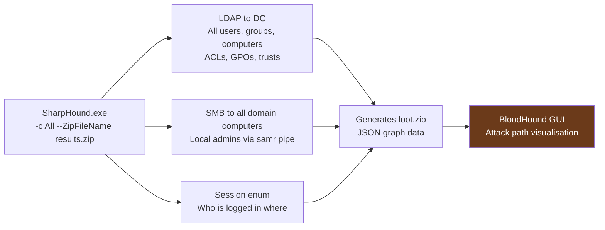

# Module 5: Attacker Tooling Signatures

[← Module 4: Common AD Attacks](./module_04_common_ad_attacks.md) | [Module 6: AD Weakness Identification →](./module_06_ad_weakness_identification.md)

---

## Module Overview

| Attribute | Detail |
|---|---|
| **Estimated Time** | 2.5 hours |
| **PEAK Phase** | Prepare → Explore → Knowledge |
| **Data Sources** | Sysmon EID 1/3/7/8/10/17/18, WinEvent 4624/4625/4662/4769/7045, Corelight conn.log |
| **Prerequisites** | [Module 4: Common AD Attacks](./module_04_common_ad_attacks.md) |

### Learning Objectives

After completing this module you will be able to:

1. Identify the log artifacts generated by Mimikatz, Impacket, Rubeus, BloodHound, NetExec, and Cobalt Strike.
2. Write SPL queries that detect each tool's signature even when the binary has been renamed.
3. Understand the evasion techniques used by each tool and how to counter them with behavioural detection.
4. Map tool artefacts to MITRE ATT&CK techniques.

---

## Tool 1: Mimikatz

### What It Does

Mimikatz is the most widely used credential-harvesting tool. Core capabilities:

| Command | Action | Events Generated |
|---|---|---|
| `sekurlsa::logonpasswords` | Dump credentials from LSASS memory | Sysmon EID 10 (LSASS ProcessAccess) |
| `lsadump::dcsync` | Pull NTDS hashes via DRS replication | WinEvent 4662 (replication GUIDs) |
| `lsadump::lsa` | Dump LSA secrets from registry | Sysmon EID 12/13 (registry access to LSA keys) |
| `kerberos::ptt` | Pass-the-Ticket: inject Kerberos ticket | WinEvent 4624 LogonType=9 |
| `privilege::debug` | Gain SeDebugPrivilege | WinEvent 4673 (sensitive privilege use) |
| `misc::memssp` | Install SSP for credential interception | Sysmon EID 7 (lsasrv.dll region) |

### What Spawns Mimikatz

In a real attack, Mimikatz is almost never run by itself from the command line by a human typing `mimikatz.exe`. It is typically:
- Loaded as a reflective DLL into memory by a C2 beacon (no file on disk)
- Executed via PowerShell (`Invoke-Mimikatz`)
- Bundled into another tool (Cobalt Strike's `hashdump` module, Metasploit's `kiwi`)
- Renamed to evade file-based detection

### LSASS Access Detection

```spl
/* Mimikatz: LSASS process access — any process accessing lsass.exe with broad rights */
index=sysmon EventCode=10 earliest=-1h
| where match(lower(TargetImage), "lsass\.exe")
| where GrantedAccess IN ("0x1fffff", "0x1010", "0x1410", "0x143a", "0x40")
| where NOT match(lower(SourceImage),
    "(?i)antivirus|defender|crowdstrike|sysmon|csrss|werfault|taskmgr|wmiprvse")
| eval tool_hint = case(
    match(CallTrace, "(?i)mimidrv"), "Mimikatz driver",
    match(CallTrace, "(?i)unknown"), "Reflective DLL (no file)",
    match(lower(SourceImage), "(?i)powershell"), "PowerShell-based dump",
    true(), "Unknown tool"
  )
| table _time, host, SourceImage, TargetImage, GrantedAccess, CallTrace, tool_hint
```

### Evasion Techniques and Counter-Detection

| Evasion | Technique | Counter-Detection |
|---|---|---|
| Rename binary | `svhost32.exe` instead of `mimikatz.exe` | Detect by behaviour (LSASS access), not name |
| Reflective DLL | No file on disk; loaded from memory | Sysmon EID 7 with `Signed=false` in lsass process space |
| PowerShell wrapper | `Invoke-Mimikatz` via PS | Sysmon EID 10 with `SourceImage=powershell.exe` |
| PPL bypass | Mimidrv kernel driver to bypass LSASS protection | Sysmon EID 6 (driver load) for `mimidrv.sys` |

---

## Tool 2: Impacket

### What It Does

Impacket is a Python library with standalone attack scripts for remote execution, authentication, and credential extraction:

| Tool | Purpose | Network Behaviour |
|---|---|---|
| `psexec.py` | Remote execution via SMB service install | Port 445; creates PSEXESVC or random service name via EID 7045 |
| `wmiexec.py` | Remote execution via WMI | Port 135 → dynamic; child of `wmiprvse.exe` |
| `smbexec.py` | Remote execution via SMB, shell commands | Port 445; creates new service per command |
| `secretsdump.py` | Extract hashes remotely (DCSync or SAM) | Port 445/135; EID 4662 replication events |
| `GetUserSPNs.py` | Kerberoast over network | Port 88; EID 4769 RC4 requests |
| `ticketer.py` | Golden/Silver ticket forge | No network (offline) |

### psexec.py vs Sysinternals PsExec

| Indicator | Sysinternals PsExec | Impacket psexec.py |
|---|---|---|
| Service name | `PSEXESVC` (consistent) | Random 8-char alphanumeric (e.g., `abCdEfGh`) |
| Binary path | `%SystemRoot%\PSEXESVC.exe` | `%SystemRoot%\[random].exe` or `ADMIN$\[random].exe` |
| Service account | Usually domain user | Usually SYSTEM |
| Cleanup | Leaves service | Deletes service after execution |

```spl
/* Impacket psexec: random service name pattern via EID 7045 */
index=wineventlog EventCode=7045 earliest=-1h
| where match(ServiceFileName, "(?i)\\\\[A-Za-z0-9]{6,10}\.exe")
| where NOT match(ServiceName, "(?i)PSEXESVC|ManagementAgent|WMI|BITS|MSSQL")
| eval path_suspicious = if(
    match(ServiceFileName, "(?i)ADMIN\$|C\$\\\\Windows\\\\[A-Za-z0-9]{6,10}"), "YES", "NO"
  )
| table _time, ComputerName, ServiceName, ServiceFileName, ServiceType, path_suspicious
```

```spl
/* Impacket wmiexec: suspicious child processes of wmiprvse.exe */
index=sysmon EventCode=1 earliest=-1h
| where match(lower(ParentImage), "wmiprvse\.exe")
| where NOT match(lower(Image), "(?i)sccm|ccm|wbem|msiexec|gpupdate")
| stats count, values(CommandLine) AS cmds BY host, Image, ParentImage
| sort - count
```

---

## Tool 3: Rubeus

### What It Does

Rubeus is a C# Kerberos toolkit that operates entirely through the Windows Kerberos API — no direct LSASS access required. This makes it harder to detect via process injection indicators.

| Command | Action | Events |
|---|---|---|
| `kerberoast` | Request TGS for SPN accounts | EID 4769 RC4 spike |
| `asreproast` | AS-REP roast accounts without pre-auth | EID 4768 PreAuthType=0 |
| `dump` | Extract Kerberos tickets from memory | Sysmon EID 10 (lsass.exe, lower access level) |
| `ptt` | Pass-the-Ticket injection | EID 4624 LogonType=9 |
| `tgtdeleg` | Unconstrained delegation abuse | EID 4769 from delegation target |
| `monitor` | Continuously harvest new tickets | Repeated low-level lsass EID 10 |

```spl
/* Rubeus: Kerberoast signature — RC4 TGS requests from single user in burst */
index=wineventlog EventCode=4769 earliest=-30m
| where TicketEncryptionType="0x17"
| where NOT match(ServiceName, "krbtgt|\\$$|IMAP|SMTP|HTTP$")
| bin _time span=5m AS window
| stats count AS tgs_count, dc(ServiceName) AS services BY SubjectUserName, window
| where tgs_count > 5 OR services > 3
| sort - tgs_count
```

```spl
/* Rubeus process detection — look for it by name or its parent patterns */
index=sysmon EventCode=1 earliest=-24h
| where match(lower(Image), "rubeus")
    OR (match(lower(ParentImage), "(?i)powershell|cmd\.exe")
        AND match(CommandLine, "(?i)kerberoast|asreproast|ptt|tgtdeleg|monitor"))
| table _time, host, User, Image, ParentImage, CommandLine
```

---

## Tool 4: BloodHound / SharpHound

### What It Does

SharpHound is the data collector for BloodHound. It performs:
1. LDAP enumeration of all AD objects
2. SMB-based enumeration of local admin group membership
3. Session enumeration (who is logged where)
4. Trust enumeration

The result is a compressed JSON dataset fed into the BloodHound GUI to display shortest paths to DA.



### Detection Signatures

```spl
/* SharpHound: LDAP enumeration burst */
index=wineventlog EventCode=4662 earliest=-1h
| where NOT match(SubjectUserName, "\\$$")
| lookup dc_list computername as SubjectUserName OUTPUT is_dc
| where isnull(is_dc)
| bin _time span=5m AS window
| stats dc(AttributeName) AS unique_attrs, count AS ldap_ops BY SubjectUserName, window
| where unique_attrs > 30
| sort - unique_attrs
```

```spl
/* SharpHound: SMB local admin enumeration pattern (SAMR pipe) */
index=wineventlog EventCode=5145 earliest=-1h
| where match(RelativeTargetName, "(?i)samr|lsarpc|netlogon")
| stats count AS shares, dc(IpAddress) AS unique_sources BY SubjectUserName, ShareName
| where unique_sources > 5
| sort - unique_sources
```

```spl
/* SharpHound binary and common invocations */
index=sysmon EventCode=1 earliest=-24h
| where match(lower(Image), "sharphound|bloodhound")
    OR match(CommandLine, "(?i)-c All|CollectionMethod|--ZipFilename|-d [A-Z]+\.[A-Z]+ -c")
| table _time, host, User, Image, CommandLine
```

---

## Tool 5: NetExec (CrackMapExec)

### What It Does

NetExec (formerly CrackMapExec) is a network sweep and credential validation tool. Primary uses:

| Feature | Description | Log Signature |
|---|---|---|
| SMB auth sweep | Test credentials against all hosts in CIDR | Rapid 4624/4625 sequence from single IP |
| Command execution | Run commands via SMB, WMI, WinRM | EID 7045 (SMB exec), wmiprvse.exe children, wsmprovhost.exe children |
| Module execution | Mimikatz, NTDS dump, lsassy modules | EID 10 LSASS access after auth |
| Enum | Users, shares, logged-on users | EID 5145 share access, 4662 LDAP |
| Password spray | One password across all hosts | High dc(ComputerName) with same SubjectUserName |

```spl
/* NetExec credential sweep: rapid auth attempts from single IP across many hosts */
index=wineventlog (EventCode=4624 OR EventCode=4625) earliest=-15m
| stats count AS auth_events,
        dc(ComputerName) AS unique_targets,
        sum(eval(if(EventCode=4624,1,0))) AS successes,
        sum(eval(if(EventCode=4625,1,0))) AS failures
    BY IpAddress, SubjectUserName
| where unique_targets > 10
| eval success_rate = round(successes / auth_events * 100, 1)
| sort - unique_targets
```

---

## Tool 6: Cobalt Strike

### What It Does

Cobalt Strike is a commercial C2 framework widely used (and cracked) by threat actors. It uses **beacons** — shellcode payloads that phone home to the team server. Key detection artefacts:

| Artefact | What to Look For |
|---|---|
| Default named pipes | `\MSSE-*-server`, `\postex_*`, `\status_*`, `\msagent_*` (Sysmon EID 17/18) |
| Service installation | Random service name for SMB beacon delivery (EID 7045) |
| Reflective DLL | No file on disk; detected via Sysmon EID 7 unsigned DLL in unusual process |
| Process injection | Sysmon EID 8 (CreateRemoteThread) into remote process |
| Malleable C2 | Custom HTTP profiles — detect via JA3 fingerprint consistency and unusual user-agents |
| Beaconing | Regular outbound connections with low jitter (see Beaconing detection use case) |

### Named Pipe Detection

```spl
/* Cobalt Strike: default named pipe patterns — Sysmon EID 17/18 */
index=sysmon (EventCode=17 OR EventCode=18) earliest=-24h
| where match(PipeName, "(?i)\\\\MSSE-|\\\\postex_|\\\\status_|\\\\msagent_|\\\\wkssvc_")
    OR match(PipeName, "\\\\[a-f0-9]{8}-[a-f0-9]{4}")
| table _time, host, Image, PipeName, EventCode
| sort - _time
```

```spl
/* Cobalt Strike: process injection via CreateRemoteThread (EID 8) */
index=sysmon EventCode=8 earliest=-24h
| where NOT match(lower(SourceImage), "(?i)antivirus|defender|crowdstrike|cylance")
| where NOT match(lower(TargetImage), "(?i)antivirus|defender|crowdstrike")
| stats count, values(SourceImage) AS injectors, values(TargetImage) AS targets BY host
| sort - count
```

```spl
/* Cobalt Strike: reflective DLL — unsigned module loaded in unusual process */
index=sysmon EventCode=7 earliest=-24h
| where Signed="false"
| where NOT match(lower(ImageLoaded), "(?i)appdata|temp|downloads")
| where match(lower(Image), "(?i)rundll32|regsvr32|mshta|wscript|cscript|powershell")
| table _time, host, Image, ImageLoaded, Signed, Company
| sort - _time
```

---

## Tool Comparison: Event Fingerprints

| Tool | Primary Auth Events | Process Events | Network Events | Key Detection Field |
|---|---|---|---|---|
| **Mimikatz** | 4673 (SeDebug) | Sysmon 10 (LSASS access) | None (local) | `GrantedAccess=0x1fffff` on lsass.exe |
| **Impacket psexec** | 4624 LogonType=3 | 7045 (random service) | Port 445 | Random service name pattern |
| **Impacket wmiexec** | 4624 LogonType=3 | Sysmon 1 parent=wmiprvse | Port 135+high | `wmiprvse.exe` spawning cmd/ps |
| **Rubeus** | 4769 RC4 burst | Sysmon 1 | Port 88 (Kerberos) | `TicketEncryptionType=0x17` burst |
| **SharpHound** | 4662 LDAP burst | Sysmon 1 | Port 389/636 | `dc(AttributeName) > 50` in 5 min |
| **NetExec** | 4624/4625 sweep | 7045 (if exec) | Port 445/5985 | High `dc(ComputerName)` per source |
| **Cobalt Strike** | 4624 (depends on payload) | Sysmon 7/8/17/18 | Beaconing port | Named pipe pattern; JA3 hash |

---

## Module Summary

| Key Concept | Remember |
|---|---|
| Rename evasion | Detect tools by **behaviour** (what they access/spawn/write), not binary name |
| Mimikatz | LSASS `GrantedAccess=0x1fffff`; EID 4662 with replication GUIDs |
| Impacket | Random 7045 service name in `ADMIN$`; `wmiprvse.exe` spawning cmd |
| Rubeus | RC4 TGS burst (EID 4769); operates via Kerberos API — no LSASS touch |
| SharpHound | LDAP `dc(AttributeName)` burst in minutes from non-DC account |
| NetExec | High `dc(ComputerName)` per source IP in short window |
| Cobalt Strike | Named pipes matching `\MSSE-*`; unsigned DLL loads; beaconing pattern |

### Related Detection Use Cases

- [Beaconing](../03_detection_use_cases/01_beaconing.md) — Cobalt Strike beacon detection
- [Credential Attacks](../03_detection_use_cases/03_credential_attacks.md) — Rubeus/Impacket Kerberoasting
- [Lateral Movement](../03_detection_use_cases/05_lateral_movement.md) — Impacket lateral execution
- [Privilege Escalation](../03_detection_use_cases/06_privilege_escalation.md) — Mimikatz credential escalation

---

[← Module 4: Common AD Attacks](./module_04_common_ad_attacks.md) | [Module 6: AD Weakness Identification →](./module_06_ad_weakness_identification.md)
