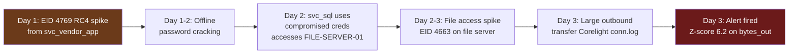
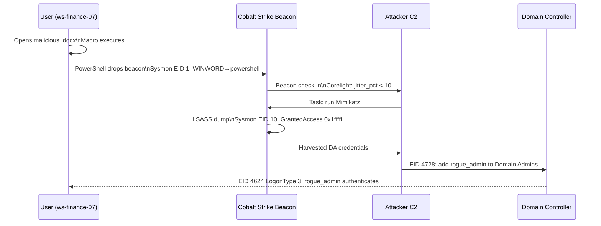
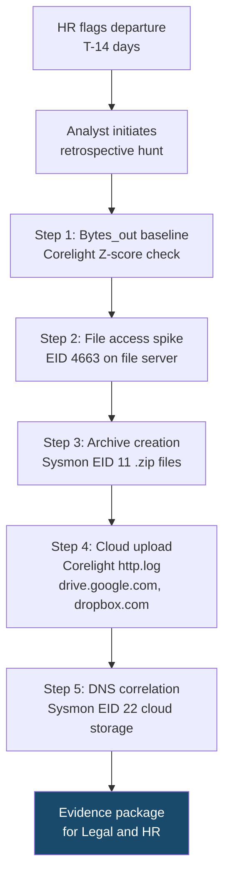

# Module 7: Threat Hunting Capstone — End-to-End Investigations

[← Module 6: AD Weakness Identification](./module_06_ad_weakness_identification.md) | [← Back to Course Overview](./00_course_overview.md)

---

## Module Overview

| Attribute | Detail |
|---|---|
| **Estimated Time** | 4 hours |
| **PEAK Phase** | Full cycle: Prepare → Explore → Analyze → Knowledge |
| **Data Sources** | All: Corelight conn/dns/http/ssl, WinEvent, Sysmon |
| **Prerequisites** | All prior modules |

### Learning Objectives

After completing this module you will be able to:

1. Apply the complete PEAK framework to an end-to-end incident investigation.
2. Chain multiple detection techniques together to reconstruct an attack timeline.
3. Identify the complete scope of an intrusion using statistical and behavioural methods.
4. Operationalise hunts as saved Splunk searches and produce actionable evidence packages.

---

## Scenario 1: Kerberoasting → Lateral Movement → Data Exfiltration

### Narrative

A SIEM alert fires for unusual Kerberos TGS requests (EID 4769 RC4 spike). Investigation reveals a contractor account (`svc_vendor_app`) has been used to Kerberoast service accounts, crack one password, use it to access a file server, and exfiltrate a compressed archive. The attacker had access for 72 hours before detection.



### Step 1 — Validate the Alert: Kerberoasting Confirmed

```spl
/* Validate: was the RC4 TGS spike genuine Kerberoasting? */
index=wineventlog EventCode=4769 earliest=-24h
| where TicketEncryptionType="0x17"
| where NOT match(ServiceName, "krbtgt|\\$$")
| stats count AS tgs_count, dc(ServiceName) AS services,
        values(ServiceName) AS targeted_svcs,
        values(IpAddress) AS sources
    BY SubjectUserName
| where services > 3 OR tgs_count > 10
| sort - services
```

**Expected finding:** `svc_vendor_app` requested TGS for 8 service accounts in a 4-minute window — all with RC4. This is unambiguous Kerberoasting.

### Step 2 — Identify the Cracked Account

```spl
/* Which service account was successfully authenticated AFTER the Kerberoasting event? */
index=wineventlog EventCode=4624 earliest=-72h
| where SubjectUserName IN ("svc_sql","svc_backup","svc_web","svc_monitor")
| where LogonType IN ("2","3","10")
| where NOT match(ComputerName, "(?i)sqlserver|appserver")
| stats count, values(ComputerName) AS hosts, values(IpAddress) AS sources
    BY SubjectUserName, LogonType
| sort - count
```

**Expected finding:** `svc_sql` authenticated (LogonType=3) to `FILE-SERVER-01` from the same IP used for Kerberoasting — confirms the account was cracked and used.

### Step 3 — Scope the File Server Access

```spl
/* What files did svc_sql access on FILE-SERVER-01 after the compromise? */
index=wineventlog EventCode=4663 ComputerName="FILE-SERVER-01" earliest=-72h
| where SubjectUserName="svc_sql"
| stats count AS access_count,
        dc(ObjectName) AS unique_files,
        values(ObjectName) AS accessed_files
    BY SubjectUserName, AccessMask
| sort - access_count
```

```spl
/* File staging: was anything written to disk (zipped, compressed)? */
index=sysmon EventCode=11 ComputerName="FILE-SERVER-01" earliest=-72h
| where match(TargetFilename, "(?i)\.zip|\.7z|\.tar|\.rar|\.gz")
| table _time, host, Image, TargetFilename, User
| sort _time
```

### Step 4 — Confirm Exfiltration

```spl
/* Z-score on outbound bytes from FILE-SERVER-01 over last 7 days */
index=corelight sourcetype=corelight_conn earliest=-7d
| where id.orig_h="10.10.5.44"
| where NOT cidrmatch("10.0.0.0/8", id.resp_h)
| bin _time span=1h AS hour
| stats sum(orig_bytes) AS bytes_out BY hour
| eventstats avg(bytes_out) AS avg_bytes, stdev(bytes_out) AS stdev_bytes
| eval zscore = round((bytes_out - avg_bytes) / (stdev_bytes + 1), 2)
| where zscore > 3
| sort - zscore
```

### Step 5 — Build the Full Timeline

```spl
/* Complete attack timeline: Kerberoasting → access → exfil */
(index=wineventlog (EventCode=4769 OR EventCode=4624 OR EventCode=4663) earliest=-72h)
OR (index=sysmon EventCode=11 earliest=-72h)
OR (index=corelight sourcetype=corelight_conn earliest=-72h)
| eval actor = coalesce(SubjectUserName, User, id.orig_h)
| eval event_desc = case(
    EventCode=4769, "Kerberoasting TGS request — " + ServiceName,
    EventCode=4624, "Logon (Type " + LogonType + ") to " + ComputerName,
    EventCode=4663, "File access: " + ObjectName,
    EventCode=11, "File created: " + TargetFilename,
    sourcetype="corelight_conn", "Network: " + id.orig_h + " → " + id.resp_h + " " + tostring(orig_bytes) + " bytes",
    true(), EventCode
  )
| where match(actor, "svc_vendor_app|svc_sql|10\.10\.5\.44")
| table _time, actor, event_desc
| sort _time
```

### Evidence Collection Checklist

- [ ] EID 4769 RC4 spike: timestamp, source IP, targeted accounts
- [ ] EID 4624 success: which cracked account, from which IP, to which host
- [ ] EID 4663 file access: file names, access mask, volume
- [ ] Sysmon EID 11: staged archive file names and paths
- [ ] Corelight conn.log: destination IP/domain, bytes transferred, duration
- [ ] Corelight http/ssl: destination domain, JA3, URI patterns (if applicable)

---

## Scenario 2: Phishing → Beacon → Privilege Escalation

### Narrative

A user opens a malicious Word document. A macro drops a PowerShell payload that establishes a Cobalt Strike beacon. The attacker runs Mimikatz via the beacon, harvests DA credentials, and adds a rogue account to Domain Admins. The entire chain occurs in under 4 hours.



### Step 1 — Beaconing Detection Fires

```spl
/* Confirm beacon from ws-finance-07 */
index=corelight sourcetype=corelight_conn earliest=-6h
| where id.orig_h="10.10.3.55"
| where NOT cidrmatch("10.0.0.0/8", id.resp_h)
| where id.resp_p != 53 AND id.resp_p != 123
| sort 0 id.orig_h, id.resp_h, _time
| autoregress _time AS prev_time p=1
| eval interval_sec = _time - prev_time
| where interval_sec > 0 AND interval_sec < 3600
| stats count AS conn_count, avg(interval_sec) AS avg_interval,
        stdev(interval_sec) AS stdev_interval
    BY id.orig_h, id.resp_h, id.resp_p
| eval jitter_pct = round((stdev_interval / avg_interval) * 100, 1)
| where conn_count > 15 AND jitter_pct < 15
| table id.orig_h, id.resp_h, id.resp_p, conn_count, avg_interval, jitter_pct
```

### Step 2 — Identify the Beaconing Process

```spl
/* Which process owns the beaconing connection? */
index=sysmon EventCode=3 SourceIp="10.10.3.55" DestinationIp="<DEST_IP>" earliest=-6h
| stats count, values(Image) AS processes, values(DestinationPort) AS ports
    BY SourceIp, DestinationIp
| table SourceIp, DestinationIp, processes, ports
```

### Step 3 — Trace the Process Chain

```spl
/* Parent process chain on ws-finance-07 */
index=sysmon EventCode=1 host="ws-finance-07" earliest=-6h
| where match(lower(ParentImage), "winword|excel|outlook|powershell")
| eval process_chain = ParentImage + " → " + Image
| table _time, process_chain, CommandLine, User
| sort _time
```

**Expected finding:** `WINWORD.EXE → powershell.exe → powershell.exe (encoded command)` — the classic macro-to-PowerShell chain.

### Step 4 — LSASS Dump Indicator

```spl
/* Mimikatz/LSASS dump on ws-finance-07 */
index=sysmon EventCode=10 host="ws-finance-07" earliest=-6h
| where match(lower(TargetImage), "lsass\.exe")
| table _time, SourceImage, TargetImage, GrantedAccess, CallTrace
```

### Step 5 — Privilege Escalation: Rogue Account Added

```spl
/* DA group change after the beacon established */
index=wineventlog (EventCode=4728 OR EventCode=4732 OR EventCode=4756) earliest=-6h
| where match(GroupName, "(?i)Domain Admins|Enterprise Admins")
| where NOT match(SubjectUserName, "(?i)expected_admin")
| table _time, SubjectUserName, MemberName, GroupName, ComputerName
```

### Step 6 — Full Host Timeline

```spl
/* Complete timeline: ws-finance-07 from T-1h to T+4h */
(index=sysmon host="ws-finance-07" earliest=-6h)
OR (index=wineventlog ComputerName="WS-FINANCE-07" earliest=-6h)
OR (index=corelight sourcetype=corelight_conn id.orig_h="10.10.3.55" earliest=-6h)
| eval event_type = case(
    EventCode=1, "Process: " + Image,
    EventCode=3, "Network: " + DestinationIp + ":" + DestinationPort,
    EventCode=10, "LSASS Access from " + SourceImage,
    EventCode=11, "File Created: " + TargetFilename,
    EventCode=4624, "Logon Type " + LogonType,
    EventCode=4728, "DA Group Change: " + MemberName,
    sourcetype="corelight_conn", "Conn: " + id.resp_h + ":" + id.resp_p + " " + tostring(orig_bytes) + "B",
    true(), "Event " + EventCode
  )
| table _time, event_type
| sort _time
```

---

## Scenario 3: Insider Threat — Departing Employee Data Staging

### Narrative

An HR system flags an employee resignation. Before their last day, security reviews their activity. Logs reveal bulk downloads from internal file shares, archive creation on their workstation, and uploads to a personal cloud storage account.



### Step 1 — Outbound Volume Anomaly Check

```spl
/* Z-score on user's outbound bytes over last 30 days */
index=corelight sourcetype=corelight_conn earliest=-30d
| where id.orig_h="10.10.2.77"
| where NOT cidrmatch("10.0.0.0/8", id.resp_h)
| bin _time span=1d AS day
| stats sum(orig_bytes) AS daily_bytes BY day
| eventstats avg(daily_bytes) AS avg_bytes, stdev(daily_bytes) AS stdev_bytes
| eval zscore = round((daily_bytes - avg_bytes) / (stdev_bytes + 1), 2)
| table day, daily_bytes, avg_bytes, zscore
| sort day
```

### Step 2 — File Access Volume on File Servers

```spl
/* File access spike: EID 4663 for target user on file servers */
index=wineventlog EventCode=4663 earliest=-30d
| where SubjectUserName="jdoe"
| bin _time span=1d AS day
| stats count AS file_accesses, dc(ObjectName) AS unique_files BY day
| eventstats avg(file_accesses) AS avg_accesses, stdev(file_accesses) AS stdev_accesses
| eval zscore = round((file_accesses - avg_accesses) / (stdev_accesses + 1), 2)
| sort day
```

### Step 3 — Archive File Creation on Workstation

```spl
/* Archive files created by target user — Sysmon EID 11 */
index=sysmon EventCode=11 host="ws-finance-03" earliest=-14d
| where match(TargetFilename, "(?i)\.zip|\.7z|\.rar|\.tar\.gz")
| where NOT match(TargetFilename, "(?i)windows|program files|splunk")
| table _time, User, Image, TargetFilename
| sort _time
```

### Step 4 — Cloud Upload Detection

```spl
/* Cloud storage uploads — large POSTs to known cloud storage domains */
index=corelight sourcetype=corelight_http earliest=-14d
| where id.orig_h="10.10.2.77"
| where method="POST"
| where match(host, "(?i)drive\.google\.com|dropbox\.com|onedrive\.live\.com|wetransfer\.com|box\.com")
| stats count AS uploads,
        sum(request_body_len) AS total_bytes_uploaded,
        values(host) AS cloud_services,
        values(uri) AS upload_paths
    BY id.orig_h, host
| eval total_MB = round(total_bytes_uploaded / 1048576, 2)
| sort - total_bytes_uploaded
```

### Step 5 — DNS Correlation for Timeline

```spl
/* DNS queries to cloud storage — correlate with Sysmon EID 22 for process attribution */
index=sysmon EventCode=22 host="ws-finance-03" earliest=-14d
| where match(QueryName, "(?i)drive\.google|dropbox|onedrive|wetransfer|box\.com")
| table _time, User, Image, QueryName
| sort _time
```

### Step 6 — Legal Preservation Package

```spl
/* Complete evidence timeline for legal hold */
(index=wineventlog EventCode=4663 SubjectUserName="jdoe" earliest=-14d)
OR (index=sysmon host="ws-finance-03" (EventCode=11 OR EventCode=22) earliest=-14d)
OR (index=corelight sourcetype=corelight_conn id.orig_h="10.10.2.77" earliest=-14d)
| eval evidence_type = case(
    EventCode=4663, "File Access: " + ObjectName,
    EventCode=11, "File Created: " + TargetFilename,
    EventCode=22, "DNS Query: " + QueryName,
    sourcetype="corelight_conn", "Network: " + tostring(round(orig_bytes/1024,1)) + " KB to " + id.resp_h,
    true(), "Event " + EventCode
  )
| table _time, evidence_type
| sort _time
| outputlookup insider_threat_evidence_jdoe.csv
```

> **Legal note:** Before conducting an insider threat investigation, engage your Legal and HR teams. Chain of custody for digital evidence requires documented procedures. Use `outputlookup` to preserve a timestamped evidence record. Do not alert or confront the employee while investigation is ongoing.

---

## Operationalising These Hunts

### Converting Hunts to Scheduled Searches

Each scenario in this module can be converted to a scheduled Splunk saved search:

| Hunt Type | Recommended Schedule | Lookback | Alert Action |
|---|---|---|---|
| Kerberoasting spike | Every 15 minutes | `-1h` | Notable event, P2 |
| Beaconing detection | Every 30 minutes | `-2h` | Notable event, P2 |
| Exfiltration z-score | Every hour | `-24h` | Notable event, P1 if z>5 |
| Insider threat volume | Daily at 06:00 | `-7d` | HR/Security email digest |
| DA group changes | Real-time | `-5m` | P1 immediate alert |

### Techniques Used Across Scenarios

| Scenario | Techniques Applied |
|---|---|
| Kerberoasting chain | Frequency Analysis → Z-Score → Behavioral Profiling → Timeline |
| Phishing → Beacon | Rate of Change (beaconing) → Behavioral Profiling → Anomaly Detection |
| Insider Threat | Z-Score (bytes) → Frequency (file access) → Behavioral Profiling → Moving Average |

---

## Module Summary

| Key Concept | Remember |
|---|---|
| Chain the signals | No single alert tells the full story. Start with the triggered alert, then pivot across data sources to build the complete timeline. |
| Timeline is evidence | The `table _time, event_type \| sort _time` pattern produces the analyst's most important artefact. |
| Z-score is the first filter | For volume-based attacks (exfiltration, credential spray), z-score is always the first pivot. |
| Process chain reveals intent | `ParentImage → Image → CommandLine` tells you more than the network alone. |
| Legal preservation | Use `outputlookup` to capture evidence. Engage Legal before confronting insider threats. |
| Operationalise after the hunt | Every hunt that finds something real should become a scheduled search. |

---

### All Techniques and Modules Used in This Capstone

| Topic | Reference |
|---|---|
| Frequency Analysis | [02_baseline_hunts/01_frequency_analysis.md](../02_baseline_hunts/01_frequency_analysis.md) |
| Z-Score / Stdev | [02_baseline_hunts/03_zscore_stdev.md](../02_baseline_hunts/03_zscore_stdev.md) |
| Rate of Change | [02_baseline_hunts/07_rate_of_change.md](../02_baseline_hunts/07_rate_of_change.md) |
| Behavioral Profiling | [02_baseline_hunts/09_behavioral_profiling.md](../02_baseline_hunts/09_behavioral_profiling.md) |
| Anomaly Detection | [02_baseline_hunts/10_anomaly_detection.md](../02_baseline_hunts/10_anomaly_detection.md) |
| Beaconing | [03_detection_use_cases/01_beaconing.md](../03_detection_use_cases/01_beaconing.md) |
| Data Exfiltration | [03_detection_use_cases/02_data_exfiltration.md](../03_detection_use_cases/02_data_exfiltration.md) |
| Credential Attacks | [03_detection_use_cases/03_credential_attacks.md](../03_detection_use_cases/03_credential_attacks.md) |
| Lateral Movement | [03_detection_use_cases/05_lateral_movement.md](../03_detection_use_cases/05_lateral_movement.md) |
| Privilege Escalation | [03_detection_use_cases/06_privilege_escalation.md](../03_detection_use_cases/06_privilege_escalation.md) |
| Insider Threat | [03_detection_use_cases/07_insider_threat.md](../03_detection_use_cases/07_insider_threat.md) |
| AD Attacks (Module 4) | [module_04_common_ad_attacks.md](./module_04_common_ad_attacks.md) |
| Tooling Signatures (Module 5) | [module_05_attacker_tooling_signatures.md](./module_05_attacker_tooling_signatures.md) |
| AD Weaknesses (Module 6) | [module_06_ad_weakness_identification.md](./module_06_ad_weakness_identification.md) |

---

[← Module 6: AD Weakness Identification](./module_06_ad_weakness_identification.md) | [← Back to Course Overview](./00_course_overview.md)
