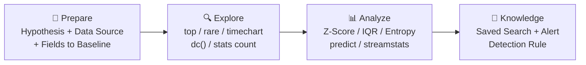
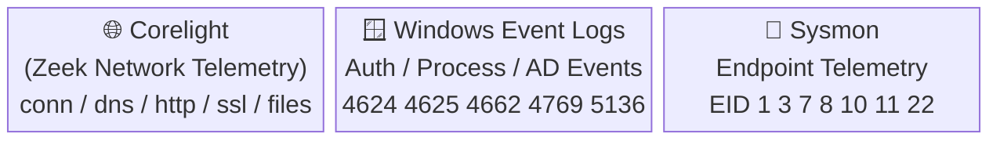
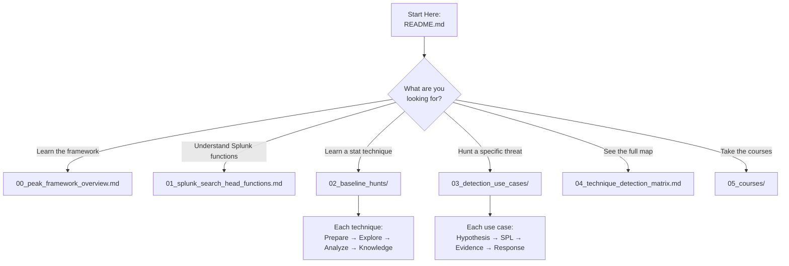

# Stats for SOC Analysts — Splunk Baseline Hunts

> A practical reference for SOC analysts and threat hunters using **Splunk Search Head** statistical functions to build behavioral baselines, identify anomalies, and derive detections from **Corelight**, **Windows Event Logs**, and **Sysmon** data.

---

## Framework: PEAK Threat Hunting

All content in this repository is structured around the **Splunk PEAK Threat Hunting Framework**:



| Phase | Question | Primary Splunk Commands |
|---|---|---|
| **Prepare** | What am I hunting for? What data do I need? | Define index, sourcetype, field(s) |
| **Explore** | What does normal look like? | `top`, `rare`, `timechart`, `stats count`, `dc()` |
| **Analyze** | Where are the statistical outliers? | `stats avg/stdev`, `eventstats`, `streamstats`, `predict`, `eval` |
| **Knowledge** | How do I operationalize this? | Saved search, alert threshold, detection SPL |

---

## Data Sources

This repository uses **three data sources only**, all available via Splunk Search Head:



### Corelight Logs
| Log | Key Fields |
|---|---|
| `conn.log` | `id.orig_h`, `id.resp_h`, `id.resp_p`, `proto`, `orig_bytes`, `resp_bytes`, `duration`, `conn_state` |
| `dns.log` | `query`, `qtype_name`, `answers`, `id.orig_h`, `rcode_name` |
| `http.log` | `host`, `uri`, `method`, `status_code`, `request_body_len`, `response_body_len`, `user_agent` |
| `ssl.log` | `server_name`, `cipher`, `validation_status`, `ja3`, `ja3s` |
| `files.log` | `filename`, `mime_type`, `total_bytes`, `source` |

### Windows Event Logs
| EventID | Description |
|---|---|
| 4624 | Successful logon |
| 4625 | Failed logon |
| 4648 | Explicit credential logon |
| 4662 | Object operation (DCSync) |
| 4688 | Process creation |
| 4698/4702 | Scheduled task created/modified |
| 4720/4732 | Account created / added to group |
| 4768/4769/4770 | Kerberos ticket events |
| 4771 | Kerberos pre-auth failure |
| 5136/4670 | Directory service / ACL change |
| 7045 | Service installed |

### Sysmon Events
| EventID | Description |
|---|---|
| 1 | Process creation |
| 3 | Network connection |
| 7 | Image loaded (DLL) |
| 8 | CreateRemoteThread |
| 10 | ProcessAccess (LSASS) |
| 11 | FileCreate |
| 12/13/14 | Registry events |
| 22 | DNS query |

---

## Repository Structure

```
Stats-for-soc-analysts/
├── README.md                               ← You are here
├── 00_peak_framework_overview.md           ← PEAK explained in depth
├── 01_splunk_search_head_functions.md      ← Distributed vs Streaming functions
│
├── 02_baseline_hunts/                      ← 10 statistical techniques
│   ├── 01_frequency_analysis.md
│   ├── 02_cardinality_analysis.md
│   ├── 03_zscore_stdev.md
│   ├── 04_percentile_iqr.md
│   ├── 05_entropy_analysis.md
│   ├── 06_moving_averages.md
│   ├── 07_rate_of_change.md
│   ├── 08_timeseries_forecasting.md
│   ├── 09_behavioral_profiling.md
│   └── 10_anomaly_detection.md
│
├── 03_detection_use_cases/                 ← 9 attack use cases
│   ├── 01_beaconing.md
│   ├── 02_data_exfiltration.md
│   ├── 03_credential_attacks.md
│   ├── 04_dns_tunneling_dga.md
│   ├── 05_lateral_movement.md
│   ├── 06_privilege_escalation.md
│   ├── 07_insider_threat.md
│   ├── 08_port_scanning.md
│   └── 09_rogue_services_processes.md
│
├── 04_technique_detection_matrix.md        ← Full cross-reference table
│
└── 05_courses/                             ← SOC analyst investigation skills
    ├── 00_course_overview.md
    ├── module_01_ad_traffic_fundamentals.md
    ├── module_02_infrastructure_traffic_analysis.md
    ├── module_03_authentication_patterns.md
    ├── module_04_common_ad_attacks.md
    ├── module_05_attacker_tooling_signatures.md
    ├── module_06_ad_weakness_identification.md
    └── module_07_threat_hunting_capstone.md
```

---

## Quick Reference: Technique → Use Case Matrix

| Technique | PEAK | Primary Commands | Detection Use Cases |
|---|---|---|---|
| [Frequency Analysis](02_baseline_hunts/01_frequency_analysis.md) | Explore | `rare`, `top`, `stats count` | Rogue Services, DGA, Priv Esc |
| [Cardinality (dc)](02_baseline_hunts/02_cardinality_analysis.md) | Explore | `stats dc()` | Port Scan, Lateral Movement, Brute Force |
| [Z-Score / Std Dev](02_baseline_hunts/03_zscore_stdev.md) | Analyze | `stats avg/stdev`, `eventstats`, `eval` | Exfiltration, UEBA, Lateral Movement |
| [Percentile / IQR](02_baseline_hunts/04_percentile_iqr.md) | Analyze | `stats perc95/99`, `eval` | Exfiltration, Credential Attack, Beaconing |
| [Entropy Analysis](02_baseline_hunts/05_entropy_analysis.md) | Analyze | `eval`, `rex` | DNS Tunneling, DGA |
| [Moving Averages](02_baseline_hunts/06_moving_averages.md) | Analyze | `streamstats window=N avg()` | Exfiltration, Lateral Movement |
| [Rate of Change](02_baseline_hunts/07_rate_of_change.md) | Analyze | `autoregress`, `eval` | Beaconing, Brute Force |
| [Time-Series Forecast](02_baseline_hunts/08_timeseries_forecasting.md) | Knowledge | `predict` (ARIMA/LL/LLP) | Credential Attack, Traffic Anomaly |
| [Behavioral Profiling](02_baseline_hunts/09_behavioral_profiling.md) | Knowledge | `eventstats`, `streamstats` | Insider Threat, UEBA, Lateral Movement |
| [Anomaly Detection](02_baseline_hunts/10_anomaly_detection.md) | Knowledge | `anomalydetection`, `cluster` | Multi-use automated baseline |

---

## Detection Use Cases

| Use Case | Techniques | MITRE ATT&CK |
|---|---|---|
| [Beaconing](03_detection_use_cases/01_beaconing.md) | Rate of Change, IQR | T1071, T1132 |
| [Data Exfiltration](03_detection_use_cases/02_data_exfiltration.md) | Z-Score, Percentile | T1041, T1048 |
| [Credential Attacks](03_detection_use_cases/03_credential_attacks.md) | Frequency, Cardinality | T1110 |
| [DNS Tunneling / DGA](03_detection_use_cases/04_dns_tunneling_dga.md) | Entropy, Frequency | T1071.004, T1568.002 |
| [Lateral Movement](03_detection_use_cases/05_lateral_movement.md) | Cardinality, Z-Score | T1021 |
| [Privilege Escalation](03_detection_use_cases/06_privilege_escalation.md) | Frequency, Behavioral | T1078, T1134 |
| [Insider Threat / UEBA](03_detection_use_cases/07_insider_threat.md) | Behavioral Profiling, Z-Score | T1078 |
| [Port Scanning](03_detection_use_cases/08_port_scanning.md) | Cardinality | T1046 |
| [Rogue Services / Processes](03_detection_use_cases/09_rogue_services_processes.md) | Frequency, IQR | T1543, T1059 |

---

## Courses

| Module | Topic |
|---|---|
| [Overview](05_courses/00_course_overview.md) | Learning path and prerequisites |
| [Module 1](05_courses/module_01_ad_traffic_fundamentals.md) | Active Directory Traffic Fundamentals |
| [Module 2](05_courses/module_02_infrastructure_traffic_analysis.md) | Infrastructure Traffic Analysis (SCCM, WMI, SMB) |
| [Module 3](05_courses/module_03_authentication_patterns.md) | Enterprise Auth vs Attack Traffic |
| [Module 4](05_courses/module_04_common_ad_attacks.md) | Common Active Directory Attacks |
| [Module 5](05_courses/module_05_attacker_tooling_signatures.md) | Attacker Tooling Signatures |
| [Module 6](05_courses/module_06_ad_weakness_identification.md) | Identifying AD Weaknesses Through Logs |
| [Module 7](05_courses/module_07_threat_hunting_capstone.md) | Capstone: ACSC Real-World Scenarios |

---

## How to Use This Repository



> **Tip**: Start with [PEAK Framework Overview](00_peak_framework_overview.md) if you're new to structured threat hunting, then work through the [baseline hunts](02_baseline_hunts/) before diving into specific [detection use cases](03_detection_use_cases/).

---

*All SPL in this repository runs on the **Splunk Search Head** using built-in commands only. No ML Toolkit or external add-ons required.*
