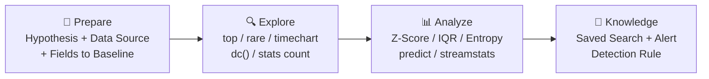
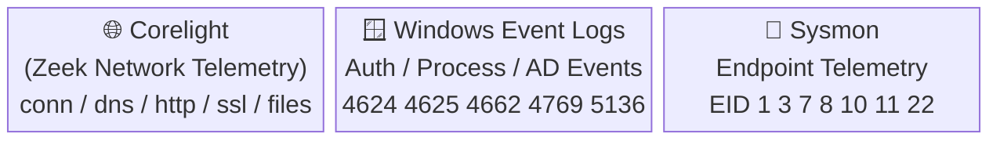
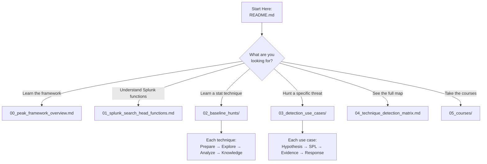

# Stats for SOC Analysts — Splunk Baseline Hunts

> A practical reference for SOC analysts and threat hunters using **Splunk Search Head** statistical functions to build behavioral baselines, identify anomalies, and derive detections from **Corelight**, **Windows Event Logs**, and **Sysmon** data.

---

## Framework: PEAK Threat Hunting

All content in this repository is structured around the **Splunk PEAK Threat Hunting Framework**:



| Phase | Question | Primary Splunk Commands |
|---|---|---|
| **Prepare** | What am I hunting for? What data do I need? | Define index, sourcetype, field(s) |
| **Explore** | What does normal look like? | `top`, `rare`, `timechart`, `stats count`, `dc()` |
| **Analyze** | Where are the statistical outliers? | `stats avg/stdev`, `eventstats`, `streamstats`, `predict`, `eval` |
| **Knowledge** | How do I operationalize this? | Saved search, alert threshold, detection SPL |

---

## Data Sources

This repository uses **three data sources only**, all available via Splunk Search Head:



### Corelight Logs
| Log | Key Fields |
|---|---|
| `conn.log` | `id.orig_h`, `id.resp_h`, `id.resp_p`, `proto`, `orig_bytes`, `resp_bytes`, `duration`, `conn_state` |
| `dns.log` | `query`, `qtype_name`, `answers`, `id.orig_h`, `rcode_name` |
| `http.log` | `host`, `uri`, `method`, `status_code`, `request_body_len`, `response_body_len`, `user_agent` |
| `ssl.log` | `server_name`, `cipher`, `validation_status`, `ja3`, `ja3s` |
| `files.log` | `filename`, `mime_type`, `total_bytes`, `source` |

### Windows Event Logs
| EventID | Description |
|---|---|
| 4624 | Successful logon |
| 4625 | Failed logon |
| 4648 | Explicit credential logon |
| 4662 | Object operation (DCSync) |
| 4688 | Process creation |
| 4698/4702 | Scheduled task created/modified |
| 4720/4732 | Account created / added to group |
| 4768/4769/4770 | Kerberos ticket events |
| 4771 | Kerberos pre-auth failure |
| 5136/4670 | Directory service / ACL change |
| 7045 | Service installed |

### Sysmon Events
| EventID | Description |
|---|---|
| 1 | Process creation |
| 3 | Network connection |
| 7 | Image loaded (DLL) |
| 8 | CreateRemoteThread |
| 10 | ProcessAccess (LSASS) |
| 11 | FileCreate |
| 12/13/14 | Registry events |
| 22 | DNS query |

---

## Repository Structure

```
Stats-for-soc-analysts/
├── README.md                               ← You are here
├── 00_peak_framework_overview.md           ← PEAK explained in depth
├── 01_splunk_search_head_functions.md      ← Distributed vs Streaming functions
│
├── 02_baseline_hunts/                      ← 15 statistical techniques
│   ├── 01_frequency_analysis.md
│   ├── 02_cardinality_analysis.md
│   ├── 03_zscore_stdev.md
│   ├── 04_percentile_iqr.md
│   ├── 05_entropy_analysis.md
│   ├── 06_moving_averages.md
│   ├── 07_rate_of_change.md
│   ├── 08_timeseries_forecasting.md
│   ├── 09_behavioral_profiling.md
│   ├── 10_anomaly_detection.md
│   ├── 11_peer_group_analysis.md
│   ├── 12_cohort_baselining.md
│   ├── 13_first_seen_tracking.md
│   ├── 14_long_term_drift.md
│   └── 15_baseline_management.md
│
├── 03_detection_use_cases/                 ← 9 attack use cases
│   ├── 01_beaconing.md
│   ├── 02_data_exfiltration.md
│   ├── 03_credential_attacks.md
│   ├── 04_dns_tunneling_dga.md
│   ├── 05_lateral_movement.md
│   ├── 06_privilege_escalation.md
│   ├── 07_insider_threat.md
│   ├── 08_port_scanning.md
│   └── 09_rogue_services_processes.md
│
├── 04_technique_detection_matrix.md        ← Full cross-reference table
│
├── 05_courses/                             ← SOC analyst investigation skills
│   ├── 00_course_overview.md
│   ├── module_01_ad_traffic_fundamentals.md
│   ├── module_02_infrastructure_traffic_analysis.md
│   ├── module_03_authentication_patterns.md
│   ├── module_04_common_ad_attacks.md
│   ├── module_05_attacker_tooling_signatures.md
│   ├── module_06_ad_weakness_identification.md
│   └── module_07_threat_hunting_capstone.md
│
├── 06_statistical_tests/                   ← 46 statistical tests with formulas, SPL, and cybersecurity use cases
│   ├── 00_index.md                         ← Test selection guide and complete list
│   ├── 01_univariate_tests.md              ← Z-Score, MAD, IQR, Grubbs, Benford's Law
│   ├── 02_bivariate_tests.md              ← Pearson, Spearman, Kendall's Tau, Chi-Square, Point-Biserial
│   ├── 03_multivariate_tests.md           ← PCA, K-Means, Hierarchical, Isolation Forest, LOF, DBSCAN
│   ├── 04_time_series_tests.md            ← AR, MA, ARIMA, ETS, Change Point, Spectral, ACF/PACF
│   ├── 05_regression_methods.md           ← Simple Linear, Multiple Linear, Logistic Regression
│   ├── 06_hypothesis_tests.md             ← t-tests, ANOVA, Mann-Whitney, K-S, Shapiro-Wilk, Levene, Bonferroni
│   └── 07_classification_metrics.md       ← ROC/AUC, Precision-Recall, Confusion Matrix, MCC, Calibration
│
├── 07_hunt_taxonomy/                       ← Complete threat hunting taxonomy + 12-month calendar
│   ├── 00_index.md                         ← Taxonomy overview and data source matrix
│   ├── 01_hypothesis_driven.md             ← APT29/SolarWinds, Kerberoasting chain, DeTTECT, Tracecat, Neo4j
│   ├── 02_anomaly_driven.md               ← Statistical baseline deviation, ML-based UEBA
│   ├── 03_indicator_and_technique_driven.md ← Hash/IP/domain hunts, T1566/T1021/T1055/T1134 ATT&CK SPL
│   └── 04_custom_chains_and_jeopardy.md   ← Ransomware, supply chain, insider theft, cryptojacking + Hunt Jeopardy
│
└── 08_splunk_performance/                  ← tstats, data models, streaming/distributed architecture
    ├── 00_index.md                         ← When to use tstats vs raw search
    ├── 01_tstats_and_data_models.md        ← tstats syntax, acceleration setup, performance benchmarks
    ├── 02_streaming_commands_deep_dive.md  ← streamstats, eventstats, transaction, eval, autoregress, predict
    ├── 03_statistical_tests_with_tstats.md ← All 06_statistical_tests/ tests rewritten at production scale
    └── 04_cim_field_mapping.md             ← CIM fields: Sysmon, WEL, Corelight, Palo Alto, Azure AD, Web proxy
```

---

## Quick Reference: Technique → Use Case Matrix

| Technique | PEAK | Primary Commands | Detection Use Cases |
|---|---|---|---|
| [Frequency Analysis](02_baseline_hunts/01_frequency_analysis.md) | Explore | `rare`, `top`, `stats count` | Rogue Services, DGA, Priv Esc |
| [Cardinality (dc)](02_baseline_hunts/02_cardinality_analysis.md) | Explore | `stats dc()` | Port Scan, Lateral Movement, Brute Force |
| [Z-Score / Std Dev](02_baseline_hunts/03_zscore_stdev.md) | Analyze | `stats avg/stdev`, `eventstats`, `eval` | Exfiltration, UEBA, Lateral Movement |
| [Percentile / IQR](02_baseline_hunts/04_percentile_iqr.md) | Analyze | `stats perc95/99`, `eval` | Exfiltration, Credential Attack, Beaconing |
| [Entropy Analysis](02_baseline_hunts/05_entropy_analysis.md) | Analyze | `eval`, `rex` | DNS Tunneling, DGA |
| [Moving Averages](02_baseline_hunts/06_moving_averages.md) | Analyze | `streamstats window=N avg()` | Exfiltration, Lateral Movement |
| [Rate of Change](02_baseline_hunts/07_rate_of_change.md) | Analyze | `autoregress`, `eval` | Beaconing, Brute Force |
| [Time-Series Forecast](02_baseline_hunts/08_timeseries_forecasting.md) | Knowledge | `predict` (ARIMA/LL/LLP) | Credential Attack, Traffic Anomaly |
| [Behavioral Profiling](02_baseline_hunts/09_behavioral_profiling.md) | Knowledge | `eventstats`, `streamstats` | Insider Threat, UEBA, Lateral Movement |
| [Anomaly Detection](02_baseline_hunts/10_anomaly_detection.md) | Knowledge | `anomalydetection`, `cluster` | Multi-use automated baseline |
| [Peer Group Analysis](02_baseline_hunts/11_peer_group_analysis.md) | Analyze | `eventstats`, `lookup` | Lateral Movement, Insider Threat, UEBA |
| [Cohort Baselining](02_baseline_hunts/12_cohort_baselining.md) | Analyze | `stats`, `eval case()` | Lateral Movement, Privilege Escalation |
| [First-Seen Tracking](02_baseline_hunts/13_first_seen_tracking.md) | Explore | `stats min()`, `outputlookup` | Rogue Processes, Lateral Movement, C2 |
| [Long-Term Drift Detection](02_baseline_hunts/14_long_term_drift.md) | Analyze | `streamstats`, `predict`, `eval` | Slow exfil, slow lateral, APT dwell time |
| [Baseline Management](02_baseline_hunts/15_baseline_management.md) | Knowledge | `inputlookup`, `outputlookup` | Operational hygiene across all techniques |
| [Statistical Tests (46)](06_statistical_tests/00_index.md) | Analyze | MLTK: `fit IsolationForest/KMeans/LogisticRegression` | All — with formal statistical validation |
| [Hunt Taxonomy](07_hunt_taxonomy/00_index.md) | All phases | Full SPL chains per technique | Hypothesis/anomaly/indicator/technique/chain hunts |
| [tstats + Data Models](08_splunk_performance/00_index.md) | All phases | `\| tstats FROM datamodel=` | All — production-scale implementations |

---

## Detection Use Cases

| Use Case | Techniques | MITRE ATT&CK |
|---|---|---|
| [Beaconing](03_detection_use_cases/01_beaconing.md) | Rate of Change, IQR | T1071, T1132 |
| [Data Exfiltration](03_detection_use_cases/02_data_exfiltration.md) | Z-Score, Percentile | T1041, T1048 |
| [Credential Attacks](03_detection_use_cases/03_credential_attacks.md) | Frequency, Cardinality | T1110 |
| [DNS Tunneling / DGA](03_detection_use_cases/04_dns_tunneling_dga.md) | Entropy, Frequency | T1071.004, T1568.002 |
| [Lateral Movement](03_detection_use_cases/05_lateral_movement.md) | Cardinality, Z-Score | T1021 |
| [Privilege Escalation](03_detection_use_cases/06_privilege_escalation.md) | Frequency, Behavioral | T1078, T1134 |
| [Insider Threat / UEBA](03_detection_use_cases/07_insider_threat.md) | Behavioral Profiling, Z-Score | T1078 |
| [Port Scanning](03_detection_use_cases/08_port_scanning.md) | Cardinality | T1046 |
| [Rogue Services / Processes](03_detection_use_cases/09_rogue_services_processes.md) | Frequency, IQR | T1543, T1059 |

---

## Courses

| Module | Topic |
|---|---|
| [Overview](05_courses/00_course_overview.md) | Learning path and prerequisites |
| [Module 1](05_courses/module_01_ad_traffic_fundamentals.md) | Active Directory Traffic Fundamentals |
| [Module 2](05_courses/module_02_infrastructure_traffic_analysis.md) | Infrastructure Traffic Analysis (SCCM, WMI, SMB) |
| [Module 3](05_courses/module_03_authentication_patterns.md) | Enterprise Auth vs Attack Traffic |
| [Module 4](05_courses/module_04_common_ad_attacks.md) | Common Active Directory Attacks |
| [Module 5](05_courses/module_05_attacker_tooling_signatures.md) | Attacker Tooling Signatures |
| [Module 6](05_courses/module_06_ad_weakness_identification.md) | Identifying AD Weaknesses Through Logs |
| [Module 7](05_courses/module_07_threat_hunting_capstone.md) | Capstone: ACSC Real-World Scenarios |

---

## How to Use This Repository



> **Tip**: Start with [PEAK Framework Overview](00_peak_framework_overview.md) if you're new to structured threat hunting, then work through the [baseline hunts](02_baseline_hunts/) before diving into specific [detection use cases](03_detection_use_cases/).

---

*All SPL in this repository runs on the **Splunk Search Head** using built-in commands only. No ML Toolkit or external add-ons required.*

---

## Outstanding Work / TODO

The following items are planned but not yet written. Contributions welcome.

### Module 2 — Infrastructure Traffic Analysis (expansion needed)

`05_courses/module_02_infrastructure_traffic_analysis.md` covers SMB, WMI, RPC, SCCM, and WinRM at a foundational level. The following sections need to be added:

- [x] **Windows process inventory** — svchost, lsass, services.exe, rundll32, mshta, certutil, bitsadmin etc. with normal spawn chains and LotL abuse SPL — see Sections 8
- [x] **WSUS / Windows Server Update Services** — normal traffic, rogue WSUS detection, SPL — see Section 9
- [x] **SCCM Distribution Points** — DP traffic baseline, anomaly detection — see Section 9
- [x] **Malicious IT admin / shadow IT detection** — audit policy changes (EID 4719), log clearing, task sequences suppressing events, undocumented admin actions outside change windows — see Section 10
- [x] **Splunk lookup build-out** — PowerShell commands to export `dc_list`, `asset_classification`, `unconstrained_delegation_hosts` etc. from AD; SCCM and WSUS extraction; `transforms.conf` stanzas — see Section 11
- [x] **Splunk data model configuration** — CIM field mappings for Corelight, WinEvent, and Sysmon; `datamodels.conf` acceleration config; `tstats` usage examples — see Section 12

### Mermaid Diagram Audit

- [x] Verified all mermaid blocks are properly closed across all 25 files — no unclosed blocks found
- [x] Confirmed xychart-beta, quadrantChart, mindmap, flowchart, and sequenceDiagram syntax is valid throughout
- [x] Quoted all node labels containing special characters (`>`, `(`, `/`) in flowchart diagrams

---

## Future Enhancements

Planned additions beyond the current scope. Contributions welcome — see the section headings below for suggested file paths.

### Completed ✅

- [x] **46 statistical tests** (`06_statistical_tests/`) — univariate through classification metrics; each with formulas, I/O spec, cybersecurity use case, assumptions, limitations, and Splunk SPL
- [x] **Hunt taxonomy** (`07_hunt_taxonomy/`) — hypothesis, anomaly, indicator, technique, and custom chain hunts (ransomware, supply chain, insider, cryptojacking) + 12-month Hunt Jeopardy calendar
- [x] **tstats + Data Models** (`08_splunk_performance/`) — tstats architecture, streaming vs. distributed commands, all statistical tests rewritten at production scale, CIM field mapping for Sysmon/WEL/Corelight/Palo Alto/Azure AD/Web proxy

### Splunk Enterprise Security Integration

`06_es_integration/` *(new directory)*

- [ ] **Converting detections to ES Notable Events** — how to wrap each detection SPL as a correlation search that produces a Notable Event with proper `risk_score`, `urgency`, `security_domain`, and `kill_chain_phase` fields
- [ ] **Risk-Based Alerting (RBA)** — risk modifier searches that accumulate per-entity risk scores from the composite signals in this repo rather than firing individual alerts; includes `risk_object`, `risk_object_type`, and `threat_object` field mapping
- [ ] **Adaptive Response Actions** — attaching response actions (block IP via firewall, disable AD account) to Notable Events using Splunk SOAR or custom adaptive response scripts
- [ ] **Glass Table design** — suggested ES glass table layout for the full threat hunting workflow

### SOAR / Phantom Playbooks

`07_soar_playbooks/` *(new directory)*

- [ ] **Beaconing playbook** — automated: WHOIS lookup on dest IP → VirusTotal enrichment → block at firewall → isolate host if VT score > 5 → create IR ticket
- [ ] **Credential attack playbook** — automated: lock source IP → check for successful logons from same IP → force password reset if successful login found → page on-call
- [ ] **Insider threat playbook** — semi-automated: shadow monitor mode (no block) → notify Legal and HR → preserve evidence to case management → escalation decision gate
- [ ] **Port scan playbook** — automated: classify source as internal vs external → if internal, isolate and hunt laterally; if external, block at perimeter + threat intel lookup

### Azure AD / Entra ID Coverage

`08_entra_id/` *(new directory)*

- [ ] **Azure AD sign-in logs** — equivalent field mappings from `SigninLogs` and `AADNonInteractiveUserSignInLogs` to the WinEvent patterns used in this repo
- [ ] **Conditional Access anomalies** — detecting impossible travel, unfamiliar location, legacy auth, and MFA fatigue attacks using Entra ID sign-in risk events
- [ ] **Azure AD-specific attacks** — Device Code phishing, OAuth consent grant abuse, Entra ID DCSync equivalent (PTA agent abuse), and password spray against federated endpoints
- [ ] **Unified detection** — hybrid environment hunting: correlating on-prem WinEvent with Entra ID logs for accounts that exist in both

### Detection-as-Code

`09_detection_as_code/` *(new directory)*

- [ ] **SPL validation in CI/CD** — how to lint and syntax-check SPL queries in a Git pipeline using the Splunk REST API (`/services/search/parser`) before merging detection changes
- [ ] **Detection versioning** — storing saved searches, correlation search configs, and lookup table updates in Git with structured YAML metadata (description, MITRE IDs, data sources, author, created/modified dates)
- [ ] **Automated regression testing** — replaying sample events through detections after code changes to confirm detections still fire correctly; sample dataset generation guidance
- [ ] **Deployment pipeline** — pushing tested detection changes to Splunk via the REST API or Splunk App packaging, with environment promotion (dev → staging → prod)

### Threat Intelligence Enrichment

`10_threat_intel/` *(new directory)*

- [ ] **Lookup-based enrichment** — adding threat intel feeds (Abuse.ch, OTX, MISP exports) as Splunk KV Store lookups; auto-updating via scheduled searches
- [ ] **Domain reputation scoring** — combining WHOIS age, passive DNS cardinality, and Alexa/Umbrella rank into a domain risk score usable in detection SPL
- [ ] **JA3/JA3S fingerprint library** — building a lookup of known-bad and known-good JA3 hashes from Corelight ssl.log for C2 TLS fingerprinting
- [ ] **IOC correlation search** — a scheduled search that cross-references all active IOCs against a rolling 30-day window of Corelight and Sysmon data

### Cloud Infrastructure Coverage

`11_cloud_infrastructure/` *(new directory)*

- [ ] **AWS CloudTrail** — equivalent field mappings and detections for IAM enumeration, S3 exfiltration, EC2 instance launches, and CloudTrail disabling
- [ ] **Azure Activity Log** — equivalent detections for Azure RBAC changes, resource group enumeration, and Azure VM deployment anomalies
- [ ] **GCP Audit Logs** — covering IAM privilege escalation, Cloud Storage exfiltration, and Compute Engine activity
- [ ] **Multi-cloud correlation** — hunting across cloud and on-prem simultaneously for identity-based attacks that pivot from SaaS into the corporate network

### Lab Exercises and Sample Data

`12_lab_exercises/` *(new directory)*

- [ ] **Synthetic event generator** — Python scripts to generate realistic Corelight, WinEvent, and Sysmon events with embedded attack patterns for each detection use case; events importable into a Splunk trial instance
- [ ] **Exercise worksheets** — guided exercises for each baseline hunt technique with questions, expected SPL answers, and worked examples using the synthetic data
- [ ] **Capture-the-flag challenges** — 5 progressively harder scenarios embedded in synthetic datasets where analysts must identify the attack, scope it, and write a detection rule

### Tuning and Operationalisation Guide

`13_tuning_guide/` *(new directory)*

- [ ] **False positive classification framework** — systematic process for categorising each FP (noise source, misconfiguration, legitimate anomaly) and documenting the fix
- [ ] **Threshold calibration methodology** — how to use 30/60/90-day lookback data to set statistically justified thresholds rather than guesses; seasonality adjustment
- [ ] **Alert fatigue measurement** — SPL to measure analyst workload per detection (alerts fired, closed as FP, closed as TP, time-to-close); use this to prioritise tuning effort
- [ ] **Detection coverage heatmap** — mapping your active detections against the MITRE ATT&CK matrix to visualise gaps and over-invested areas
